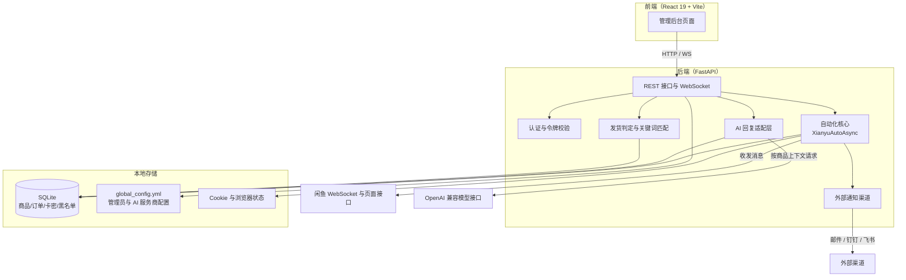

<div align="center">

# 闲鱼智控 Pro

**闲鱼自动发货、自动回复与 AI 智能议价一体化管理系统**

[](https://www.python.org/)


[](LICENSE)

</div>

---

## 目录

- [项目简介](#项目简介)
- [界面预览](#界面预览)
- [核心功能](#核心功能)
- [系统架构](#系统架构)
- [技术栈](#技术栈)
- [环境要求](#环境要求)
- [快速开始](#快速开始)
- [容器化部署（Docker）](#容器化部署docker)
- [认证配置](#认证配置)
- [人工智能服务商配置](#人工智能服务商配置)
- [目录结构](#目录结构)
- [使用流程](#使用流程)
- [数据与安全](#数据与安全)
- [部署失败排查](#部署失败排查)
- [更新与验证](#更新与验证)
- [许可证](#许可证)
- [免责声明](#免责声明)
- [交流社群](#交流社群)

---

## 项目简介

本项目面向闲鱼卖家，把「客服回复 — 下单发货 — 订单核对 — 风控拉黑」整条链路自动化：

- **自动发货**：买家付款后自动识别订单，按商品绑定的卡密分组或关键词规则发放卡密、链接、图片或调用上游接口取卡。
- **自动回复**：支持关键词精确/模糊匹配、账号默认回复，以及接入大模型的 AI 智能回复。
- **多账号托管**：同时管理多个闲鱼账号，支持扫码登录、Cookie 持久化与在线状态监控。
- **风险控制**：恶意退款买家自动拉黑，命中黑名单的订单不再自动发货。
- **运营看板**：营收趋势、商品分析、订单明细与库存余量实时统计。

> 说明：README 中所有界面截图均为**演示数据**，用于展示页面布局，与真实账号数据无关。
> 截图分浅色与深色两套，深色截图文件名带 `-dark` 后缀，均取自当前发布版本。

---

## 界面预览

### 仪表盘

店铺实时经营数据总览，包含累计营收、账号在线数、订单数与库存余量，以及营收趋势与商品分析。

<p align="center">
  
</p>

### 账号管理

管理闲鱼授权账号，支持扫码添加、在线状态与自动回复开关。

<p align="center">
  
</p>

### 订单管理

订单列表支持状态筛选、一键同步、手动插入与立即发货。

<p align="center">
  
</p>

### 卡密库存

管理自动发货所需的卡密、链接或图片资源，支持批量库存、固定文本、API 取卡与图片四种类型。

<p align="center">
  
</p>

### 商品列表

监控并管理所有账号下的闲鱼商品，可单独设置自动发货与 AI 回复开关。

<p align="center">
  
</p>

### 关键词回复

配置命中关键词后自动发送的回复内容，支持精确匹配与模糊匹配。

<p align="center">
  
</p>

### 关键词发货

配置「商品标题/详情关键词 → 卡密分组」的兜底发货规则，并支持多规格条件匹配。

<p align="center">
  
</p>

### 账号默认回复

为指定账号配置默认回复内容，在未命中任何关键词时兜底发送。

<p align="center">
  
</p>

### 黑名单管理

本地买家风控记录，支持退款凭证留档、永久白名单与按账号筛选。

<p align="center">
  
</p>

### 系统与 AI 设置

配置全局自动化规则、AI 智能回复、SMTP 邮件通知等系统参数。

<p align="center">
  
</p>

### 深色主题

系统内置浅色 / 深色两套主题，点击界面右上角的主题按钮即可一键切换（切换结果保存在浏览器本地，首次访问会跟随系统偏好）。
下图为深色主题下的部分界面（完整 10 张深色截图见 `docs/images/`，命名规则为 `<页面>-dark.png`）。

**仪表盘**

<p align="center">
  
</p>

**商品列表**

<p align="center">
  
</p>

**订单管理**

<p align="center">
  
</p>

**关键词回复**

关键词管理页的选项卡与卡片在深色下使用深灰渐变（`#25282D → #1F2226`），替代浅色主题的浅灰渐变。

<p align="center">
  
</p>

**账号默认回复**

<p align="center">
  
</p>

**系统与 AI 设置**

<p align="center">
  
</p>

---

## 核心功能

| 模块 | 能力 |
| --- | --- |
| 自动发货 | 付款触发、订单锁 + 冷却防重复、批量库存消费、API 动态取卡、图片发货、多数量发货 |
| 自动回复 | 关键词精确/模糊匹配、账号默认回复、图片回复、回复一次开关 |
| AI 回复 | 接入 OpenAI 兼容接口，以商品标题/价格/详情为上下文智能应答，支持商品级开关 |
| 账号管理 | 扫码登录、Cookie 持久化与自动刷新、在线状态监控、自动回复全局开关 |
| 商品管理 | 多账号商品同步、封面自动回填、自动发货/AI 回复商品级开关、指定卡密分组 |
| 卡密库存 | 批量/文本/API/图片四种类型、分组管理、库存消费、发货后追加消息与变量替换 |
| 订单管理 | 订单同步与导入、状态筛选、手动发货、订单详情、导出 Excel |
| 黑名单风控 | 恶意退款买家自动拉黑、永久白名单、按账号与状态筛选、退款凭证留档 |
| 消息通知 | 邮件（SMTP）、钉钉、飞书等外部通知渠道 |
| 数据看板 | 营收趋势、商品分析、订单明细、城市分布统计 |

完整的发货判定流程与卡密消费规则见 [`自动发货逻辑说明.md`](自动发货逻辑说明.md)。

---

## 系统架构



上图的调用关系：前端通过 REST 接口与 WebSocket 访问后端；`XianyuAutoAsync` 负责与闲鱼建立长连接、收发消息并执行发货动作；发货判定与关键词匹配、AI 回复适配层分别读写 SQLite 中的商品、订单与卡密数据；管理员密码与 AI 服务商配置只保存在根目录 `global_config.yml`，模型 API Key 不落库。

---

## 技术栈

**后端**：FastAPI、Python 3.11、SQLite、Playwright、WebSocket、Asyncio

**前端**：React 19、TypeScript、Vite、Tailwind CSS、Recharts、Lucide

**部署**：Docker Compose，可选 Nginx

---

## 环境要求

- Python 3.11+
- Node.js 20+
- npm
- Windows 10/11 或常见 Linux 发行版

---

## 快速开始

### 一键启动（Windows）

Windows 用户可直接双击根目录的 `start.bat`，脚本会自动创建虚拟环境、安装依赖并启动服务。

### 手动启动

```bash
git clone https://github.com/245867/xianyu-auto-delivery.git
cd xianyu-auto-delivery

py -3.11 -m venv .venv
.\.venv\Scripts\Activate.ps1
python -m pip install --upgrade pip
python -m pip install -r requirements.txt
playwright install chromium

cd frontend
npm install
npm run build
cd ..

python Start.py
```

启动完成后访问 <http://localhost:8080/>。

首次启动前请复制配置模板并修改其中的管理员密码：

```bash
copy global_config.example.yml global_config.yml   # Linux/macOS 使用 cp
```

---

## 容器化部署（Docker）

可选：在根目录创建 `.env`，至少设置强密码和随机密钥：

```env
ADMIN_USERNAME=admin
ADMIN_PASSWORD=replace-with-a-strong-password
JWT_SECRET_KEY=replace-with-at-least-32-random-characters
```

构建并启动：

```bash
docker compose -f deploy/docker-compose.yml up -d --build
docker compose -f deploy/docker-compose.yml ps
docker compose -f deploy/docker-compose.yml logs -f xianyu-app
```

国内镜像配置：

```bash
docker compose -f deploy/docker-compose-cn.yml up -d --build
```

可选 Nginx：

```bash
docker compose -f deploy/docker-compose.yml --profile with-nginx up -d --build
```

数据默认持久化到：

- `./data`：SQLite 数据库
- `./logs`：运行日志
- `./backups`：备份文件

---

## 认证配置

- 管理员账号和密码位于根目录 `global_config.yml` 的 `AUTH` 节。
- `access_token` 由你自行填写；可使用任意足够长的随机字符串。
- 可用 `python -c "import secrets; print(secrets.token_urlsafe(32))"` 生成随机 Token。
- `token_login_enabled: true` 开启 Token 登录。
- `token_only_enabled: true` 后只允许 Token 登录，账号密码和邮箱登录会被拒绝。
- 登录成功后服务端会另行签发有有效期的会话令牌，不会把根配置 Token 直接用作 API 会话令牌。

---

## 人工智能服务商配置

- 模型名、服务商模型标识、API 地址和 API Key 只在根目录 `global_config.yml` 的 `AI_PROVIDER` 节维护。
- 网页只显示配置状态，不显示或修改 API Key 与 API 地址。
- SQLite 数据库不会保存这些服务商敏感配置。

---

## 目录结构

```
├── backend/            # 后端服务、闲鱼自动化核心模块和验证码页面
├── frontend/           # React + Vite 前端源码
├── static/             # 前端构建产物和上传文件
├── utils/              # 验证码、登录、图片、订单等辅助模块
├── deploy/             # Docker Compose、Dockerfile 和 Nginx 配置
├── docs/               # 说明文档与界面截图
└── archive/            # 历史前端备份，仅供回溯，不参与运行
```

---

## 使用流程

1. 登录后台并修改默认管理员密码。
2. 在「账号」页面登录闲鱼账号，等待状态显示「在线」和「监听中」。
3. 在「商品」页面选择账号并同步商品。
4. 在「卡密」页面创建卡券分组并导入库存。
5. 在「自动回复」或「人工智能回复」配置客服策略。
6. 在「自动发货」中为指定商品绑定卡券，或设置账号级、全局关键词规则。
7. 在「订单」和「消息管理」页面核对实际触发结果。
8. 在「通知与日志」中排查过滤、暂停、无规则、发送失败和监听退出。

自动发货、卡密分组、商品级开关和 AI 回复的完整说明见 [`自动发货逻辑说明.md`](自动发货逻辑说明.md)。

扫码登录成功后，系统会先保存已验证的核心 Cookie 并更新账号状态，再在后台补全浏览器 Cookie。商品同步会对比页面声明数量、接口解析数量和数据库保存数量，数量不一致时给出明确提示。

---

## 数据与安全

- 不要提交数据库、日志、Cookie、Token、卡密、浏览器状态和本地配置。
- 日志不得输出完整 Cookie、Authorization、签名或模型 API Key。
- 自动发货、发送卡密、删除商品等操作应先用测试账号验证。
- 闲鱼页面和接口可能随平台更新变化，升级后应重新验证登录、消息、商品和订单链路。
- 旧版无盐 SHA-256 密码会在首次成功验证后自动迁移为带盐 PBKDF2 哈希。
- 旧版 `/api/captcha` 远程验证码控制接口没有独立鉴权，现已默认关闭。
- 如确需开发调试，可在 `WEB_SECURITY.remote_captcha_enabled` 中临时开启，并仅在可信本机网络使用。

---

## 部署失败排查

重复部署失败通常不是前端问题，优先按以下顺序检查：

1. **确认版本**：使用 Docker Engine 24+、Docker Compose v2 和至少 2 GB 可用内存。
2. **确认 .env**：未设置 `ADMIN_PASSWORD` 或 `JWT_SECRET_KEY` 时，Compose 会主动拒绝启动。
3. **确认端口**：8080 被占用时，在 `.env` 设置 `WEB_PORT=8081`，然后访问对应端口。
4. **确认目录权限**：容器必须能够写入 `data`、`logs` 和 `backups`。
5. **等待首次构建**：首次构建会安装 Python 依赖和 Playwright Chromium，网络较慢时耗时明显。
6. **检查健康状态**：
   ```bash
   curl http://localhost:8080/health
   ```
7. **查看真实错误**：
   ```bash
   docker compose -f deploy/docker-compose.yml logs --tail=200 xianyu-app
   ```
   不要只看浏览器「无法访问」。
8. **清理失败构建缓存**：确认数据已备份后运行
   ```bash
   docker compose -f deploy/docker-compose.yml build --no-cache xianyu-app
   ```

常用诊断命令：

```bash
docker compose -f deploy/docker-compose.yml config
docker compose -f deploy/docker-compose.yml ps
docker compose -f deploy/docker-compose.yml logs --tail=200 xianyu-app
curl http://localhost:8080/health
```

---

## 更新与验证

更新代码：

```bash
git pull
docker compose -f deploy/docker-compose.yml up -d --build
```

后端检查：

```bash
.\.venv\Scripts\python.exe -m compileall -q Start.py backend utils
```

前端检查：

```bash
cd frontend
.\node_modules\.bin\tsc.cmd --noEmit
npm run build
```

---

## 许可证

本项目采用 [AGPL-3.0](LICENSE) 许可证。

---

## 免责声明

**数据存储说明**

本系统在运行过程中，数据全部保存在使用者本地的 `data` 目录下，不会上传至任何第三方服务器。请在部署前自行确认这一点。

**用户须知**

1. **数据安全**：请妥善保管您的账号密码和服务器访问权限，因用户自身原因导致的数据泄露，本系统不承担责任。
2. **合规使用**：用户应确保使用本系统的行为符合相关平台的用户协议和法律法规，因违规使用导致的账号封禁或其他损失，由用户自行承担。
3. **数据备份**：建议用户定期备份重要数据，因系统故障、服务器问题、黑客攻击等导致的数据丢失，本系统不承担责任。
4. **服务中断**：本系统不保证服务的持续性和稳定性，因系统维护、升级或不可抗力导致的服务中断，本系统不承担责任。
5. **第三方平台**：本系统依赖第三方平台接口运行，因第三方平台政策变更、接口调整等导致的功能异常，本系统不承担责任。
6. **免费服务**：本项目未收取任何费用，没有义务解答任何疑问，没有义务解决任何问题。
7. **安全声明**：本人技术有限，不是专业安全人员，无法完全保证数据安全，请用户自行评估风险。

**隐私保护承诺**

- 所有用户数据仅用于本系统功能运行。
- 用户可随时自行删除其存储的数据。

---

## 交流社群

<div align="center">

<p><strong>遇到问题？欢迎加群交流 —— 版本更新与问题答疑第一时间同步</strong></p>

<p>
<a href="https://qm.qq.com/q/89nIPLRrCU" title="易语言+AI-吹牛逼（群号 607124662）"></a>
&nbsp;&nbsp;
<a href="https://qm.qq.com/q/Fv9KjpGCEq" title="易语言 jadeView 前端UI（群号 1103426302）"></a>
</p>

<p>
<strong>易语言+AI-吹牛逼</strong> ｜ 群号 <code>607124662</code><br>
<strong>易语言 jadeView 前端UI</strong> ｜ 群号 <code>1103426302</code>
</p>

<p><sub>点击上方按钮即可一键加群，无需手动搜索群号</sub></p>

</div>
