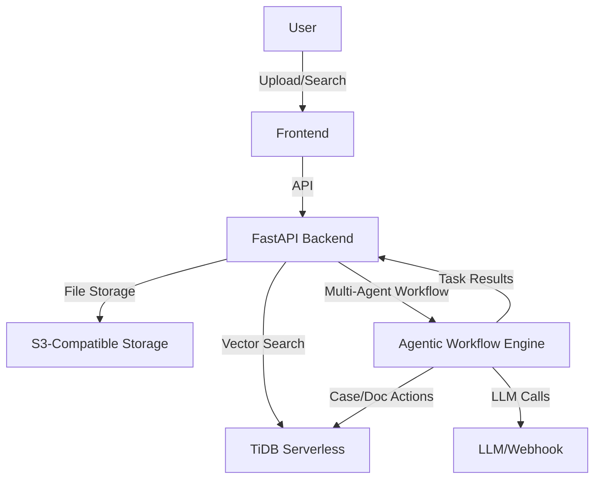

# Semantic Case Manager

A full-stack, open-source web application for semantic case management using TiDB Serverless (vector search), FastAPI, and React. It uses Amazon Bedrock Titan-V2 for text embeddings and Claude 3 Sonnet for LLM-based summarization in semantic search.

## Project Status

## Live App

[Access the live Semantic Case Manager app here](https://semantic-case-manager-loib.vercel.app)


## Features
- Amazon Bedrock Titan-V2 for text embeddings
- TiDB for Emeddings storage 
- TiDB Serverless vector search for semantic retrieval and 
- Claude 3 Sonnet for LLM-based summarization
- Multi-step agentic workflow engine
- Document upload, embedding, and search
- JWT authentication
- Free-tier hosting (Render, Vercel)
- S3-compatible file storage
- Automated tests & CI/CD
- **Responsive UI** using Tailwind CSS

- **Admin Dashboard** for Upload Documents, Documents List, Case Management, and User Management

## Quick Start

1. **Clone the repo**
   ```sh
   git clone https://github.com/yourusername/semantic-case-manager.git
   cd semantic-case-manager
   ```
2. **Run locally (dev)**
   ```sh
   docker compose up
   ```
3. **Set up TiDB Serverless**
   - Create a free TiDB Cloud account: https://tidbcloud.com
   - Create a Serverless cluster
   - Note your connection string and set it in `.env`

4. **Set up S3-compatible storage**
   - Use Cloudflare R2 or any S3-compatible free-tier
   - Set credentials in `.env`

5. **Configure environment variables**
   - Copy `.env.example` to `.env` and fill in required values


## Repo Structure
```
```
/backend   # FastAPI backend
/frontend  # React + Vite frontend
```

---


## Search Page

**Ask a Question:**
Type your question in the search bar. The app will search all cases or your selected case and provide a clear, organized answer based on the documents.
```

---

## Application Flows

1. **User Authentication**
   - User visits the app and logs in via username/password (JWT)
   - Authenticated users are redirected to the dashboard.

2. **Document Upload & Extraction**
   - User uploads a document (PDF, DOCX, etc.).
   - Backend extracts text and stores file in S3-compatible storage.
   - Embeddings are generated and stored in TiDB.

3. **Semantic Search**
   - User enters a search query.
   - Backend performs vector search and returns semantically relevant response based on the documents/cases.

4. **Case Management**
   - User creates new cases, assigns/unassigns documents, and views case details.

5. **Admin Dashboard**
   - Admins access advanced features: user management, activity logs, and workflow triggers.

6. **Workflow Automation**
   - LLM-based summarization and notification workflows can be triggered on cases/documents.


## License
MIT

---

## Data Flow Diagram



## Improvement Areas & Recommendations

- **User Experience:**
   - Add onboarding tooltips and contextual help for new users.
   - Improve error messages and loading indicators.
- **Security:**
   - Enforce stricter password policies and rate limiting.
   - Add audit logging for sensitive actions.
- **Scalability:**
   - Add support for multi-tenant organizations.
   - Implement background job queue for heavy tasks (embedding, LLM calls).
- **Testing:**
   - Increase test coverage for both backend and frontend.
   - Add end-to-end (E2E) tests for critical flows.
- **DevOps:**
   - Add monitoring/alerting for backend errors and downtime.
   - Automate database migrations on deploy.
- **Documentation:**
   - Expand API docs and add more usage examples.
   - Add a troubleshooting FAQ for common deployment issues.

## Cost & Quota Notes
- TiDB Serverless free-tier: 5GB storage, 20K QPS, 1M vector queries/month
- Example dataset: <100 docs, <1GB total
- S3/R2: free-tier limits apply

---

## Backend API Verification

**Health check:**
```sh
curl http://localhost:8000/api/health
# Response: {"status": "ok"}
```

**Login (JWT):**
```sh
curl -X POST http://localhost:8000/api/auth/token -d "username=testuser&password=testpass"
# Response: {"access_token": ...}
```

**User info:**
```sh
curl -H "Authorization: Bearer <access_token>" http://localhost:8000/api/auth/me
# Response: {"username": "testuser","testpass"}
```

**Admin endpoint:**
```sh
curl -H "Authorization: Bearer <access_token>" http://localhost:8000/api/admin/ping
# Response: {"msg": "pong", ...}
```

**Troubleshooting:**
- If you see `Could not validate credentials`, check your token format and ensure the backend is running.
- If you see form data errors, ensure `python-multipart` is installed (see requirements.txt).

## Next Steps
The major functionalities have been implemented and the project has been deployed to Vercel (frontend) and Render (backend).

Some improvement areas remain (see 'Improvement Areas & Recommendations' above), but the core features are complete and the app is deployed.
