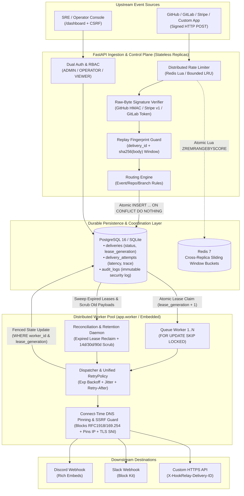
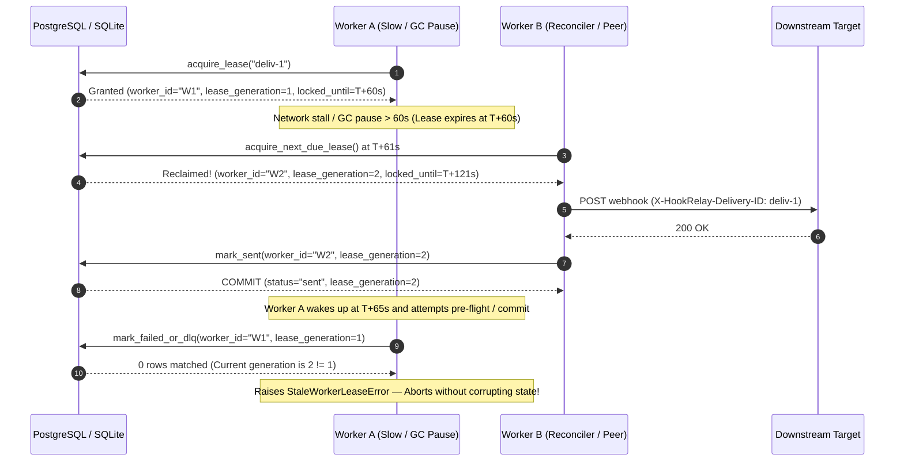

# HookRelay — Reliable Webhook Delivery Infrastructure You Can Self-Host

<p align="center">
  
</p>

<p align="center">
  <a href="https://github.com/Abhishek-Gali/HookRelay/actions/workflows/ci.yml"></a>
  <a href="https://www.python.org/downloads/"></a>
  <a href="https://fastapi.tiangolo.com"></a>
  <a href="https://github.com/Abhishek-Gali/HookRelay/actions/workflows/ci.yml"></a>
  <a href="https://github.com/Abhishek-Gali/HookRelay/actions/workflows/ci.yml"></a>
  <a href="https://github.com/Abhishek-Gali/HookRelay/actions/workflows/ci.yml"></a>
  <a href="https://opensource.org/licenses/MIT"></a>
</p>

> **HookRelay — Reliable webhook delivery with retries, idempotency, monotonic fencing tokens & crash recovery.**
>
> Instead of rebuilding HMAC verification, retry loops, rate-limit handling, and dead-letter queues inside every service, **your application or webhook provider talks to HookRelay once**. HookRelay verifies signatures, persists events durably in SQL (`PostgreSQL` or `SQLite`), coordinates distributed workers via monotonic fencing tokens, and guarantees delivery to **Discord, Slack, and custom HTTP microservices**.

```text
                 ┌──► Discord 🔵      (Native incoming webhooks + Rich Embeds)
GitHub ──┐       ├──► Slack 🟢        (Native incoming webhooks + Block Kit)
GitLab ──┼─► HookRelay ──► Custom HTTP ⚙️  (HTTPS POST + X-HookRelay-Delivery-ID idempotency)
Stripe ──┤       └──► WhatsApp / Email / PagerDuty* (*Via HTTP bridge or Provider plugin)
Custom ──┘
```

---

## ⚡ 1. See It Survive Outages & Worker Crashes (Live Demo)

What happens when your downstream API or Discord webhook goes down mid-deployment, or a worker process crashes while holding a job lease?

```text
GitHub / Stripe / App                Downstream Outage & Automatic Recovery
         │                                     │
         ▼                                     ├─► Attempt 1: Discord DOWN ❌ (HTTP 503)
    ┌───────────┐                              │      └──► Exponential Backoff + Jitter
    │ HookRelay │                              ├─► Attempt 2: Rate Limited ⚠️ (HTTP 429 Retry-After: 0.1s)
    └─────┬─────┘                              │      └──► Honors exact Retry-After header
          ▼                                    └─► Attempt 3: Discord UP   ✅ (HTTP 204 Delivered!)
   ┌─────────────┐
   │ PostgreSQL  │                   Worker Crash & Split-Brain Fencing Protection
   └──────┬──────┘                             │
          ▼                                    ├─► Worker A claims job (lease_generation = 1) & crashes 💥
   ┌─────────────┐                             ├─► Lease expires -> Worker B reclaims (lease_generation = 2) ✅
   │ Worker Pool │─────────────────────────────┴─► Zombie Worker A wakes up (gen=1 != gen=2) -> BLOCKED 🛡️
   └─────────────┘
```

Run the self-contained chaos & recovery demonstration in **under 5 seconds** (`zero external dependencies required`):

```bash
python -m scripts.demo_chaos_recovery
```

<details open>
<summary><b>📺 View Actual Terminal Output from <code>python -m scripts.demo_chaos_recovery</code></b></summary>

```text
==============================================================================
  SCENARIO 1: DOWNSTREAM OUTAGE (503) -> RATE LIMIT (429) -> RECOVERY (204)
==============================================================================
  [1] GitHub sends signed 'push' webhook (274 bytes, sig=sha256=e67e7f57f75d0d7...)
  [2] HookRelay verified HMAC & persisted job in SQL: delivery_id='deliv-outage-recovery-001' (claimed=True)
  [3] Worker 'worker-primary-01' claims lease (gen=1) & starts delivery with automatic retries:
      ├──► Attempt 1 -> Discord DOWN ❌ (HTTP 503 Service Unavailable)
      ├──► Attempt 2 -> Discord RATE LIMITED ⚠️ (HTTP 429 Retry-After: 0.1s)
      └──► Attempt 3 -> Discord UP ✅ (HTTP 204 No Content - Rich Embed Delivered!)
  [4] Final SQL Delivery Status: status='sent' | attempts=3 | total_time=621.6ms
      • Attempt #1: outcome='failed' | http_status=503 | latency=0.45ms | error=Service Unavailable: upstream outage
      • Attempt #2: outcome='failed' | http_status=429 | latency=0.30ms | error=Too Many Requests
      • Attempt #3: outcome='sent'   | http_status=204 | latency=0.21ms | error=None

==============================================================================
  SCENARIO 2: WORKER CRASH MID-FLIGHT & FENCING TOKEN SPLIT-BRAIN PROTECTION
==============================================================================
  [1] Worker A ('worker-A-stalled') claims 'deliv-worker-crash-002' -> lease_generation=1
  [2] Worker A suffers a network hang / GC pause 💥 (Lease expires!)
  [3] Worker B ('worker-B-rescuer') reclaims expired job -> lease_generation=2 (incremented!)
  [4] Worker B delivers webhook & commits status='sent' with fencing token (lease_generation=2) ✅
  [5] Zombie Worker A wakes up and attempts to overwrite SQL state with stale lease_generation=1...
      └──► BLOCKED BY DATABASE FENCING GUARD 🛡️: Fenced out: worker 'worker-A-stalled' (gen=1) no longer owns delivery 'deliv-worker-crash-002' (owner='None', gen=2, status='sent').
  [6] Verified Final SQL State remains intact: status='sent', lease_generation=2

==============================================================================
  ALL CHAOS & RECOVERY CHECKS PASSED (0 lost webhooks, 0 duplicate deliveries)
==============================================================================
```
</details>

---

## 🚀 2. 60-Second Quickstart & Example Webhook

### Option A: Production Multi-Container Stack (`Docker Compose`)
Launches **HookRelay API Gateway**, **4-Worker Distributed Consumer Pool**, **PostgreSQL 16**, and **Redis 7**:

```bash
git clone https://github.com/Abhishek-Gali/HookRelay.git
cd HookRelay
cp .env.example .env
POSTGRES_PASSWORD=$(python -c "import secrets; print(secrets.token_urlsafe(24))") docker compose up --build -d
```

### Option B: Zero-Dependency Local Run (`SQLite` + Embedded Worker)
```bash
pip install -r requirements.txt
uvicorn app.main:app --host 127.0.0.1 --port 8000
```

### Send a Signed Webhook & Inspect It in the Operations Console
Once running, send a signed test event (GitHub, Stripe, GitLab, or Custom) and open **`http://127.0.0.1:8000/dashboard`**:

```bash
python -c '
import hmac, hashlib, json, urllib.request
secret = "dev_webhook_secret_replace_in_prod"
body = json.dumps({
    "ref": "refs/heads/main",
    "repository": {"full_name": "Abhishek-Gali/HookRelay", "html_url": "https://github.com/Abhishek-Gali/HookRelay"},
    "pusher": {"name": "Abhishek-Gali"},
    "commits": [{"id": "4915e85", "message": "feat: verify resilient webhook delivery"}]
}).encode()
sig = "sha256=" + hmac.new(secret.encode(), body, hashlib.sha256).hexdigest()
req = urllib.request.Request(
    "http://127.0.0.1:8000/webhook/github",
    data=body,
    headers={"Content-Type": "application/json", "X-GitHub-Event": "push", "X-GitHub-Delivery": "demo-001", "X-Hub-Signature-256": sig}
)
print(urllib.request.urlopen(req).read().decode())
'
```
- **Response:** `{"accepted": true, "delivery_id": "demo-001"}`
- **Operations Console:** Open **`http://127.0.0.1:8000/dashboard`** to inspect real-time delivery status, per-attempt HTTP latency, Dead Letter Queue (DLQ) redrives, and security audit logs.

---

## 🏗️ 3. System Architecture & Fencing-Token Lease Lifecycle

### 3.1 End-to-End Ingestion, Durable Queueing & Egress Architecture



### 3.2 Split-Brain Prevention via Monotonic Fencing Tokens (`HR-02` / `HR-03`)



---

## 🧠 4. Key Engineering & Architecture Decisions

### 4.1 Why SQL (`FOR UPDATE SKIP LOCKED`) Instead of Kafka or RabbitMQ?
For a self-hosted webhook gateway, requiring teams to operate a separate JVM/Erlang message broker alongside their database doubles operational complexity and introduces **dual-write consistency bugs** (where a record commits to SQL but fails to publish to the broker, or vice versa).
- By storing both the delivery state machine and the job queue in the same ACID table (`deliveries`), **ingestion and queueing happen in a single atomic SQL transaction** (`INSERT ... ON CONFLICT DO NOTHING`).
- With PostgreSQL `FOR UPDATE SKIP LOCKED` and monotonic `lease_generation` fencing tokens, HookRelay gets durable, transactional job queueing with zero extra infrastructure.

### 4.2 Delivery Guarantees: `At-Least-Once` vs. `Effectively-Once`
Webhook gateways operate across network boundaries where external HTTP servers (Discord, Slack, third-party APIs) do not participate in two-phase commit (`2PC`) transactions with the gateway's database. If a worker crashes in the millisecond *after* the downstream HTTP server receives the TCP bytes but *before* the SQL `COMMIT` marking `status = 'sent'`, **true mathematical "exactly-once" delivery across arbitrary external HTTP servers is impossible without downstream cooperation**.

Instead, HookRelay implements **End-to-End At-Least-Once Delivery** paired with **Four-Layer Idempotency & Fencing Controls** to achieve **Effectively-Once Execution**:

| Pipeline Stage | Guarantee | Mechanism Implemented in HookRelay |
|---|---|---|
| **1. Webhook Ingress** | **Exactly-Once Ingestion** | • **Primary Key Deduplication:** `INSERT INTO deliveries ... ON CONFLICT (delivery_id) DO NOTHING` atomically rejects duplicate delivery IDs even under 200+ concurrent requests.<br>• **Signed-Payload Replay Guard (`HR-04`):** Indexes `payload_hash = sha256(raw_body)` + `event_type` within `REPLAY_WINDOW_SECONDS` (300s) so an attacker cannot replay an identical signed body under a mutated `X-GitHub-Delivery` UUID. |
| **2. Queue Lease & Worker Coordination** | **Mutual Exclusion + Fenced State Commits** | • **Atomic Row Claim:** Workers claim due jobs via `FOR UPDATE SKIP LOCKED` (PostgreSQL) or serialized `RETURNING` updates (SQLite).<br>• **Monotonic Fencing Tokens (`HR-02`/`HR-03`):** Every claim increments `lease_generation`. Workers verify `(worker_id, lease_generation)` before every HTTP attempt and inside the `WHERE` clause of `mark_sent` / `mark_retry_wait` / `mark_failed_or_dlq`. |
| **3. Multi-Destination Fan-Out** | **Per-Target Idempotency (`only_unsent=True`)** | • **Granular Target Checkpoint (`HR-06`):** Each destination inside `deliveries.destinations` tracks its own state (`pending` ➔ `sent` / `failed`) immediately after each HTTP call.<br>• If Destination 1 (Discord) succeeds (`204`) and Destination 2 (Slack) fails (`503`), subsequent retries and manual DLQ redrives **skip Destination 1** and only retry Destination 2. |
| **4. Downstream Egress (`provider: "http"`)** | **Idempotent Consumer Contract** | • Every outbound HTTP request includes deterministic headers (`X-HookRelay-Delivery-ID: <delivery_id>`, `X-HookRelay-Event: <event_type>`) so downstream microservices can deduplicate on `X-HookRelay-Delivery-ID`. |

### 4.3 Single-Instance (`SQLite`) vs. Distributed Multi-Worker (`PostgreSQL` + `Redis`)

| Architectural Dimension | Single-Node Mode (`SQLite` Default) | Distributed Multi-Instance Mode (`PostgreSQL` + `Redis`) |
|---|---|---|
| **Target Use Case** | Local dev, CI tests, single-VM / low-cost edge deployment | High-availability production, multi-replica Kubernetes / ECS / Compose |
| **Write Concurrency** | Process-local `asyncio.Lock` (`DeliveryStore._db_lock`) serializes SQLite write transactions (`WAL` mode + `busy_timeout=5000ms`), preventing `database is locked` errors up to ~720 req/sec burst. | Lock-free concurrent SQL writes across $N$ API replicas (`DeliveryStore._db_lock` is `None`); PostgreSQL MVCC handles thousands of concurrent inserts. |
| **Worker Job Claiming** | Single-statement `UPDATE ... WHERE id = (SELECT ...) RETURNING` claims due rows atomically within the process. | Row-level `SELECT id FROM deliveries ... FOR UPDATE SKIP LOCKED` allows $M$ distributed worker containers to claim disjoint jobs concurrently with zero lock contention. |
| **Rate Limiting** | Bounded-memory `OrderedDict` LRU sliding window (`max_buckets=10,000`) per process. | Shared atomic Redis Lua sliding window (`REDIS_URL=redis://...`) enforcing global rate limits across all API replicas. |
| **Worker Topology** | Embedded background worker + reconciler run inside the FastAPI `lifespan` process. | Standalone worker fleet (`python -m app.worker --concurrency 4`) scales independently from stateless API containers (`ENABLE_EMBEDDED_WORKER=false`). |

---

## 📊 5. Load & Concurrency Benchmark Results (`1,000` & `10,000` Webhooks)

Measured using the included [`scripts/benchmark_load.py`](scripts/benchmark_load.py) load harness (`python -m scripts.benchmark_load`) on a single machine (Python 3.13, SQLite WAL mode with full raw-byte HMAC-SHA256 verification, replay fingerprint lookup, and atomic SQL queue persistence enabled):

| Benchmark Tier | Total Events | Concurrency | Accepted / Dispatched | Errors / Duplicates | Throughput | Mean Latency | p50 Latency | p95 Latency | p99 Latency |
|---|---:|---:|---:|---:|---:|---:|---:|---:|---:|
| **Tier 1: 1,000 Signed Webhooks Ingestion** | `1,000` | `100` clients | `1,000 / 1,000` | `0` (`0.0%`) | **`722.2 req/sec`** | `131.21 ms` | `133.75 ms` | `151.22 ms` | `153.38 ms` |
| **Tier 2: 10,000 Signed Webhooks Ingestion** *(Sustained SQLite write-lock stress)* | `10,000` | `200` clients | `10,000 / 10,000` | `0` (`0.0%`) | **`240.8 req/sec`** | `821.03 ms` | `831.69 ms` | `1,095.33 ms` | `1,143.83 ms` |
| **Tier 3: 4-Worker Distributed Queue Drain** (`bench-worker-0..3`) | `1,000` jobs | `4` workers | `1,000 / 1,000` (`[250, 250, 250, 250]`) | `0` duplicates | **`38.2 jobs/sec`** *(SQLite lock serialized)* | — | — | — | — |

```bash
# Reproduce the 1,000 and 10,000 webhook load test locally:
python -m scripts.benchmark_load --tiers 1000 10000 --workers 4
```

---

## 🛡️ 6. Security Hardening & STRIDE Threat Model

Full analysis in [docs/threat-model.md](docs/threat-model.md).

| STRIDE Category | Threat Vector | Technical Control | Verified By |
|---|---|---|---|
| **Spoofing** | Forged GitHub / Stripe / GitLab webhook | Raw-byte HMAC-SHA256 / Stripe `v1` / GitLab token (`compare_digest`) | `tests/test_security.py` |
| **Spoofing** | Mutated `X-GitHub-Delivery` replay | Bounded `payload_hash` replay window (`HR-04`) | `tests/test_webhook_e2e.py` |
| **Spoofing** | Default credentials in prod | Startup validator rejects defaults / keys `<32` chars | `tests/test_auth.py` |
| **Tampering** | Stale worker overwriting state | Monotonic `lease_generation` fencing tokens (`HR-02/03`) | `tests/test_queue_and_leases.py` |
| **Tampering** | Stored XSS in dashboard | Pure DOM `.textContent` rendering + strict CSP | `tests/test_webhook_e2e.py` |
| **Tampering** | Mention injection (`@everyone`) | Universal `sanitize_mentions()` + HTTPS URL validation | `tests/test_formatter.py` |
| **Repudiation** | Unaudited auth failures / replays | Persistent `audit_logs` (never logs raw keys) | `tests/test_webhook_e2e.py` |
| **Info Disclosure** | SSRF to internal/metadata IPs | `resolve_and_pin_destination()` + `ALLOW_PRIVATE` prod block | `tests/test_routing.py`, `tests/test_auth.py` |
| **Denial of Service** | Chunked multi-GB payload | Streaming byte cutoff (`read_bounded_body_stream`) | `tests/test_webhook_e2e.py` |
| **Denial of Service** | API brute-force / redrive flood | Redis Lua / bounded LRU sliding-window rate limiters | `tests/test_webhook_e2e.py` |
| **Elevation of Privilege** | Viewer triggering redrive/discard | Strict RBAC `require_role()` dependency (403) | `tests/test_webhook_e2e.py` |

---

## 🔌 7. API & Probe Reference

| Method | Endpoint | Auth / Role | Description |
|---|---|---|---|
| `POST` | `/webhook/github` | GitHub HMAC (`X-Hub-Signature-256`) | Streaming size check, HMAC verify, replay check, atomic claim, durable enqueue |
| `POST` | `/webhook/{source}` | `stripe` \| `gitlab` \| `custom` | Multi-source webhook ingestion (`Stripe-Signature`, `X-Gitlab-Token`, `X-HookRelay-Signature`) |
| `GET` | `/dashboard` | Browser (Session Cookie) | XSS/CSRF-hardened operations & DLQ replay console |
| `POST` | `/api/auth/login` | API Key in body | Exchanges API key for `HttpOnly; SameSite=Strict` session cookie + CSRF token |
| `POST` | `/api/auth/logout` | `VIEWER`+ & CSRF | Revokes active browser session cookie |
| `GET` | `/api/deliveries` | `VIEWER`+ | List deliveries with attempt histories |
| `GET` | `/api/deliveries/{id}` | `VIEWER`+ | Inspect single delivery and per-attempt trace |
| `POST` | `/api/deliveries/{id}/redrive` | `OPERATOR`+ | Replay failed/DLQ delivery (retries only unsent destinations by default) |
| `GET` | `/api/dlq` | `VIEWER`+ | List deliveries in `dead_letter` status |
| `POST` | `/api/dlq/{id}/discard` | `ADMIN` | Transition unfixable DLQ item to `discarded` |
| `GET` | `/api/stats` | `VIEWER`+ | Aggregated delivery, queue depth, & DLQ statistics |
| `GET` | `/api/audit-logs` | `ADMIN` | Security audit trail (`auth_failed`, `authz_denied`, `redrive`, `discard`) |
| `GET` | `/health/live` | Public | Minimal liveness probe (`{"status": "alive"}`) |
| `GET` | `/health/ready` (`/healthz`) | Public | Minimal readiness probe (`{"status": "healthy", "database": "connected"}`) |
| `GET` | `/metrics` | `VIEWER`+ (`REQUIRE_METRICS_AUTH=true`) | Prometheus telemetry metrics |

---

## 🗺️ 8. Roadmap & Contributing

- [x] **v2.0:** Durable SQL Queue, Worker Leases, Reconciliation & RBAC Operations Console
- [x] **v2.1:** Monotonic Fencing Tokens (`lease_generation`), Per-Destination Partial-Failure Recovery, Connect-Time DNS Pinning & Retention Scrubbing
- [x] **v2.2:** Multi-Source Ingestion (`GitHub`, `GitLab`, `Stripe`, `Custom`), Standalone Distributed Worker Pool (`app.worker`), & 10k Load Benchmark Suite
- [ ] **v2.3 (Next):** Native **PagerDuty Events v2**, **Telegram Bot API**, **Email (Resend / SMTP)**, and **WhatsApp Cloud API** destination providers
- [ ] **v2.4:** Per-destination circuit breakers & OpenTelemetry (`OTLP`) distributed trace propagation

Contributions, issue reports, and new provider adapters are welcome! See **[CONTRIBUTING.md](CONTRIBUTING.md)** to get started in under 60 seconds.

---

## 📄 License

MIT License. Designed and maintained by [Abhishek Gali](https://github.com/Abhishek-Gali).
