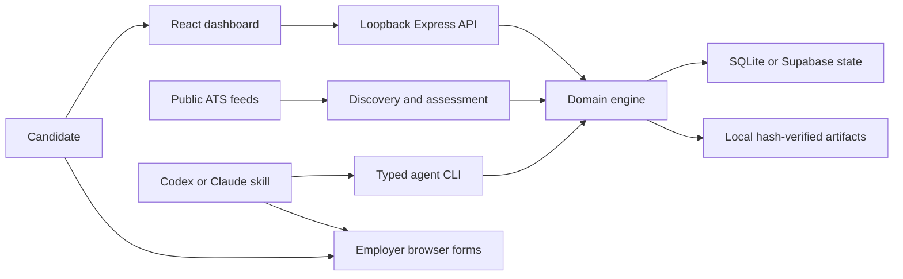

<div align="center">

# Career Agent

### A local-first job application workspace.

Research opportunities. Prepare with facts. Review every application.

[](https://github.com/AdiRosenstock/career-agent-public/actions/workflows/ci.yml)


[](LICENSE)

[Start here](#start-here-no-coding-experience-needed) · [Use with Codex or Claude](docs/AGENT_SETUP.md) · [Architecture](docs/ARCHITECTURE.md) · [Design decisions](docs/DESIGN_DECISIONS.md) · [Interface](docs/UI_DESIGN.md) · [Contribute](CONTRIBUTING.md)

</div>

---

> **This is an open-source project, and you are invited to improve it.** Suggestions, bug reports, design changes, documentation edits and code contributions are welcome. You do not need technical experience to share an idea. [Suggest an improvement](https://github.com/AdiRosenstock/career-agent-public/issues/new?template=feature_request.yml) · [Report a bug](https://github.com/AdiRosenstock/career-agent-public/issues/new?template=bug_report.yml) · [Propose an edit](CONTRIBUTING.md).
>
> Changes are reviewed through pull requests before being merged. Please use fictional examples and keep personal application information private.

## Start here: no coding experience needed

Career Agent helps your assistant find suitable jobs, complete applications and keep the results in one place. **You do not need to write code or make an agent plan.** Save your details on the dashboard once, then let Codex or Claude Code work from them.

You need your own computer, internet access, **Codex or Claude Code with access to that computer**, and your original résumé PDF before preparing applications. These assistants are separate products; Career Agent does not install or provide them. If you have neither, ask someone to help you set one up. You can also try the fictional demo before adding your résumé.

1. Open Codex or Claude Code on your computer and send the message below.
2. Open the dashboard link it gives you. At the top of **Start here**, upload your original résumé PDF and, if available, a base cover letter PDF and transcript PDF. Then add your profile, degree, job interests, optional career page URLs, reusable answers, and choices for AI writing, form filling, and submission. Automatic submission has a separate warning because AI may make mistakes.
3. Click **Search employer feeds now** to find and prepare roles from configured public boards. For a broader employer search and live form completion, choose your assistant and copy its preparation instruction into the same chat.
4. Answer any missing personal questions in **Review queue → Needs answers**. Repeated questions can be answered together.
5. Follow your submission choice: submit yourself, approve an exact batch, or ask your agent to find jobs and apply automatically after accepting the risk warning. The agent records actual confirmation evidence.

**Copy this message to your assistant:**

```text
Install and open Career Agent for me:
https://github.com/AdiRosenstock/career-agent-public
Follow the README and shared job-application-agent skill. Use the default local
setup, preserve existing files, and open Start here for my profile and job choices.
Let me add my original résumé PDF in Start here.
```

The assistant handles installation. You may need to choose a file, approve a software installation, or sign in yourself. Personal answers belong on the dashboard, so you do not need a long chat interview. The dashboard can search configured public employer feeds; Codex or Claude Code expands the search and handles actual employer forms through its browser tools. Login, CAPTCHA and assessments may need your action. Agent subscriptions and external tools can have their own costs; this project's code is free.

If you get stuck, tell the same assistant: **“I'm stuck at [what you see]. Fix it or show me the next click.”**

To return later, say: **“Open my existing Career Agent and continue from my saved dashboard.”** The app runs on your computer; restarting the computer or stopping its process closes it until reopened. Your saved records remain on disk.

Prefer installing it yourself? Follow the [quick start](#quick-start). To try fictional data first, say: **“Set up the demo only.”**

Career Agent is an open-source, local-first application workspace, built around a simple requirement: reduce repetitive application work while keeping the candidate in control. It brings job research, sourced facts, unchanged documents, draft answers, duplicate checks, and review history into one place.

The dashboard is the system of record. Codex or Claude Code handles research and browser work through a repository skill. An application is only considered submitted when there is confirmation evidence.

**Open source under the MIT license.** Built with TypeScript, React, Express, SQLite, and a shared agent workflow. This repository contains reusable code and synthetic examples; personal applications and documents belong in each user's private workspace.


> **Current scope:** US full-time jobs at your saved new graduate, early-career or experienced level, across your selected career paths and job titles. It is a single-user local application. Other countries and independent background workers need further development.

## What you can do

| Capability | How it works |
|---|---|
| Filter saved roles | Company, location, sponsorship evidence, compensation, career track, and status; built-in quick views and sorting |
| Discover opportunities | Read public Greenhouse, Lever, and Ashby job feeds; import sourced manual postings |
| Set up once | Save your profile, career stage, role interests, location/workplace choices and confirmed reusable answers |
| Answer missing questions | Resolve repeated personal questions together in the dashboard while the agent continues other jobs |
| Compare compensation | Check annual USD base or total pay against your selected floor; keep ambiguous ranges in research |
| Research sponsorship | Separate role-specific policy from employer history and explicit refusals |
| Avoid duplicate applications | Match prior evidence by ATS identity, URL, requisition, and role; hold uncertain identities for review |
| Prepare review packets | Track tailored answers, open questions, document choices, and content versions |
| Preserve original documents | Copy PDFs without rewriting them and verify SHA-256 before use |
| Complete applications | Your agent fills supported browser forms and can submit the exact batch you review, approve and ask it to execute |
| Track outcomes | Keep handoffs, failures, confirmed submissions, and unknown outcomes distinct |

The app does not run an invisible AI agent, store email credentials, take candidate assessments, bypass CAPTCHA, or guarantee compatibility with every employer form. A ready packet is not proof that a live form is complete.

## Quick start

You run Career Agent on **your own computer**. There is no website account to create. Your profile and documents stay in your private workspace. The dashboard works for manual tracking; Codex or Claude Code adds research and form-filling assistance.

Choose your actual career stage, experience and graduation/start dates in **Start here**. Matching uses those saved choices rather than the creator’s personal career targets.

### 1. Install the basics once

- Install **Node.js 22** from [Node.js](https://nodejs.org/en/download). Node runs the app; npm, included with it, installs its dependencies. The project is tested on Node 22.16 or newer within Node 22.
- Install [Git](https://git-scm.com/downloads), which downloads and updates the project.
- For assisted work, use your installed **Codex or Claude Code**. You can try the dashboard without either.

Open **Terminal** on macOS or **PowerShell** on Windows. Paste each command below and press Enter. Keep this terminal open while using the app.

### 2. Download Career Agent

```sh
git clone https://github.com/AdiRosenstock/career-agent-public.git
cd career-agent-public
npm ci
```

Wait for installation to finish. The `career-agent-public` folder is your copy of the app. Keep it in a place you can find again.

### 3. Try it first, with fictional data

```sh
npm run demo
```

Open [the demo at 127.0.0.1:4318](http://127.0.0.1:4318) in your browser. Try the company, sponsorship, location, pay and career-track filters. **About** in the left menu introduces the creator. The demo uses fictional jobs and a placeholder résumé; do not use them for real applications. It never loads your personal application database.

Press **Ctrl+C** in the terminal to stop the demo when you are ready for your own workspace.

### 4. Set up your own workspace

In the same project folder, run:

```sh
npm run setup
npm run doctor
npm run build
npm start
```

Setup lets you provide the full path to your original résumé PDF or press Enter and add it in **Start here**. It preserves the PDF and uses **local SQLite by default**, with no database account or storage choice required. Existing configuration and backend selections are kept. The default port is **4317**.

`doctor` checks your setup and reports missing requirements. On the first run it may report that the app has not been built; the next command, `npm run build`, handles that. Fix any Node, résumé or database errors before continuing. Setup will not overwrite an existing configuration.

Open [your dashboard at 127.0.0.1:4317](http://127.0.0.1:4317). This address works only while the app is running on your computer.

- **Start here:** save contact details, career stage, job interests, locations, workplace preferences, compensation policy and separate work authorization answers. Use your actual graduation date when relevant.
- **Your profile / Settings:** update saved details and verified experience later.
- **Review queue:** answer missing questions together, review exact packets and approve a batch.
- **Applications:** filter saved roles and review the evidence. Employer sponsorship history is not confirmation for a specific role.
- **Opportunities:** add a job posting or refresh configured public employer feeds. An empty list is normal until jobs are imported or feeds are configured.
- **About:** find the creator's background, LinkedIn, GitHub and source links. You can reopen it directly with `?view=about`.

Your private files live in `.data/` and `.env.local`. They are excluded from Git. **GitHub stores the code, not your application records.** Keep a private backup if you need to restore your history later.

### 5. Let your assistant work

Open this project folder in Codex or Claude Code. In the dashboard, choose your assistant and copy the generated preparation instruction into its chat. You can also say:

```text
Use the job-application-agent skill and continue from my saved dashboard.
Search and complete application preparation; put missing personal answers
in Needs answers and continue the other jobs. Leave final Submit for review.
```

The shared skill reads a compact work queue and saved preferences. It researches employers, inspects live forms, prepares sourced answers and fills the forms its browser can handle. You do not need to name companies, configure feeds or write a detailed plan first.

When a batch is ready, review its exact answers and documents on the dashboard. Approve the packets you want and copy the submission instruction into the assistant's chat. This authorizes that specific batch; changed contents require another review. The assistant records confirmation evidence and identifies any job requiring your action.

The assistant selector generates instructions; it does **not** connect accounts or launch a background worker. Actual form work uses your own assistant's browser tools. If those are unavailable, the assistant prepares saved answers and records a manual handoff. See [agent setup](docs/AGENT_SETUP.md) and [connections](docs/CONNECTIONS.md) when a tool needs connecting. SQLite needs no external service; Supabase is optional.

### Open the app again later

Open a terminal inside your `career-agent-public` folder and run:

```sh
npm start
```

Open [127.0.0.1:4317](http://127.0.0.1:4317). Your saved local records remain between runs. Stop the app with **Ctrl+C**; this does not erase your data. You do not need to run setup again.

### If something goes wrong

| What you see | What to do |
|---|---|
| `npm` or `node` is not recognized | Install Node 22, then close and reopen your terminal |
| `package.json` cannot be found | Enter the downloaded folder with `cd career-agent-public` |
| Browser says the page is unavailable | Run `npm start` and keep the terminal open; use port 4317 for your workspace or 4318 for the demo |
| Native SQLite / Node version error | Use Node 22 for both installation and execution, then run `npm ci` again |
| Résumé path or checksum error | Run `npm run doctor`; restore the original PDF rather than editing the recorded checksum |
| Setup says configuration already exists | Keep it; do not delete your configuration to repeat onboarding |
| No jobs or no sponsorship matches | Import a posting or configure feeds; unknown evidence does not count as confirmed sponsorship |
| Your assistant cannot open forms | Configure its browser tools or fill manually; see the connections guide |

For more help, read [troubleshooting](docs/TROUBLESHOOTING.md). When reporting an issue, remove personal answers, documents and credentials from logs or screenshots.

## Your daily workflow

1. **Continue from saved choices.** Copy the dashboard's preparation instruction into your assistant chat. It checks previous applications and researches suitable jobs.
2. **Answer only what's missing.** Use **Review queue → Needs answers** for personal choices the assistant cannot source; it continues other jobs.
3. **Apply your way.** Submit yourself, approve exact packets and copy the batch instruction, or choose automatic submission with the dashboard risk acknowledgment and ask your agent to apply.
4. **Check results.** Confirmations, unknown outcomes and handoffs appear in history. An uncertain result must be reconciled before retrying.

Ordinary new preparation is capped at **20/day**, shared across runs using the Chicago day boundary. Explicit one-day manual allowances can raise the limit to 50; they do not authorize submission. Scheduling is separate and opt-in. Scheduled discovery/preparation never submits, even when an older batch is approved.

## Architecture at a glance



The engine owns eligibility, packet versions, approvals, daily limits, and attempt transitions. Browser interactions happen outside the engine; confirmation evidence connects them back to history. SQLite transactions or Supabase revision checks coordinate updates. A selected backend failing never silently redirects writes elsewhere.

See [architecture](docs/ARCHITECTURE.md) and [design decisions](docs/DESIGN_DECISIONS.md) for the data model, trust boundaries, and tradeoffs.

## Documentation

| Guide | Covers |
|---|---|
| [Agent setup](docs/AGENT_SETUP.md) | First-run onboarding, profile facts, account checks, browser workflow, prompts |
| [Connections](docs/CONNECTIONS.md) | Your own database, agent accounts, browser/email tools and MCP servers |
| [Architecture](docs/ARCHITECTURE.md) | Components, state, approval integrity, concurrency, trust boundaries |
| [Design decisions](docs/DESIGN_DECISIONS.md) | Why local first, explicit evidence, hash-verified documents, and human review |
| [Interface design](docs/UI_DESIGN.md) | Layout, visual hierarchy, filter behavior and accessibility |
| [Configuration and storage](docs/CONFIGURATION.md) | Environment variables, SQLite/Supabase, backups, restore and migration |
| [CLI reference](docs/CLI.md) | Commands, side effects, structured payloads |
| [Troubleshooting](docs/TROUBLESHOOTING.md) | Startup, PDFs, browser persistence, ATS limitations |
| [Browser helper](browser-extension/README.md) | Optional Chrome/Edge extension installation and limits |
| [Contributing](CONTRIBUTING.md) | Development, validation, privacy and pull requests |
| [Security](SECURITY.md) | Local-only deployment and private vulnerability reporting |

## Help make Career Agent better

**Contributions are welcome.** You do not need to be a developer to help.

- [Report a bug](https://github.com/AdiRosenstock/career-agent-public/issues/new?template=bug_report.yml): describe what you tried and what went wrong.
- [Suggest an improvement](https://github.com/AdiRosenstock/career-agent-public/issues/new?template=feature_request.yml): tell us what would make applying easier.
- Improve confusing instructions, accessibility, filters, or the interface.
- Build and test support for more countries, employer controls and agent tools.

For code or documentation changes, read [Contributing](CONTRIBUTING.md). Fork the project, make your change, and open a pull request so it can be reviewed before it becomes part of the app. For a large change, open an issue first to discuss the approach. Use fictional examples; never share your résumé, application history, passwords or private screenshots.

## Development

```sh
npm ci
npm test
npm run build
npm run check:public
npm run dev
```

Tests use temporary storage and fictional fixtures; they do not apply to real employers. CI runs public-file hygiene, tests, and the production build on Node 22. `npm run check:public` checks tracked files for common private artifacts and credential patterns; it is not a complete secret scanner or Git-history audit.

## Before deleting a workspace

A GitHub clone restores **code**, not your candidate state. Back up the active state **and** local artifacts to private storage, verify a restore into an empty destination, and retain any original documents you need. Exported JSON does not include PDF bytes. Never publish application histories, exported answers, candidate documents, cookies, credentials, or private handoffs.

## License

[MIT](LICENSE). You can use, modify, and share the code subject to the license. Employer sites retain their own terms; this project grants no permission to bypass their controls.

## About the creator


Career Agent was created by **Adi Rosenstock**, a Costa Rican student studying Data Science and Economics at Northwestern University and the creator of [BanterBoost](https://fplbanterboost.com). It grew out of a personal application workflow and is open source so others can use their own documents, profile, storage, and agent tools.

The architecture keeps candidate data private, checks original document integrity, and shares one workflow across Codex and Claude Code. Review mode requires current approval; automatic mode requires explicit risk acknowledgment and a complete current packet. Read the [architecture decisions](docs/ARCHITECTURE.md) for implementation details.

[LinkedIn](https://www.linkedin.com/in/adirosenstock) · [GitHub](https://github.com/AdiRosenstock)

Biography and portrait: [BanterBoost About page](https://fplbanterboost.com/about). The portrait is hosted there and is not covered by this repository's software license. Creator attribution does not supply application answers or identify the current workspace user.

### Personal career targets and authorization

In **Settings → Career targets**, select tracks and move them into your preferred
order. Engineering covers mechanical, aerospace, propulsion, manufacturing,
electrical and hardware careers. Use additional comma-separated role title terms
for other interests (for example, teacher or nurse). These settings control feed
selection, preparation priority and opportunity ordering. Existing saved jobs are
re-evaluated when targeting or profile answers change; affected approvals require
fresh review.

In **Your profile → Work authorization**, confirm authorization now and at the
proposed start date and whether you need sponsorship now or in the future. If you
confirm authorization at start and no sponsorship requirement, postings without
sponsorship evidence or offering no sponsorship can qualify. Unknown answers keep
the sponsorship checks in place. Citizenship, ITAR/export-control and clearance
requirements need separate confirmed eligibility; work authorization alone does
not establish them.

Choose your own employer boards in Settings. Feeds support Greenhouse, Lever and
Ashby. Workday and other postings without a public feed can be added with **Add a job** by
pasting the employer URL, title, location and description. The agent can complete
these forms through its browser when the actual controls are supported and the exact packet is reviewed and approved. Saved career stage,
experience and graduation dates control US full-time matching.
