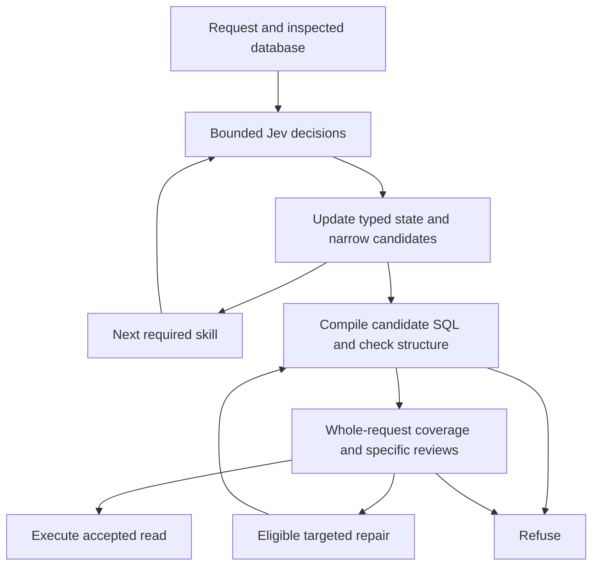

# IntentSQL

**Explore a SQLite database in plain English, then inspect how the answer was built.**

IntentSQL is a local playground for querying and changing SQLite data. Ask for rows, counts, grouped results or related fields; inspect the semantic decisions, typed plan, SQL and result. For `INSERT`, `UPDATE` and `DELETE`, review the proposed changes before confirming them.

It is also an experiment with **decision models / System One models**, using **Jev** in practice: can small, bounded judgments compose with ordinary code into useful behavior?

[Jev is TypeSafe’s System One model](https://docs.typesafe.ai/concepts/system-one): give it context and focused questions, and receive a choice, yes/no probability or rubric score. These are bounded decisions for code to combine; the application defines the workflow and actions. “Decision model” describes this role here.

> Show the five districts with the highest per-pupil expenditure. Return district name and per-pupil expenditure, highest first.


*Jev / `jev-latest`, on the bundled DESE database: a direct relationship, highest-first ordering and five rows. This recorded capture predates the latest Alpha UI cleanup. Display SQL renders values; execution uses bound parameters.*

## The experiment

I built IntentSQL to explore what happens when semantic judgment becomes a small, programmable part of otherwise deterministic software.

Code inspects the database and supplies real candidates: tables, columns, relationships, values and legal operations. Jev makes bounded judgments about what the request means. A selected table narrows the available fields. A selected comparison narrows the possible operands. Established facts flow into later decisions, and checks can challenge an incomplete plan.

SQL is a useful test bed because the world is structured and the effects are visible. A query can be compared with independent reference SQL; an unsupported interpretation can be refused. The interesting question is the composition, rather than natural-language SQL itself.

## How it works

The read path looks like this:



Python selects the branches. Independent questions can share a call; dependent questions receive relevant established state. The feedback arrow represents specific implemented repairs, such as retrying an omitted joined filter—not a general search over plans.

Writes share the row-predicate planner, then take a separate path: compile → preview on an isolated copy → semantic vet → explicit confirmation → guarded commit.


*Detail from the recorded run above. The current UI exposes exact questions, answers, probabilities, confidence and optional raw exchanges, with a revised card layout. [ARCHITECTURE.md](ARCHITECTURE.md) explains the mechanics.*

## A result—and a refusal

The [final user smoke report](benchmarks/alpha-user-smoke-result.json) records:

> Give me the first three episodes from season 4, in episode order.

```sql
SELECT * FROM "episodes"
WHERE "season" = ?
ORDER BY "episode_in_season" ASC
LIMIT ?
-- Parameters: [4, 3]
```

Three rows matched the independent reference, and the typed plan matched the requested filter, ordering and limit.

The same report records this request:

> Return the two tallest players within each birth country, ranked separately inside every country.

It refused: `This request requires unsupported window/ranking semantics; no partial query was executed.` General top-N-per-group ranking is outside the current capability set. Refusal is a useful outcome here, but is counted separately from a correct query.

## What you can do

| Area | Current capabilities |
| --- | --- |
| Read | Whole rows or selected fields; comparisons, numeric/date ranges, NULL checks, text contains/prefix/suffix, alternatives and flat AND/OR |
| Summarize | DISTINCT, COUNT, scalar aggregates, grouping, HAVING, aggregate ordering and supported rounding |
| Relate and rank | One declared foreign-key hop for fields/predicates; ordering, limits, global and per-group MIN/MAX row selection |
| Change | Grounded INSERT/UPDATE/DELETE, before/after preview, explicit confirmation, transactional commit and guarded undo |
| Inspect | Schema browser, row previews, read-only SQL console, exact call details, typed plans, SQL/parameters, token usage and estimated Jev cost |

Bundled Cyberchase, DESE and Moneyball databases give you something to explore immediately. You can also import SQLite databases; the app works on copies and preserves the originals.

## Alpha limits

**v0.1.0-alpha.1** is a local, single-user experiment. The supported shapes do not cover every phrasing. Jev can reject valid wording, and probabilistic coverage does not prove an accepted interpretation correct. Inspect important results and every mutation preview.

Joined aggregates, multi-hop joins, general subqueries, arbitrary nested Boolean logic and top-N-per-group ranking are outside the current envelope. Writes require grounded targets and enforce a 100-change cap, including cascades/trigger effects. Confirmation and undo state live in one server process.

Reconsideration follows finite code-defined paths. There is no training or persistent learning between requests. Whether this pattern is useful beyond the current application remains an open question.

## Quick start

Live semantic decisions need a reachable connection. Configure **Jev** in **Connection** after starting the app; no frontend build or `.env` file is needed. Open <http://127.0.0.1:7862>, choose a database and try a question.

### Getting access

Sign in to the [TypeSafe console](https://console.typesafe.ai/) and obtain an API key from its dashboard, following the [official quick start](https://docs.typesafe.ai/introduction/quickstart). In IntentSQL’s **Connection**, select **Jev** and save the key; the preset uses `https://api.typesafe.ai/v1/systemone` and `jev-latest`. You can also configure OpenJEV, a separately running local Laya adapter, or another compatible endpoint. Compatibility is an interface option, not a claim of equivalent tested behavior.

### Docker

```bash
docker build -t intentsql:0.1.0-alpha.1 .
docker volume create intentsql-data
docker run --rm --name intentsql \
  -p 127.0.0.1:7862:7862 \
  --mount source=intentsql-data,target=/data \
  intentsql:0.1.0-alpha.1
```

The volume preserves saved connections, imported working copies and committed changes. API keys are not baked into the image. Stop with `Ctrl+C`.

### Python — Linux / macOS

Use Python **3.10+**:

```bash
python3 --version
python3 -m venv .venv
.venv/bin/python -m pip install -r requirements.txt
.venv/bin/python -m uvicorn intentsql.web:app --host 127.0.0.1 --port 7862 --workers 1
```

### Python — Windows PowerShell

```powershell
py -3 --version  # verify 3.10 or newer
py -3 -m venv .venv
.\.venv\Scripts\python.exe -m pip install -r requirements.txt
.\.venv\Scripts\python.exe -m uvicorn intentsql.web:app --host 127.0.0.1 --port 7862 --workers 1
```

Use **one worker** and keep the server bound to localhost. For Python installs, you may set `SYSTEM_ONE_API_KEY` in your shell instead of saving it through the UI.

Saved profiles live outside the repository in the IntentSQL workspace: `%LOCALAPPDATA%\IntentSQL` on Windows, or `$XDG_DATA_HOME/intentsql` / `~/.local/share/intentsql` on Linux/macOS. `INTENTSQL_WORKSPACE` overrides the location; older workspace locations are reused when applicable. The connection API does not return saved keys. Imported working copies can be deleted after confirmation; bundled examples cannot.

## Evidence

These are recorded snapshots, not general natural-language accuracy estimates:

| Check | Recorded outcome |
| --- | --- |
| [Internal Alpha v2](benchmarks/v2/README.md), development corpus | 80/80 in one historical run, including 19 expected rejections |
| [Originally unseen Spider subset](benchmarks/spider/README.md), frozen eligible 40 cases | 30/40 passed execution and typed-plan checks; 5 safe rejections, 4 incorrect-result classifications, 1 matching result with a plan mismatch |
| [Final user smoke](benchmarks/ALPHA_USER_SMOKE.md), development validation | 18 supported requests matched rows and shape; 2 expected rejections; 379 offline tests recorded |

The original Spider result is preserved unchanged and is not an official Spider score. [Later safety fixes](benchmarks/ALPHA_SAFETY.md) and user-smoke checks are development work; neither the full Spider subset nor the internal live suite was rerun after those fixes. The existing plain-English smoke recorded 9/10, with one safe cardinality rejection. Provider/model identity is not recorded in the curated safety and user-smoke results. Detailed usage and failure evidence stay in the linked reports.

The recorded internal and Spider runs identify **Jev / `jev-latest`**. Their curated reports do not record run dates or the resolved versioned model ID. [TypeSafe documents `jev-latest` as a moving alias](https://docs.typesafe.ai/models), so a later run can use a different underlying model. No historical version or date is inferred here.

## Contributing and licenses

A useful issue includes the request, a small schema/database, expected meaning, actual SQL or refusal, and the decisive trace. General fixes are more useful than database-specific phrase rules. The [original CSV prototype](examples/) and [launch/demo notes](docs/LAUNCH.md) are available separately.

IntentSQL code is [MIT licensed](LICENSE). The bundled `cyberchase.db`, `dese.db`, and `moneyball.db` originate from [Harvard CS50's Introduction to Databases with SQL](https://cs50.harvard.edu/sql/) and are provided for the reproducible demo under the course's [CC BY-NC-SA 4.0 license](https://cs50.harvard.edu/sql/license/); that license applies to the course material separately from the MIT code. The database files have not been modified. See [Cyberchase](https://cs50.harvard.edu/sql/psets/0/cyberchase/), [DESE](https://cs50.harvard.edu/sql/psets/1/dese/), and [Moneyball](https://cs50.harvard.edu/sql/psets/1/moneyball/) for source context.
