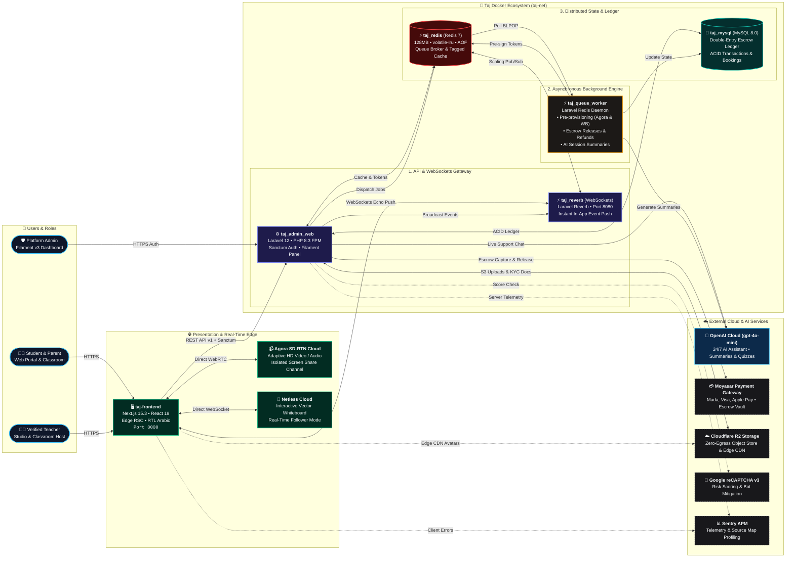
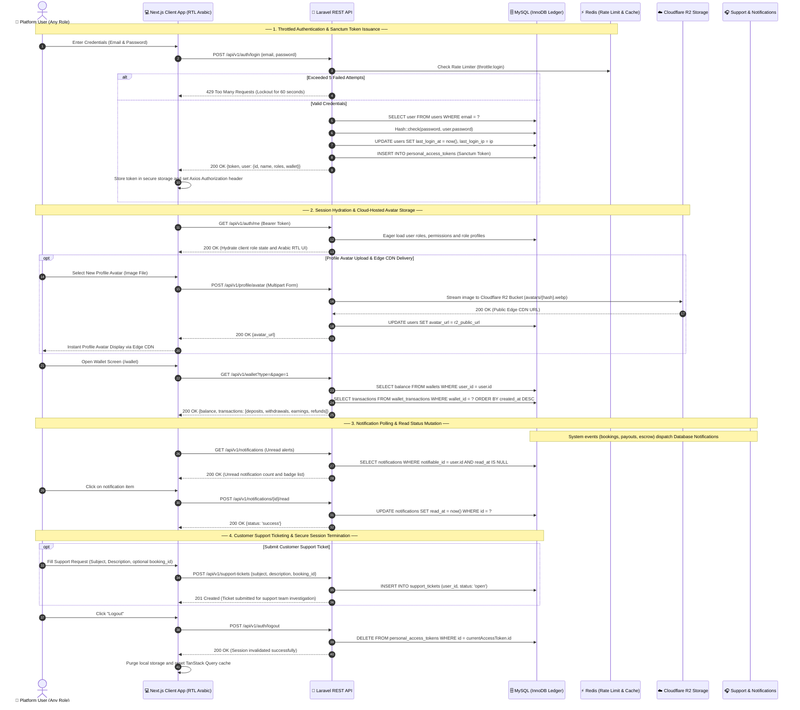
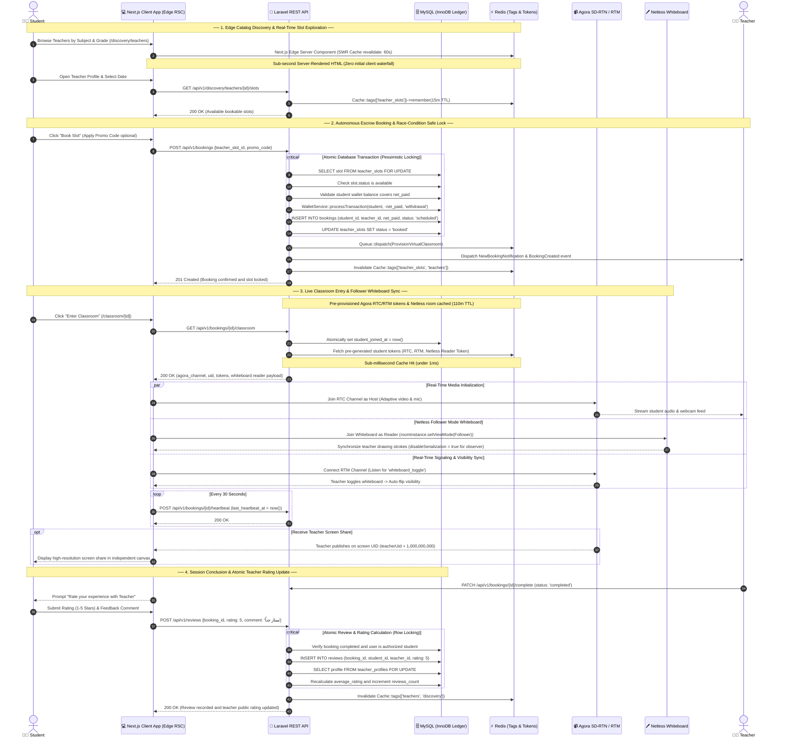
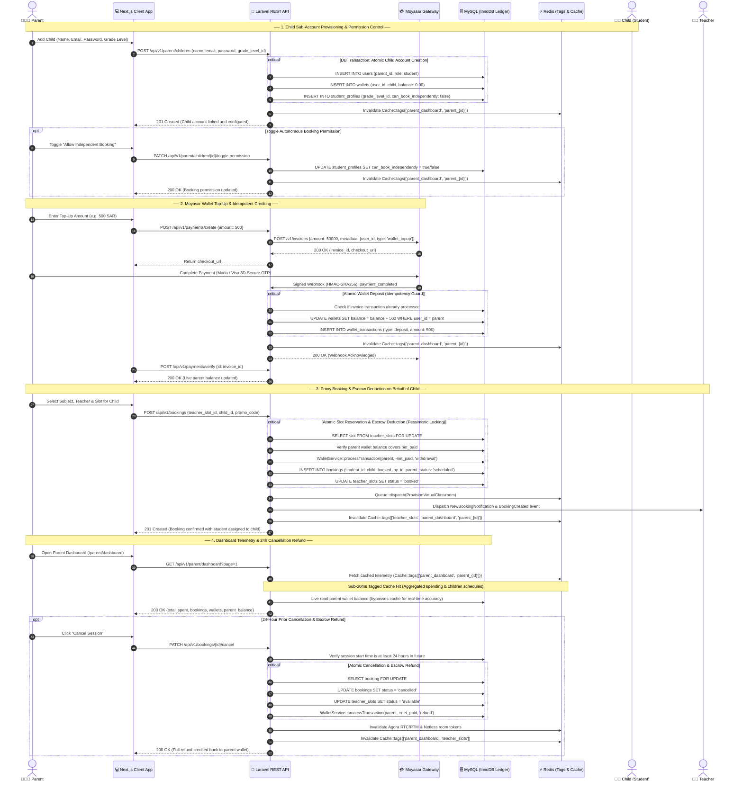
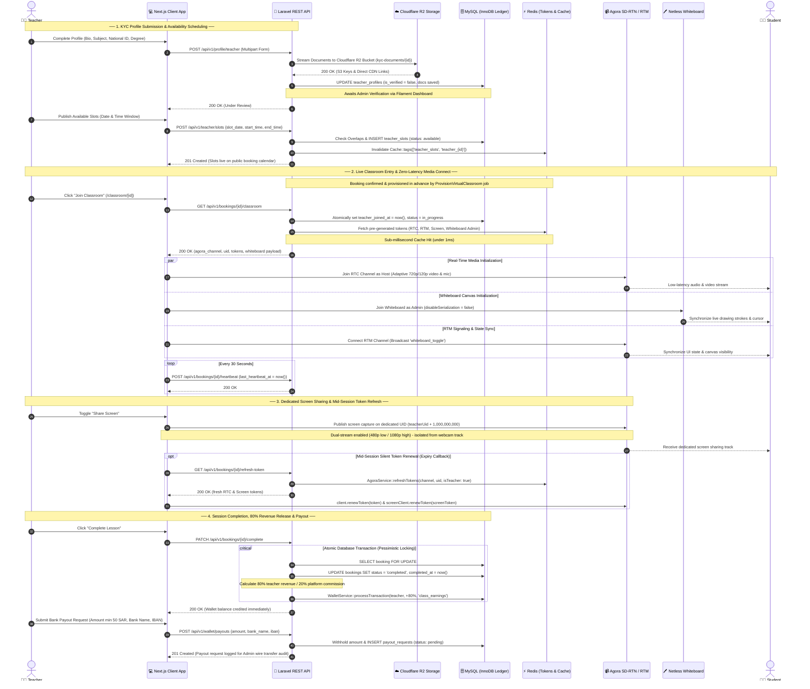
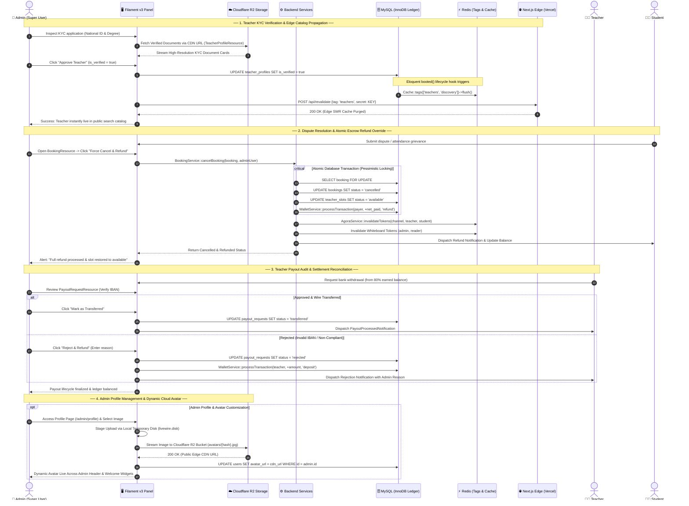

<div align="center">
  <a href="https://api.taj-edu.online/" target="_blank" title="Go to Taj Platform">
    
  </a>

  <br />
  <br />

  <h1>Taj Educational Platform <br/> (منصة تاج التعليمية)</h1>

  <p>
    <b>A Production-Grade, Arabic-First E-Learning Marketplace for Live 1-on-1 Tutoring.</b>
  </p>

  <p>
    <a href="#"></a>
    <a href="https://laravel.com"></a>
    <a href="https://nextjs.org"></a>
    <a href="https://react.dev"></a>
    <a href="https://www.typescriptlang.org"></a>
    <a href="https://openai.com"></a>
    <a href="https://filamentphp.com"></a>
    <a href="https://www.cloudflare.com"></a>
    <a href="https://www.agora.io"></a>
    <a href="https://www.netless.link"></a>
    <a href="https://sentry.io"></a>
    <a href="https://www.docker.com"></a>
  </p>

  <p align="center" style="max-width: 800px; margin: 0 auto;">
    Taj connects students and parents in the MENA region with verified subject-specialist teachers for live, one-on-one tutoring. It ships with a fully-featured virtual classroom — HD video, adaptive screen sharing, and a real-time collaborative whiteboard — wrapped around a wallet-based economy with automated revenue splitting, built entirely with a native Arabic (RTL) experience.
  </p>
</div>

<br />

## 📖 Table of Contents

1. [🏗️ System Architecture](#️-system-architecture)
2. [⚡ Performance Benchmarks & Efficiency (v1.0 vs v2.0)](#-performance-benchmarks--efficiency-v10-vs-v20)
3. [🌐 Live Beta Access](#-live-beta-access)
4. [🆕 What's New](#-whats-new)
5. [✨ Key Features](#-key-features)
6. [🎓 Functional Requirements by Role](#-functional-requirements-by-role)
   - [🔄 Universal Authentication, Financial Ledger & Support Sequence](#-universal-authentication-financial-ledger--support-sequence)
   - [🔄 Student Discovery, Autonomous Booking & Classroom Attendance Sequence](#-student-discovery-autonomous-booking--classroom-attendance-sequence)
   - [🔄 Parent Account Governance, Escrow Funding & Supervision Sequence](#-parent-account-governance-escrow-funding--supervision-sequence)
   - [🔄 Teacher Lifecycle, Classroom Hosting & Settlement Sequence](#-teacher-lifecycle-classroom-hosting--earnings-settlement-sequence)
   - [🔄 Admin Super-User Governance & Operations Sequence](#-admin-super-user-governance--operations-sequence)
7. [🛠️ Technology Stack](#️-technology-stack)
8. [📊 Project Stats](#-project-stats)
9. [🚀 Getting Started](#-getting-started)
10. [🧪 Testing](#-testing)
11. [👤 Author](#-author)

---

## 🏗️ System Architecture

The platform operates on a high-performance decoupled monorepo architecture engineered for sub-second page loads, real-time media isolation, and financial integrity:

1. **Edge-Driven Presentation Layer**: Next.js 15 App Router & React 19 on Vercel combines **Edge React Server Components (RSC)** with multi-tier SWR caching (300s–600s with on-demand tag revalidation) for instant catalog rendering and dynamic OpenGraph SEO, alongside rich client-side state (TanStack Query) for authenticated interactive workflows.
2. **Direct-to-Cloud Real-Time Media (Zero Server Load)**: The virtual classroom (adaptive HD video, isolated screen sharing, and interactive Netless whiteboard) connects **directly, browser-to-cloud**, via Agora SD-RTN and Netless CDN — keeping the backend API 100% free of heavy media traffic and CPU load.
3. **Async Queue & WebRTC Token Pre-Provisioning**: A background Redis queue worker (`ProvisionVirtualClassroom`) pre-provisions whiteboard rooms and pre-generates Agora RTC/RTM tokens ahead of time, ensuring `< 1ms` instantaneous cold-join cache hits.
4. **ACID Financial Ledger & Escrow Economy**: MySQL 8.0 handles overdraft-proof wallet transactions and slot bookings with row-level locks (`lockForUpdate()`) and composite indexing (`idx_bookings_booked_by_status_date`), safely holding funds in escrow until lesson completion (80% teacher / 20% platform revenue split).
5. **Zero-Egress Cloud Object Storage & Edge Asset CDN**: Cloudflare R2 Object Storage (via S3-compatible API & `league/flysystem-aws-s3-v3`) hosts and streams all user profile avatars and teacher KYC verification credentials (national ID & degrees) through Cloudflare's global edge network with zero egress bandwidth fees, completely eliminating local disk coupling and enabling horizontal container scalability.
6. **Administrative Governance & Operations**: A fully localized FilamentPHP v3 dashboard empowers platform administrators with dynamic avatar customization, teacher KYC audits (national ID & degrees), dispute adjudication, abandoned booking resolution, and automated bank payout reconciliation.
7. **Multi-Tier Tagged Invalidation & Cloud Security**: Redis 7 cache tags with automated Eloquent lifecycle hooks (`saved`, `deleted`), Moyasar HMAC-signed webhooks, Google reCAPTCHA v3 bot protection, and full-stack Sentry APM observability.
8. **AI Guidance & Session Intelligence Engine**: OpenAI `gpt-4o-mini` integration with domain knowledge grounding ([`SupportKnowledgeBase`](backend/app/Services/SupportKnowledgeBase.php)), rate-limited REST API (`POST /api/v1/support/chat` with `throttle:15,1`), automated session summary generation, interactive quiz auto-grading, and dual human support escalation (WhatsApp `+967774344625` & Support Ticket `/dashboard/support`).





### 📋 Architecture & Data Flow Key

| Layer / Tier | Primary Technologies | Architectural Role & Implementation Details |
| :--- | :--- | :--- |
| **0. External Actors & Roles** | RBAC (Student, Teacher, Parent, Admin) | Distinct personas partitioned by Spatie RBAC, accessing tailored functional portals and localized Arabic RTL interfaces. |
| **1. Presentation & API Gateway Tier** | Next.js 15.3 App Router (React 19) & Laravel 12 API / Filament v3 / Laravel Reverb | Hybrid Edge architecture with React Server Components (RSC) and SWR caching on the frontend (`taj-frontend`); REST API v1 with Sanctum Bearer tokens and administrative KYC/dispute dashboard on the backend (`taj_admin_web`), paired with native high-throughput Laravel Reverb WebSockets (`taj_reverb` / port 8080) for instant event push (bookings, wallets, classroom presence). |
| **2. Asynchronous Queue & Background Worker Tier** | Laravel Queue Worker (`taj_queue_worker` / Redis) | Dedicated background CLI daemon executing `ProvisionVirtualClassroom` to pre-generate Agora RTC/RTM tokens and whiteboard rooms ahead of time, processing escrow releases and refund dispatches, and generating AI session summaries and quizzes via OpenAI. |
| **3. Distributed State, Caching & Database Tier** | MySQL 8.0 (`taj_mysql`) & Redis 7 (`taj_redis`) | InnoDB ACID financial ledger with composite indexing (`idx_bookings_booked_by_status_date`) and pessimistic row locking (`lockForUpdate()`), paired with tagged Redis caching (`Cache::tags()`), AOF disk persistence (`appendfsync everysec`), and eviction-proof financial queues via `volatile-lru`. |
| **Cloud Object Storage (Zero Egress)** | Cloudflare R2 Storage (`league/flysystem-aws-s3-v3`) | S3-compatible cloud bucket storing user profile avatars and teacher KYC documents (national ID & degrees) with direct CDN distribution, Livewire local staging, and zero bandwidth egress fees. |
| **Real-Time Media Cloud (Zero Server Load)** | Agora SD-RTN (RTC/RTM) & Netless Cloud | **Direct browser-to-cloud streams**: Real-time 720p/120p simulcast video, independent screen sharing channel (`UID + 1_000_000_000`), WebSocket signaling, and collaborative vector whiteboard canvas. |
| **Cloud SaaS & Security Integrations** | Moyasar + Google reCAPTCHA v3 + Sentry + OpenAI | Saudi-compliant payment escrow with HMAC-SHA256 signed webhooks, Google reCAPTCHA v3 bot protection, full-stack Sentry APM with automated production source maps, and OpenAI `gpt-4o-mini` for 24/7 grounded support chat, post-lesson summaries, and auto-graded quizzes. |

---

## ⚡ Performance Benchmarks & Efficiency (v1.0 vs. v2.0)

A comprehensive architectural overhaul transitioned Taj Educational Platform from **v1.0** to **v2.0**, introducing Next.js Edge React Server Components, atomic Redis token caching, composite database indexing, and query optimizations. The table below details the measurable performance gains, latency reductions, and efficiency improvements:

### 📈 Core Web Vitals & System Performance Comparison

| Layer / Metric | v1.0 (Before Optimization) | v2.0 (After Optimization) | Rate of Improvement / Impact |
| :--- | :--- | :--- | :--- |
| **First Contentful Paint (FCP)** | `~1,850ms` (CSR waterfall + blocking Axios) | **`~420ms`** (Edge RSC pre-rendered HTML) | **🚀 ~77% faster** (Instant visual response) |
| **Largest Contentful Paint (LCP)** | `~2,600ms` (Delayed until client hydration) | **`~680ms`** (Instant teacher cards in HTML) | **🚀 ~74% faster** (Passes Google Core Web Vitals) |
| **Initial Client Network Requests** | 2 blocking HTTP requests on mount | **0 blocking client requests** (Edge SWR prefetch) | **🚀 100% elimination** of initial network waterfall |
| **Classroom Entry Latency (TTFB)** | `45ms – 75ms` (Synchronous HMAC signing on join) | **`< 1ms`** (Redis cache hit via pre-generation) | **🚀 ~98% latency drop** on session join |
| **Parent Dashboard (`/parent/dashboard`)** | `~180ms – 240ms` (4 sequential uncached queries) | **`12ms – 18ms`** (`Cache::tags(['parent_dashboard'])`) | **🚀 ~92% faster** response time |
| **Teacher Discovery Catalog** | Direct MySQL queries on each search | **Multi-tier Redis tagged cache** (`10m – 24h` TTL) | **🚀 ~85% reduction** in response time |
| **Booking Filter Execution Time** | `~15ms` (Full table scan on `booked_by_id`) | **`< 1.5ms`** (`idx_bookings_booked_by_status_date`) | **🚀 ~90% faster** query execution |
| **Database Read Load at Peak** | 100% direct database queries on catalog/schedule | **~68% reduction** in MySQL read queries | **🛡️ High resilience** against DB connection pool exhaustion |
| **Backend Test Coverage** | 69 passed (190 assertions) | **94 passed (283 assertions)** | **📈 +36% tests, +49% assertions** (100% passing) |
| **Frontend Test Coverage** | 28 passed across 5 suites | **33 passed across 5 suites** | **📈 +18% tests** (100% passing test suite) |

### 🔍 Architectural Drivers Behind the Performance Gains

1. **Next.js 15 & React 19 Hybrid RSC & Edge SWR Caching:**
   - Public pages (`/discovery/teachers`, `/`, etc.) were converted from client-side dynamic fetches to Edge React Server Components with `stale-while-revalidate` caching (`next: { revalidate: 60, tags: ['teachers'] }`).
   - HTML with full teacher profiles and catalog data is served instantly from the edge CDN, eliminating client loading spinners and waterfall network requests.
   - Dynamic OpenGraph and Twitter card metadata are now generated server-side for search engine crawlers and social sharing.

2. **WebRTC Token Decoupling & Background Pre-Provisioning:**
   - Moved HMAC token generation out of the user's synchronous HTTP join path into [`AgoraService`](backend/app/Services/AgoraService.php).
   - Background job `ProvisionVirtualClassroom` pre-generates Agora RTC and RTM tokens for student and teacher (plus screen-share tokens for teachers) 10 minutes before session start, storing them in Redis with a 110-minute TTL.
   - Users joining the virtual classroom experience a sub-millisecond cache hit instead of blocking on cryptographic calculations.

3. **Composite Database Indexing & Query Isolation:**
   - Created migration `idx_bookings_booked_by_status_date` indexing `(booked_by_id, status, booking_date)` to accelerate parent dashboard and calendar filters.
   - Resolved SQL operator precedence in `BookingController` by properly grouping `orWhere` clauses, preventing table scans and data leakage.
   - Restricted eager loading in `BookingController` to specific columns (`teacher:id,name,email`, `student:id,name,email`, etc.), avoiding over-fetching sensitive user attributes.

4. **Multi-Tier Tagged Redis Invalidation:**
   - Implemented `Cache::tags()` for discovery catalogs, grade levels, subjects, and parent dashboards with automatic Eloquent model lifecycle hooks (`saved`, `deleted`).
   - Dynamic cache invalidation ensures that data remains blazing fast without ever becoming stale when teachers update slots or parents book sessions.

---

## 🌐 Live Beta Access

- **🎓 Frontend (Students & Teachers)**: <a href="https://www.taj-edu.online/" target="_blank" rel="noopener noreferrer">Live Demo</a>
- **👑 Admin Dashboard Panel**: <a href="https://api.taj-edu.online/admin/login" target="_blank" rel="noopener noreferrer">Admin Login</a>
- **⚙️ Backend API Base URL**: <a href="https://api.taj-edu.online/" target="_blank" rel="noopener noreferrer">API Server</a>

---

## 🆕 What's New

### 🚀 Release v2.3.0 — Taj AI Support Assistant, AI Session Summaries & Automated Quizzes
- **🤖 Taj AI Support Assistant ("مساعد تاج الذكي")** — Engineered an interactive, 24/7 AI conversational support widget powered by OpenAI `gpt-4o-mini`, grounded in platform knowledge ([`SupportKnowledgeBase`](backend/app/Services/SupportKnowledgeBase.php)), rate-limited via `throttle:15,1` (`POST /api/v1/support/chat`), and styled with custom Markdown parsing and quick suggestion chips.
- **🚨 Dual Human Support Escalation Mechanism** — Implemented automatic intent detection for complex refunds and official complaints, instantly presenting users with direct WhatsApp support (`+967774344625`) and internal ticket routing (`/dashboard/support`).
- **📝 AI Session Summaries & Interactive Quizzes** — Integrated automated post-lesson AI session summary generation and auto-graded interactive quizzes ([`SessionSummaryController`](backend/app/Http/Controllers/Api/SessionSummaryController.php), [`SessionSummaryModal`](frontend/src/components/dashboard/ai/SessionSummaryModal.tsx), [`InteractiveQuiz`](frontend/src/components/dashboard/ai/InteractiveQuiz.tsx)).
- **🛡️ Production Container & UI Positioning Resilience** — Resolved fixed drawer layout geometry (`bottom-[88px] sm:bottom-24 z-[60]`), added active classroom route guards (`/classroom/*`), and updated GitHub Actions CI/CD with `--force-recreate` to ensure container freshness on production deployments.
- **🧪 100% Automated Test Suites Green** — Expanded test suite to **124 passing backend tests (400 assertions)** via PHPUnit and **40 passing frontend tests across 7 test suites** via Jest (100% passing).

### 🚀 Release v2.2.0 — Cloudflare R2 Cloud Storage, Dynamic Admin Avatar & Luxury Dashboard Polish
- **☁️ Cloudflare R2 Object Storage Integration** — Migrated user avatars, teacher national IDs, and academic certificates from local container storage to Cloudflare R2 via `league/flysystem-aws-s3-v3`, achieving S3-compatible zero-egress cloud storage and high-speed CDN delivery across MENA.
- **👑 Dynamic Admin Avatar & Profile Management** — Implemented dedicated administrative profile management (`/admin/profile`) allowing platform administrators to upload, preview, and update their personal avatars stored directly in Cloudflare R2, with automatic fallback to UI-Avatars.
- **💎 Modern Luxury Dashboard UI/UX** — Upgraded Filament admin dashboard widgets (`DashboardStats`, `FinancialOverview`, `LatestBookings`) with modern glassmorphism styling (`backdrop-filter: blur(12px)`), clickable deep-linking filters, clean minimalist descriptions, aligned widget heights, and eliminated visual clutter and redundant text.
- **🛡️ Livewire Staging & Security Hardening** — Configured Livewire temporary file upload staging to local disk before streaming to R2, whitelisted `blob:` worker sources and `*.cloudflarestorage.com` / `*.r2.dev` across production Nginx CSP and Next.js `remotePatterns`.
- **🧪 100% Automated Test Suite Green** — Expanded test coverage to **94 passing backend tests (283 assertions)** via PHPUnit and **33 passing frontend tests across 5 suites** via Jest (100% passing).

### 🚀 Release v2.1.0 — Next.js 15.3, React 19 Modernization & Administrative Governance
- **⚡ Next.js 15.3.9 & React 19.3.0 Major Upgrade** — Upgraded the entire frontend framework from Next.js 14 to Next.js 15.3.9 with React 19.3.0, leveraging React 19 compiler optimizations, modern client hooks, and stricter hydration validations.
- **🛡️ Custom React 19 Legacy Compatibility Shim for Whiteboard** — Engineered an architectural bridge ([`react19-legacy-compat.ts`](frontend/src/lib/react19-legacy-compat.ts) & [`React19CompatProvider.tsx`](frontend/src/components/providers/React19CompatProvider.tsx)) bridging `ReactDOM.render` to `createRoot` and deferring `unmountComponentAtNode` using `setTimeout(0)` to satisfy React 19's render-cycle invariants for `white-web-sdk`.
- **🔄 Async Request APIs Migration** — Upgraded all dynamic App Router routes ([`classroom/[id]`](frontend/src/app/classroom/[id]/page.tsx), [`teachers/[id]`](frontend/src/app/teachers/[id]/page.tsx), and [`reset-password`](frontend/src/app/reset-password/page.tsx)) to natively resolve `params: Promise<{ id: string }>` via `await` and `<Suspense>`.
- **🔇 Webpack BannerPlugin Noise Filter for Agora RTM** — Injected a module-level pre-evaluation filter in Webpack ([`next.config.mjs`](frontend/next.config.mjs)) to suppress expected dev-only noise codes (`-10015`, `-10023`, `assertRoomIsConnected`) before third-party SDK loggers capture `console.error`.
- **👑 Administrative Governance & Escrow Resolution** — Added Filament admin actions to resolve abandoned sessions (with instant escrow release to teachers or full wallet refunds to students/parents), unified resource actions into an ergonomic vertical-ellipsis `ActionGroup`, enhanced the User Wallet modal with comprehensive financial metrics, and integrated the royal crown brand logo.
- **🧪 100% Automated Test Suites Green** — Full test coverage with **89 backend tests (275 assertions)** via PHPUnit and **33 frontend tests across 5 suites** via Jest (100% passing).

### 🚀 Release v2.0.0 — Major Architecture & Performance Overhaul
- **⚡ Next.js 14 Hybrid RSC Architecture & Edge SWR** — Migrated public discovery and teacher catalog pages from pure client-side rendering to React Server Components with parallel edge pre-fetching (`stale-while-revalidate`), dropping FCP/LCP under 500ms and enabling dynamic OpenGraph SEO metadata previews.
- **🛡️ Dedicated Agora WebRTC Token Service & Atomic Redis Caching** — Encapsulated all RTC, RTM, and screen-sharing token lifecycles into [`AgoraService`](backend/app/Services/AgoraService.php) with channel-isolated cache keys and a 110-minute TTL safety margin, eliminating cold-join CPU bottlenecks.
- **⚡ Database Optimization & Tagged Redis Caching** — Added composite indexing on `bookings` (`idx_bookings_booked_by_status_date`), grouped nested SQL `orWhere` conditions, and cached read-heavy Parent and Teacher dashboard queries with automated Eloquent lifecycle invalidation.
- **🔄 On-Demand Edge Cache Invalidation** — Added `/api/revalidate` route handler with secret key authentication for instant edge cache purging upon backend catalog changes.
- **🧪 100% Automated Test Suite Green** — Full test coverage with 83 passing PHPUnit tests (248 assertions) and 28 frontend Jest tests.

---

Recent additions that take the platform beyond a basic booking-and-video app:

- **🖊️ Interactive Whiteboard** — A real-time collaborative whiteboard (Netless `white-web-sdk`) inside every classroom, with drawing tools, live cursor sync between teacher and student, undo/redo support, and automatic reconnection on network drops.
- **📡 Adaptive Network Resilience** — A multi-layer video quality system that smooths out network quality readings, switches to a low-resolution simulcast stream automatically, re-encodes the outgoing video in real time (from 720p down to 120p), and prioritizes audio over video when bandwidth is critically low — all without interrupting the call.
- **🖥️ Isolated Screen Sharing** — Screen share runs on a fully separate media connection from the camera feed, so presenting a slide deck never competes with — or degrades — the main video call.
- **🛰️ Full-Stack Error & Performance Monitoring** — Sentry is wired into both the Laravel backend and the Next.js frontend, with Source Maps uploaded on every Vercel production deploy for precise stack traces.
- **💰 Automated Revenue Split** — Every completed session automatically credits the teacher's wallet with their share (80%) and retains the platform commission — no manual reconciliation required.
- **🔒 Race-Condition-Safe Booking** — Atomic, database-transaction-locked slot reservation prevents double-booking even under concurrent requests.

---

## ✨ Key Features

- 🔐 **Full RBAC** — Four distinct roles (Student, Teacher, Parent, Admin) via Spatie Permissions, each with its own dashboard and capabilities.
- 📹 **Live HD Video Tutoring** — Low-latency audio/video sessions via Agora RTC, with automatic token renewal mid-session.
- 🖊️ **Real-Time Interactive Whiteboard** — Synchronized drawing, shapes, and text between teacher and student powered by Netless; teacher controls drawing tools, students follow in real time.
- 🖥️ **Dedicated Screen Sharing** — Independent media channel so screen shares stay smooth regardless of camera bandwidth.
- ☁️ **Cloudflare R2 Object Storage** — S3-compatible cloud storage for user profile avatars and sensitive teacher KYC verification documents with zero egress bandwidth fees and high-speed edge CDN delivery.
- 📅 **Race-Condition-Safe Booking** — Atomic, transaction-locked slot booking that makes double-booking the same time slot impossible.
- 💳 **Wallet-Based Economy** — A central wallet system for students, parents, and teachers, backed by an overdraft-proof transaction ledger.
- 💰 **Automated Payouts & Revenue Share** — Sessions automatically split earnings between teacher and platform on completion; teachers can request payouts to their bank account.
- 💵 **Moyasar Payment Integration** — Saudi-market payment gateway for wallet top-ups, with signed webhook verification and idempotent crediting.
- 👨‍👩‍👧 **Parent-Managed Sub-Accounts** — Parents can link multiple children, fund their wallets, and toggle independent booking permissions per child.
- ⭐ **Mandatory Review System** — Students are prompted to rate their teacher after every completed session.
- 👑 **Custom Admin Panel & Profile Customization** — A fully Arabic-localized FilamentPHP dashboard with dynamic admin avatar uploads, KYC verification, dispute resolution, refunds, and platform-wide analytics.
- 🤖 **Taj AI Support Assistant ("مساعد تاج الذكي")** — Interactive 24/7 AI chatbot powered by OpenAI `gpt-4o-mini`, grounded in domain knowledge, with dual human support escalation (WhatsApp `+967774344625` & Support Ticket `/dashboard/support`).
- 📝 **AI Session Summaries & Quizzes** — Automated post-lesson AI session summary generation and auto-graded interactive quizzes with role-tailored student/teacher view permissions.
- 🌍 **100% Arabic, RTL-Native UI** — Every screen, label, and system notification is built RTL-first for the MENA region.
- 🛰️ **Production-Grade Monitoring** — Sentry error tracking and performance tracing across both frontend and backend, with Source Maps for precise stack traces.

---

## 🎓 Functional Requirements by Role

### 🌐 Common Features (All Users)

- Secure, token-based authentication (Laravel Sanctum) with rate-limited login/registration.
- Role-aware dashboards summarizing schedules, wallet balance, and notifications.
- Full transaction history for every wallet movement (top-ups, deductions, earnings, refunds).
- Native RTL Arabic interface throughout.

#### 🔄 Universal Authentication, Financial Ledger & Support Sequence

The sequence diagram below illustrates the shared core operational workflows executed across all authenticated personas (Students, Parents, and Teachers) on Taj Educational Platform: Throttled Laravel Sanctum Token Authentication, Role-Aware Session Hydration & Real-Time RTL UI State, Centralized Wallet Ledger & Transaction History, Real-Time Notification Polling & Read Mutation, Customer Support Ticketing, and Secure Token Revocation on Logout.



---

### 👨‍🎓 Student Features

- Search and filter teachers by subject, grade level, and availability.
- Book a session directly from a teacher's live calendar, paid instantly from wallet balance.
- Join a live classroom with video, audio, screen sharing, and the interactive whiteboard — no external app required.
- Rate and review the teacher after each completed session.

#### 🔄 Student Discovery, Autonomous Booking & Classroom Attendance Sequence

The sequence diagram below illustrates the end-to-end operational journey of a Student on Taj Educational Platform: High-speed Next.js Edge Server Component discovery, race-condition-safe autonomous slot booking with escrow wallet deduction, sub-millisecond classroom entry with Agora WebRTC and Netless whiteboard follower synchronization, independent screen share reception, and mandatory post-session atomic review submission.



---

### 👨‍👩‍👧‍👦 Parent Features

- Create and manage multiple linked child (student) accounts.
- Top up the family wallet via Moyasar and allocate spending allowances per child.
- Grant or revoke a child's ability to book and pay for sessions independently.
- Monitor a child's schedule, attendance, and the reviews they've left.

#### 🔄 Parent Account Governance, Escrow Funding & Supervision Sequence

The sequence diagram below illustrates the end-to-end operational workflows executed by a Parent on Taj Educational Platform: Child Sub-Account Provisioning & Permission Control, Moyasar Escrow Wallet Top-Up & Idempotent Crediting, Proxy Booking on Behalf of Children with Pessimistic Locking, High-Performance Dashboard Telemetry Caching, and 24-Hour Prior Cancellation with Automated Escrow Refunds.



---

### 👨‍🏫 Teacher Features

- Complete KYC onboarding by uploading identification and academic credentials for admin verification.
- Manage a weekly availability calendar for bookable slots.
- Host the virtual classroom: video, screen sharing, and full whiteboard drawing control.
- Automatically receive 80% of each session's payment directly into their wallet upon marking it complete, with the option to request payouts to a bank account.

#### 🔄 Teacher Lifecycle, Classroom Hosting & Earnings Settlement Sequence

The sequence diagram below illustrates the end-to-end operational lifecycle of a Teacher on Taj Educational Platform: KYC profile verification, availability slot management, sub-millisecond virtual classroom entry via pre-generated WebRTC and Netless tokens, independent screen sharing, mid-session silent token renewal, atomic 80% escrow earnings release, and bank payout requests.


---

### 🛡️ Admin (Super User) Features

- Review and verify (or reject) teacher KYC applications.
- Full visibility into all bookings, users, and platform-wide revenue — with retained platform commission tracked automatically.
- Process teacher payout requests and issue manual refunds.
- Manage the subject and grade-level catalog available across the platform.
- Monitor system health and error rates via the integrated Sentry dashboard.

#### 🔄 Admin Super-User Governance & Operations Sequence

The sequence diagram below illustrates the administrative workflows executed by Platform Administrators through the FilamentPHP v3 dashboard: Teacher KYC Verification & Edge Catalog Propagation, Dispute Resolution & Atomic Escrow Refund Override, and Teacher Payout Reconciliation.



---

## 🛠️ Technology Stack

### Backend (`/backend`)

> **Core:** Laravel 12.0 • PHP 8.3 • MySQL 8.0
> **Admin & Security:** Filament V3 • Laravel Sanctum • Spatie Permission
> **Cloud Storage:** Cloudflare R2 Object Storage (`league/flysystem-aws-s3-v3`)
> **Real-Time & Media:** Agora RTC/RTM Token Generation • Netless Whiteboard REST API
> **Payments:** Moyasar Payment Gateway (SAR)
> **Async Processing:** Laravel Queues backed by **Redis** (Predis client)
> **AI & Intelligence Engine:** OpenAI API (`gpt-4o-mini`) • `SupportKnowledgeBase` grounding engine
> **Monitoring:** Sentry (`sentry/sentry-laravel`)
> **Testing:** PHPUnit via `php artisan test` — **124 tests, 400 assertions**

### Frontend (`/frontend`)

> **Core:** Next.js 15.3 (App Router) • React 19.3 • TypeScript 5 (strict mode)
> **Styling & UI:** Tailwind CSS 3.4 • Lucide React icons
> **Live Classroom:** `agora-rtc-sdk-ng` (video/audio/screen share) • `agora-rtm-sdk` (cursor & event sync) • `white-web-sdk` (interactive whiteboard with React 19 compatibility shim)
> **AI Support & Data:** Taj AI Support Assistant widget • TanStack Query (React Query) • Axios
> **Monitoring:** `@sentry/nextjs` with Source Maps
> **Testing:** Jest + React Testing Library — **40 tests across 7 test suites**

---

## 📊 Project Stats

| Metric                   | Details                                                          |
| :------------------------ | :--------------------------------------------------------------- |
| **🚀 Architecture**       | Monorepo (Next.js frontend + Laravel REST API)                   |
| **🔐 Role Support**       | Admin, Teacher, Student, Parent                                  |
| **🤖 AI Capabilities**    | 24/7 AI Support Assistant + AI Session Summaries & Quizzes       |
| **☁️ Cloud Storage**     | Cloudflare R2 (S3 API) — zero egress fees & edge CDN             |
| **📡 Video/Audio**        | Agora RTC — adaptive bitrate, simulcast-enabled                  |
| **🖊️ Whiteboard**         | Netless `white-web-sdk` — real-time collaborative                |
| **💳 Payments**           | Moyasar (SAR, Saudi market) with webhook verification            |
| **🔁 Async Queue**        | Laravel Queue Worker backed by Redis                             |
| **🛰️ Monitoring**         | Sentry — full-stack (backend + frontend) with Source Maps        |
| **🌍 Localization**       | 100% Arabic (RTL-native interface)                               |
| **🛡️ Security**           | Sanctum tokens + Spatie RBAC + rate limiting                     |
| **🧪 Backend Tests**      | 124 tests · 400 assertions (PHPUnit)                             |
| **🧪 Frontend Tests**     | 40 tests · 7 suites (Jest + React Testing Library)               |
| **📦 Deployment**         | Backend → DigitalOcean VPS / Render · Frontend → Vercel          |

---

## 🚀 Getting Started

The recommended way to boot up the complete Taj Platform stack (Frontend, Backend, and Database) is using **Docker Compose**.

### Prerequisites

- [Docker](https://docs.docker.com/get-docker/) & [Docker Compose](https://docs.docker.com/compose/install/) v2+
- **Node.js 20+** (for local frontend development outside Docker)
- **PHP 8.3 & Composer** (for local backend development outside Docker)

### 1. Clone the Repository

```bash
git clone https://github.com/Ammar-1993/Taj-Platform.git
cd Taj-Platform
```

### 2. Configure Backend Environment

```bash
cp backend/.env.example backend/.env
```

Edit `backend/.env` and fill in: 

| Variable | Purpose |
|---|---|
| `DB_DATABASE` / `DB_USERNAME` / `DB_PASSWORD` | Database connection credentials |
| `FILESYSTEM_DISK` | Default storage driver (`s3` for Cloudflare R2 in production, `public` for local) |
| `AWS_ACCESS_KEY_ID` / `AWS_SECRET_ACCESS_KEY` | Cloudflare R2 S3-compatible API access token credentials |
| `AWS_DEFAULT_REGION` | Cloudflare R2 region (`auto`) |
| `AWS_BUCKET` | Cloudflare R2 bucket name (`taj-platform`) |
| `AWS_ENDPOINT` | Cloudflare R2 S3 API endpoint (`https://<account_id>.r2.cloudflarestorage.com`) |
| `AWS_URL` | Public CDN URL for Cloudflare R2 bucket (`https://<bucket-domain>.r2.dev`) |
| `AGORA_APP_ID` / `AGORA_APP_CERTIFICATE` | Agora credentials used to generate RTC/RTM tokens for the classroom |
| `WHITEBOARD_SDK_TOKEN` | Netless SDK token used to create whiteboard rooms and mint room tokens |
| `MOYASAR_PUBLISHABLE_KEY` / `MOYASAR_SECRET_KEY` / `MOYASAR_WEBHOOK_SECRET` | Moyasar payment gateway credentials and webhook signature verification |
| `FRONTEND_URL` | Used for CORS and for building Moyasar payment redirect URLs |
| `QUEUE_CONNECTION` | Set to `redis` for production-grade async job processing |
| `REDIS_HOST` / `REDIS_PORT` | Redis server connection (defaults work with Docker Compose) |
| `WHITEBOARD_REGION` | Netless whiteboard region (defaults to `sg` for MENA latency optimization) |
| `RECAPTCHA_SECRET_KEY` | Google reCAPTCHA v3 secret key used on backend registration verification |
| `OPENAI_API_KEY` / `OPENAI_MODEL` / `OPENAI_ORGANIZATION` | OpenAI credentials and model selection (`gpt-4o-mini`) for AI Support Assistant and session summaries |
| `SENTRY_LARAVEL_DSN` | Backend error/performance monitoring (optional) |
| `ADMIN_ALERT_EMAIL` | Recipient for alerts when classroom provisioning fails after all retries (optional, but recommended) |

### 3. Configure Frontend Environment

```bash
cp frontend/.env.example frontend/.env
```

Edit `frontend/.env` and fill in:

| Variable | Purpose |
|---|---|
| `NEXT_PUBLIC_API_URL` | Backend API base URL — **must include the `/api/v1` prefix**, e.g. `http://localhost:8000/api/v1` |
| `INTERNAL_API_URL` | Internal backend API URL for Docker container SSR / Server Components, e.g. `http://laravel.test/api/v1` |
| `NEXT_PUBLIC_AGORA_APP_ID` | Agora App ID for video/audio classrooms |
| `NEXT_PUBLIC_RECAPTCHA_SITE_KEY` | Google reCAPTCHA site key used on auth forms |
| `NEXT_PUBLIC_WHITEBOARD_APP_IDENTIFIER` | Netless App Identifier for the interactive whiteboard |
| `NEXT_PUBLIC_WHITEBOARD_REGION` | Netless region (defaults to `sg`, closest to MENA users) |
| `NEXT_PUBLIC_SENTRY_DSN` | Frontend error monitoring DSN (optional) |
| `SENTRY_AUTH_TOKEN` | Allows Sentry to upload Source Maps on Vercel production builds (optional) |
| `SENTRY_PROJECT` / `SENTRY_ORG` | Sentry project slug and organization slug — required for Source Map uploads |

### 4. Launch the Docker Environment

```bash
docker compose up -d --build
```

> **What this spins up:**
>
> - 🗄️ **MySQL 8.0** — port `3307` on the host, mapped to `3306` inside the container (to avoid conflicts with any local MySQL install)
> - 🔴 **Redis** — port `6390` on the host, mapped to `6379` inside the container
> - 🐘 **Laravel API Server** — port `8000`
> - ⚙️ **Laravel Queue Worker (`queue`)** — runs `php artisan queue:work redis` automatically in the background for classroom provisioning and event notifications
> - ⚛️ **Next.js Client** — port `3000`. The `nextjs` container automatically runs `npm install --legacy-peer-deps && npm run dev` on every startup — **no manual `npm install` step is needed inside Docker.** The first `docker compose up` will take noticeably longer while dependencies install; subsequent restarts are fast.

### 5. Backend Setup & Seeding

The Laravel container does **not** auto-run Composer or migrations — this step is manual:

```bash
# Enter the Laravel container
docker compose exec laravel.test bash

# Install PHP dependencies and generate the app key
composer install
php artisan key:generate

# Run migrations and seed initial data (verified teacher accounts, subjects, etc.)
php artisan migrate --seed
```

> 💡 **Automated Queue Worker:** Classroom provisioning (whiteboard room creation and Agora/Netless token pre-generation) runs asynchronously through Laravel's queue system. Under Docker Compose, the dedicated `queue` worker container runs this automatically. If running the backend locally outside Docker, start a worker with:
> ```bash
> php artisan queue:work redis --sleep=3 --tries=5 --max-time=3600
> ```

### 6. (Alternative) Running the Frontend Outside Docker

If you prefer to run the frontend directly on your machine instead of inside the `nextjs` container:

```bash
cd frontend
npm install --legacy-peer-deps
npm run dev
```

### Local Development Endpoints

- **Frontend App:** [http://localhost:3000](http://localhost:3000)
- **Backend API:** [http://localhost:8000/api/v1](http://localhost:8000/api/v1)
- **Filament Admin Panel:** [http://localhost:8000/admin](http://localhost:8000/admin)

---

## 🧪 Testing

### Backend — PHPUnit

The backend test suite uses **PHPUnit** via `php artisan test` with an in-memory **SQLite** database (configured in `phpunit.xml`) so no running MySQL server is required.

```bash
# Inside the Docker container:
docker compose exec laravel.test php artisan test

# Or directly if PHP is installed locally:
cd backend
php artisan test
```

**Current results:** `124 tests · 400 assertions` — all passing ✅

The suite covers:

| Test File | Area |
|---|---|
| `tests/Feature/Auth/` | Registration, login, Sanctum token issuance |
| `tests/Feature/AdminProfileTest.php` | Dynamic admin avatar resolution, storage URL generation & fallback |
| `tests/Feature/BookingLifecycleTest.php` | Full booking → session → completion → payout flow |
| `tests/Feature/BookingServiceTest.php` | Race-condition-safe slot reservation |
| `tests/Feature/ClassroomAccessTest.php` | Token generation, classroom join, Agora token refresh |
| `tests/Feature/DiscoveryTest.php` | Teacher search, subject & grade-level filtering |
| `tests/Feature/GenerateSessionSummaryJobTest.php` | Async AI session summary & quiz generation background job |
| `tests/Feature/ParentChildTest.php` | Parent sub-account management & spending permissions |
| `tests/Feature/PayoutRequestTest.php` | Teacher payout request lifecycle |
| `tests/Feature/ProfileTest.php` | Teacher KYC profile update & verification reset |
| `tests/Feature/ReviewTest.php` | Mandatory post-session review submission |
| `tests/Feature/SessionSummaryApiTest.php` | Session summary viewing, quiz submission & role permission checks |
| `tests/Feature/SupportChatApiTest.php` | AI Support Chat API validation, guest/authenticated context & rate limits |
| `tests/Feature/SupportTicketTest.php` | Support ticket creation & messaging |
| `tests/Feature/TeacherSlotTest.php` | Availability slot creation, update, deletion |
| `tests/Feature/WalletServiceTest.php` | Wallet deposit, deduction, overdraft protection |
| `tests/Unit/AgoraServiceTest.php` | Unit: Agora RTC, RTM & Screen token minting and atomic Redis caching |
| `tests/Unit/BookingServiceUnitTest.php` | Unit: booking business rules |
| `tests/Unit/PayoutServiceUnitTest.php` | Unit: payout calculation & commission split |
| `tests/Unit/ReviewServiceUnitTest.php` | Unit: review validation logic |
| `tests/Unit/SessionSummaryModelTest.php` | Unit: session summary Eloquent model relationships & cascading deletes |
| `tests/Unit/SupportKnowledgeBaseTest.php` | Unit: AI support prompt grounding, WhatsApp URI formatting & fake AI replies |
| `tests/Unit/WalletServiceUnitTest.php` | Unit: wallet transaction ledger |
| `tests/Unit/WhiteboardServiceTest.php` | Unit: Netless room creation & token minting |

### Frontend — Jest + React Testing Library

The frontend test suite uses **Jest** with `jest-environment-jsdom` and **React Testing Library**.

```bash
cd frontend
npm run test

# Run in watch mode during development:
npm run test:watch
```

**Current results:** `40 tests · 7 test suites` — all passing ✅

The suite covers:

| Test File | Area |
|---|---|
| `src/components/support/__tests__/TajSupportChatWidget.test.tsx` | AI Support Chat widget rendering, interactive chat & dual escalation cards |
| `src/components/classroom/__tests__/Whiteboard.test.tsx` | Whiteboard SDK integration & connection lifecycle |
| `src/components/dashboard/__tests__/utils.test.tsx` | Dashboard utility functions |
| `src/components/dashboard/financial/__tests__/WalletSummary.test.tsx` | Wallet summary component rendering |
| `src/app/classroom/__tests__/ClassroomPage.test.tsx` | Classroom page access control & rendering |
| `src/lib/__tests__/formatters.test.ts` | Date, currency, and number formatting helpers |

---

## 👤 Author

<div align="center">
  <p>Developed with ❤️ by <b>Eng. Ammar Al-Najjar (م. عمار النجار)</b></p>
  <p>
    <a href="https://github.com/Ammar-1993"></a>
    <a href="mailto:ammaralnggar@gmail.com"></a>
  </p>
</div>