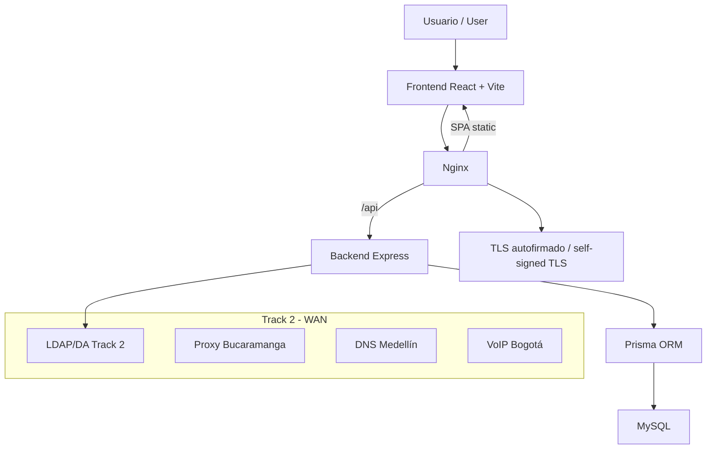

<div align="center">


# 🌊 Turismo Cali - Ruta 7 Ríos

**ES:** Landing page pública, backend base y evidencia técnica del consorcio turístico Ruta 7 Ríos.
**EN:** Public landing page, backend baseline, and technical evidence for the Ruta 7 Ríos tourism consortium.

**React + TypeScript + Node.js + Prisma + Nginx | Track 2 Redes UPB**

[](https://react.dev/)
[](https://nodejs.org/)
[](https://www.typescriptlang.org/)
[](https://vite.dev/)
[](LICENSE)

</div>

---

## 🇪🇸 Resumen

**Ruta 7 Ríos** es una plataforma turística académica para Santiago de Cali. El proyecto presenta experiencias culturales, naturales, salseras y gastronómicas bajo una identidad visual propia. Nació dentro del Track 2 de Redes UPB y fue separado del repositorio del Simulador de Crédito Educativo para dejarlo listo como repositorio público.

## 🇬🇧 Summary

**Ruta 7 Ríos** is an academic tourism platform for Santiago de Cali. It presents cultural, nature, salsa, and gastronomy experiences under a dedicated visual identity. The project started inside UPB's Networking Track 2 and was split from the Educational Credit Simulator repository so it can live as a clean public repository.


---

## ✨ Qué incluye / What is included

| ES | EN |
|---|---|
| Landing pública en React, Vite, TypeScript y Tailwind CSS. | Public landing page built with React, Vite, TypeScript, and Tailwind CSS. |
| Backend base en Express, Prisma y MySQL. | Backend baseline with Express, Prisma, and MySQL. |
| Evidencia de despliegue con Nginx, PM2, Tailscale y TLS autofirmado. | Deployment evidence with Nginx, PM2, Tailscale, and self-signed TLS. |
| Documentación del Track 2 migrada desde el repositorio anterior. | Track 2 documentation migrated from the former repository. |
| Guía de aprendizaje para GitHub Education. | Learning guide for GitHub Education. |

---

## 🧭 Acceso histórico / Historical access

| Modo / Mode | URL | Nota / Note |
|---|---|---|
| Desarrollo local / Local development | `http://localhost:5173` | Vite sirve la landing y proxya `/api`. |
| Dominio de laboratorio / Lab domain | `http://ruta7rios.page/` | Entrada histórica usada en la entrega. |
| HTTPS de laboratorio / Lab HTTPS | `https://ruta7rios.page/` | Certificado autofirmado; puede mostrar advertencia. |
| Red privada / Private network | `https://100.121.33.80` | Acceso por Tailscale. |

**ES:** Durante la entrega se usó `thisisunsafe` en Chrome para continuar ante el bloqueo de un certificado autofirmado en el TLD `.page`. Esto queda documentado como evidencia académica, no como recomendación de producción.
**EN:** During the delivery, Chrome's `thisisunsafe` bypass was used to continue past the self-signed certificate warning on the `.page` TLD. This is documented as academic evidence, not as a production recommendation.

📘 Detalle completo: [docs/infrastructure/lab-deployment.md](./docs/infrastructure/lab-deployment.md)

---

## 🖼️ Producto / Product

| Sección / Section | Propósito / Purpose |
|---|---|
| Hero | Presentar Cali como una ciudad de ríos, salsa y tradición. |
| Sobre nosotros / About us | Explicar misión, visión e identidad del consorcio. |
| Experiencias / Experiences | Cultura, naturaleza, entretenimiento y gastronomía. |
| Destinos / Destinations | Cristo Rey, San Antonio, Zoológico, Farallones, Bulevar del Río y La Ermita. |
| Login | Acceso administrativo. |

<p align="center">
  
  
  
</p>

---

## 🧱 Arquitectura / Architecture



| Capa / Layer | Tecnología / Technology | Responsabilidad / Responsibility |
|---|---|---|
| Frontend | React 18, Vite 5, TypeScript, Tailwind CSS | Landing, login y dashboard protegido. |
| Backend | Node.js, Express, TypeScript | API REST, autenticación, contacto y auditoría. |
| Datos / Data | Prisma, MySQL | Modelos relacionales y cliente tipado. |
| Infraestructura / Infrastructure | Nginx, PM2, OpenSSL | Estáticos, proxy `/api`, TLS de laboratorio. |
| Red académica / Academic network | Tailscale, DNS, LDAP, Proxy, VoIP | Integración del Track 2. |

---

## 🚀 Inicio rápido / Quick start

**PowerShell en Windows / Windows PowerShell**

```powershell
cd D:\Desarrollo\Proyectos\UPB\Turismo-Cali-UPB
fnm use 24.14.0
npm install
npm run dev:frontend
```

Abrir / Open: `http://localhost:5173`

Para levantar backend y frontend / To run backend and frontend:

```powershell
fnm use 24.14.0
Copy-Item backend\.env.example backend\.env
npm run dev
```

| Servicio / Service | URL |
|---|---|
| Frontend | `http://localhost:5173` |
| API | `http://localhost:4000/api` |
| Health check | `http://localhost:4000/api/health` |

---

## 🧪 Verificación / Verification

```powershell
fnm use 24.14.0
npm run build:frontend
npm run build:backend
npm audit --audit-level=high
```

**Estado actual / Current state**

| Check | Resultado / Result |
|---|---|
| Frontend build | ✅ Compila y optimiza imágenes con `vite-plugin-image-optimizer`. |
| Backend build | ✅ Compila con TypeScript. |
| Audit high | ✅ Sin vulnerabilidades altas; quedan moderadas en `vite/esbuild`. |

---

## 📚 Documentación / Documentation

| Documento / Document | ES | EN |
|---|---|---|
| [LEARN.md](./LEARN.md) | Ruta de aprendizaje GitHub Education. | GitHub Education learning path. |
| [docs/README.md](./docs/README.md) | Índice documental. | Documentation index. |
| [docs/landing/README.md](./docs/landing/README.md) | Identidad, UI, SEO, accesibilidad y capturas. | Identity, UI, SEO, accessibility, and screenshots. |
| [docs/infrastructure/lab-deployment.md](./docs/infrastructure/lab-deployment.md) | Despliegue real de laboratorio. | Real lab deployment. |
| [docs/track-2/README.md](./docs/track-2/README.md) | Evidencias migradas del Track 2. | Migrated Track 2 evidence. |
| [docs/repository-publication-audit.md](./docs/repository-publication-audit.md) | Auditoría de publicación pública. | Public repository audit. |

---

## 🧾 Historias clave / Key user stories

| HU | ES | EN |
|---|---|---|
| HU-73 | Contenido y estructura de la landing. | Landing content and structure. |
| HU-75 | Guía visual y design tokens. | Visual guide and design tokens. |
| HU-76 | Implementación UI landing/login. | Landing/login UI implementation. |
| HU-77 | Accesibilidad, SEO y rendimiento. | Accessibility, SEO, and performance. |
| HU-78 | Despliegue de landing. | Landing deployment. |
| HU-79 | Configuración de servidor web. | Web server configuration. |
| HU-70 | HTTPS/TLS. | HTTPS/TLS. |
| HU-80 | Evidencias y manual técnico. | Evidence and technical manual. |

---

## 🔐 Seguridad / Security

**ES:** No se deben publicar `.env`, llaves privadas, dumps de base de datos ni certificados con material sensible. El certificado autofirmado documentado pertenece al laboratorio.
**EN:** Do not publish `.env` files, private keys, database dumps, or certificates containing sensitive material. The documented self-signed certificate belongs to the lab environment.

Reportes / Reports: [SECURITY.md](./SECURITY.md)

---

## 📄 Licencia / License

MIT - ver / see [LICENSE](./LICENSE).

<div align="center">

**Universidad Pontificia Bolivariana - Track 2 Redes - 2026**

</div>
