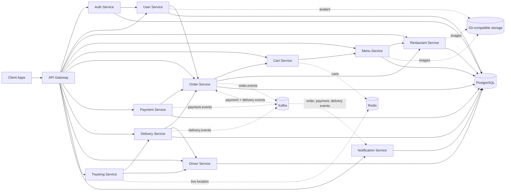

<p align="center">
  
</p>

<h3 align="center">A cloud-native, event-driven microservices platform for on-demand delivery</h3>

<p align="center">
  <a href="./LICENSE"></a>
  
  
  
  
  
  
  
</p>

<p align="center">
  
  
  <a href="https://github.com/Delivery-Plus0/delivery-plus/actions/workflows/ci.yml"></a>
  
  
</p>

<p align="center">
  <a href="#-the-delivery-plus-platform">Platform</a> ·
  <a href="#-project-status">Status</a> ·
  <a href="#-architecture">Architecture</a> ·
  <a href="#-tech-stack">Tech Stack</a> ·
  <a href="#-services">Services</a> ·
  <a href="#-getting-started">Getting Started</a> ·
  <a href="#-testing">Testing</a> ·
  <a href="#-contributing">Contributing</a> ·
  <a href="#-license">License</a>
</p>

---

##  Overview

**Delivery Plus** is a backend food-delivery platform built as independently deployable **microservices** that communicate over REST and **Kafka** events. Domain responsibilities are separated across auth, users, restaurants, menus, carts, orders, payments, drivers, deliveries, tracking, and notifications. PostgreSQL-backed services own relational data; cart and tracking use Redis; images live in S3-compatible object storage, uploaded directly by clients through presigned POST policies; the gateway owns no domain data.

For a one-page status of what is implemented, partial, or missing today, see [`.project-context/16-current-state.md`](./.project-context/16-current-state.md).

This is the **backend** of the Delivery Plus platform — no frontend/UI is included here by design. The customer, driver and restaurant apps live in companion repositories (below) and, like any third-party client, talk to the platform only through the **API Gateway**.

##  The Delivery Plus platform

Delivery Plus connects three roles around one order: a **customer** orders from a **restaurant**, the restaurant prepares it, the platform dispatches a **driver**, and everyone follows the same order and delivery state in real time.

```text
Delivery Plus  (github.com/Delivery-Plus0)
│
├── delivery-plus                  Backend platform (this repository)
│   └── 12 NestJS services behind one API Gateway · Kafka events · PostgreSQL · Redis · S3
│
├── delivery-plus-customer-app     Customer app (Expo / React Native: Android, iOS, web)
│   └── browse · cart · checkout · order status · live driver tracking · alerts
│
├── delivery-plus-driver-app       Driver app (Expo / React Native)
│   └── online/offline · automatic job assignment · pickup → delivered · location sharing
│
└── delivery-plus-restaurant-app   Restaurant app (Expo / React Native, web-first)
    └── incoming orders · kitchen workflow (preparing → ready for pickup) · availability
```

| Repository | Responsibility | Visibility |
|---|---|---|
| [`delivery-plus`](https://github.com/Delivery-Plus0/delivery-plus) | Business rules, data, events, auth and the public API. The single source of truth for order, payment, delivery and tracking state; also hosts the project-wide issue tracker and roadmap milestones. | Public |
| [`delivery-plus-customer-app`](https://github.com/Delivery-Plus0/delivery-plus-customer-app) | The customer experience. | Private |
| [`delivery-plus-driver-app`](https://github.com/Delivery-Plus0/delivery-plus-driver-app) | The driver experience. | Private |
| [`delivery-plus-restaurant-app`](https://github.com/Delivery-Plus0/delivery-plus-restaurant-app) | The restaurant experience. | Private |

How they interact: every app calls the API Gateway over HTTPS with a JWT whose role (`CUSTOMER`, `DRIVER`, `RESTAURANT_OWNER`) decides what it may do; the apps never talk to each other or to individual services. State changes flow through the backend (for example: restaurant marks an order ready → `order.ready_for_pickup` → automatic dispatch assigns an online driver → the driver app sees the job → the customer app shows the driver and the live map). Each app's E2E suite runs against this repository's isolated E2E stack, and the customer app's business flow drives all three apps in one browser.

##  Project status

Honest status, tracked in this repository's [milestones](https://github.com/Delivery-Plus0/delivery-plus/milestones). Details per area: [`.project-context/16-current-state.md`](./.project-context/16-current-state.md).

**Implemented**
- Accounts and roles (customer, driver, restaurant owner, admin) with JWT; restaurants, menus with availability, Redis cart
- Order lifecycle with idempotent creation; order and delivery events via a transactional outbox; Kafka consumers with dedupe, retries and dead-letter topics
- **Simulated** payments (no real card provider)
- Automatic driver dispatch, driver availability and the delivery lifecycle (assigned → picked up → in transit → delivered)
- Live tracking: driver location bound to the active delivery, tracking lifecycle, server-sent events with polling fallback; a customer-safe driver card (first name, vehicle, plate)
- In-app notifications for each order stage (no push notifications)
- S3-compatible media uploads via presigned POST

**In progress** — [Product sprint · Business & UX](https://github.com/Delivery-Plus0/delivery-plus/milestone/10): live order screen (#140) and driver dashboard (#141) are done; driver/customer history, ratings, menu management UI, profiles, Egypt locale, Arabic/RTL and OTP are open (#142–#155).

**Planned / not built yet**
- Real payment provider, driver earnings and wallet (#145, #146)
- Push notifications ([Phase 6](https://github.com/Delivery-Plus0/delivery-plus/milestone/6)); ETA estimation (the contract exists, no estimator)
- Production readiness: deployment target, observability, hardening ([Phase 9](https://github.com/Delivery-Plus0/delivery-plus/milestone/9))

##  Architecture



Every service is self-contained and shares a common foundation through the internal `shared` library. The shared package provides enums, transition helpers, Kafka/Redis helpers, S3 media storage, internal service authentication, JWT and role guards, logging, and common NestJS utilities. Redis is also used for caching, rate limits, and internal-auth nonces, which the diagram omits for readability. Kafka consumers deduplicate events per consumer group in Redis, retry a failing handler three times, then park the message in a `<topic>.dlq` dead-letter topic that `npm run kafka:dlq` can list and replay; events are keyed by `orderId`. Order and delivery events go through a transactional outbox (written in the same database transaction as the state change, then relayed to Kafka); payment-service still publishes directly, at most once per payment status.

##  Tech Stack

| Layer | Technology |
|---|---|
| Runtime | Node.js 22 LTS |
| Language | TypeScript 5 |
| Framework | NestJS 10 |
| Database | PostgreSQL 16 |
| Cache / Real-time state | Redis 7 |
| Messaging / Events | Apache Kafka |
| Media storage | S3-compatible object storage (SeaweedFS in local dev/test) |
| Containerization | Docker & Docker Compose |
| Testing | Jest (unit + e2e) |
| Shared internals | Custom `shared` package (events, guards, filters, utils) |

##  Services

| Service | Responsibility |
|---|---|
| `api-gateway` | Single entry point, request routing to downstream services |
| `auth-service` | Authentication, credentials, JWT issuing |
| `user-service` | User profiles |
| `restaurant-service` | Restaurant records & status |
| `menu-service` | Menu categories & items, availability |
| `cart-service` | Shopping cart (Redis-backed) |
| `order-service` | Order lifecycle & orchestration |
| `payment-service` | Payment processing |
| `driver-service` | Driver registration & status transitions |
| `delivery-service` | Delivery lifecycle |
| `tracking-service` | Live location tracking (Redis-backed) |
| `notification-service` | User notifications |

Every service, including the API Gateway, exposes a `/health` route used by Compose healthchecks. These are liveness checks; they do not prove that Kafka, Redis, or downstream services are reachable. Services generally follow `controllers → services → repositories/entities`, with variations by service.

##  Getting Started

### Prerequisites
- Node.js 22 (22.15 or newer)
- Docker & Docker Compose

### Run locally

```bash
# clone the repo
git clone https://github.com/Delivery-Plus0/delivery-plus.git
cd delivery-plus

# install dependencies
npm install

# local dev stack: shared infra + application services; --wait blocks until
# Compose healthchecks pass, including services after their migrations run
docker compose -f docker-compose.base.yml -f docker-compose.dev.yml up -d --build --wait --wait-timeout 300

# bootstrap sample data through the API Gateway and run the critical path
npm run seed
npm run e2e
```

For environment-specific validation:

```bash
# deterministic test layout
docker compose -f docker-compose.base.yml -f docker-compose.test.yml config --quiet

# production-like validation (requires secrets explicitly)
# These values are for Compose configuration validation only and must never be used for deployment.
export POSTGRES_USER="compose_validation_user"
export POSTGRES_PASSWORD="compose_validation_only_7f3c2b"
export POSTGRES_USER_URLENCODED="compose_validation_user"
export POSTGRES_PASSWORD_URLENCODED="compose_validation_only_7f3c2b"
export JWT_SECRET="compose_validation_only_jwt_9a41d8"
docker compose -f docker-compose.base.yml -f docker-compose.prod.yml config --quiet
```

```powershell
# PowerShell equivalent
$env:POSTGRES_USER="compose_validation_user"
$env:POSTGRES_PASSWORD="compose_validation_only_7f3c2b"
$env:POSTGRES_USER_URLENCODED="compose_validation_user"
$env:POSTGRES_PASSWORD_URLENCODED="compose_validation_only_7f3c2b"
$env:JWT_SECRET="compose_validation_only_jwt_9a41d8"
docker compose -f docker-compose.base.yml -f docker-compose.prod.yml config --quiet
```

### API documentation

Each HTTP service exposes Swagger UI at `http://localhost:<service-port>/docs`, and the API Gateway aggregates the service docs at `http://localhost:3000/docs`.

The API Gateway will be available at `http://localhost:3000`; see [`docs/deployment.md`](./docs/deployment.md) for the Compose variants, ports, and environment configuration. `npm run seed` bootstraps the sample environment through the API Gateway only. It is safe to rerun: existing accounts and catalog records are reused, while each run creates a new order/payment/delivery scenario. `npm run e2e` assumes the seed has completed successfully. For manual testing of the customer app, `npm run seed:demo` adds a richer catalog (6 restaurants across OPEN/BUSY/CLOSED, categorized menus with sold-out items, cover and avatar images) and a demo customer (`demo.customer@example.com` / `password123`) with a profile, a filled cart, notifications, and orders in delivered, cancelled, failed-payment, preparing, and on-the-way states. It is also rerunnable and does not interfere with `npm run seed` / `npm run e2e`.

##  Testing

```bash
# unit tests for a given service
npm run test --workspace=services/order-service

# complete repository validation used by CI
npm run verify

# API-level local bootstrap and critical-path validation
npm run seed
npm run e2e
```

`npm run verify` runs workspace lint, tests, and builds. CI also validates Compose syntax, builds the API Gateway image, and runs Trivy filesystem and image scans. It does not start the full stack or run the E2E script.

##  Documentation

- [`docs/architecture.md`](./docs/architecture.md) — deep dive into service boundaries & event flows
- [`docs/deployment.md`](./docs/deployment.md) — environment variables, ports, deployment guide
- [`docs/services.md`](./docs/services.md) — per-service API reference

### Related repositories

- [Delivery Plus Customer App](https://github.com/Delivery-Plus0/delivery-plus-customer-app) · [Driver App](https://github.com/Delivery-Plus0/delivery-plus-driver-app) · [Restaurant App](https://github.com/Delivery-Plus0/delivery-plus-restaurant-app)

##  Contributing

Contributions are what make open source great. Please read [`CONTRIBUTING.md`](./CONTRIBUTING.md) and our [`CODE_OF_CONDUCT.md`](./CODE_OF_CONDUCT.md) before opening a PR.

1. Fork the repo
2. Create your branch (`git checkout -b feature/amazing-feature`)
3. Commit your changes (`git commit -m 'feat: add amazing feature'`)
4. Push to the branch (`git push origin feature/amazing-feature`)
5. Open a Pull Request

Found a security issue? Please follow the process in [`SECURITY.md`](./SECURITY.md) instead of opening a public issue.

##  License

Distributed under the **MIT License**. See [`LICENSE`](./LICENSE) for details.

---

<p align="center">
  
  Made by the Delivery Plus team
</p>