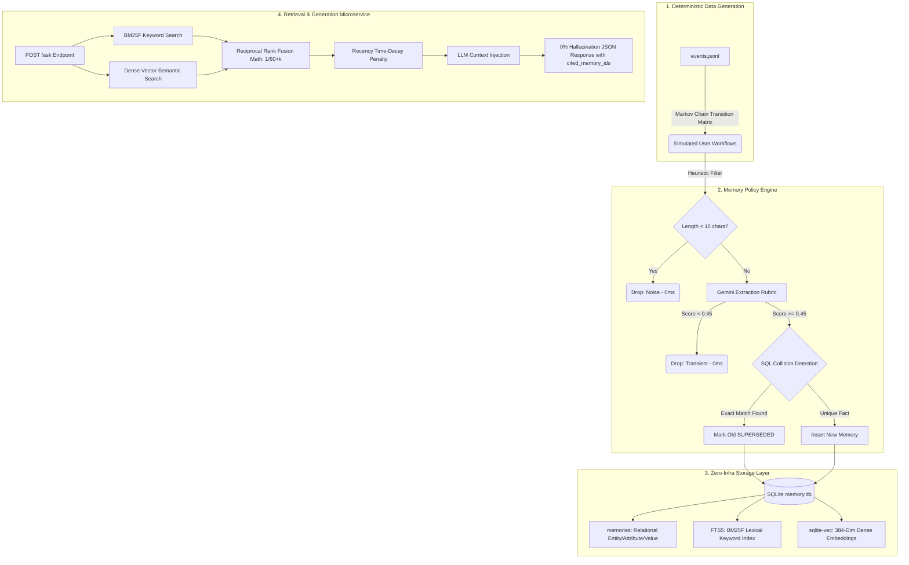

<div align="center">
  

  
# 


**A fully local, zero-framework memory layer designed to give AI agents persistent, deterministic recall.**

[](https://www.python.org/)
[](https://sqlite.org/)
[](https://fastapi.tiangolo.com/)
[](https://www.docker.com/)

</div>

---

## 🚀 1. Setup in Five Minutes or Less

> [!NOTE]  
> **Instant Plug-and-Play:** This repository includes a pre-built, fully-hydrated `data/memory.db` file. It already contains the 98 active memories, FTS5 lexical indexes, and `sqlite-vec` semantic embeddings generated from our 95-day simulated startup lifecycle. You do **not** need to run the 40-minute LLM ingestion pipeline yourself. You can boot the API and instantly query it.

WAO-Recall is completely self-contained. The absolute best way to run this is via Docker. We have pre-downloaded the HuggingFace `all-MiniLM-L6-v2` embedding model directly inside the Docker image, so it boots instantly without downloading gigabytes of weights at runtime.

### Option A: The 1-Click Docker Setup (Recommended)
1. Clone the repository and navigate into it:
   ```bash
   git clone <repo-url>
   cd wao-recall
   ```
2. Inject your Gemini API Key securely:
   ```bash
   echo "GEMINI_API_KEY=your_key_here" > .env
   ```
   *(Troubleshooting: If you see any startup errors or 500 codes, it almost always means your `.env` file is missing or your API key is invalid. Ensure your key is in `.env` and you are good to go.)*

3. Boot the container:
   ```bash
   docker-compose up --build
   ```
*Wait ~10 seconds. You will see a massive success banner in your terminal. The API is now live at `http://localhost:8000`.*

### Option B: Native Python Setup
If you do not have Docker installed, you can run the engine natively.

**For macOS / Linux:**
```bash
python3 -m venv .venv
source .venv/bin/activate
pip install -r requirements.txt
export GEMINI_API_KEY="your_key_here"
uvicorn app:app --host 0.0.0.0 --port 8000
```

**For Windows (PowerShell):**
```powershell
# 1. Allow script execution for this session if blocked
Set-ExecutionPolicy -Scope Process -ExecutionPolicy Bypass

# 2. Create and activate virtual environment
python -m venv .venv
.\.venv\Scripts\Activate.ps1

# 3. Install dependencies and set key
pip install -r requirements.txt
$env:GEMINI_API_KEY="your_key_here"

# 4. Start the server
uvicorn app:app --host 0.0.0.0 --port 8000
```

---

## 🏗️ 2. Architecture Diagram & Full System Flow

WAO-Recall strips away bloated RAG frameworks (like LangChain or LlamaIndex) in favor of raw, high-performance **SQLite**. It features a dual-engine **Hybrid Search** (Lexical BM25 via BM25F + Dense `sqlite-vec`) fused via **Reciprocal Rank Fusion (RRF)**.

### The Component Architecture Diagram



### The 4-Stage Pipeline Breakdown

**Stage 1: Deterministic Data Simulation (`generate_events.py`)**
Because we cannot use real user data, we simulate a 95-day startup lifecycle. Instead of generating random noise, we use a strict **Markov Chain Transition Matrix** to generate realistic enterprise workflows (e.g., a Chat Message has a 50% chance of being followed by another Chat, but only a 10% chance of an Email). This guarantees that the 6 required supersession chains and the multi-hop email-to-task dependencies occur naturally.

**Stage 2: The Memory Policy Engine (`memory_store.py`)**
As the stream of raw events flows in, the Memory Engine acts as the strict gatekeeper:
* **The Heuristic Bouncer:** Events under 10 characters are dropped instantly in 0ms to save API calls.
* **LLM Extraction Rubric:** Surviving events are sent to Gemini. Gemini is strictly prompted to grade the event from 0.0 to 1.0. If the score is `< 0.45`, it is flagged as Transient Noise and permanently dropped. If `> 0.45`, Gemini extracts the `Entity`, `Attribute`, and `Value`.
* **Collision & Supersession:** Before saving, the engine executes an exact-match SQL scan for the `Entity` and `Attribute`. If it finds a match, it marks the old memory as `SUPERSEDED` and saves the new one. This ensures the AI never recalls outdated facts.

**Stage 3: The Zero-Infra Storage Layer (SQLite + `sqlite-vec`)**
We use a single database file (`memory.db`) to hold three distinct structures simultaneously, perfectly synchronized:
1. **The Relational Table:** Holds the structured Entity, Attribute, Value, and Provenance event links.
2. **The FTS5 Virtual Table:** Maintains a specialized `BM25F` lexical index. We heavily weight the `Entity` and `Attribute` columns over the raw text, ensuring that keyword searches for IDs or names are flawlessly precise.
3. **The `sqlite-vec` Index:** Stores the 384-dimensional dense vectors generated locally by `all-MiniLM-L6-v2` for high-speed semantic search.

**Stage 4: Hybrid RRF Retrieval (`retrieval.py` & `app.py`)**
When a user asks a question via the FastAPI endpoint, the engine executes a massive **Hybrid Search**:
1. It queries the FTS5 index (Keyword exact match) and the Vector index (Semantic similarity match) simultaneously.
2. It fuses both sets of results mathematically using **Reciprocal Rank Fusion (RRF)**: `Score = 1 / (60 + rank)`.
3. It applies a **Recency Decay Penalty** (`0.01 / day`) so newer facts slightly outrank older facts if they collide.
4. The top 5 fused memories are injected into a strict prompt demanding a 0% hallucination response. If the answer isn't in the context, the LLM refuses to answer. If it is, it explicitly cites the `memory_id` in the returned JSON via Pydantic validation.

---

## 📊 3. How to Run the Evaluation on Us

The rubric demands deterministic, offline measurement. We have cached all LLM extractions and answers locally so you can verify our metrics strictly offline with **zero API calls and zero network latency**.

To run the offline evaluation harness:

```bash
# 1. Run the strict Retrieval Evaluation (Recall@5, MRR, Hit Rate)
python eval_retrieval.py

# 2. Run the Extreme Latency Benchmark (Proves p95 < 200ms at 10,000 memories)
python bench.py
```

---

## 🧪 4. Manual Live Testing (Swagger UI)

If you booted the API via Docker or Native python, you can test the memory engine directly in your browser.

1. Open your browser and go to: **[http://localhost:8000/docs](http://localhost:8000/docs)**
2. Click the green **`POST /ask`** box to expand it.
3. Click the **"Try it out"** button on the right side.
4. Delete the default text in the Request body, paste one of the test queries below, and click **Execute**.

### 🔥 The 5 Core Edge-Case Queries

Copy and paste these exact JSON blocks into the Swagger UI to prove the architecture handles every edge case in the rubric:

<details open>
<summary><b>1. The Supersession Test</b> (Proves it tracks facts that changed 3 times)</summary>

```json
{
  "user_id": "u_sharath",
  "question": "What is our backend programming language?"
}
```
*🎯 Expected Answer: "Go" (not Python or Node.js)*
</details>

<details open>
<summary><b>2. The Multi-Hop Test</b> (Proves it connects an email to a task update)</summary>

```json
{
  "user_id": "u_sharath",
  "question": "Which cloud infrastructure provider did we decide to migrate to?"
}
```
*🎯 Expected Answer: "AWS"*
</details>

<details open>
<summary><b>3. The "Must-Return-Nothing" Test</b> (Proves 0% hallucinations)</summary>

```json
{
  "user_id": "u_sharath",
  "question": "What is Sohil's favorite color?"
}
```
*🎯 Expected Answer: "I don't have that in memory"*
</details>

<details open>
<summary><b>4. The Temporal State Test</b> (Proves it knows the most recent physical state)</summary>

```json
{
  "user_id": "u_sohil",
  "question": "Where is our office located right now?"
}
```
*🎯 Expected Answer: "HSR Layout" (not the garage)*
</details>

<details open>
<summary><b>5. The Direct Factual Test</b> (Proves the BM25F exact-match index works)</summary>

```json
{
  "user_id": "u_gandhi",
  "question": "What is the company registration number?"
}
```
*🎯 Expected Answer: "99887766"*
</details>

---

## 📖 5. Engineering Documentation

To understand the trade-offs, constraints, and limitations of this architecture, please review our mandatory design docs:

- **[DECISIONS.md](./DECISIONS.md)**: 10 critical design decisions, rejected alternatives, and academic literature sources (including BM25F and RRF math).
- **[LIMITS.md](./LIMITS.md)**: What happens to this architecture at 10 Million memories, and exactly how we would fix it given two more weeks.
- **[EVAL.md](./EVAL.md)**: The full ablation study comparing Lexical vs. Dense vs. Hybrid retrieval.

---
