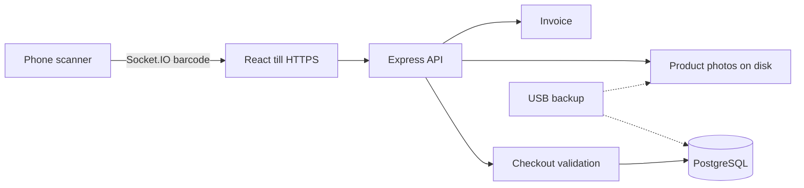

<p align="center">
  
</p>

# CapyTech POS

**A local-first point-of-sale system for a computer accessories shop — checkout, stock, invoices, and reports on the store computer, not in the cloud.**

CapyTech POS is a delivered retail till: sell from the counter, scan barcodes from a phone on the same Wi-Fi, keep product photos on disk, and back up PostgreSQL plus images to USB. It was built for one shop operator on a MacBook Air, with the same app runnable on Windows for development. This public repository is the **portfolio / example** source. It is not a SaaS product and is not deployed on Vercel or Docker.

[](https://react.dev/)
[](https://www.typescriptlang.org/)
[](https://vitejs.dev/)
[](https://expressjs.com/)
[](https://www.postgresql.org/)
[](https://socket.io/)

**Example repository:** [github.com/Gooniez3/capytech-pos](https://github.com/Gooniez3/capytech-pos)

## Product overview

A small accessories shop needs a till that stays up on the local network, charges the price stored in the database, never sells more stock than it has, and produces reports the owner can trust. Cloud POS tools add accounts, monthly fees, and an internet dependency the counter does not need.

CapyTech POS runs HTTPS on the shop PC (`https://localhost:5173`). PostgreSQL is the system of record. Product images are files on disk; the database stores paths only. The owner creates their own login on first open. First real sale is `INV-000001`.

## Core features

| Capability | What it provides |
| --- | --- |
| **Checkout** | Cart, line discounts, store tax from settings, cash / KBZ Pay / Wave Pay / MMQR, invoice print. Server recomputes totals from database prices. |
| **Stock safety** | Row-level stock locks at charge time so two overlapping sales cannot oversell the same variant. |
| **Idempotent charge** | Client checkout UUID plus a server fingerprint so a double-click or retry does not create two invoices. |
| **Products & variants** | SKUs, barcodes, costs, prices, photos, categories, barcode labels, and a recently-deleted restore bin. |
| **Inventory** | On-hand quantities, low-stock thresholds, and stock value from cost × quantity. |
| **Sales history** | Completed, refunded, and voided invoices with payment method and cashier. |
| **Admin refund / void** | Role re-checked in the database; stock and money reversed together. |
| **Dashboard & reports** | Today and range revenue, tax collected, COGS, profit net of tax, payment mix, top products, Excel export. |
| **Phone scanner** | Pair a phone on shop Wi-Fi (not Guest). The phone camera sends barcodes to the till over Socket.IO. |
| **First-open setup** | If there are no users, the owner creates name, username, and password. No shared demo login. |
| **Remember me** | Optional 30-day session so the till stays signed in overnight. |
| **Local backup** | `pg_dump`, product photos, and `shop.env` to USB, plus Time Machine on Mac. |

## Product walkthrough

### Sign in


The till opens on HTTPS. Remember me keeps the counter signed in for 30 days. If the database has no users yet, this screen becomes **Create your shop account** instead of Sign in.

### Dashboard


### Counter

| Point of sale | Phone scanner |
| --- | --- |
|  |  |

### Catalog

| Products | Add product |
| --- | --- |
|  |  |

| Inventory | Barcode label |
| --- | --- |
|  |  |

### Sales and invoices

| Sales history | Printed invoice |
| --- | --- |
|  |  |

### Reports


| Trend and product profit | Payments and refunds |
| --- | --- |
|  |  |

### Settings

| Store | Notifications |
| --- | --- |
|  |  |

<details>
<summary><strong>What the numbers mean</strong></summary>

Tax is stored on each sale. Shop profit is **net of tax** (revenue − tax − COGS). Product performance uses the same rule so tax is not counted as margin.

</details>

## How it works



The browser never chooses the sell price. Checkout loads locked product/variant rows, recomputes subtotal, applies discount only up to subtotal, reads `store_settings.tax_rate`, and writes `tax` and `total` so that:

`total = subtotal − discount + tax`

## Checkout integrity

Charge is treated as a money movement, not a form POST.

| Guard | Behavior |
| --- | --- |
| **Database prices** | Line amounts come from stored product/variant price, not the cart payload. |
| **Stock locks** | `SELECT … FOR UPDATE` on stock rows before decrement. |
| **Idempotency** | Checkout UUID + fingerprint; a repeated charge returns the original sale. |
| **Discount cap** | Discount cannot exceed subtotal. |
| **Tax** | Percent from `store_settings`, applied to (subtotal − discount), integer-safe minor units. |
| **Refund / void** | Admin-only after a live role check; stock restored; reports subtract refunded tax and COGS. |

Focused Node tests cover validation, fingerprinting, refund/void, product images, recycle bin, and migrations.

## Technology stack

| Area | Technologies |
| --- | --- |
| **Frontend** | React 18, TypeScript, Vite 5, Tailwind CSS 3, React Router, Lucide, ExcelJS, ZXing barcode reader |
| **Backend** | Node.js, Express 4, JWT, bcrypt, Socket.IO, Multer, bwip-js / QR |
| **Data** | PostgreSQL, `node-pg-migrate`, local product-image storage |
| **Shop HTTPS** | mkcert development certificates for localhost and the LAN IP |
| **Launchers** | Double-click Start / Backup (Windows `.bat`, Mac `.command`), Mac Install for an empty shop |

## Project structure

```text
capytech-pos/
|-- frontend/                 # Vite React till
|   |-- src/pages/            # Dashboard, POS, products, inventory, sales, reports, settings
|   |-- src/components/       # Layout, charts, UI
|   `-- scripts/              # Local HTTPS certificate
|-- backend/
|   |-- src/routes/           # Auth, products, sales, dashboard, reports, settings
|   |-- src/services/         # Checkout validation, fingerprint, refund/void, images
|   |-- src/middleware/       # JWT auth, uploads
|   |-- migrations/           # Versioned PostgreSQL migrations
|   `-- storage/product-images/
|-- scripts/                  # Start, backup, Mac install, empty-shop prepare
|-- Start CapyTech POS.*      # Daily till launcher
|-- Backup CapyTech POS.*     # Daily backup launcher
`-- Install CapyTech POS.command  # Mac empty-shop installer
```

## Local development

### Prerequisites

- Node.js (v24 validated for migration tooling)
- npm
- PostgreSQL 14+
- mkcert (for HTTPS on the till, including phone scanner)

### Setup

```bash
git clone https://github.com/Gooniez3/capytech-pos.git
cd capytech-pos
```

```bash
cd backend
cp .env.example .env
# Set DB_* and JWT_SECRET
npm install
npm run migrate:up -- --database pos_store
npm run dev
```

```bash
cd frontend
npm install
npm run dev
```

Open [https://localhost:5173](https://localhost:5173). On an empty database the first screen creates the owner account.

On a **shop Mac**, double-click **Install CapyTech POS** instead of copying a developer `.env` or restoring a test USB dump. That installer creates an empty `pos_store`. Do not copy sales from another computer.

### Daily shop use

```text
Morning:  Start CapyTech POS
Counter:  https://localhost:5173
Scanner:  same shop Wi-Fi, not Guest
Night:    Backup CapyTech POS  (USB) + Time Machine on Mac
```

## Environment configuration

Use [backend/.env.example](backend/.env.example). The server reads:

| Variable | Purpose |
| --- | --- |
| `PORT` | API port (default `4000`) |
| `DB_HOST`, `DB_PORT`, `DB_NAME`, `DB_USER`, `DB_PASSWORD` | PostgreSQL |
| `JWT_SECRET` | Access tokens (12h, or 30d with Remember me) |

Never commit real `.env` files, dumps, or `backups/`. Product photos under `backend/storage/product-images/` are gitignored except `.gitkeep`.

## Reliability and engineering

- **Server-side money:** checkout totals and tax are computed in the API from locked rows and store settings.
- **Idempotent charge:** duplicate submit returns the same invoice instead of a second sale.
- **Profit net of tax:** dashboard, reports, charts, and product performance use the same net-of-tax profit definition.
- **Local photos:** image bytes stay on disk; Postgres stores paths.
- **LAN scanner:** Socket.IO pairing is limited to local-network origins.
- **Migrations:** applied versions are not rewritten; new shops use `migrate:up` on an empty database.
- **Tests:** `npm run test:checkout-validation`, `test:checkout-idempotency`, `test:refund-void`, `test:product-images`, `test:product-recycle-bin`, `test:migrations`, `test:local-network`.

Automated CI is not configured; this is a shop-computer product.

## Security and privacy

- API routes (except login, setup, and health) require JWT.
- Passwords are hashed with bcrypt.
- Login is rate-limited.
- Refund and void re-read the caller’s role from the database.
- Checkout does not trust client prices, tax, or stock.
- `.env`, dumps, and product image binaries are not tracked.

No credentials or live shop data belong in this repository. These notes describe application behavior; they are not a compliance certification.

## License

Copyright © 2026 Saw Lwin Htoo. All rights reserved.

This repository is source-visible for portfolio and evaluation purposes. It is **not open source**, and no permission is granted to redistribute, modify, sublicense, sell, or commercially reuse substantial portions of the software without prior written permission. See [LICENSE](LICENSE) for the complete terms.

## Author

**Saw Lwin Htoo (Finn)**

Full-Stack Developer / Software Engineer focused on building modern web applications and production systems for real operators.

- GitHub: [@Gooniez3](https://github.com/Gooniez3)
- Related project: [StudyMate AI](https://github.com/Gooniez3/studymate-ai)
