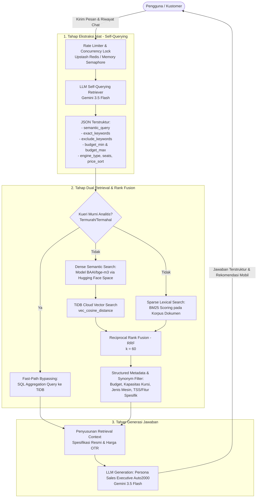

# Toyota Smart Recommender (Auto2000 Assistant)

[](https://nextjs.org/)
[](https://react.dev/)
[](https://www.typescriptlang.org/)
[](https://ai.google.dev/)
[](https://tidbcloud.com/)
[](https://github.com/confident-ai/deepeval)

**Toyota Smart Recommender** adalah sistem asisten digital cerdas berbasis AI yang dikembangkan khusus untuk **Auto2000 Rantauprapat (PT Astra International Tbk - Toyota Sales Operation)**. Sistem ini membantu calon kustomer menemukan rekomendasi kendaraan Toyota yang paling sesuai dengan kebutuhan fungsional, preferensi spesifikasi teknis, dan rentang anggaran (budget OTR) mereka secara interaktif, akurat, dan bebas halusinasi.

Sistem ini mengimplementasikan arsitektur **Self-Querying Hybrid RAG (Dense Vector + Sparse BM25 + Reciprocal Rank Fusion + Structured SQL Filtering)** yang telah divalidasi dan diuji secara kuantitatif menggunakan framework **DeepEval**.

---

## 📑 Daftar Isi
- [Arsitektur Sistem (Hybrid RAG Pipeline)](#-arsitektur-sistem-hybrid-rag-pipeline)
- [Tahapan Alur Kerja (Workflow)](#-tahapan-alur-kerja-workflow)
- [Legitimasi & Hasil Evaluasi DeepEval](#-legitimasi--hasil-evaluasi-deepeval)
  - [Ringkasan Perbandingan (Hybrid RAG vs Native RAG)](#ringkasan-perbandingan-hybrid-rag-vs-native-rag)
  - [Analisis Hasil Evaluasi Retrieval](#analisis-hasil-evaluasi-retrieval)
  - [Analisis Hasil Evaluasi Generative](#analisis-hasil-evaluasi-generative)
  - [Tabel Hasil Evaluasi 25 Skenario Uji](#tabel-hasil-evaluasi-25-skenario-uji)
- [Tech Stack](#-tech-stack)
- [Struktur Direktori Proyek](#-struktur-direktori-proyek)
- [Panduan Instalasi & Menjalankan Sistem](#-panduan-instalasi--menjalankan-sistem)
- [Environment Variables](#-environment-variables)

---

## 🏗️ Arsitektur Sistem (Hybrid RAG Pipeline)

Sistem rekomendasi ini dirancang untuk mengatasi kelemahan mendasar dari *Semantic-Only RAG (Native RAG)* pada domain otomotif, seperti kegagalan menangkap batasan harga numerik yang kaku, distorsi istilah teknis (seperti perbedaan *Sunroof* vs *Panoramic Glass*, atau *Cab-Chassis* vs *Pick Up* utuh), serta pencarian model spesifik.



---

## 🔄 Tahapan Alur Kerja (Workflow)

### 1. Concurrency Control & Rate Limiting
Untuk menjaga ketersediaan API dan menghindari *rate limit* berlebih, setiap permintaan masuk diatur melalui mekanisme antrean berkapasitas terkontrol:
- **Upstash Redis REST API**: Berfungsi sebagai *distributed lock / semaphore* saat aplikasi di-deploy secara multi-instance atau serverless.
- **In-Memory MemorySemaphore Fallback**: Mengatur batas konkurensi lokal (maksimal 10 concurrent requests) ketika Redis tidak terkonfigurasi.

### 2. Tahap Ekstraksi Niat (*Self-Querying Extraction*)
Pesan dari kustomer beserta 6 riwayat percakapan terakhir dibedah oleh model **Gemini 3.5 Flash** yang dikonfigurasi dengan *JSON Schema* ketat (`responseSchema`) dan aturan anti-bias:
*   `semantic_query`: Intisari fungsional murni tanpa kata sapaan atau halusinasi nama mobil yang tidak disebutkan pengguna.
*   `exact_keywords` & `exclude_keywords`: Ekstraksi fitur harga mati (misal: *Panoramic Roof*, *Captain Seat*, *TSS*) dan kata kunci pengecualian (*bukan hybrid*, *selain Fortuner*).
*   `budget_min` & `budget_max`: Pemetaan matematis harga dalam satuan Rupiah (misal: "budget 400 jutaan" dipetakan menjadi batas atas `499.999.999`).
*   `engine_type` (*bensin/hybrid/ev/diesel*), `seats` (*5/7/16*), `price_sort` (*termurah/termahal*), dan `is_fuel_efficient`.

### 3. Tahap Dual Retrieval & Reciprocal Rank Fusion (RRF)
Menggabungkan keunggulan pencarian makna semantik dan pencocokan leksikal kata kunci:
*   **Dense Semantic Search**: Menggunakan model embedding **BAAI/bge-m3** (dimensi 1024) yang di-host pada Hugging Face Space khusus (`ikiiloh-rag-car.hf.space`) dengan mekanisme *In-Memory Embedding Cache* (TTL 15 menit). Vektor kueri dibandingkan dengan vektor spesifikasi di dalam **TiDB Cloud MySQL** menggunakan fungsi `vec_cosine_distance`.
*   **Sparse Lexical Search (BM25)**: Menghitung relevansi kata kunci spesifikasi teknis dan tipe varian dengan penyesuaian panjang dokumen dinamis (*dynamic average document length*).
*   **Reciprocal Rank Fusion (RRF)**: Menggabungkan peringkat dari pencarian vektor dan BM25 dengan rumus baku ($k=60$):
    $$\text{RRF Score}(d) = \frac{1}{60 + r_{\text{vector}}(d)} + \frac{1}{60 + r_{\text{bm25}}(d)}$$
*   **Structured SQL Filtering & Dynamic Synonyms**: Hasil fusi difilter menggunakan klausa SQL terstruktur berdasarkan rentang harga, tipe mesin, kapasitas kursi, serta pencocokan kamus sinonim fitur resmi Toyota (*TSS, BSM, RCTA, PVM, Panoramic View, Wireless Charger, Power Backdoor*).
*   **Fast-Path Bypassing**: Kueri analitis murni (seperti *"apa mobil Toyota termurah?"*) langsung dieksekusi melalui SQL agregasi tanpa melalui pencarian vektor, menghasilkan latensi sangat rendah dengan akurasi 100%.

### 4. Tahap Generasi Jawaban (*Grounded Generation*)
Data spesifikasi detail, tipe transmisi, konsumsi bahan bakar, dan harga OTR Rantauprapat yang lolos retrieval disuntikkan ke dalam prompt LLM. Model diinstruksikan dengan persona **Sales Executive Auto2000 Rantauprapat**:
- **Strict Ground Truth**: Menjawab hanya berdasarkan konteks data yang berhasil diretriever (menghilangkan halusinasi).
- **Intelligent Cross-Selling**: Jika mobil yang dicari kustomer melebihi anggaran atau tidak memenuhi kriteria, sistem menawarkan alternatif mobil Toyota lain yang paling mendekati dengan penjelasan rasional.

---

## 📊 Legitimasi & Hasil Evaluasi DeepEval

Kinerja arsitektur **Hybrid RAG** telah diuji secara empiris dan dibandingkan langsung dengan arsitektur **Native RAG (Semantic-Only)** menggunakan framework pengujian standar industri **DeepEval** dengan metode *LLM-as-a-Judge* (berdasarkan berkas evaluasi `evaluate/Laporan_Gabungan_Evaluasi_Hybrid_vs_Native_RAG.docx`).

Pengujian dilakukan terhadap **25 skenario pengujian komprehensif** (20 skenario *In-Scope* mencakup harga, spesifikasi, fitur keselamatan, mobil listrik, kendaraan komersial, perbandingan unit, dan 5 skenario *Out-of-Scope*).

### Ringkasan Perbandingan (Hybrid RAG vs Native RAG)

| Komponen | Metrik Evaluasi | Hybrid RAG | Native RAG (Semantic-Only) | Selisih (Delta) | Keterangan |
|---|---|:---:|:---:|:---:|---|
| **Retrieval** | **Contextual Precision** | **0.957** (95.7%) | 0.600 (60.0%) | **+0.357 (+35.7%)** | Dokumen paling relevan konsisten di posisi teratas |
| **Retrieval** | **Contextual Recall** | **0.827** (82.7%) | 0.609 (60.9%) | **+0.218 (+21.8%)** | Konteks yang ditarik lengkap mencakup seluruh fakta |
| **Retrieval** | **Contextual Relevancy** | **0.640** (64.0%) | 0.462 (46.2%) | **+0.178 (+17.8%)** | Konteks bersih dan bebas dari noise dokumen tak relevan |
| **Generative** | **Faithfulness** | **1.000** (100.0%) | **1.000** (100.0%) | **0.000 (Setara)** | **0% Halusinasi**, seluruh klaim 100% didukung data |
| **Generative** | **Answer Relevancy** | **0.916** (91.6%) | 0.854 (85.4%) | **+0.062 (+6.2%)** | Jawaban langsung menjawab maksud kustomer |

```
Contextual Precision  : [████████████████████] 95.7% (Hybrid) vs [████████████        ] 60.0% (Native)  [+35.7%]
Contextual Recall     : [█████████████████   ] 82.7% (Hybrid) vs [████████████        ] 60.9% (Native)  [+21.8%]
Contextual Relevancy  : [█████████████       ] 64.0% (Hybrid) vs [█████████           ] 46.2% (Native)  [+17.8%]
Faithfulness          : [████████████████████] 100%  (Hybrid) vs [████████████████████] 100%  (Native)  [Setara]
Answer Relevancy      : [██████████████████  ] 91.6% (Hybrid) vs [█████████████████   ] 85.4% (Native)  [+6.2%]
```

### Analisis Hasil Evaluasi Retrieval
1. **Keunggulan Drastis pada Kueri Parametrik & Spesifik**: Pada skenario dengan filter harga/budget, tipe bodi khusus (*Cab-Chassis* untuk karoseri), jenis bahan bakar (*BEV/Non-Hybrid*), dan segmen spesifik (*SUV Compact, Luxury*), Native RAG kerap mengalami kegagalan (*Contextual Precision = 0.00*). Hybrid RAG berhasil mempertahankan skor sempurna (**1.00**) berkat kombinasi *Self-Querying structured extraction* dan *BM25 lexical scoring*.
2. **Kueri Analitikal (Termurah/Termahal)**: Pada skenario mobil termurah, Native RAG mendapatkan Precision 0.00 dan Recall 0.33 karena embedding semantik kata "termurah" tidak memiliki representasi harga numerik. Hybrid RAG mengeksekusi *Fast-Path SQL* dengan hasil sempurna (**1.00 / 1.00**).

### Analisis Hasil Evaluasi Generative
1. **Bebas Halusinasi (100% Faithfulness)**: Kedua arsitektur memperoleh skor sempurna **1.000**, membuktikan bahwa prompt engineering dan instruksi ground-truth LLM sangat efektif menjaga model agar tidak pernah mengarang spesifikasi.
2. **Kualitas Jawaban Lebih Tinggi (Answer Relevancy +6.2%)**: Karena konteks yang diambil pada tahap retrieval jauh lebih presisi dan relevan, jawaban akhir yang diproduksi oleh Hybrid RAG jauh lebih tepat sasaran, akurat terhadap kebutuhan kustomer, dan bebas dari rekomendasi yang meleset.

---

### Tabel Hasil Evaluasi 25 Skenario Uji

Berikut rincian lengkap hasil benchmark kuantitatif 25 skenario pengujian DeepEval:

| No | Skenario Pengujian | Hybrid Precision | Hybrid Recall | Hybrid Relevancy | Native Precision | Native Recall | Native Relevancy | Hybrid Ans. Rel. | Native Ans. Rel. |
|:---:|---|:---:|:---:|:---:|:---:|:---:|:---:|:---:|:---:|
| 1 | In-Scope: Pertanyaan Harga Spesifik | 1.00 | 1.00 | 1.00 | 1.00 | 1.00 | 0.57 | 1.00 | 1.00 |
| 2 | In-Scope: Rekomendasi Mobil Keluarga & Budget | 1.00 | 1.00 | 1.00 | 1.00 | 0.75 | 0.29 | 1.00 | 0.91 |
| 3 | In-Scope: Fitur Keselamatan (TSS/Airbags) | 1.00 | 1.00 | 0.44 | 1.00 | 1.00 | 0.57 | 0.93 | 0.85 |
| 4 | In-Scope: Mobil Paling Irit BBM | 1.00 | 1.00 | 1.00 | 1.00 | 1.00 | 1.00 | 1.00 | 0.93 |
| 5 | In-Scope: Perbandingan Dua Model | 1.00 | 1.00 | 1.00 | 1.00 | 0.67 | 1.00 | 1.00 | 0.95 |
| 6 | In-Scope: Mobil Offroad / Medan Berat | 1.00 | 1.00 | 0.29 | 1.00 | 1.00 | 0.71 | 1.00 | 1.00 |
| 7 | In-Scope: Mobil Listrik Murni (BEV) | 1.00 | 1.00 | 1.00 | 0.00 | 0.75 | 1.00 | 1.00 | 1.00 |
| 8 | In-Scope: Pertanyaan Mobil Termurah | 1.00 | 1.00 | 1.00 | 0.00 | 0.33 | 1.00 | 1.00 | 0.62 |
| 9 | In-Scope: Mobil Komersial / Pick Up | 1.00 | 1.00 | 0.93 | 1.00 | 1.00 | 1.00 | 1.00 | 1.00 |
| 10 | In-Scope: Spesifikasi Mesin & Tenaga | 1.00 | 1.00 | 0.20 | 1.00 | 1.00 | 0.14 | 1.00 | 0.90 |
| 11 | In-Scope: Ketersediaan Pilihan Warna | 1.00 | 1.00 | 1.00 | 1.00 | 1.00 | 0.29 | 0.75 | 1.00 |
| 12 | In-Scope: Kapasitas Tangki BBM | 1.00 | 1.00 | 1.00 | 1.00 | 1.00 | 1.00 | 1.00 | 0.83 |
| 13 | In-Scope: Mobil Sport (GR Series) | 1.00 | 0.75 | 1.00 | 0.00 | 0.40 | 0.29 | 1.00 | 1.00 |
| 14 | In-Scope: Garansi & Layanan Purnajual | 1.00 | 0.67 | 0.86 | 1.00 | 0.33 | 0.83 | 0.80 | 0.78 |
| 15 | In-Scope: Mobil SUV Compact | 1.00 | 1.00 | 1.00 | 0.00 | 0.00 | 0.00 | 1.00 | 0.45 |
| 16 | In-Scope: Mobil Premium / Luxury | 1.00 | 1.00 | 1.00 | 0.00 | 0.00 | 0.71 | 1.00 | 0.78 |
| 17 | In-Scope: Mobil Sasis Kosong (Karoseri/Cab-Chassis) | 0.92 | 1.00 | 0.43 | 0.00 | 0.00 | 0.00 | 1.00 | 0.86 |
| 18 | In-Scope: Mobil Non-Hybrid Saja | 1.00 | 1.00 | 0.43 | 0.00 | 0.25 | 0.00 | 1.00 | 0.50 |
| 19 | In-Scope: Dimensi & Kapasitas Bagasi | 1.00 | 1.00 | 0.50 | 1.00 | 1.00 | 0.14 | 0.92 | 0.93 |
| 20 | In-Scope: Truk Komersial Berat (Dyna) | 1.00 | 1.00 | 0.43 | 1.00 | 1.00 | 1.00 | 1.00 | 1.00 |
| 21 | Out-of-Scope: Merek Kompetitor | 1.00 | 1.00 | 0.00 | 1.00 | 0.33 | 0.00 | 1.00 | 1.00 |
| 22 | Out-of-Scope: Layanan Bengkel / Servis | 1.00 | 0.00 | 0.00 | 0.00 | 0.00 | 0.00 | 0.71 | 0.86 |
| 23 | Out-of-Scope: Pertanyaan Non-Otomotif | 0.00 | 0.00 | 0.00 | 0.00 | 0.50 | 0.00 | 0.20 | 0.20 |
| 24 | Out-of-Scope: Simulasi Kredit/DP Tanpa Konteks | 1.00 | 0.25 | 0.00 | 1.00 | 0.25 | 0.00 | 0.91 | 1.00 |
| 25 | Out-of-Scope: Mobil Bekas / Second | 1.00 | 0.00 | 0.50 | 0.00 | 0.67 | 0.00 | 0.67 | 1.00 |
| **-** | **RATA-RATA KESELURUHAN** | **0.957** | **0.827** | **0.640** | **0.600** | **0.609** | **0.462** | **0.916** | **0.854** |

*(Catatan: Faithfulness pada seluruh skenario 1–25 bernilai 1.00 untuk kedua model).*

---

## 🛠️ Tech Stack

### Web Application & Frontend
- **Framework**: [Next.js 16 (App Router)](https://nextjs.org/)
- **Core Library**: [React 19](https://react.dev/) & [TypeScript 5](https://www.typescriptlang.org/)
- **Styling**: [Tailwind CSS](https://tailwindcss.com/) & [Radix UI](https://www.radix-ui.com/)
- **Animations & Interactivity**: [Motion (Framer Motion)](https://motion.dev/) & [Lucide React](https://lucide.dev/)
- **State Management**: [Zustand](https://zustand-demo.pmnd.rs/)

### AI & Backend Pipeline
- **Large Language Model (LLM)**: [Google Gemini 3.5 Flash](https://ai.google.dev/) via `@google/generative-ai`
- **Embedding Model**: `BAAI/bge-m3` (1024-dim dense vectors) di-host pada Hugging Face Space (Gradio API)
- **Vector Database**: [TiDB Cloud Serverless](https://tidbcloud.com/) (MySQL-compatible dengan fungsi `vec_cosine_distance`)
- **Lexical Search Engine**: Algoritma BM25 (*Best Matching 25*) terintegrasi dalam pipeline Node.js
- **Rank Fusion**: Reciprocal Rank Fusion (RRF)
- **Distributed Lock & Queue**: [Upstash Redis](https://upstash.com/) REST Client

### Data Management & Ingestion (`admin/`)
- **Backend Ingestion**: Python 3.11+, Flask
- **Document Processing**: `PyMuPDF` (fitz) untuk ekstraksi brosur spesifikasi PDF resmi Toyota
- **Database Driver**: `mysql-connector-python`

### Framework Evaluasi (`evaluate/`)
- **Evaluation Framework**: [DeepEval](https://github.com/confident-ai/deepeval)
- **Metrics**: Contextual Precision, Contextual Recall, Contextual Relevancy, Faithfulness, Answer Relevancy
- **Testing Runner**: Pytest, Kaggle Kernel Environment

---

## 📁 Struktur Direktori Proyek

```text
prototype/
├── admin/                                # Modul Manajemen Data & Ingestion
│   ├── admin_server.py                   # Server Flask Admin Ingestion
│   ├── extract_cli.py                    # Ekstraksi PDF brosur via PyMuPDF
│   ├── index.html / style.css / app.js   # Panel Web GUI Admin
│   └── PANDUAN_EKSTRAK_CLI.md            # Dokumentasi ekstraksi CLI
├── evaluate/                             # Modul Pengujian & Benchmark DeepEval
│   ├── Laporan_Gabungan_Evaluasi_Hybrid_vs_Native_RAG.docx # Laporan lengkap evaluasi
│   ├── rag_pipeline.py                   # Pipeline Hybrid RAG untuk evaluasi
│   ├── native_rag_pipeline.py            # Pipeline Native RAG (Semantic-Only)
│   ├── test_case.json                    # Dataset 25 skenario uji DeepEval
│   ├── test_evaluasi_generate_kaggle.py  # Evaluasi generative metrics di Kaggle
│   └── test_evaluasi_retrieval_kaggle.py # Evaluasi retrieval metrics di Kaggle
├── src/
│   ├── app/
│   │   ├── api/ai-chat/route.ts          # Core API Handler Hybrid RAG Pipeline
│   │   ├── layout.tsx                    # Root Layout Next.js
│   │   └── page.tsx                      # Beranda & Virtual Showroom UI
│   ├── components/                       # Komponen UI (Chat, MobilCard, Navbar, dll)
│   ├── hooks/                            # Custom React Hooks
│   └── lib/                              # Utility & Konfigurasi Helper
├── public/                               # Aset Statis (Gambar Mobil, Brosur, Logo)
├── package.json                          # Manifest Dependensi Next.js
└── README.md                             # Dokumentasi Teknis Utama Proyek
```

---

## 🚀 Panduan Instalasi & Menjalankan Sistem

### Prasyarat
- [Node.js](https://nodejs.org/) v18.18.0 atau lebih baru
- [Python](https://www.python.org/) 3.10+ (untuk modul admin / evaluasi)
- Akun dan Database [TiDB Cloud Serverless](https://tidbcloud.com/)
- [Google AI Studio API Key](https://aistudio.google.com/) (Gemini API)

### 1. Clone Repository & Install Dependensi Frontend
```bash
git clone https://github.com/your-username/prototype.git
cd prototype

# Install dependensi Node.js
npm install
```

### 2. Konfigurasi Environment Variables
Salin atau buat file `.env` pada direktori root proyek:

```env
# Google Gemini API
GOOGLE_API_KEY=your_gemini_api_key_here
GOOGLE_API_KEY_RAG=your_gemini_api_key_here

# TiDB Cloud Vector Database
TIDB_HOST=your-tidb-cluster-host.tidbcloud.com
TIDB_PORT=4000
TIDB_USER=your_username.root
TIDB_PASSWORD=your_password
TIDB_NAME=your_database_name

# Hugging Face Embedding Service (BAAI/bge-m3)
HUGGINGFACE_SPACE_URL=https://ikiiloh-rag-car.hf.space

# Upstash Redis (Opsional untuk Distributed Semaphore Lock)
UPSTASH_REDIS_REST_URL=https://your-upstash-instance.upstash.io
UPSTASH_REDIS_REST_TOKEN=your_upstash_token
```

### 3. Menjalankan Server Pengembangan (Frontend)
```bash
npm run dev
```
Akses aplikasi melalui browser di `http://localhost:3000`.

### 4. Menjalankan Panel Admin Ingestion (Opsional)
```bash
cd admin
pip install -r requirements.txt
python admin_server.py
```
Akses panel admin di `http://localhost:5000`.

### 5. Menjalankan Evaluasi DeepEval
```bash
cd evaluate
pip install deepeval pytest

# Menjalankan evaluasi retrieval
pytest test_evaluasi_retrieval_kaggle.py -s

# Menjalankan evaluasi generative
pytest test_evaluasi_generate_kaggle.py -s
```

---

## 📄 Lisensi & Hak Cipta
Dikembangkan sebagai bagian dari proyek penelitian dan implementasi sistem asisten digital rekomendasi mobil Toyota pada Auto2000 Rantauprapat.

Hak Cipta © 2026 Toyota Smart Recommender Project.
