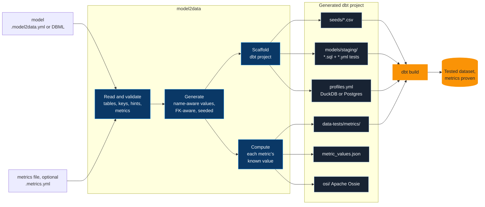

# model2data

[](https://pypi.org/project/model2data/)
[](https://pypi.org/project/model2data/)
[](https://pypi.org/project/model2data/)
[](https://github.com/JB-Analytica/model2data/actions/workflows/ci.yml)
[](https://codecov.io/gh/JB-Analytica/model2data)
[](LICENSE)

Built and maintained by [JB Analytica](https://www.jbanalytica.com/) — data platform architecture and analytics engineering.

**Turn a data model into a running analytics stack in one command.**

Give `model2data` a data model — a `.model2data.yml` file, or a [DBML](https://dbml.dbdiagram.io/docs/)
schema hand-written or exported from an existing database — and it generates realistic,
relationship-preserving synthetic data *and* a complete, runnable dbt project around it: seeds,
staging models, tests, and a DuckDB or Postgres profile. Add a metrics file and it also knows
what your revenue comes to, and writes a dbt test that proves it. No sample data to hunt down,
no dbt boilerplate to hand-write, no production data to risk exposing.


```bash
pip install model2data
model2data --file examples/ecommerce.model2data.yml --rows 200 --seed 42   # examples/ is in this repository
cd dbt_ecommerce && dbt build
```

> **Prefer a browser?** [model2data studio](https://studio.jbanalytica.com) is the same
> engine as a web app: write DBML, watch the entity diagram redraw as you type, see what every
> column will generate before you generate it, then export CSVs or a runnable dbt project.
> Nothing to install, free to start.

---

## What you get

**Values that look real.** Column names are matched against about 40 common patterns — `email`,
`first_name`, `city`, `phone`, `company`, ... — so a column called `email` gets real-looking
emails, not `Lorem ipsum`. Type a column with any Faker provider (`billing_country state`,
`sku ean13`) to pick its generator outright, and `--locale nl_BE` makes every person and address
come from one country. → [The model file](docs/model-file.md)

**Foreign keys that resolve.** Tables are generated in dependency order and every foreign key
points at a parent row that exists — onto a primary key or a unique one. Composite primary and
unique keys hold, and a column that repeats a parent's value through a foreign key
(`orders.customer_email`) holds the email of the order's own customer.
→ [The model file](docs/model-file.md)

**A dbt project that runs.** Seeds, staging models that `ref()` them, `not_null`, `unique`,
`relationships` and `accepted_values` tests, data tests written from the model's own hints, and
a DuckDB (zero-config) or Postgres profile. One `dbt build` loads, builds and tests it, and
`--unit-tests` adds dbt unit test fixtures. → [The generated dbt project](docs/dbt-project.md)

**The same files, byte for byte.** The same model, `--seed`, `--as-of` and options give the same
files on any machine, any day, with the same model2data version — safe to commit as fixtures,
safe to diff in CI. `--table-seed orders=7` re-rolls one table and leaves every other one
byte-identical. → [The determinism promise](docs/generating.md#the-determinism-promise)

**Days after the first.** A table marked `incremental` moves on day by day: `--days 7` or
`--next` adds new rows and updates existing ones, an enum with `transitions` moves an order from
`pending` to `shipped`, and each day is written as a batch or a changelog to load incrementally.
→ [Days after the first](docs/days.md)

**History tables.** `history: true` writes `<table>_history`, every version of every row with
`valid_from`, `valid_to` and `is_current`: an SCD type 2 source to build snapshots against.
→ [A source that keeps its history](docs/history.md)

**When things happen.** `--business-hours`, `--growth` and `--seasonality` shape every timestamp
(weekdays and working hours, a trend, a Q4 peak), or one column at a time. `updated_at` never
lands before `created_at`, `after` orders any two columns, and `when` gives `shipped_at` a value
on shipped and delivered orders only. → [When things happen](docs/time-shapes.md)

**How the data is spread.** `--skew` lets a few customers place most of the orders; `weights`,
`true_rate`, `null_rate` and `distinct` shape a column; `distribution` draws a number from a
normal, lognormal or exponential curve. → [How the data is spread](docs/distributions.md)

**Defects on purpose.** `--defects training` breaks each standard dbt test once, `messy` puts a
small share of every defect on every table, and a table can list its own: duplicate keys,
orphans, nulls, invalid values, messy text, late-arriving rows. Every run with defects writes
`EXPECTED_FAILURES.md`, so a test that does not fire shows. → [Defects on purpose](docs/defects.md)

**Metrics with known values** (new in 1.13.0). A metrics file beside the model defines revenue,
orders, average order value. The run writes each metric's value over the generated data to
`metric_values.json`, overall and per month, a dbt test per metric that must reproduce it on the
warehouse, and an [Apache Ossie](https://github.com/apache/ossie) semantic model under `osi/`.
New in 1.14.0: `--lightdash` writes the same metrics into the staging models' YAML as
[Lightdash](https://www.lightdash.com/) reads them, filters, joins and ratios included, so the
dashboard's revenue can be checked against the number the run already knows.
→ [Metrics with known values](docs/metrics.md)

**Validate in CI.** `model2data validate` checks models and metrics files and prints GitHub
annotations; `uses: JB-Analytica/model2data@v1` fails a pull request that breaks one. A
pre-commit hook and a GitLab CI snippet do the same. → [Validate models in CI](docs/ci.md)

**Use it from an agent.** `uvx model2data@latest guide` prints instructions written for a coding
agent, shipped with the installed version; [LLMS.md](LLMS.md) takes an LLM from a plain-English
description to a running project. → [Agents and LLMs](docs/agents.md)

**Or in the browser.** [model2data studio](#model2data-studio--the-same-engine-in-the-browser)
is the same engine with a DBML editor and a live diagram.

---

## Before and after

In: a model (here the `orders` table of
[`examples/ecommerce.model2data.yml`](examples/ecommerce.model2data.yml)) and, optionally, the
metrics that matter ([`examples/ecommerce.metrics.yml`](examples/ecommerce.metrics.yml)):

```yaml
  orders:
    columns:
      id: {type: bigint, pk: true, not_null: true}
      customer_id: {type: bigint, not_null: true, references: customers.id}
      order_date: {type: timestamp, not_null: true}
      total_amount:
        type: numeric
        not_null: true
        generate: {min: 10, max: 5000}
      status: order_status
```

```yaml
metrics:
  revenue:
    label: Revenue
    measure: orders.total_amount
    agg: sum
    where:
      orders.status: [processing, shipped, delivered]
    time: orders.order_date
    format: currency
  orders:
    count: orders
    where:
      orders.status: [processing, shipped, delivered]
    time: orders.order_date
  average_order_value:
    ratio: {numerator: revenue, denominator: orders}
```

```bash
model2data --file examples/ecommerce.model2data.yml --metrics examples/ecommerce.metrics.yml \
  --rows 200 --seed 42 --as-of 2026-01-31
```

Out: a dbt project.

```
dbt_ecommerce/
├── seeds/raw/                  customers.csv, orders.csv, order_items.csv, products.csv,
│                               product_reviews.csv, __seed_config.yml
├── models/staging/             stg_<table>.sql + stg_<table>.yml (with tests), for each table
├── data-tests/metrics/         metric_revenue.sql, metric_orders.sql,
│                               metric_average_order_value.sql, metric_units_sold.sql
├── macros/                     generate_schema_name.sql, model2data_hint_tests.sql
├── osi/ecommerce.yml           the model and its metrics as Apache Ossie 0.1.1
├── metric_values.json          each metric's known value
├── ecommerce.model2data.yml    the model, and
├── ecommerce.metrics.yml       its metrics, copied as given
├── dbt_project.yml
└── profiles.yml                DuckDB
```

`dbt build` loads the seeds, builds the staging models and runs every test, the four metric
tests included:

```
Finished running 5 seeds, 49 data tests, 5 view models in 0 hours 0 minutes and 0.71 seconds (0.71s).

Completed successfully

Done. PASS=59 WARN=0 ERROR=0 SKIP=0 NO-OP=0 REUSED=0 TOTAL=59
```

And `metric_values.json` says what a dashboard on this data must show:

```json
{
  "model2data-metrics": "0.1.0",
  "model": "ecommerce",
  "run": {
    "seed": 42,
    "as_of": "2026-01-31"
  },
  "rounding": "counts, and sums, minimums and maximums of integer columns, are exact; every other value is rounded to 6 decimal places, half to even",
  "metrics": {
    "revenue": {
      "kind": "simple",
      "label": "Revenue",
      "value": 220291.8,
      "time": "orders.order_date",
      "by_month": {
        "2025-01": 3967.88,
        "2025-02": 10676.66,
        ...
        "2026-01": 31879.13
      }
    },
    "orders": { "kind": "count", "label": "Orders", "value": 92, ... },
    "average_order_value": { "kind": "ratio", "label": "Average order value", "value": 2394.476087, ... },
    "units_sold": { "kind": "simple", "label": "Units sold", "value": 734, ... }
  }
}
```

Run it again tomorrow, or on another machine, with the same model2data version, and every one
of those files is the same.

---

## Who it's for

Analytics engineers hit the same wall constantly: you need realistic data to build or test a
pipeline, but production data is off-limits (privacy, access, scale), and hand-rolling mock CSVs
is tedious and doesn't scale past two tables. model2data closes that gap. Nothing but a schema
definition goes in; nothing but synthetic data comes out.

- **A consultant who needs a client demo before source access.** Write the client's model from a
  kick-off call, generate a year of their data, and show a working dbt project and dashboard in
  the first week, without touching production.
- **An analytics engineer who wants fixtures in CI.** Commit the model, generate with `--seed`
  and `--as-of`, and every CI run builds against the same bytes. `--days` gives an incremental
  model the next day's batch to process.
- **A trainer who needs data that fails on purpose.** `--defects training` breaks each standard
  dbt test once and says which, so a class sees `unique`, `not_null`, `relationships` and
  `accepted_values` fail for the right reason.
- **A team defining metrics once.** Write revenue in one metrics file, check every number the
  semantic layer or dashboard shows against `metric_values.json`, let `dbt build` prove the SQL,
  and hand the definitions on as Apache Ossie or straight to Lightdash.

## How it works



1. **Read.** Reads the model — its tables, columns, keys, references and generation hints — from
   a `.model2data.yml` document, checking it against [the spec](model2data/spec/README.md), or
   from DBML, which it converts to the same model first. A metrics file is checked against
   [its spec](model2data/spec/metrics/README.md) and against the model.
2. **Generate.** Produces synthetic values per column — typed generation for known SQL types
   (int, date, timestamp, ...), then a Faker provider named as the type (`sku ean13`), then
   name-aware inference for everything else (`email`, `phone`, `city`, ...), foreign keys
   resolved against already-generated parent rows. The metrics file is never read here: the data
   is the same with or without it.
3. **Scaffold.** Writes a complete dbt project around that data: CSV seeds, staging models that
   `ref()` those seeds, `not_null`/`unique`/`relationships` tests, `accepted_values` tests for
   enum-typed columns, singular SQL tests for composite primary/unique keys, tests from the
   model's hints, table and column `description:` fields from the model, and a profile for
   DuckDB (zero-config, file-based) or Postgres.
4. **Compute metrics.** With `--metrics`, computes each metric over the generated data and writes
   its known value, a dbt test that checks it, and the Apache Ossie file; with `--lightdash`,
   Lightdash metrics and dimensions in the staging models' YAML.

---

## Installation

```bash
pip install model2data                 # DuckDB included
pip install "model2data[postgres]"     # to target Postgres with --adapter postgres
uvx model2data --help                  # or run it without installing
```

Python 3.10 to 3.14. The examples used on this page are in [`examples/`](examples/).

---

## model2data studio — the same engine, in the browser

[**model2data studio**](https://studio.jbanalytica.com) puts everything on this page behind a
web UI. It is built by JB Analytica on top of this library, it's the fastest way to try
model2data, and it's the better fit while a schema is still being designed:

- **Type DBML, see the diagram.** Syntax highlighting, autocomplete and live error checking; the
  entity diagram redraws as you type. Click a column to trace what actually joins to it.
- **See what you'll get before you generate.** Every column shows an example of the value it will
  produce, and columns nothing recognises are marked — so placeholder data is visible rather than
  silent.
- **Generate and export.** Per-table row counts, then CSVs or a complete dbt project: the same
  seeds, staging models, tests and DuckDB profile this CLI produces, reproducing the exact rows
  you previewed.
- **Share the model.** A share link that also embeds as a chrome-free diagram in a Notion,
  Confluence or wiki page.

Free to start, nothing to install: [studio.jbanalytica.com](https://studio.jbanalytica.com)
([plans and pricing](https://www.jbanalytica.com/model2data/pricing/)).
The CLI stays the right tool for scripting, CI and fixtures you commit; the studio is where a
model gets designed and shown.

---

## Validate models in CI

```yaml
name: model2data
on:
  pull_request:
    paths: ["**/*.model2data.yml"]
jobs:
  validate:
    runs-on: ubuntu-latest
    steps:
      - uses: actions/checkout@v5
      - uses: JB-Analytica/model2data@v1
```

Issues show inline on the pull request's Files tab. The inputs, a pre-commit hook and GitLab CI
are in [Validate models in CI](docs/ci.md).

---

## Documentation

- [The model file](docs/model-file.md) — `.model2data.yml`, DBML as input, `validate`, `convert`
- [Generating a project](docs/generating.md) — row counts, `--as-of`, the determinism promise, `--table-seed`, `--locale`
- [The generated dbt project](docs/dbt-project.md) — `dbt build`, Postgres, unit tests, hint tests, structure
- [Days after the first](docs/days.md) and [history tables](docs/history.md)
- [When things happen](docs/time-shapes.md) and [how the data is spread](docs/distributions.md)
- [Defects on purpose](docs/defects.md)
- [Metrics with known values](docs/metrics.md)
- [Validate models in CI](docs/ci.md)
- [Agents and LLMs](docs/agents.md), and [LLMS.md](LLMS.md)
- The [model spec](model2data/spec/README.md) and the [metrics spec](model2data/spec/metrics/README.md)
- [Examples](examples/README.md) and the [changelog](CHANGELOG.md)

---

## dbt-core versions

model2data requires **dbt-core >= 1.11**, tracking [dbt's own version support
policy](https://docs.getdbt.com/docs/dbt-versions): dbt Labs supports each minor release for one
year, and 1.11 is the oldest that still is. Generated projects build cleanly — no deprecation
warnings — on every supported dbt-core version, and CI proves it on each push by running a real
`dbt build` against both the stated floor and the newest release.

If you're pinned to an older dbt-core, use model2data 0.5.x, which supported down to 1.8.5.

---

## Design decisions / non-goals

- **DuckDB Default**: Chosen for its zero-config, file-based nature, making it easy to get started without database setup. Postgres is supported via `--adapter postgres`; other adapters can be configured manually.
- **dbt Integration**: Leverages dbt's transformation capabilities for a familiar workflow in analytics engineering.
- **Synthetic Data**: Uses deterministic generation for reproducibility; not intended for production use or as a replacement for real data.
- **Metrics describe, never steer**: The generator never reads the metrics file, so adding or changing a metric changes no generated data, only the known values and tests computed from it.
- **Non-goals**: This is not a data migration tool, ETL pipeline, or real-time data generator. It focuses on static, synthetic datasets for testing and prototyping.

---

## Limitations

- Synthetic data generation is heuristic-based (typed generation, name-aware inference, enum/default awareness) and may not perfectly mimic real-world distributions or edge cases.
- DuckDB and Postgres are supported today; other databases require manual profile adjustments.
- No support for incremental models or advanced dbt features in generated projects.
- Composite foreign keys (across a bridge/join table) are generated as independent single-column FKs — each column's values are individually valid, but the *combination* isn't guaranteed to match a real parent composite key unless that key is separately enforced as a key of the child (`keys`).
- A model that doesn't conform to the spec — or DBML that can't be read, or converts to such a model — is refused with every issue and where it is, rather than generated from in part. A reference onto a column that is not a key is allowed with a warning: its values are drawn from the ones the parent column holds.

---

## Project status

model2data is stable and actively developed. Releases follow semantic versioning: new
capabilities arrive in minor releases (since 1.0: days after the first, time shapes,
distributions, defects, history tables, CI validation, the agent guide and, in 1.13.0, metrics
with known values and Apache Ossie export). CI runs a real `dbt build` against both the oldest supported dbt-core and the newest
release on every push, and checks the output of a spread of models byte for byte. The
[changelog](CHANGELOG.md) says what each release changed, including any change to what a seed
produces.

Ideas still open, in case anyone wants to pick them up as a contribution:

- Additional database adapters (e.g. Snowflake, BigQuery).
- Example mart-layer models on top of staging (the generated `dbt_project.yml` carries a
  ready-to-uncomment `marts` schema/materialization config for this).

See [CONTRIBUTING.md](CONTRIBUTING.md) if you'd like to work on any of these.

---

## Contributing

We welcome contributions!

- Open issues for bugs or feature requests.
- Submit PRs to add new example models, custom data generators, or improvements.
- Ensure all new features include tests if possible.

See [CONTRIBUTING.md](CONTRIBUTING.md) for detailed guidelines, and [DEVELOPMENT.md](DEVELOPMENT.md) for the local dev setup and release process.

## Code of Conduct

Please read our [Code of Conduct](CODE_OF_CONDUCT.md) to understand our community standards.

---

## License

MIT License. See LICENSE for details.

---

<p align="center">
  <a href="https://www.jbanalytica.com">
    
  </a>
  <br>
  Built and maintained by <a href="https://www.jbanalytica.com"><strong>JB Analytica</strong></a> —
  Data & Analytics Engineering · Data Platform Architecture · Modern BI.
  <br>
  Try <a href="https://studio.jbanalytica.com"><strong>model2data studio</strong></a> — model2data in the browser, nothing to install.
</p>
