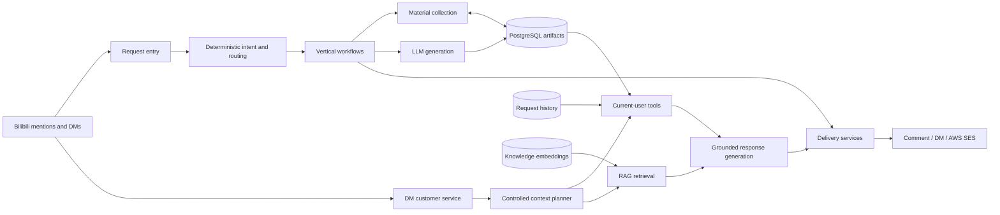

# MilkyAi

<div align="center">

**An AI-powered video-to-notes email platform for Bilibili**

Turn public videos into concise summaries, searchable transcripts, Chinese translations, and structured Markdown notes delivered by email.

[Bilibili](https://space.bilibili.com/3461574540921489) · [中文说明](README_zh_%E4%B8%AD%E6%96%87.md) · [Architecture](docs/ARCHITECTURE.md)


<br>

[](https://space.bilibili.com/3461574540921489)

</div>

> This repository is a public engineering showcase, not the production source release. MilkyAi's production implementation, prompts, platform integrations, and operational configuration remain private. The included code is a deliberately small architecture skeleton.

## At a Glance

| Production footprint | Product surface |
| --- | --- |
| **38K+** Bilibili community | Video summaries and Q&A |
| **~300** daily active users | Email-delivered Markdown notes |
| **250K+** lifetime requests | Transcripts and Chinese translation |
| **24/7** managed service | RAG-enabled DM customer service |

MilkyAi is invoked where the video already lives. A user mentions `@MilkyAi` in a Bilibili video comment and chooses a delivery channel. The service classifies the request, retrieves or extracts video material, generates the requested artifact, persists reusable results, and delivers the response through a comment, Bilibili DM, or email.

The signature experience is **video-to-notes by email**: MilkyAi produces a readable HTML email, a reusable Markdown note, and the source transcript as attachments. Transcript-only requests can also include a Chinese translation when the source language is non-Chinese.

## Product Capabilities

| Capability | What the user receives |
| --- | --- |
| Comment summary | A compact answer suitable for a public comment thread |
| Video Q&A | A grounded answer based on the video's available material |
| DM summary | A longer private summary, split safely for platform delivery |
| Email notes | Rendered HTML plus Markdown notes and transcript attachments |
| Email transcript | Original transcript and, when applicable, a Chinese translation |
| Multi-part notes | Batched notes for all pages of an eligible multi-part video |
| DM customer service | Product help, request diagnostics, subscription lookup, and video follow-up |

## System Architecture



The production system follows a **functional orchestration + object-oriented service boundaries** style:

- `main` owns startup, dependency assembly, polling, and top-level dispatch.
- Vertical workflows own request-specific orchestration.
- Horizontal services expose reusable material, generation, persistence, quota, account-selection, and delivery capabilities.
- Stateful integrations and interchangeable dependencies use classes, `Protocol` interfaces, and constructor injection.
- Pure classification and transformation logic remains function-oriented.

See [Architecture](docs/ARCHITECTURE.md) for the workflow map, persistence model, and customer-service design.

## Engineering Highlights

### Reusable, DB-first video artifacts

PostgreSQL stores video metadata, transcripts, translations, comment summaries, DM summaries, and Markdown notes under the identity `(bvid, page)`. Workflows read reusable artifacts before invoking external services, reducing repeated ASR and LLM work while preserving distinct artifacts for distinct delivery contexts.

### Controlled RAG customer service

MilkyAi's DM experience combines a self-authored product knowledge base with trusted, user-scoped tools. The knowledge retriever supplies stable product facts; typed tools supply current subscription state, recent request history, and recent video artifacts. A deterministic context planner decides which bounded tools are available, so the model never invents tool calls or selects arbitrary user identifiers.

The retrieval layer is evaluated with a **41-scenario regression suite** covering routing, support boundaries, request diagnostics, delivery questions, and common conversational edge cases.

### Persistent request diagnostics

Every accepted mention receives a durable request record containing the original request, video identity, selected workflow, processing timestamps, and delivery outcome. This allows customer service to distinguish “the platform never delivered the mention” from generation, queueing, quota, and delivery failures without scraping free-form logs.

### Async processing and resilient delivery

An `asyncio` worker pool processes up to three requests concurrently while additional work remains queued. Delivery services normalize channel-specific behavior such as DM splitting, comment fallback, rate limits, and SES attachments into structured results that workflows can persist and inspect.

### Explicit architecture boundaries

The codebase is organized around vertical workflows and shared horizontal services rather than one large bot script. Request classification, artifact access, material collection, LLM generation, RAG, delivery, quotas, and persistent state each have an explicit owner.

## Workflow Map

```text
Comment mention
  -> comment.summary | comment.qa
  -> dm.summary      | dm.qa
  -> email.notes     | email.transcript | email.allparts

Non-video post
  -> opus.chat

Direct message
  -> dm.customer
```

MilkyAi currently routes nine user-facing request variants. Delivery intent takes precedence over format wording: for example, an email request enters the email workflow, while a DM request receives a DM-native result.

## Technology

- **Python 3.12** and `asyncio`
- **PostgreSQL** for artifacts, request history, and RAG chunks
- **OpenAI-compatible LLM and embedding APIs**
- **Speech-to-text** fallback for videos without usable captions
- **AWS SES** for HTML email and file attachments
- **Docker** and **Railway** for production deployment
- Structured event logging and a seven-day diagnostic request history

## Public Repository Layout

```text
MilkyAi-bilibili/
├── README.md
├── README_zh_中文.md
├── docs/
│   └── ARCHITECTURE.md
├── src/milky_ai/
│   ├── domain.py          # request/result data contracts
│   ├── ports.py           # interface-based service boundaries
│   └── workflows.py       # illustrative orchestration examples
└── tests/
    └── test_workflows.py  # tests for the public skeleton only
```

The skeleton demonstrates the architectural style without exposing production prompts, adapters, routing heuristics, platform APIs, credentials, or operational policies. It is intentionally not a deployable clone of MilkyAi.

## Explore the Skeleton

The public skeleton has no runtime dependencies:

```bash
python -m unittest discover -s tests
```

Start with [`src/milky_ai/ports.py`](src/milky_ai/ports.py) to see the dependency boundaries, then [`src/milky_ai/workflows.py`](src/milky_ai/workflows.py) for two small orchestration examples.

## Source Availability

MilkyAi is an independently designed and operated production service. This repository documents the product and selected engineering patterns, but it is **not an open-source distribution** of the production system. No permission is granted to reproduce the service, its branding, or its private implementation from this showcase.

For the live product, visit [MilkyAi on Bilibili](https://space.bilibili.com/3461574540921489).
