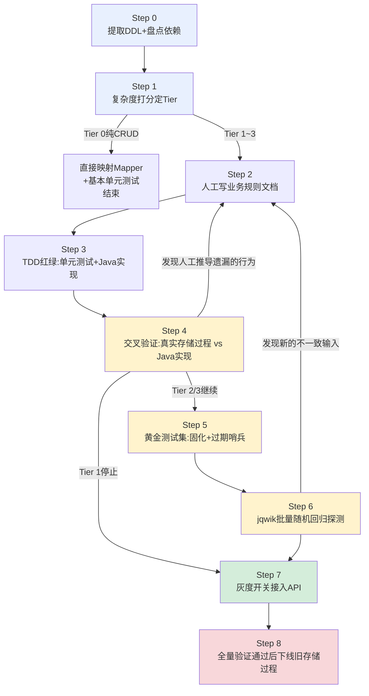
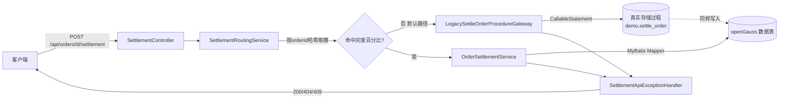
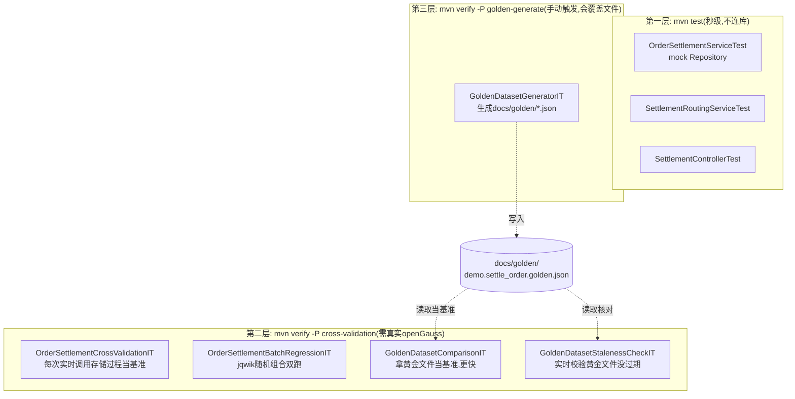

# openGauss 存储过程 → Java 迁移项目

把 openGauss 存储过程改写成 Java 代码,用多层测试保证转换正确,再通过灰度开关把线上流量从旧存储过程逐步切到新 Java 实现,直到确认无误后才允许下线旧存储过程。

当前仓库用一个示例存储过程 `demo.settle_order`(订单结算:游标遍历、条件分支、异常处理、嵌套调用子过程、跨5张表写入)把整套流程完整跑了一遍。这份 README 既是使用说明,也是**可复制的迁移 SOP**——迁移下一个真实存储过程时,照着"第二部分:迁移一个存储过程的完整步骤"从头走一遍,每一步换成你的存储过程名字就行。

---

# 设计思路:为什么要这样设计

这一节讲的不是"做了什么",是"为什么这么做,权衡在哪"。如果只想知道怎么跑起来,可以跳到"第一部分"。

## 问题到底出在哪

存储过程转 Java 最大的风险不是"语法翻译错了"——循环、条件、游标这些控制流翻译对不对,人工审查基本能查出来。真正危险的是**人读代码时根本意识不到有这个行为存在**。这个项目里最典型的例子就是 `demo.settle_order`:整段逻辑被一个 `EXCEPTION WHEN OTHERS RAISE` 包住,PL/pgSQL 里这等价于一个隐式 SAVEPOINT,失败路径写进日志表的记录会随着 RAISE 一起被回滚,根本不会落库。读这段 PL/pgSQL 代码,大概率会想"失败了当然要留日志方便排查",这个假设合情合理,但是错的。

这类问题的共性是:**它不是逻辑错误,是语义差异**——PL/pgSQL 的异常处理块、openGauss 的隐式类型转换、游标遍历顺序、事务边界,这些东西在 Java 里没有一一对应的语法,翻译的人必须做选择,而选错了不会报错、不会崩溃,只会在某个边界条件下悄悄产生不一样的结果。这种 bug 传统的"写完测试再跑一遍"抓不住,因为写测试用的预期值也是从同一个"读代码产生的理解"里来的——对代码的误解会原封不动地变成测试断言,自己骗自己,测试全绿但逻辑是错的。

## 核心设计原则:不相信人工理解,让真实数据库当裁判

这是整个项目最关键的一个决定。单纯的 TDD 在这个场景下有个结构性缺陷:mock 掉数据库,断言的是"我以为它应该输出什么",而不是"它实际输出什么"。所以验证被拆成了两条完全独立的证据链:

- **人工推导链**:读源码 → 写规则文档 → 写单元测试断言。验证的是"Java 代码是否忠实翻译了理解的逻辑"。
- **数据库实测链**:同一批输入,真实调用旧存储过程拿到真实结果,再拿这个结果去校验 Java 实现。验证的是"理解的逻辑,是否就是数据库真实的逻辑"。

两条链缺一个都不完整。只有第一条,会把误解当真理;只有第二条,没有可读、可审查的"这个输入该输出什么"的清单,出问题不好排查也不好跟业务方沟通。这就是为什么项目里同时存在 `OrderSettlementServiceTest`(纯 mock)和 `OrderSettlementCrossValidationIT`(真实数据库)——它们不是同一层测试的两个副本,是两种完全不同的怀疑对象。

## 分层防御:每一层防的是不同种类的失误

按风险类型分了五层,每一层解决的问题不重叠:

1. **单元测试**防"翻译错误"——控制流写错了、边界值算错了。
2. **交叉验证**防"理解错误"——数据库真实行为和以为的不一样。这是唯一能抓到"未知的未知"的手段。
3. **黄金测试集**防"验证成本和可审查性的矛盾"——交叉验证每次都要连真实数据库、每次都要跑存储过程,慢,而且答案是动态生成的,业务方没法脱离代码去审阅"这个输入本该产出什么"。黄金文件把交叉验证的一次性答案固化成可读、可 diff、可版本控制的文档,但这样引入了新风险:文件生成后可能被遗忘更新,变成"过期的真理"给后续开发一种虚假的安全感。所以配了一个"过期哨兵"(`GoldenDatasetStalenessCheckIT`)——它不信任黄金文件,每次都重新实时调用数据库去戳破这份文件是不是已经过期了。这是特意设计的**互相牵制**关系:黄金文件负责快和可读,哨兵负责让这个"快"不会变成"假"。
4. **jqwik 批量随机回归**防"手写用例的想象力边界"——101/102/103 这几个订单号覆盖的是"能想到的场景",但客户等级×商品×数量的组合是排列不完的。这一层生成随机输入去探测,它的角色定位是**探测工具**不是**长期回归基线**——一旦跑出问题,正确做法是把这个具体输入固化成新的规则文档条目和新场景,而不是让随机测试自己扛住长期回归的责任(不然出了问题都没法稳定复现)。
5. **灰度开关**防"测试覆盖不到的生产真实边界"——这是唯一一层不属于"测试"范畴的机制,它承认一个事实:再完备的测试也不能保证生产流量里不会撞到没想到的输入组合。所以它的设计目标不是"提高正确率",是**把出错的影响范围限制住,并且让影响范围可控地扩大**。按 `orderId` 哈希取模而不用随机数,是为了保证同一个订单每次路由结果稳定——如果线上真出了问题,能立刻定位到"是哪一批订单在走新代码",而不是这次报错下次复现不了。

这五层不是"越多越好"的堆砌,是**故意分工**:任何一层单独存在都有明显漏洞,组合起来漏洞互相补位。

## 复杂度分级:不能一刀切

如果每个存储过程都要求走完整五层,简单的 CRUD 存储过程会被过度设计,而真正高风险的存储过程又可能因为"流程太重大家懒得走完"被敷衍过去。所以设计了一个可计算的打分公式(见下文 Step 1),不靠"感觉这个复杂"这种主观判断。这个分级本身也是给"别的 AI 或工程师接手时"用的判断依据,不然每个人对"复杂"的直觉都不一样,流程执行就会不一致。

## 一个更底层的哲学:机制对等,不是表面对等

发现"失败路径日志被回滚"这个行为后,有两种修法:

- **表面对等**:Java 实现里,失败分支干脆不调用 `insert`——反正最终效果看起来一样,日志表里都没有这条记录。
- **机制对等**:Java 实现依然调用 `insert`,然后让 Spring 的 `@Transactional` 统一回滚,复现的是"回滚"这个机制本身,不是伪造这个机制产生的表面结果。

项目里选的是后者。原因是表面对等只在**当前已知的分支覆盖范围内**成立——如果未来存储过程的分支逻辑发生变化,表面模仿的代码不会跟着联动变化,因为它压根没有实现那个机制,只是硬编码了一个特例的结果。机制对等是"抄底层原理",表面对等是"抄这次考试的答案"。网关调用旧存储过程时用的 `CallableStatement` 写法,和交叉验证工具类里验证过的写法完全一致,也是同一个原则的体现。

## 幂等性:测试基础设施必须能反复重置,不能靠回滚兜底

最开始种子数据脚本是纯 `INSERT`,依赖"先 TRUNCATE 再插入"的顺序才能反复跑。这个设计的隐藏假设是"测试永远会正确地做前置清理",但实际上网关调用真实存储过程走的是独立的 autocommit 连接,不在 JUnit 的事务回滚范围内,测试中断了数据就会一直留着;批量回归测试插入的临时订单同样不在任何会自动回滚的事务里。

真正稳妥的做法不是"想办法让什么东西都在事务里跑然后回滚",而是让种子数据脚本本身**具备自我修复能力**——`INSERT ... ON DUPLICATE KEY UPDATE`,不管当前状态是什么(已结算、被测试改过、从没跑过),重跑一次就能强制拉回已知基线。这是一个朴素但重要的原则:**不要依赖"正确的清理时序"来保证正确性,让状态本身可以被幂等地覆写**。回滚是锦上添花,幂等重置才是兜底。

## 为什么文档写成 SOP 而不是项目说明

`demo.settle_order` 不是随便选的示例——它故意包含了游标、条件分支、异常块、嵌套调用、跨表写入,把五层验证机制能用到的场景全部凑齐了。选一个简单存储过程当示例,交叉验证/黄金测试集/批量回归这些机制根本没有意义去演示。

第二部分写成"Step 0 到 Step 8"的 SOP 形式,是因为这个项目的价值不在于"迁移好了一个订单结算功能",而在于**这套流程本身可以被复用**。写成步骤化的 SOP,每一步都标出"产出什么文件、参照哪个已有文件当模板",另一个 AI 或工程师就能照着替换存储过程名字往下走,不需要重新理解设计意图。

## 明确没做、也不该自己决定的事

- **接口没鉴权**——这个决定的后果(是否允许未授权调用真实扣库存扣余额)超出了"怎么写代码"的范畴,是业务/安全策略决定,项目只在代码注释和 README 里反复标注风险,没有自己加一套鉴权就了事,因为加错的鉴权方案可能比没有更危险(给人一种"已经安全了"的错觉)。
- **灰度开关不做热更新**——技术上可以做,但每多一个能在运行时被修改的接口,就多一个"被误改导致流量突然全切换"的风险面。改配置重启虽然笨,但换来的是"改动这件事本身有摩擦、需要走部署流程",这是故意的摩擦力,不是技术能力不够。
- **下线旧存储过程**——文档里写死了这一步需要人工签字确认,不允许自动化流程自己判断"测试都通过了所以可以删了",因为删除操作不可逆,而测试覆盖率永远不能证明"没有遗漏"。

**一句话总结**:不相信任何单一来源的真相(人工理解、静态测试、甚至黄金文件本身),用多个互相牵制的机制去交叉印证;把验证投入和实际风险绑定而不是均匀分配;复制行为时复制机制而不是复制结果;把无法消除的残余风险,用可控、可复现、可回退的方式圈起来,而不是假装它不存在。

---

# 具体例子:跟着订单103走一遍完整流程

上面讲的都是抽象原则,这一节拿项目里真实的一个场景(订单103——SVIP客户但商品库存不足)完整走一遍,展示每一层测试具体在做什么、看到了什么。所有命令和输出都是在这个仓库里实际跑出来的。

## 场景设定

`db/testdata/demo.order_settlement.seed.sql` 里预置了订单103:

```sql
-- 订单3:SVIP客户,库存不足(SKU-002只有5件,买10件) -> 预期抛异常 P0003,整单回滚
INSERT INTO demo.orders (order_id, customer_id, status, total_amount) VALUES
    (103, 3, 'PENDING', 500.00);
INSERT INTO demo.order_items (item_id, order_id, product_code, quantity, unit_price) VALUES
    (1003, 103, 'SKU-002', 10, 50.00);
```

客户3是 SVIP(85折),但 `SKU-002` 库存只有5件,订单要买10件——库存不够,这个订单理应结算失败。

## 第一层:先看存储过程原文怎么写(Step 0/2 的产出)

`db/legacy-procedures/demo.order_settlement.sql` 里这段是关键:

```sql
UPDATE demo.inventory
   SET stock_qty = stock_qty - v_item.quantity
 WHERE product_code = v_item.product_code
   AND stock_qty >= v_item.quantity;

IF NOT FOUND THEN
    INSERT INTO demo.settlement_log(order_id, event, detail)
    VALUES (p_order_id, 'STOCK_SHORTAGE', '库存不足: ' || v_item.product_code);
    CLOSE v_item_cursor;
    RAISE EXCEPTION '商品库存不足: %', v_item.product_code USING ERRCODE = 'P0003';
END IF;
```

人工读到这里,写进 `docs/rules/demo.settle_order.md` 的理解是:"库存不足时,先把 STOCK_SHORTAGE 事件写进日志表,再抛 P0003 异常"。这是 Step 2 产出的**待验证假设**——注意,这里还没有人怀疑"日志到底有没有真的写进去"。

## 第二层:单元测试断言的是这份"人工理解"(Step 3)

`OrderSettlementServiceTest.settleOrder_stockShortage_throwsAndStopsAtFirstShortItem`:

```java
when(inventoryRepository.tryDeduct("SKU-002", 10)).thenReturn(false);

assertThatThrownBy(() -> service.settleOrder(103))
        .isInstanceOf(StockShortageException.class)
        .hasMessage("商品库存不足: SKU-002");

verify(settlementLogRepository).insert(103, "STOCK_SHORTAGE", "库存不足: SKU-002");
```

这个测试 mock 掉了数据库,`verify(settlementLogRepository).insert(...)` 断言的是"Java 代码调用了 insert 方法"——它证明不了"这条 insert 最终真的留在数据库里"。这正是纯 mock 测试的天花板:能验证代码写对了,不能验证代码的效果符合数据库真实行为。跑 `mvn test` 这条测试会通过,但这只说明 Java 代码和"人工理解"一致,还没有跟数据库对过账。

## 第三层:交叉验证测试拿真实数据库当裁判(Step 4)——这里抓到了问题

`OrderSettlementCrossValidationIT.settleOrder_stockShortage_bothThrowAndLeaveTablesUnchanged` 真实调用存储过程:

```java
ProcedureExecutionResult procedureResult = callLegacyProcedure(103);
assertThat(procedureResult.thrownError()).isPresent();
assertThat(procedureResult.thrownError().get().message()).contains("商品库存不足");
// 存储过程的 EXCEPTION 块回滚了本次调用的全部写操作,调用前后表快照应完全一致。
assertThat(procedureResult.tableDiffs()).allSatisfy(diff -> assertThat(diff.isEmpty()).isTrue());
```

实际用 gsql 手动复现这一步(仓库开发过程中做过的验证):

```bash
$ gsql ... -c "CALL demo.settle_order(103, NULL, NULL);"
ERROR:  商品库存不足: SKU-002

$ gsql ... -c "SELECT * FROM demo.settlement_log WHERE order_id = 103;"
(0 rows)
```

**这就是人工理解和数据库真实行为的分歧点**:存储过程确实执行了 `INSERT INTO settlement_log`,但因为外层 `EXCEPTION WHEN OTHERS RAISE` 块的存在,这条 insert 连同 `RAISE` 一起被回滚了,`settlement_log` 表里查不到任何 STOCK_SHORTAGE 记录。如果没有这一层交叉验证,Java 实现很可能会做成"失败时插入日志,但不回滚"——表面上和存储过程的源码逐句对应,实际上产生的可观测结果(日志表内容)是不一致的。

这个发现被写回了 `docs/rules/demo.settle_order.md` 的"交叉验证发现的隐藏行为"章节,Java 实现也据此改成让 `@Transactional` 统一回滚失败路径的 insert(机制对等,不是"失败分支干脆不 insert"的表面模仿)。

## 第四层:黄金测试集把这个答案固化下来(Step 5)

`docs/golden/demo.settle_order.golden.json` 里订单103对应的记录(由 `GoldenDatasetGeneratorIT` 真实调用存储过程生成,不是手写):

```json
{
  "name" : "stock_shortage_rejected",
  "orderId" : 103,
  "description" : "SVIP客户但商品库存不足,应整单回滚并抛异常",
  "expectedOutcome" : "FAILURE",
  "expectedSqlState" : "P0003",
  "expectedErrorMessageContains" : "[*.*.0.1:62185/*.*.0.1:15432] ERROR: 商品库存不足: SKU-002"
}
```

`GoldenDatasetComparisonIT` 直接读这份文件校验 Java 实现,不用每次都连数据库现算;`GoldenDatasetStalenessCheckIT` 则每次都重新真实调用存储过程,确认这份文件里存的 P0003 没有过期。两者一起跑 `mvn verify -P cross-validation` 时都会执行。

## 第五层:批量回归会不会碰到类似场景(Step 6)

`OrderSettlementBatchRegressionIT` 用 jqwik 在 `customerId∈{1,2,3,4} × 商品∈{SKU-001,SKU-002,SKU-003} × 数量∈[1,20]` 里随机采样50次,每次新建一个订单双跑对比。订单103是"人想到的"边界(SVIP+库存刚好不够),但比如"低余额客户(customerId=4)买 SKU-003(库存0件)" 这种组合是随机采样才会碰到的,能验证"库存不足"和"余额不足"两个失败分支同时触发时,存储过程和 Java 实现哪个分支先报错是否一致——这正是手写用例覆盖不到、只有靠这一层探测出来的地方。

## 第六层:灰度开关下这个订单走哪条路(Step 7)

假设 `MIGRATION_SETTLE_ORDER_ENABLED=true`、`MIGRATION_SETTLE_ORDER_ROLLOUT_PERCENTAGE=50`,请求进来后:

```bash
curl -X POST http://127.0.0.1:8080/api/orders/103/settlement
```

`SettlementRoutingService` 算 `Math.floorMod(Integer.hashCode(103), 100)`,如果落在灰度百分比之内就走 `OrderSettlementService`(新 Java 实现),否则走 `LegacySettleOrderProcedureGateway`(真实存储过程)。因为库存确实不足,**不管走哪条路,这次调用都应该失败**,`SettlementApiExceptionHandler` 统一把 P0003 映射成 HTTP 409:

```json
{"sqlState":"P0003","message":"商品库存不足: SKU-002"}
```

如果某天线上灰度过程中发现订单103这类场景返回的 HTTP 状态码和消息在两条路径下不一样,由于路由是按 `orderId` 哈希稳定的,可以直接把 `rolloutPercentage` 调回 0,同时这个订单号能稳定复现问题,不会变成一个偶发、难查的线上 bug。

## 这个例子说明了什么

同一个"库存不足"场景,在六层里分别扮演了六个不同的角色:人工读代码的一句注释 → mock 测试的一个断言 → 交叉验证抓到的真实行为分歧 → 黄金文件里的一条固化记录 → 批量回归探测组合的一个采样点 → 灰度路由决策里的一个哈希输入。没有哪一层单独就能完整验证这个场景,是这六层叠在一起才把"日志被回滚"这个隐藏行为从"读代码根本看不出来"变成了"有真实测试证据、有文档记录、有生产灰度保护"的已知事实。

---

## 全局流程图



黄色的 Step 4/5/6 是相互反馈的:交叉验证或批量回归一旦发现 Java 实现和真实存储过程不一致,不是直接改 Java 代码了事,而是先回头更新 Step 2 的规则文档(把这个之前没想到的行为记录下来),再决定怎么改。

## 一次请求的运行时路径(Step 7 灰度接入后)



同一个 `orderId` 每次请求哈希结果固定,不会这次走新代码下次走旧代码——这是为了灰度期间出问题能稳定复现。

## 三层测试怎么配合(以 demo.settle_order 为例)



第一层验证"代码是否符合人工理解";第二层验证"人工理解是否符合数据库真实行为";第三层是第二层里黄金测试集这条支线的生成入口,故意和日常回归分开,避免被误跑覆盖文件。

---

# 第一部分:这个项目是什么、怎么跑起来

## 目录结构

```
change/
├── docker-compose.yml                    # 一键起 openGauss,自动建好 demo schema/存储过程/测试账号
├── .env                                   # OG_PASSWORD=xxx(不进版本库,自己创建)
├── db/
│   ├── legacy-procedures/                 # 迁移前存储过程原始 DDL 备份(只读留痕,不会被启动脚本执行以外的用途使用)
│   │   ├── README.md                      # 怎么用 pg_get_functiondef 导出 DDL
│   │   └── demo.order_settlement.sql      # 示例:demo schema + 5张表 + apply_vip_discount函数 + settle_order存储过程
│   ├── init/
│   │   └── 02-create-test-user.sh         # docker-entrypoint-initdb.d 脚本:建 migration_test 测试账号
│   └── testdata/
│       ├── README.md
│       ├── demo.order_settlement.reset.sql # 清空 demo schema 下的表(带安全校验,见下文)
│       └── demo.order_settlement.seed.sql  # 按分支覆盖设计的种子数据(6个订单,幂等,可重复执行,见下文表格)
├── docs/
│   ├── inventory/dependency-map.csv        # 存储过程盘点清单(表/触发器/序列/嵌套调用)
│   ├── rules/
│   │   ├── TEMPLATE.md                     # 人工推导业务规则文档的模板
│   │   └── demo.settle_order.md            # 示例:签名/分支/边界条件/交叉验证发现的隐藏行为/复杂度评分
│   └── golden/
│       └── demo.settle_order.golden.json   # (生成后才有)黄金测试集,见下文
├── src/main/java/com/example/migration/
│   ├── domain/          # Customer/Order/OrderItem/SettlementResult:纯数据 record
│   ├── exception/       # 对应存储过程各 SQLSTATE 的业务异常
│   ├── repository/      # Repository 接口(与 MyBatis 解耦)
│   ├── repository/mybatis/  # MyBatis Mapper(注解式 SQL) + Repository 实现
│   ├── service/         # 迁移后的 Java 业务逻辑(存储过程控制流的等价实现)
│   ├── legacy/          # 生产代码里调用旧存储过程的网关(灰度关闭时走这条路)
│   ├── routing/         # 灰度路由:开关 + 按 orderId 哈希的百分比灰度
│   ├── web/             # HTTP 接口 + 统一异常处理
│   └── config/          # MyBatisConfig(@MapperScan 单独放,原因见代码注释)
└── src/test/java/com/example/migration/
    ├── service/          # 单元测试(mock Repository,不连数据库)
    ├── routing/, web/    # 路由决策 + 接口层单元测试
    ├── support/          # 交叉验证用的通用工具:ProcedureExecutionRecorder等
    ├── golden/           # 黄金测试集的数据结构(GoldenScenario等)
    └── crossvalidation/  # 需要真实数据库的测试,全部打 @Tag("cross-validation") 或 @Tag("golden-generate")
```

## 怎么启动

### 1. 起数据库

```bash
echo "OG_PASSWORD=<自定义密码,须含大小写字母+数字+特殊字符,长度>=8>" > .env
docker compose up -d
```

第一次启动(空 volume)会自动执行 `db/legacy-procedures/demo.order_settlement.sql` 和 `db/init/02-create-test-user.sh`,建好 `demo` schema、存储过程、以及交叉验证测试用的 `migration_test` 账号。想验证这套初始化脚本本身没问题,可以 `docker compose down -v` 删掉 volume 再 `up -d` 重新走一遍全新初始化。

### 2. 灌种子数据(如果不是刚初始化的全新容器,或者跑过测试想复位数据)

```bash
docker cp db/testdata/demo.order_settlement.reset.sql og-migration-demo:/tmp/reset.sql
docker cp db/testdata/demo.order_settlement.seed.sql og-migration-demo:/tmp/seed.sql
docker exec og-migration-demo bash -lc 'export LD_LIBRARY_PATH=/usr/local/opengauss/lib; /usr/local/opengauss/bin/gsql -h 127.0.0.1 -p 5432 -U opengauss -W "<密码>" -d postgres -f /tmp/reset.sql -f /tmp/seed.sql'
```

**`seed.sql` 本身是幂等的**,可以只单独重跑它、不先跑 `reset.sql`:

```bash
docker exec og-migration-demo bash -lc 'export LD_LIBRARY_PATH=/usr/local/opengauss/lib; /usr/local/opengauss/bin/gsql -h 127.0.0.1 -p 5432 -U opengauss -W "<密码>" -d postgres -f /tmp/seed.sql'
```

原理:所有 INSERT 都写成 `INSERT ... ON DUPLICATE KEY UPDATE`(openGauss 的 upsert 语法,不是标准 PostgreSQL 的 `ON CONFLICT`——那个在这套 openGauss 兼容模式下会报 `syntax error at or near "CONFLICT ("`,已验证)。重复执行只会把订单状态/金额强制改回种子基线值,不会因为主键冲突报错。已实测验证:调用 `demo.settle_order(101,...)` 把订单101结算成 SETTLED 后,单独重跑 `seed.sql`(不跑 `reset.sql`),101号订单正确复位回 `PENDING`、`settled_amount` 变回 NULL。

两种复位方式的区别:
- 只跑 `seed.sql`:把 `seed.sql` 里列出的订单(101-106)状态复位,但不会清掉**额外插入的数据**(比如批量回归测试临时插入的90000号订单)。
- `reset.sql` + `seed.sql`:先 TRUNCATE 整个 schema 再重新灌,保证回到"只有这6个订单"的干净状态,更彻底。交叉验证测试(`CrossValidationFixtures.resetAndSeed`)固定用这种方式。

### 3. 跑单元测试(不需要数据库,秒级)

```bash
mvn test
```

### 4. 跑交叉验证测试(需要第1步的数据库已启动且已灌种子数据)

```bash
OG_TEST_PASSWORD=<第1步的密码> mvn verify -P cross-validation
```

### 5. 启动应用

```bash
OG_DATASOURCE_PASSWORD=<同上密码> mvn spring-boot:run
```

```bash
curl -X POST http://127.0.0.1:8080/api/orders/101/settlement
```

> ⚠️ 这个接口没有接鉴权,会真实扣库存/扣余额,仅用于本地验证灰度路由机制。上线前必须在网关层或 `SettlementController` 补认证。

### 命令速查表

| 目的 | 命令 |
|---|---|
| 只跑单元测试(无需数据库) | `mvn test` |
| 跑单元测试+交叉验证测试(需数据库) | `OG_TEST_PASSWORD=<密码> mvn verify -P cross-validation` |
| 生成/重新生成黄金测试集(需数据库,会覆盖文件) | `OG_TEST_PASSWORD=<密码> mvn verify -P golden-generate` |
| 启动应用 | `OG_DATASOURCE_PASSWORD=<密码> mvn spring-boot:run` |
| 灰度全开跑 Java 实现 | 加环境变量 `MIGRATION_SETTLE_ORDER_ENABLED=true MIGRATION_SETTLE_ORDER_ROLLOUT_PERCENTAGE=100` |

---

# 第二部分:迁移一个存储过程的完整步骤(SOP)

下面以本项目的 `demo.settle_order` 为例,逐步说明每一步具体做了什么、为什么这么做、产出的文件是什么。迁移新的存储过程时,把 `demo.settle_order` 换成你的 `{schema}.{proc_name}`,重复以下步骤。

## Step 0:提取存储过程源码,建立盘点清单

先搞清楚这个存储过程实际做了什么、依赖了什么,不要凭记忆。

**导出完整可重建 DDL**(存进 `db/legacy-procedures/{schema}.{proc_name}.sql`,只读留痕,今后不会再改这份文件):
```sql
SELECT pg_get_functiondef(p.oid)
FROM pg_proc p
JOIN pg_namespace n ON n.oid = p.pronamespace
WHERE n.nspname = '<schema>' AND p.proname = '<proc_name>';
```

**查依赖的表/触发器/序列/嵌套调用**,填进 `docs/inventory/dependency-map.csv`。openGauss 的 `pg_depend` 不记录函数体内的表依赖(函数体是不透明文本),所以要么正则扫描 DDL 文本里的 `FROM/JOIN/UPDATE/INSERT INTO/CALL`,要么开 `log_statement='all'` 实际调用一次抓真实触达的表。触发器和序列可以查系统表:
```sql
-- 触发器(容易被人工读代码漏掉的副作用来源)
SELECT t.tgname, c.relname AS table_name, p.proname AS trigger_function
FROM pg_trigger t JOIN pg_class c ON c.oid=t.tgrelid JOIN pg_proc p ON p.oid=t.tgfoid
WHERE NOT t.tgisinternal AND c.relname = '<table_name>';
```

`demo.settle_order` 的示例结果记在 `docs/rules/demo.settle_order.md` 的"依赖"章节:5张表、0个触发器、1个隐式序列(SERIAL列)、1个嵌套调用(`apply_vip_discount`)。

## Step 1:复杂度打分,决定要投入多少验证成本

不是每个存储过程都值得走完整流程。用可计算的公式打分,不要靠"感觉复杂":

```
score = branch_count(IF/CASE/ELSIF)×2 + loop_count(LOOP/WHILE/FOR)×3
      + cursor_count(CURSOR/OPEN/FETCH)×4 + exception_block_count×3
      + nested_proc_call_count×2 + distinct_table_count×1
      + (COMMIT/ROLLBACK/SAVEPOINT出现)×5
```

| Tier | 分数 | 要求 |
|---|---|---|
| 0 纯CRUD | 0 | 直接映射 Mapper 方法+基本单元测试,不用走 Step 2~7 |
| 1 轻业务逻辑 | 1-5 | 完整走 Step 2~4,跳过 Step 5~7 |
| 2 重业务逻辑 | 6-15 | 完整走 Step 2~4,建议加 Step 5(黄金测试集) |
| 3 高风险核心 | >15,或涉及金额/库存/状态机 | Step 2~7 全部要做 |

`demo.settle_order` 算出 27 分(4个IF+1个CASE=10,1个LOOP=3,1个游标=4,1个异常块=3,1个嵌套调用=2,5张表=5),判定 Tier 3。评分过程记在 `docs/rules/demo.settle_order.md` 底部。

## Step 2:人工阅读存储过程,写业务规则文档

复制 `docs/rules/TEMPLATE.md` 为 `docs/rules/{schema}.{proc_name}.md`,逐条填写:
- **签名**:入参/出参/返回类型,逐字对照,不要意会
- **分支/业务含义逐条对照**:存储过程里每一个 IF/CASE 分支具体在处理什么业务场景,用自然语言写清楚,不要只抄代码
- **边界条件清单**:固定问自己四个问题——null 输入会怎样?空结果集会怎样?能不能重复调用(幂等性)?有没有隐式类型转换风险(numeric 精度截断、日期时区、字符集)?
- **依赖**:抄 Step 0 的盘点结果
- **复杂度评分**:抄 Step 1 的打分和 Tier

这一步的产出是**待验证的假设**,不是最终答案——Step 4 的交叉验证专门用来抓这一步漏掉的东西。

## Step 3:TDD 红绿——写 Java 单元测试和实现

**红**:基于 Step 2 的规则文档,在 `src/main/java/.../service/{ProcName}Service.java` 还不存在或是空的情况下,先写 `src/test/java/.../service/{ProcName}ServiceTest.java`。Mock 掉所有 Repository 依赖(`@ExtendWith(MockitoExtension.class)` + `@Mock`),断言 Step 2 里人工推导的预期值。参考 `OrderSettlementServiceTest.java` 的结构:每个业务分支一个测试方法,方法名直接说明场景(如 `settleOrder_stockShortage_throwsAndStopsAtFirstShortItem`)。

**绿**:写最小 Java 实现让测试通过。控制流(循环→for/while、游标→List遍历、CASE→switch表达式、EXCEPTION块→try-catch或事务回滚)照着原存储过程逐句翻译,不要顺手优化或抽象。参考 `OrderSettlementService.java`。

**同步建）**新增对应的 domain record(`src/main/java/.../domain/`)、业务异常类(`src/main/java/.../exception/`,每个 SQLSTATE 一个类,类似 `OrderNotFoundException`/`InvalidOrderStatusException`)、Repository 接口(`src/main/java/.../repository/`)。

**MyBatis 层**:每个 Repository 接口配一个 Mapper(注解式 SQL,`@Select`/`@Update`/`@Insert`,只做参数化 CRUD,不含业务逻辑)+ 一个 `MyBatis{Name}Repository` 实现类做适配,加 `@Repository`。参考 `OrderMapper.java` + `MyBatisOrderRepository.java`。

验证:`mvn test`,新增的单元测试全绿,原有测试不受影响。

## Step 4:交叉验证测试——拿真实数据库当裁判

Step 3 的单元测试只验证"Java 实现是否符合*人工理解*的存储过程行为",不能验证"人工理解本身是否有遗漏"。Step 4 补这个洞:同一批输入,一次真实调用旧存储过程,一次调用新 Java 实现,程序化比较两者结果。

新增 `src/test/java/.../crossvalidation/{ProcName}CrossValidationIT.java`,类级打 `@Tag("cross-validation")`(不会被 `mvn test` 跑到,只会被 `mvn verify -P cross-validation` 跑到)。复用 `CrossValidationFixtures`(已有的公共搭建代码:建 DataSource、用 `SpringManagedTransactionFactory` 搭 MyBatis 让 Java 侧事务能正常回滚、重置种子数据)。调用真实存储过程用 `JdbcProcedureExecutionRecorder`(`src/test/.../support/`,已封装好 CallableStatement 调用 + 前后表快照 diff + 异常转换)。

**这一步最重要的价值**:`demo.settle_order` 实测就是靠这一步抓到一个真会被漏掉的行为——整段逻辑被 `EXCEPTION WHEN OTHERS RAISE` 包住,这在 PL/pgSQL 里等价于隐式 SAVEPOINT,失败路径写进 `settlement_log` 的记录会随 RAISE 一起被回滚,根本不会落库。人工读代码大概率会假设"失败日志肯定留着方便排查",实测才发现不是。这类发现要**写回 Step 2 的规则文档**(见 `docs/rules/demo.settle_order.md` 的"交叉验证发现的隐藏行为"章节),并且 Java 实现要用**同一种机制**复现(交给 `@Transactional` 统一回滚),而不是"失败分支干脆不 insert"这种表面像但机制不同的补丁——机制不一致的话,一旦分支覆盖变化,两者就会重新产生分歧。

验证:`OG_TEST_PASSWORD=<密码> mvn verify -P cross-validation`,新增测试全绿。

## Step 5:黄金测试集——把交叉验证的答案固化成可审查的文件(Tier 2/3 建议做)

Step 4 的交叉验证每次跑测试都**实时**调用数据库当基准,好处是天然不会过期,但看不到一份独立、可读、可版本控制的"这个输入到底该输出什么"的清单,也没法在没有数据库时快速核对预期值。Step 5 把这份答案固化下来,同时用一个"过期哨兵"测试防止固化后的文件被遗忘更新。

**5.1 定义要覆盖哪些场景**:在 `src/test/java/.../golden/{ProcName}Scenarios.java` 里列出场景(只填 `name`/`orderId`/`description`,预期输出留空——预期输出必须来自真实调用,不能手写猜测)。场景要覆盖 Step 2 规则文档里列出的每一个分支,参考 `GoldenScenarios.java` 里 `demo.settle_order` 的6个场景(普通结算、VIP折扣、库存不足、余额不足、状态非法、多商品游标)。对应的种子数据在 `db/testdata/{proc}.seed.sql` 里要预先准备好。

**5.2 生成黄金文件**:新增 `src/test/java/.../crossvalidation/{ProcName}GoldenDatasetGeneratorIT.java`,打 `@Tag("golden-generate")`(注意不是 `cross-validation`,这个标签故意不会被日常回归跑到,只有显式执行 `-P golden-generate` 才触发,因为这是"生成/覆盖"动作而不是"校验"动作)。这个类对 Step 5.1 的每个场景实际调用真实存储过程,把结果(成功时的金额/状态,失败时的 SQLSTATE/错误信息)序列化成 `docs/golden/{schema}.{proc_name}.golden.json`。参考 `GoldenDatasetGeneratorIT.java`。

```bash
OG_TEST_PASSWORD=<密码> mvn verify -P golden-generate
```

**生成后必须 `git diff` 检查这份 JSON 的变化是否符合预期再决定是否提交**——这是黄金数据集能当基准的前提,如果被静默覆盖成错误答案却没人审查,这份文件就失去了意义。

**5.3 写比对测试**:新增 `{ProcName}GoldenDatasetComparisonIT.java`,打 `@Tag("cross-validation")`(这个会被日常回归跑到)。用 `@TestFactory` 读黄金文件里的每个场景,动态生成测试用例,调用 Java 实现,断言结果和文件里存的一致。参考 `GoldenDatasetComparisonIT.java`。这一步跑起来比 Step 4 的实时交叉验证快(不用每次都调真实存储过程),而且黄金文件本身可以直接给业务方审阅"这个输入本该产出什么结果",不需要跑代码。

**5.4 写过期哨兵测试**:新增 `{ProcName}GoldenDatasetStalenessCheckIT.java`,同样打 `@Tag("cross-validation")`。它每次都重新实时调用真实存储过程,检查结果是否还和黄金文件一致——一旦存储过程后续打了合规的行为变更补丁但黄金文件没跟着重新生成,这个测试会失败并提示"该重新生成了",防止 Step 5.3 的比对测试一直拿着过期答案给 Java 实现虚假背书。参考 `GoldenDatasetStalenessCheckIT.java`。

三者的关系:**5.2生成 → 5.3拿它当基准比对Java实现(快、可审查,但依赖文件不过期)→ 5.4实时校验文件本身没过期(慢一点,但是过期检测的唯一保障)**。5.3 和 5.4 都会随 `mvn verify -P cross-validation` 一起跑,5.2 只有手动执行才跑。

验证:`OG_TEST_PASSWORD=<密码> mvn verify -P cross-validation`,黄金比对和过期检测都全绿。

## Step 6:批量随机回归——探测手写用例没想到的组合(Tier 2/3 建议做)

Step 2~5 的用例都是"能想到的场景"。但输入维度一多(比如本例的客户等级 × 商品 × 数量),组合数量排列不完。新增 `src/test/java/.../crossvalidation/{ProcName}BatchRegressionIT.java`,打 `@Tag("cross-validation")`,用 jqwik 的 `@Property`(`tries = 50` 起)对参数维度随机采样,每次生成一个全新的测试数据,双跑存储过程和 Java 实现比较结果。参考 `OrderSettlementBatchRegressionIT.java`。

这一步是**探测工具**,不是长期回归基线——它生成的输入不固定,单靠它复现问题不好排查。如果这一步跑出了不一致,要把那个具体的失败输入**固化成 Step 2 规则文档里的新增边界条件、Step 5.1 里的新场景**,而不是让随机测试本身长期扛着这份责任。

## Step 7:灰度开关——把"迁移出错"的影响范围锁在可控比例

即便测试全绿,也不能保证生产流量里不会撞到测试没覆盖的边界。这一层是给"万一"上的保险,不是给"测试通过与否"用的。

**新增网关**(`src/main/java/.../legacy/{ProcName}Gateway.java`):生产代码里调用真实存储过程的入口(区别于 `support/JdbcProcedureExecutionRecorder`——那是测试专用工具,main 代码不能依赖 test 目录下的类)。用 `DataSourceUtils.getConnection/releaseConnection` + 原生 `CallableStatement`,和 `JdbcProcedureExecutionRecorder` 同样的调用方式,不引入新的不确定性。参考 `LegacySettleOrderProcedureGateway.java`。

**新增路由服务**(`src/main/java/.../routing/{ProcName}RoutingService.java`):按 `MigrationSwitchProperties`(`@ConfigurationProperties`,两个字段 `enabled`+`rolloutPercentage`)决定调 Java 实现还是走网关。用 `Math.floorMod(businessKey.hashCode(), 100) < rolloutPercentage` 做百分比灰度——同一个业务主键(本例用 orderId)每次路由结果稳定,不依赖随机数,方便复现和观察。参考 `SettlementRoutingService.java`。开关值改了要重启应用才生效,不做运行时热更新,换来实现简单、不会被误改。

**接 HTTP 接口**(`src/main/java/.../web/`):`Controller` 调路由服务;`@RestControllerAdvice` 统一把业务异常(不管是 Java 侧还是网关侧抛的)映射成 HTTP 状态码。参考 `SettlementController.java` + `SettlementApiExceptionHandler.java`。

验证:`mvn spring-boot:run` 起应用,用 curl 分别验证 `enabled=false`(全走旧)、`enabled=true+rollout=100`(全走新)、异常场景返回码是否正确。

## Step 8:下线旧存储过程(全部验证通过、灰度全量后才做)

这是不可逆操作,需要逐项确认,不能自行决定:
- 全量切换后经过至少一个完整业务周期无异常
- Step 4/5/6 的测试保持长期通过
- Step 0 导出的 DDL 已归档进 `db/legacy-procedures/`
- 通过依赖盘点+运行期日志审计确认没有其他调用方(触发器/调度job/其他schema)还在直连这个存储过程
- 获得业务方明确签字确认

---

# 第三部分:demo.settle_order 的种子数据设计(供参考)

`db/testdata/demo.order_settlement.seed.sql` 里的6个订单,每个对应 Step 2 规则文档里的一个分支:

| orderId | 客户 | 场景 | 对应存储过程分支 |
|---|---|---|---|
| 101 | 普通客户 | 库存充足,无折扣 | 主成功路径,vip_level=0 |
| 102 | VIP客户 | 库存充足,95折 | 主成功路径,vip_level=1 |
| 103 | SVIP客户 | 商品库存不足 | STOCK_SHORTAGE分支,P0003 |
| 104 | 低余额客户 | 余额不足 | INSUFFICIENT_BALANCE分支,P0004 |
| 105 | 普通客户 | 订单已是SETTLED状态 | REJECTED分支,P0002 |
| 106 | 普通客户 | 多商品订单(3个order_items) | 验证游标多次FETCH |

这份表格本身就是"造数据覆盖分支"的产出——它先于任何测试代码存在,规则文档、单元测试、交叉验证测试、黄金测试集全部共用这一份种子数据里的订单号,保证"同一个输入在四层验证里指向同一件事"。

---

# 已知限制

- `SettlementController` 没有鉴权,不能直接暴露到生产网络。
- 灰度开关改值需要重启应用,没有做运行时热更新接口。
- 目前只有 `demo.settle_order` 一个存储过程走完整流程。迁移真实业务存储过程时,按"第二部分"从 Step 0 开始做,不要跳步骤——尤其 Step 4(交叉验证)不能省,它是抓"人工推导遗漏"的唯一手段。
- 黄金测试集(Step 5)目前只对 `demo.settle_order` 做了。新存储过程要不要做这一步,参照 Step 1 的 Tier 判断:Tier 0/1 可以跳过,Tier 2/3 建议做。
