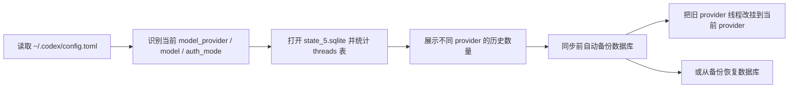

# Codex History Sync Tool


一个面向 Windows 的 Codex Desktop 本地历史修复工具。

当你切换 `API Key / provider / 登录方式 / model_provider` 之后，Codex Desktop 有时会出现一种很常见但很烦的问题: 本地对话历史实际上还在 `~/.codex` 里，但左侧历史列表却突然空了。这个项目就是为了解决这个问题而写的。

它会读取当前 Codex 配置，分析本机历史数据库里的 `threads` 分布，然后把旧 `provider` 下的线程统一同步到当前正在使用的 `provider`，同时自动备份，避免误操作。

## 这个项目解决什么问题

- 切换登录方式后，旧历史看不见
- 更换 `model_provider` 后，侧边栏对话列表丢失
- 本地数据库仍在，但 UI 不再显示旧线程
- 想在同步前先看清当前历史分布，再决定是否执行修复

## 效果预览

### Windows 图形界面


### 工作流程



## 核心能力

- 自动识别当前 Codex 配置中的 `model_provider`
- 统计本机历史线程属于哪些 provider
- 一键同步旧 provider 的线程到当前 provider
- 在同步前自动创建 SQLite 备份
- 支持从最新备份或指定备份恢复
- 同时提供 GUI 和 CLI 两种使用方式

## 适用场景

- 你切换了不同 API Key
- 你切换了不同 provider
- 你把登录方式从账号模式改成 API 模式，或反过来
- 你确认 `~/.codex` 目录和本地数据库都还在
- 你只是“历史不显示”，而不是“历史已经被删”

## 不适用的场景

- 不同电脑之间迁移聊天记录
- 云端账号之间互相同步对话
- 本地 `state_5.sqlite` 已经被删除或损坏
- 你希望把多台机器的历史合并成一个仓库

## 技术实现概览

| 模块 | 作用 |
| --- | --- |
| `sync_backend.py` | 读取配置、分析 SQLite、执行同步、备份与恢复 |
| `launch_ui.ps1` | 提供 Windows WinForms 图形界面 |
| `assets/` | 图标与界面配套素材 |

后端逻辑会优先从 `config.toml` 中读取 `model_provider`，必要时再结合 `auth.json` 与最近线程进行推断；数据库操作则通过 Python 的 SQLite 接口完成，并使用 SQLite 原生 `backup` 流程生成安全备份。

## 运行环境

- Windows 10 / 11
- PowerShell 5.1 或更高版本
- 已安装 Python，且可以通过 `py -3` 调用
- 本机存在 Codex Desktop 本地数据目录，通常为 `%USERPROFILE%\\.codex`

## 快速开始

### 方式一: 直接打开图形界面

```powershell
powershell -NoProfile -ExecutionPolicy Bypass -File .\launch_ui.ps1
```

适合第一次使用，界面会集中展示:

- 当前 provider
- 当前 model
- 可移动线程数量
- provider 分布
- 备份列表

### 方式二: 创建桌面快捷方式

```powershell
powershell -NoProfile -ExecutionPolicy Bypass -File .\launch_ui.ps1 -InstallShortcutOnly
```

执行后会在桌面创建 `Codex 对话同步工具.lnk`，以后双击即可使用。

### 方式三: 命令行模式

#### 查看当前状态

```powershell
py -3 .\sync_backend.py --json status
```

#### 执行同步

```powershell
py -3 .\sync_backend.py --json sync
```

#### 手动创建备份

```powershell
py -3 .\sync_backend.py --json backup
```

#### 从最新备份恢复

```powershell
py -3 .\sync_backend.py --json restore
```

#### 从指定备份恢复

```powershell
py -3 .\sync_backend.py --json restore --backup "C:\Users\YourName\.codex\history_sync_backups\state_5.sqlite.pre-sync.20260427-120000.bak"
```

## 典型使用步骤

1. 先关闭 Codex Desktop。
2. 运行 `status` 或打开图形界面，确认当前 provider 与历史分布。
3. 如果确认只是 provider 不一致，执行 `sync`。
4. 重新打开 Codex Desktop 检查左侧历史是否恢复。
5. 如果结果不符合预期，可以使用 `restore` 回滚。

## 备份机制

- 每次执行同步前，都会自动创建一份 `pre-sync` 备份
- 每次执行恢复前，都会先创建一份 `pre-restore` 安全备份
- 手动执行 `backup` 时，会创建一份 `manual` 备份
- 默认备份目录: `%USERPROFILE%\\.codex\\history_sync_backups`

这意味着即使同步结果不理想，也可以较低成本地回滚。

## 目录结构

```text
codex-history-sync-tool/
├─ assets/                 图标与界面素材
├─ docs/assets/            README 展示图
├─ launch_ui.ps1           WinForms 图形界面
├─ sync_backend.py         SQLite 同步、备份、恢复逻辑
└─ README.md
```

## 注意事项

- 这个工具直接修改的是本机 Codex 本地状态数据库，不是演示性质脚本
- 建议在 Codex Desktop 关闭状态下执行同步或恢复
- 如果同步完成后左侧历史没有立刻刷新，重开一次 Codex Desktop 通常即可
- 工具不会帮你跨设备同步历史，它只处理当前电脑上的本地数据库

## 免责声明

本项目已经尽量把风险降到较低水平，并内置自动备份，但它本质上仍然是在修改本地 SQLite 数据。使用前请确认你理解它会改动什么，并根据需要自行保留额外备份。
