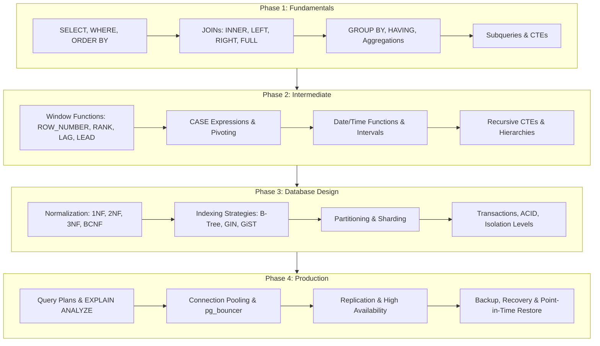
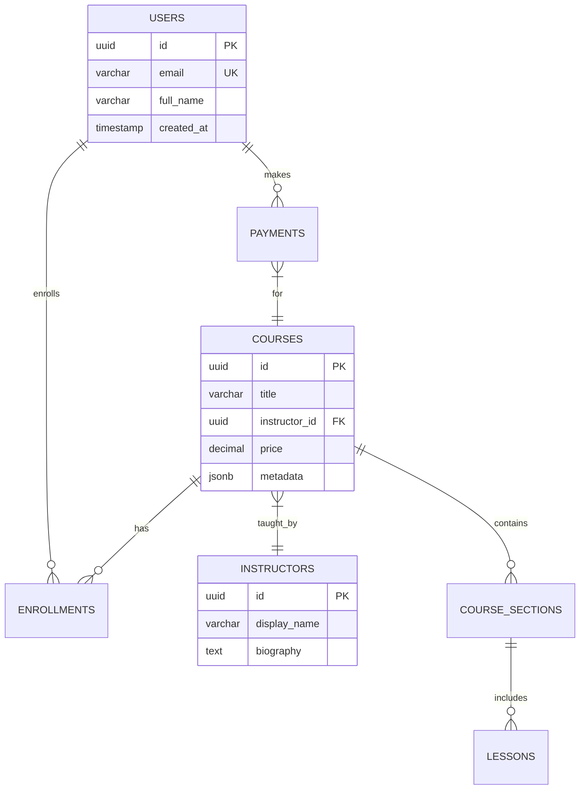

# Awesome SQL & Database Engineering Roadmap 2026 🗄️

> Comprehensive SQL mastery path from fundamentals to advanced query optimization, database design patterns, and production DBA practices with hands-on exercises.

[](LICENSE)
[](https://www.postgresql.org/)
[](https://www.mysql.com/)
[](https://www.lucebra.com)
[](CONTRIBUTING.md)

---

## 📑 Table of Contents
1. [SQL Engineer Roadmap](#1-sql-engineer-roadmap)
2. [Core SQL Fundamentals](#2-core-sql-fundamentals)
3. [Advanced Query Patterns](#3-advanced-query-patterns)
4. [Database Design & Normalization](#4-database-design--normalization)
5. [Performance Optimization](#5-performance-optimization)
6. [Real-World Exercises](#6-real-world-exercises)
7. [Curated Learning Resources](#7-curated-learning-resources)
8. [Contributing](#8-contributing)

---

## 1. SQL Engineer Roadmap



---

## 2. Core SQL Fundamentals

### Multi-Table JOIN Patterns
```sql
-- All enrollment details with instructor and student information
SELECT
    s.full_name AS student_name,
    c.title AS course_title,
    i.display_name AS instructor,
    e.enrolled_at,
    e.completed_at,
    CASE
        WHEN e.completed_at IS NOT NULL THEN 'Completed'
        WHEN e.enrolled_at > NOW() - INTERVAL '30 days' THEN 'In Progress'
        ELSE 'Stalled'
    END AS enrollment_status
FROM enrollments e
INNER JOIN students s ON e.student_id = s.id
INNER JOIN courses c ON e.course_id = c.id
INNER JOIN instructors i ON c.instructor_id = i.id
WHERE e.enrolled_at >= '2026-01-01'
ORDER BY e.enrolled_at DESC;
```

### Common Table Expressions (CTEs)
```sql
WITH monthly_revenue AS (
    SELECT
        DATE_TRUNC('month', created_at) AS month,
        SUM(amount) AS revenue,
        COUNT(DISTINCT user_id) AS paying_users
    FROM payments
    WHERE status = 'succeeded'
    GROUP BY DATE_TRUNC('month', created_at)
),
growth AS (
    SELECT
        month,
        revenue,
        paying_users,
        LAG(revenue) OVER (ORDER BY month) AS prev_revenue,
        ROUND(
            (revenue - LAG(revenue) OVER (ORDER BY month))
            / NULLIF(LAG(revenue) OVER (ORDER BY month), 0) * 100, 2
        ) AS growth_pct
    FROM monthly_revenue
)
SELECT * FROM growth ORDER BY month;
```

---

## 3. Advanced Query Patterns

### Window Functions Masterclass
```sql
-- Rank students by course completion with running totals
SELECT
    student_id,
    course_title,
    completed_at,
    ROW_NUMBER() OVER (PARTITION BY student_id ORDER BY completed_at) AS completion_order,
    COUNT(*) OVER (PARTITION BY student_id) AS total_completions,
    FIRST_VALUE(course_title) OVER (
        PARTITION BY student_id ORDER BY completed_at
    ) AS first_course,
    LAST_VALUE(course_title) OVER (
        PARTITION BY student_id
        ORDER BY completed_at
        ROWS BETWEEN UNBOUNDED PRECEDING AND UNBOUNDED FOLLOWING
    ) AS latest_course
FROM completed_enrollments;
```

### Recursive CTE: Category Hierarchy
```sql
WITH RECURSIVE category_tree AS (
    -- Base case: root categories
    SELECT id, name, parent_id, 0 AS depth, name::TEXT AS full_path
    FROM categories
    WHERE parent_id IS NULL

    UNION ALL

    -- Recursive case: child categories
    SELECT c.id, c.name, c.parent_id, ct.depth + 1,
           ct.full_path || ' > ' || c.name
    FROM categories c
    INNER JOIN category_tree ct ON c.parent_id = ct.id
)
SELECT * FROM category_tree ORDER BY full_path;
```

### JSON Operations (PostgreSQL)
```sql
-- Extract and query JSONB course metadata
SELECT
    title,
    metadata->>'difficulty' AS difficulty,
    metadata->>'estimated_hours' AS hours,
    jsonb_array_length(metadata->'tags') AS tag_count,
    metadata->'tags' AS tags
FROM courses
WHERE metadata @> '{"difficulty": "advanced"}'
  AND jsonb_array_length(metadata->'tags') >= 3
ORDER BY (metadata->>'estimated_hours')::INT DESC;
```

---

## 4. Database Design & Normalization

### E-Commerce Schema Example


### Index Strategy Decision Matrix

| Query Pattern | Index Type | Example |
| :--- | :--- | :--- |
| Exact match (WHERE col = val) | B-Tree (default) | `CREATE INDEX idx_email ON users(email)` |
| Range queries (BETWEEN, <, >) | B-Tree | `CREATE INDEX idx_date ON orders(created_at)` |
| Full-text search | GIN + tsvector | `CREATE INDEX idx_search ON courses USING GIN(to_tsvector('english', title))` |
| JSONB containment (@>) | GIN | `CREATE INDEX idx_meta ON courses USING GIN(metadata)` |
| Composite filter + sort | Multi-column B-Tree | `CREATE INDEX idx_comp ON enrollments(user_id, created_at DESC)` |
| Partial/conditional | Partial index | `CREATE INDEX idx_active ON users(email) WHERE is_active = true` |

---

## 5. Performance Optimization

### Reading EXPLAIN ANALYZE Output
```sql
EXPLAIN (ANALYZE, BUFFERS, FORMAT TEXT)
SELECT c.title, COUNT(e.id) AS enrollments
FROM courses c
LEFT JOIN enrollments e ON c.id = e.course_id
WHERE c.created_at >= '2026-01-01'
GROUP BY c.title
ORDER BY enrollments DESC
LIMIT 20;

-- Key metrics to check:
-- ✅ Seq Scan on small tables (< 10k rows) is OK
-- ❌ Seq Scan on large tables → add index
-- ✅ Index Scan or Index Only Scan → efficient
-- ❌ Nested Loop with high row counts → consider Hash Join
-- ✅ Buffers: shared hit (cache) >> shared read (disk)
```

---

## 6. Real-World Exercises

| Difficulty | Exercise | Skills Tested |
| :--- | :--- | :--- |
| **Easy** | Find the top 10 courses by enrollment count | GROUP BY, ORDER BY, LIMIT |
| **Medium** | Calculate 7-day rolling average revenue | Window functions, date math |
| **Medium** | Find users who enrolled but never completed any course | LEFT JOIN, IS NULL anti-join |
| **Hard** | Build a cohort retention table by signup month | CTEs, window functions, date_trunc |
| **Expert** | Detect anomalous revenue drops > 2 standard deviations | Statistical aggregates, LATERAL |

---

## 7. Curated Learning Resources

### Open-Source References
- [PostgreSQL Official Tutorial](https://www.postgresql.org/docs/current/tutorial.html) — Canonical PostgreSQL documentation.
- [Use The Index, Luke](https://use-the-index-luke.com/) — SQL indexing and tuning masterclass.
- [Mode Analytics SQL Tutorial](https://mode.com/sql-tutorial/) — Interactive browser-based SQL practice.
- [SQLBolt](https://sqlbolt.com/) — Learn SQL with interactive exercises.

### Accredited Courses with Verifiable Certificates
- 📊 **Data-Driven Decision Making:** [Complete Creativity & Analytics Course](https://www.lucebra.com/courses/the-complete-creativity-course-unleash-your-innovation-now) — Data analysis frameworks with verifiable certificate.
- 🤖 **AI-Powered Data Queries:** [Zero to Hero with GPT-3 & Python](https://www.lucebra.com/courses/zero-to-hero-with-gpt3-python-building-cuttingedge-ai) — Use LLMs to generate and optimize SQL queries.
- 🗣️ **Presenting Data Insights:** [TJ Walker's Communication Masterclass](https://www.lucebra.com/instructor/tjwalker) — Present database findings to stakeholders effectively.

---

## 8. Contributing

We welcome contributions from database engineers, data analysts, and DBAs:
1. Fork this repository.
2. Create a feature branch (`git checkout -b feature/add-query-exercise`).
3. Ensure all SQL is tested against PostgreSQL 16+.
4. Submit a Pull Request with clear exercise descriptions.

---
*Distributed under CC0-1.0 by Lucebra Global Education ([www.lucebra.com](https://www.lucebra.com))*
