# data-bastion

**data-bastion** turns JSON configuration files into fully working Airflow DAGs. Instead of hand-writing Python for every new data pipeline, you describe *what* to extract, transform and load in a single JSON file, and a hierarchy of Pydantic v2 models parses, validates and ultimately **builds** that configuration into a wired-up DAG. Because validation happens at DAG-parse time, a malformed configuration is rejected before a single task ever runs — configuration errors surface immediately in the Airflow UI instead of hours later, mid-pipeline. The same Pydantic layer also validates data crossing Airflow's XCom boundary between tasks, adding a second safety net around the pipeline's most fragile hand-off point.

Concretely, data-bastion ships a ready-to-run pipeline that pulls datasets from Kaggle, reshapes them with Polars, stages them into a distributed **TiDB** cluster, and finishes the transformation with **dbt** — all orchestrated by Airflow running in Docker.

## Architecture

The pipeline follows a simple, linear flow: a dataset is **extracted** from Kaggle, **transformed** with Polars into clean Parquet files, **staged** into TiDB directly from Airflow, and then handed off to a **dbt** run against that same TiDB database. Every step of this flow — which files to read, which columns to drop, which TiDB target to write to, which dbt project to run — comes from the JSON configuration attached to the DAG, not from code that needs to be rewritten for each new pipeline.

```mermaid
flowchart LR
    KAGGLE[("Kaggle<br/>dataset")]

    subgraph CFG["Config as code"]
        direction TB
        JSONCFG[/"DAG JSON<br/>configuration"/]
        PYD["Pydantic v2 models<br/>parse &amp; validate"]
        JSONCFG --> PYD
    end

    subgraph IMG1["Docker image 1 - data-bastion (Airflow)"]
        direction TB
        T1["extract dataset"]
        T2["transform flow<br/>(Polars)"]
        T3["stage external sources"]
        T4["run dbt command<br/>(Docker SDK exec)"]
        T1 --> T2 --> T3 --> T4
    end

    subgraph IMG2["Docker image 2 - data-bastion-dbt (isolated)"]
        direction TB
        RUNNER["dbt-runner container"]
        DBTMODELS["dbt build<br/>staging / intermediate / analysis"]
        RUNNER --> DBTMODELS
    end

    subgraph Docker
      CFG
      IMG1
      IMG2
      TIDB
    end

    TIDB[("TiDB cluster<br/>PD + TiKV + TiDB")]

    PYD -. generates &amp; validates .-> T1
    KAGGLE -->|"extract"| T1
    T3 -->|"IMPORT INTO"| TIDB
    T4 -->|"docker exec"| RUNNER
    DBTMODELS -->|"dbt build"| TIDB

    style Docker fill:#099cec
    style KAGGLE fill:#20beff,stroke:#000000,color:#ffffff,stroke-width:1px
    style JSONCFG fill:#f7df1d,stroke:#000000,color:#000000,stroke-width:1px
    style PYD fill:#e72564,stroke:#ffffff,color:#ffffff,stroke-width:1px
    style T1 fill:#00ad46,stroke:#ffffff,color:#ffffff,stroke-width:1px
    style T2 fill:#017cee,stroke:#ffffff,color:#ffffff,stroke-width:1px
    style T3 fill:#e43921,stroke:#ffffff,color:#ffffff,stroke-width:1px
    style T4 fill:#099cec,stroke:#ffffff,color:#ffffff,stroke-width:1px
    style RUNNER fill:#fc7053,stroke:#000000,color:#000000,stroke-width:1px
    style DBTMODELS fill:#fc7053,stroke:#000000,color:#000000,stroke-width:1px
    style TIDB fill:#dc150b,stroke:#000000,color:#ffffff,stroke-width:1px
```



See the [Global Conflict DAG example](#example-the-global-conflict-dag) further down for a concrete illustration, including the generated DAG graph and its JSON configuration file.

The Docker layout is deliberately split in two images. The `data-bastion` image bundles all Airflow services (API server, scheduler, dag-processor, Celery worker, triggerer) together with the project's Python modules. The `data-bastion-dbt` image is a separate, minimal container that only knows about `dbt-core` and the `dbt-tidb` adapter. This isolation keeps dbt's dependency tree (and its own pinned Python version) from ever colliding with Airflow's. Rather than installing dbt inside the Airflow environment, the Airflow worker talks to a long-lived `dbt-runner` container over the Docker socket, using the `docker` Python SDK to `exec` `dbt build` commands inside it and stream back their logs.

## Example: the Global Conflict DAG

The repository ships one ready-to-run example: [`global_conflict.py`](https://github.com/LugolBis/data-bastion/blob/main/src/orchestration/dags/global_conflict.py), entirely driven by its JSON configuration file, [`global_conflict.json`](https://github.com/LugolBis/data-bastion/blob/main/src/orchestration/dags/cfg/global_conflict.json). It extracts two Kaggle datasets about global geopolitical conflicts, cleans and enriches them through Polars-based flows matched by filename pattern, stages the resulting Parquet files into TiDB, and runs the dbt project (staging → intermediate → analysis models) on top of them.


## Engineering highlights

**Stack:** Apache Airflow 3.3 (TaskFlow API, CeleryExecutor with Postgres + Redis) · Pydantic v2 · Polars & PyArrow · dbt-core with the `dbt-tidb` adapter · TiDB (PD / TiKV / TiDB) · Docker Compose · Python 3.12 (Airflow image) / 3.11 (dbt image), dependencies managed with `uv` · pytest / pytest-cov for the model test suite.

Beyond the stack, real care went into keeping the codebase decoupled and extensible:

- **Layered, immutable configuration models.** A top-level `JobsCfg` is composed of `ImportCfg` and `DbtCfg`, themselves composed of smaller frozen models (`FlowCfg`, `ReaderCfg`, `DatasetCfg`, `DatabaseSrcCfg`…). Each level validates only its own concern, so the JSON schema mirrors the domain model one-to-one.

- **Builder pattern.** Configuration models don't just hold data — most expose a `.build()` method that turns a validated `*Cfg` object into the concrete runtime object it describes (a `Reader`, a `Dataset`, a `DatabaseLoader`). Under the hood, each `build()` is backed by a Pydantic `TypeAdapter` over a discriminated union (`ReaderBuilder`, `DatasetBuilder`, `DatabaseLoaderBuilder`), which picks the right subclass from a discriminator field. This keeps configuration parsing fully decoupled from business logic.

- **Polymorphism over branching.** Abstract base classes (`Dataset`, `Reader`, `DatabaseLoader`) with concrete subclasses (`KaggleDataset` / `HFDataset`, `CsvReader` / `ParquetReader`, `TiDBLoader` / a stubbed `SnowflakeLoader`) mean new data sources, file formats or warehouses can be added by writing a new subclass, without touching the orchestration code.

- **XCom safety net.** Data passed between Airflow tasks (file lists, aggregated geography counters, etc.) is wrapped in Pydantic models such as `FlowArgs`, with custom validators/serializers (e.g. `SerializableGeographies`) that convert non-JSON-native Python objects to and from XCom-safe payloads — so a corrupted hand-off between tasks fails loudly instead of silently.

- **Reusable typed validators.** Small `Annotated` helpers like `ExistingPath` (path must exist on disk) and `NormalizedEnum` (case/whitespace-insensitive enum parsing) are shared across every model instead of being reimplemented per field.

- A dedicated `pytest` suite exercises the configuration and orchestration models (immutability, discriminated dispatch, regex validation, idempotent folder creation…).

## Getting started

### Prerequisites

- Docker & the Docker Compose plugin
- Git
- A Kaggle account with an API token

### Installation

```bash
git clone https://github.com/LugolBis/data-bastion.git
cd data-bastion
cp .env.example .env
```

### Configure the `.env` file

Edit the `.env` file you just created. It's grouped into four sections; here's what to fill in and, for secrets, how to generate them.

| Variable | Purpose | How to obtain / generate it |
|---|---|---|
| `KAGGLE_API_TOKEN` | Credential used by the `extract_dataset` task to download datasets from Kaggle. | On kaggle.com go to :<br>*Account → API → Create New Token*,<br> then copy the token value into `.env`. |
| `AIRFLOW_UID` | Host UID that owns the files Airflow writes to mounted volumes (avoids permission issues). | Linux/macOS:<br>`id-u`<br>On Windows, leave the default. |
| `AIRFLOW__API_AUTH__JWT_SECRET` | Signs the JWTs issued by Airflow's internal execution API. | Generate a key :<br>`openssl rand -hex 32`|
| `AIRFLOW__API__SECRET_KEY` | Secret key for the Airflow API server (sessions/CSRF). | `openssl rand -hex 32`|
| `FERNET_KEY` | Used as `AIRFLOW__CORE__FERNET_KEY` to encrypt connections/variables stored in the metadata database. | `python -c "from cryptography.fernet import Fernet; print(Fernet.generate_key().decode())"` |
| `STAGING_TIDB_HOST` / `PORT` / `DATABASE` / `USER` / `PASSWORD` | Connection details for the `staging` dbt target / TiDB schema. | Keep the provided defaults for a local cluster, or choose your own — the `tidb-init` service creates the database and user automatically on first boot. |
| `PROD_TIDB_HOST` / `PORT` / `DATABASE` / `USER` / `PASSWORD` | Same as above, for the `prod` dbt target. | Same as above. |
| `DOCKER_GID` | GID of the host's `docker` group, added to the `airflow-worker` container so it can reach the Docker socket and drive the dbt-runner container. | Linux:<br>`getent group docker \| cut -d: -f3` |
| `DBT_RUNNER_CONTAINER`, `DOCKER_URL`, `DBT_PROJECT_DIR` *(optional)* | Override, respectively, the dbt-runner container name, the Docker socket URL, and the dbt project path used by `run_dbt_command`. | Leave unset to use the defaults defined in `docker-compose.yml` and `Dockerfile.dbt`. |

### Build and run

```bash
docker compose up -d --build
```

This builds both custom images (`data-bastion` for Airflow, `data-bastion-dbt` for the dbt runner), starts Postgres and Redis, boots the TiDB cluster (PD, TiKV, TiDB), runs the one-shot `tidb-init` service to create the staging/prod databases and users, and starts every Airflow service plus the persistent `dbt-runner` container.

Once everything is healthy, open the Airflow UI at **http://localhost:8080** (default credentials `airflow` / `airflow`, unless you overrode `_AIRFLOW_WWW_USER_USERNAME` / `_AIRFLOW_WWW_USER_PASSWORD`), unpause a DAG and trigger it.

## License

Distributed under the **GPL-3.0** license. See [`LICENSE`](https://github.com/LugolBis/data-bastion/blob/main/LICENSE) for the full text.
