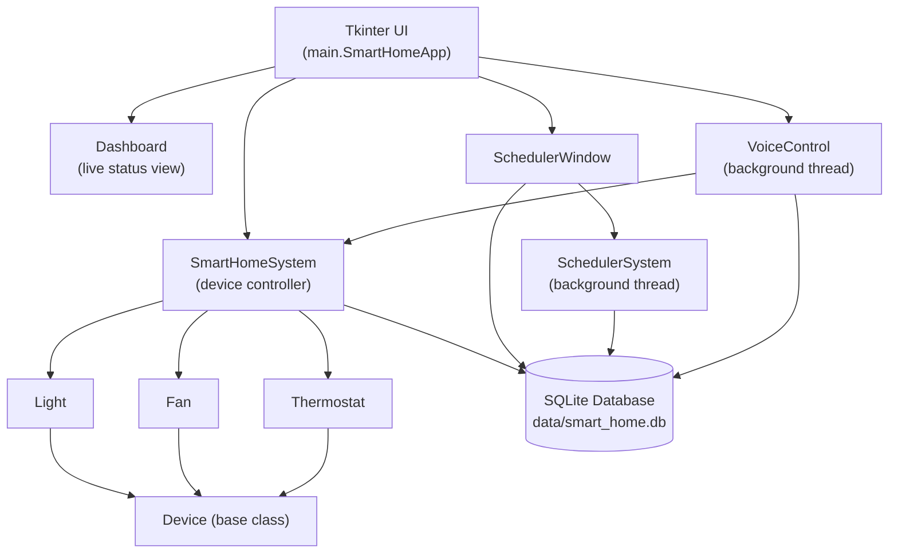
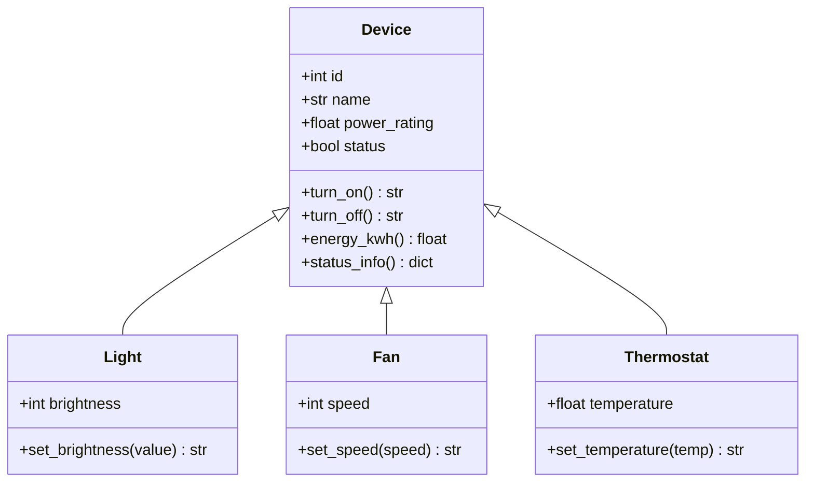

# 🏠 Smart Home Automation System

A desktop **Smart Home Automation System** built with Python and Tkinter. It models real household devices (a light, a fan, and a thermostat) as Python objects, persists their state in a local SQLite database, supports timed automation through a background scheduler, and can optionally be controlled by voice. It was originally built as a coursework project and has since been reorganized and hardened into a clean, documented, testable codebase suitable for a software engineering portfolio.


---

## ✨ Features

- **Object-oriented device model** — a shared `Device` base class handles ON/OFF state and energy tracking; `Light`, `Fan`, and `Thermostat` each extend it with their own setting (brightness, speed, temperature).
- **Persistent SQLite database** — device state, schedules, and an activity log are stored locally and restored automatically on the next launch.
- **Live dashboard** — a status panel that refreshes every second, showing each device's ON/OFF state, energy usage (kWh), and current setting.
- **Scheduling / automation** — schedule a device to turn ON or OFF after a delay, or at a specific future date and time, including simple daily (×14) or weekly (×12) repeats. Pending schedules survive an app restart.
- **Voice control (optional)** — listens on the default microphone and maps simple spoken phrases ("turn on the light", "set temperature to 22") to device actions. Degrades gracefully if no microphone or the speech-recognition dependency isn't available.
- **Custom "baby pink" theme** — a consistent, centrally-defined color palette applied across the main window, dashboard, and scheduler.
- **Energy usage estimation** — each device accumulates simulated energy consumption (in kWh) based on how long it has been ON and its rated power draw.

## 🖥️ Interface

The application window is split into two panels:

- **Left panel** — the device list, ON/OFF buttons, a context-sensitive control (brightness/speed/temperature slider) for the selected device, quick "schedule in N seconds" controls, a voice control button, and a button to open the full scheduler window.
- **Right panel** — the live dashboard, listing every device's status, energy usage, and setting, refreshed automatically.

A separate **Scheduler** window (opened from the main window) lets you pick a device, an action, a date/time, and an optional repeat pattern, and shows a list of all upcoming schedules with the ability to delete them.

### 📸 Screenshots

> Screenshots were not available in the environment used to prepare this
> repository (no display/GUI access). Run the application locally and
> add screenshots here:

| View | File |
|---|---|
| Main window & dashboard | `assets/screenshots/dashboard.png` |
| Scheduler window | `assets/screenshots/scheduler.png` |

## 🏗️ Architecture



See [`docs/architecture.md`](docs/architecture.md) for a full breakdown of every module, the class hierarchy, and the UI flow.

## 📁 Project Structure

```text
smart-home/
│
├── README.md
├── LICENSE
├── .gitignore
├── requirements.txt
├── requirements-dev.txt
├── pyproject.toml
├── CONTRIBUTING.md
├── CHANGELOG.md
├── SECURITY.md
│
├── src/
│   └── smart_home/
│       ├── __init__.py
│       ├── main.py                # Application entry point (Tkinter UI)
│       ├── dashboard.py           # Live status panel
│       ├── database.py            # SQLite persistence layer
│       ├── device.py              # Base Device class
│       ├── light.py               # Light device
│       ├── fan.py                 # Fan device
│       ├── thermostat.py          # Thermostat device
│       ├── smart_home_system.py   # Device controller / persistence glue
│       ├── scheduler_system.py    # Background job scheduler
│       ├── scheduler_ui.py        # Scheduler window
│       ├── voice_control.py       # Optional voice command handling
│       └── theme.py               # Shared color palette
│
├── assets/
│   ├── icons/                     # Optional device icons (light.png, fan.png, thermostat.png)
│   └── screenshots/                # App screenshots for documentation
│
├── data/                          # SQLite database is created here at runtime (not committed)
│
├── tests/                         # pytest unit tests for device/database/system logic
│
└── docs/
    ├── architecture.md
    ├── setup.md
    └── usage.md
```

## ⚙️ Technologies Used

- **Python 3** — core language
- **Tkinter** — desktop GUI toolkit (standard library)
- **SQLite** (`sqlite3`, standard library) — embedded local database
- **Pillow (PIL)** — icon loading/resizing
- **SpeechRecognition** + **PyAudio** — optional voice command input
- **Object-Oriented Programming** — device class hierarchy (`Device` → `Light`/`Fan`/`Thermostat`)
- **Threading** — background scheduler and voice-listener loops
- **pytest** — automated testing of non-GUI logic

## 🚀 Installation

```bash
git clone <YOUR_GITHUB_REPOSITORY_URL>
cd smart-home

python -m venv .venv
```

**Windows:**
```bash
.venv\Scripts\activate
```

**macOS / Linux:**
```bash
source .venv/bin/activate
```

Then install dependencies:

```bash
pip install -r requirements.txt
```

Run the app:

```bash
python -m smart_home.main
```

Full step-by-step instructions, including platform-specific notes for `PyAudio`/`tkinter`, are in [`docs/setup.md`](docs/setup.md).

## 🎮 Usage

1. Launch the app and select a device from the list.
2. Use **Turn ON** / **Turn OFF**, or drag the brightness/speed/temperature slider that appears for the selected device.
3. Watch the dashboard on the right update in real time.
4. Schedule a quick action ("in N seconds"), or click **📅 Open Scheduler** for date/time-based and repeating schedules.
5. Click **🎤 Voice Control** to enable spoken commands.

See [`docs/usage.md`](docs/usage.md) for the full walkthrough.

## 🗄️ Database

A local SQLite database (`data/smart_home.db`) is created automatically on first run, with three tables:

| Table | Purpose |
|---|---|
| `devices` | Current name, type, ON/OFF status, setting value, and power rating for each device. |
| `schedules` | Pending future device actions (device, action, ISO run time). |
| `logs` | A timestamped activity log of status changes, executed schedules, and voice commands. |

The database path is resolved relative to the project root (not the current working directory), so the app works the same regardless of where it's launched from, and the runtime database file itself is not committed to version control.

## 🧩 Architecture / OOP Design



- **`Device`** — base class shared by every appliance: id assignment, ON/OFF toggling, and energy accumulation (watt-seconds converted to kWh) based on elapsed ON time.
- **`Light` / `Fan` / `Thermostat`** — each adds exactly one device-specific attribute (`brightness`, `speed`, `temperature`) and its setter, clamped to a sensible range.
- **`SmartHomeSystem`** — creates the three devices, restores their saved state from the database on startup, and exposes `save_device_state()` / `get_device_by_name()`.
- **`SchedulerSystem`** — a generic background-thread job runner (wraps the standard-library `sched` module); it doesn't know about devices, only about running a callable at a future time.
- **`VoiceControl`** — a background thread that transcribes speech and maps recognized phrases to the same `turn_on()` / `turn_off()` / `set_temperature()` methods used by the UI.

## 🔮 Future Improvements

The following are realistic possibilities for future versions — **none of these exist in the current codebase today**:

- Support for multiple instances of the same device type (e.g. several lights)
- Real IoT hardware integration (e.g. via GPIO or a smart-plug API)
- MQTT support for communicating with real smart-home hardware/brokers
- A companion mobile application
- Cloud synchronization / multi-device access
- User authentication and multi-user support
- Real sensor integration (temperature, motion, occupancy)
- Detailed energy monitoring and historical usage charts
- AI-assisted automation (e.g. usage-pattern-based suggestions)

## 👩‍💻 Author

**Farzana Mostafa**

## 📄 License

This project is licensed under the [MIT License](LICENSE) — you are free to use, modify, and distribute it, provided the original copyright notice is retained.

