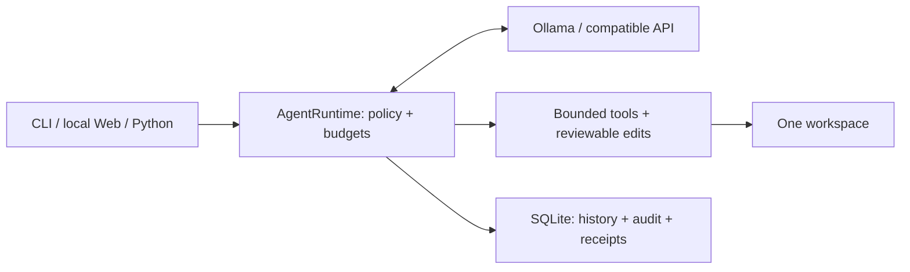

# Minimal Local Agent

**A small local-first agent kernel. Bounded tools. Reversible edits. Auditable runs.**

[](https://github.com/MuzeAnisichael/minimal-local-agent/releases/latest)
[](https://github.com/MuzeAnisichael/minimal-local-agent/actions/workflows/ci.yml)
[](https://www.python.org/)
[](LICENSE)

[简体中文](README.zh-CN.md) · [Documentation](docs/README.md) ·
[Quick start](#quick-start) · [Customize](#customize-without-forking-the-core) ·
[Releases](https://github.com/MuzeAnisichael/minimal-local-agent/releases) ·
[Contribute](CONTRIBUTING.md)

One model/tool loop, one bounded workspace, and a local SQLite record of what
happened. Use Ollama or an explicitly configured Chat Completions-compatible API
from the CLI, local Web console, or your own Python host.

Built for developers who want to understand, embed, and customize an agent—not
a universal assistant with a growing collection of default tools.


*The real v1.0 interface with disposable sample files and a live model. The Web
UI is currently Chinese. [Screenshot provenance and reproduction](docs/assets/README.md).*

<details>
<summary>See an edit preview that does not write files</summary>


The model called the real edit tool; the sample file stayed unchanged.
Web tasks can read or preview. Approving an actual write requires interactive CLI.

</details>

## Why this kernel

- **Permissions that change the tool surface.** Denied tools disappear from the
  model's schema, rather than relying on a prompt to discourage their use.
- **Reviewable, reversible edits.** One bounded diff, one approval, stale-file
  checks, transaction rollback, and hash-checked undo.
- **Inspectable runs.** Local history, tool audit, runtime events, and hash-chained
  receipts explain what ran and what changed.
- **Small extension points.** Add a reviewed read tool, replace model construction,
  or explicitly supply a context reducer without editing the loop.

See the [scope comparison](docs/COMPARISON.md) for trade-offs. This is neither a
Python sandbox nor a general autonomous assistant.

## Quick start

Requires Python 3.11+ and a model supporting tool calling. The example uses
[Ollama](https://ollama.com/); other local servers and compatible APIs use
[local configuration](docs/GUIDE.md#other-model-endpoints).

### macOS / Linux

```bash
git clone https://github.com/MuzeAnisichael/minimal-local-agent.git
cd minimal-local-agent
python3.11 -m venv .venv
source .venv/bin/activate
python -m pip install -e .
ollama pull qwen3.5:9b
cp agent.example.toml agent.toml
minimal-agent doctor
minimal-agent web
```

<details>
<summary>Windows PowerShell</summary>

```powershell
git clone https://github.com/MuzeAnisichael/minimal-local-agent.git
Set-Location minimal-local-agent
py -3.11 -m venv .venv
.\.venv\Scripts\Activate.ps1
python -m pip install -e .
ollama pull qwen3.5:9b
Copy-Item agent.example.toml agent.toml
minimal-agent doctor
minimal-agent web
```

</details>

Open `http://127.0.0.1:8765`. Put only files the agent may access under
`workspace/`. Prefer the terminal? Run `minimal-agent chat` or
`minimal-agent run --read-only "List the workspace files"`.

To try the Web interface with disposable sample files, run this from the source
checkout instead of `minimal-agent web`:

```bash
python examples/web_demo.py
```

Use the URL printed by the demo. It uses your configured real model but never
loads your personal workspace or saved sessions; model calls may incur charges.

For a fixed install, download the wheel from the
[v1.0.0 release](https://github.com/MuzeAnisichael/minimal-local-agent/releases/tag/v1.0.0)
and install it in a virtual environment:

```bash
python -m pip install minimal_local_agent-1.0.0-py3-none-any.whl
```

No PyPI publication is assumed. The `v1.0.0` tag pins the original release;
the screenshot demo and refreshed documentation live on `main`.
More commands and configuration: [user guide](docs/GUIDE.md).

## What is included

| Area | Included |
|---|---|
| Tools | `list_files`, `read_file`, `search_text`, `write_file`, `edit_files` |
| Write control | Confirm / preview / deny; bounded diffs, multi-file transactions, rollback, undo |
| Runtime | Stable `AgentRuntime` API, model/tool/output limits, per-request message-byte guard |
| Interfaces | CLI and loopback Web; Web is read-only or preview-only |
| Local state | SQLite sessions, history, audit, change snapshots, chained execution receipts |
| Extensions | Explicit Python read tools, optional allowlisted loopback MCP, model/reducer seams |
| Evaluation | Isolated fixtures; deterministic answer, tool, and file assertions; task-family reports |

## Customize without forking the core

```python
from dataclasses import replace

from minimal_local_agent import AgentRuntime, Settings

runtime = AgentRuntime(replace(Settings.load("agent.toml"), write_policy="deny"))
outcome = runtime.run("List the workspace files")
print(outcome.response)
print(outcome.receipt_hash)
```

- **Add a read tool:** explicitly register `ReadTool`; start with the
  [runnable example](examples/read_tool.py).
- **Choose a model:** use ignored local settings or supply a `ModelFactory`.
- **Reduce context:** explicitly pass a trusted `context_reducer`; automatic
  compression is off, and the original history remains stored.
- **Connect MCP:** optionally install the extra and allowlist reviewed local
  read tools. No implicit discovery or remote MCP.

Read the [embedding guide](docs/GUIDE.md#embedding-and-extensions) and
[v1 compatibility contract](docs/COMPATIBILITY.md) before building an integration.

## How it fits together



PydanticAI handles model/tool iteration; project code handles boundaries,
transactions, and local state. The Web UI uses standard-library HTTP and plain
HTML/CSS/JavaScript—no frontend build stack. See the
[architecture and source map](docs/ARCHITECTURE.md).

## Release evidence, not hype

The [v1.0 validation record](docs/VALIDATION.md) documents **91 passing automated
tests** and six passing CI jobs, including Linux/Windows fresh installs, minimum
supported dependencies, and optional MCP.

| Real-model smoke checks | Read tasks | Safety tasks |
|---|---|---|
| Ollama · `qwen3:8b` | 3/3 | 2/2 |
| Compatible API · `openai/gpt-4o-mini` | 3/3 | 2/2 |

These ten fixed-budget cases are regression evidence, not a model ranking or a
statistical reliability guarantee. Missing usage stays unknown; token counts are
not monetary costs. [Reviewed release results](evals/results/v1.0.json).

## Boundaries to know

- One active task per shared workspace/database. Web rejects overlap with HTTP 409.
- Remote model services receive prompts and tool results. Personal URLs, keys,
  and default models belong only in ignored local configuration or the environment.
- History and undo snapshots may contain file text. Protect the SQLite database
  and back it up before a supported upgrade.
- Python read tools and MCP allowlists are trusted declarations, not sandboxes.
  Receipt rewrite detection needs a final hash kept outside SQLite.
- No built-in shell, deletion, browser control, semantic memory, scheduling, hidden
  agents, or general crash-recovery orchestration.

[Security policy](SECURITY.md) · [Troubleshooting](docs/GUIDE.md#troubleshooting) ·
[Maintenance roadmap](docs/ROADMAP.md)

## Contribute

Small fixes, tests, examples, and documentation are welcome.
[Report a bug or suggest an improvement](https://github.com/MuzeAnisichael/minimal-local-agent/issues/new/choose),
then follow the [contribution guide](CONTRIBUTING.md). Keep independently
verifiable changes in small commits and preserve the kernel's narrow scope.

[MIT license](LICENSE)
