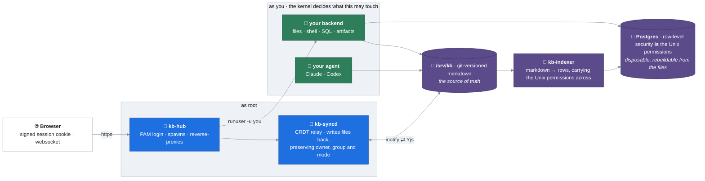

# Ollsoft Company OS

An AI-native company workspace where **the Linux kernel is the permission
system**. Documents and tasks live as plain markdown files on your own server,
and the internal tools your team builds live beside them as HTML artifacts.
Agents work in all of it as the person who asked, seeing exactly what that
person sees.

Your data is never in somebody else's cloud, and an agent reaches it the way a
colleague does rather than through an API.

Think Notion, but the permissions go all the way down to the file, the tools
are ones your team builds rather than buys, and agents work there beside you. It is an actual operating system, so it is also where the work
gets done, not only where it gets written down.


*The board on the left is stored in the markdown file on the right. Edit either;
both are the same task. A person, a dashboard and an AI agent all work on the
same file.*

**Free for up to three named users**, and free for any number of users for sixty
days while you evaluate it. Above that, production use in an organisation needs a
commercial licence: [info@ollsoft.ai](mailto:info@ollsoft.ai). The source is
public either way: read it, audit it, build it, run it for development or
testing. Every version becomes Apache 2.0 four years after its release.
Details in [LICENSE](LICENSE).

## Install it with your AI agent

An AI agent on your own computer does the whole thing over SSH: server,
hardening, domain, accounts, search, agents, monitoring and backups. It asks
one question at a time and checks every step. At the end it moves your existing
documents in from Notion, Obsidian, Confluence, Drive, SharePoint or git.

```bash
git clone https://github.com/Ollsoft-ai/ollsoft-company-os.git
cd ollsoft-company-os
claude        # then type: /install-company-os
```

- **Claude Code** picks the skill up from this repo
  (`.claude/skills/install-company-os/`).
- **Codex, Hermes Agent or any other agent:** start it in the cloned folder and
  say *"Read `.claude/skills/install-company-os/SKILL.md` and follow it."*
- You need `ssh` (built into macOS, Linux and Windows 10+), about an hour, a card
  for the server and, optionally, a domain.
- Interrupted? Run it again; it keeps a state file and resumes.

Prefer to run the commands yourself? See **[Install by hand](#install-by-hand)**.

## Design

**Four primitives. Everything else is what falls out of them.**

1. **Files.** Plain markdown in a git repo at `/srv/kb`. A document is a file, a
   project is a folder. Nothing is locked inside a database.
2. **The Linux kernel.** One OS user per human, and every web request served by a
   process running *as that user* (`runuser`), so the kernel, not application
   code, decides what each person may read and write.
3. **Postgres.** A *disposable* index of those files: drop it and rebuild it from
   the markdown whenever you like. Row-Level Security mirrors the same Unix
   permissions, so search and SQL can never return a file you could not `cat`.
4. **HTML artifacts.** A company's own small tools (a board, a CRM, an invoice
   generator) are single HTML files sitting in a folder. They run sandboxed, *as
   the person who opened them*, reaching files and SQL through a bridge bound by
   that person's permissions.

What those four give you without being asked twice:

- **The indexer** parses the markdown into rows and carries the Unix permissions
  across with it. A `- [ ] task @someone #tag` written anywhere becomes a to-do
  list, and every search is permission-scoped without a line of permission code.
- **Sharing is a Unix group.** Giving a folder an audience is giving it an owning
  group, which the file tree, the editor, search, SQL and the agents already
  obey, because they obey the kernel.
- **Multiplayer editing** is a CRDT over the same file; the daemon writes it back
  preserving owner, group and mode, so a shared edit cannot launder permissions.
- **Version history** is git, attributed to the OS user who made the edit.
- **Agents** run as the user too, so Claude or Codex see exactly what that person
  sees. No integration to grant, no second set of credentials to leak.

There is no permission table in this codebase. That is the whole point.

---

## What it looks like


*Two people, two browsers, one file. On the left somebody types into
`kanban.md`; on the right a colleague's board already carries the change. The
board is not synced with the file. **It is** the file.*


*The same document open by two people, each cursor named and coloured. Merging
is a CRDT over the file on disk, so `vim` over SSH is a third seat at the table.*


*A real shell in the browser, as your own Linux account, and `grep` finds the
same card the board was showing. Same files, same permissions, no API in
between.*


*Every open task from every document **you are allowed to read**, blocked work
first. Nobody maintains a second task list.*


*A CRM is an artifact in a folder. It runs as the person who opened it, so it
can only reach what they could.*


*…and so is an invoice generator, which writes its PDF back beside the contract
it came from.*

## Requirements

Ollsoft Company OS needs a **whole machine**: a VM or bare metal running **Ubuntu 24.04**.

It cannot run in an unprivileged container, and that is by design rather than an
oversight: it creates real Linux accounts, authenticates against PAM, spawns
processes as individual users, and relies on systemd and Postgres peer auth. A
container with fake users would run, but it would be a demo of the UI with the
security model removed, which is the part worth having.

Budget a small VM: 2 vCPU / 4 GB RAM / 20 GB disk is comfortable for a team.

---

## Install by hand

```bash
git clone https://github.com/<you>/ollsoft-company-os.git
cd ollsoft-company-os
sudo bash scripts/install.sh --admin <your-username>
```

That single command installs system packages, creates the `kb-users` group and
the `kbindexer` service account, builds the frontend, lays out `/srv/kb` with the
right modes and ACLs, creates the Postgres cluster objects and RLS schema, writes
`/etc/kb/kb.env`, and enables the four systemd services. It is idempotent: re-run
it to upgrade.

It creates exactly one account: yours. A generated password is written to
`/root/ollsoft-company-os-admin.txt` (delete it after your first login), or pass your own
with `--admin-pass`.

If `--admin` adopts an existing key-only cloud account, check it with
`passwd -S <your-username>`. A status of `L` or `NP` means PAM cannot use it for
the Company OS web login; set a separate login password with
`sudo passwd <your-username>`. This does not enable SSH password authentication.

Then open **http://127.0.0.1:8300**. It binds to localhost only. From your laptop:

```bash
ssh -L 8300:127.0.0.1:8300 you@your-box
```

See **[docs/remote-access.md](docs/remote-access.md)** before exposing it to a
network, because it needs a TLS front door and an identity layer. To work on the
knowledgebase from Explorer, opening and saving Office files as if it were a
network share, see **[docs/windows-drive.md](docs/windows-drive.md)**.
To work with the knowledgebase through Claude Code or Codex, see
**[docs/agent-cli.md](docs/agent-cli.md)**.

### Options

| Flag | Default | Meaning |
|---|---|---|
| `--admin <user>` | *required* | Admin account to create, or adopt if it exists |
| `--admin-pass <pw>` | generated | Password for a newly created admin |
| `--repo <path>` | `/srv/kb` | Where the knowledgebase lives |
| `--prefix <path>` | `/opt/kb-platform` | Where code is deployed |
| `--port <n>` | `8300` | Hub port on 127.0.0.1 |
| `--admin-group <g>` | `sudo` | OS group granting platform-admin rights |
| `--no-packages` |  | Skip `apt-get` (dependencies already present) |
| `--no-start` |  | Install without enabling the services |

### Try the permission model

```bash
sudo bash scripts/seed-demo.sh
```

Creates `alice`, `bob` and `carol`, plus a `projects/acme/` folder restricted to
the `proj-acme` group. Alice and Bob are members; Carol is not. Log in as Carol:
the folder is absent from her file tree, absent from search, and
`SELECT * FROM kb.blocks` returns none of its rows either, because the RLS policy
re-checks the same Unix permission for every row. Undo with `--undo`.

---

## What it does

- **Multiplayer markdown editing** on the files themselves: browser, `vim` and
  agents all merge through one CRDT, because the `.md` file *is* a CRDT peer.
- **Live presence & cursors**: see who has a doc open and each collaborator's
  named cursor moving in real time, in both rich and source views.
- **Rich or source editing**: a rendered-but-editable view (headings, bold, links,
  interactive checkboxes, images) over the same markdown, with a formatting
  toolbar and drag-drop / screenshot-paste that stores files and renders them
  inline. Or a raw-source view with line numbers. One toggle, same document.
  Inline `code` carries its own copy button; tagging a colleague with `@name`
  colours them in the text when the name is a real account here, and a tag of
  **you** glows yellow; and pasting a URL writes the markdown link: over a
  selection it links that selection, on its own it links to itself.
- **Link what is already there**: drag any file or folder from the tree into an
  open document and it becomes a link at the drop point. Images and video embed,
  documents open as a tab when you click through.
- **The tree puts recent work on top**: folders stay alphabetical so navigation
  never moves, while the files inside each one are ordered newest-first and
  carry a subtle last-modified stamp.
- **Drop in what you already have**: drag files, or whole folders with their
  subfolders and all, from your desktop onto any folder in the tree (or right-click it →
  *Upload folder*); everything lands with live per-file progress, then converts
  and becomes searchable. Take it back the same way: right-click any folder →
  *Download as ZIP*.
- **VS-Code-style shell**: documents and artifacts open as tabs (background
  artifacts stay live); terminals are tabbed in a docked, resizable bottom panel.
- **Cron panel**: every user has their own `crontab`; the UI lists, adds, pauses
  and deletes jobs, which run as the user even while logged out.
- **Read-only viewing** of files you can see but not edit (live, but the daemon
  refuses to persist your edits).
- **Dictation** (`F9`, hold-to-talk or tap-to-latch): speech-to-text that lands
  wherever you were already typing: a document, a **terminal**, the command
  palette, any field. The ElevenLabs key is a company credential at
  `/etc/kb/elevenlabs.key` (`0600 root:root`): every logged-in user may spend it
  through the hub, nobody may read it, and the caller never picks the upstream
  URL. See [docs/dictation.md](docs/dictation.md).
- **Search by meaning and by words**: full-text + vectors (pgvector) fused and reranked, in any language, RLS-scoped per user; `kb-search` for agents; hard spend caps. Optional: plug in your own provider keys ([docs/semantic-search.md](docs/semantic-search.md)).
- **To-dos**: `- [ ] task @assignee #tag` checkboxes aggregated across everything
  you can see, searchable and filterable over the same Postgres index, with
  write-back to the source file.
- **Artifacts are contained** by an opaque-origin iframe and a CSP, which is what
  makes a page an agent wrote safe to open, and what bounds it to its own folder.
- **File sharing**: per-file and per-folder ACLs via a permissions UI, including
  automatic traverse-grants so a share actually reaches the file.
- **Admin UI** (admin group only): create and remove users, create groups, assign
  membership, with full provisioning of the OS account, home, private dir, Postgres
  role and personal schema.
- **Company skills live in the repo** and teach Claude Code and Codex how this
  platform works, so an agent arrives knowing the conventions rather than being
  told them again in every session.

---

## Architecture



Component by component, and why each one is where it is:
[docs/ARCHITECTURE.md](docs/ARCHITECTURE.md).

---

## Where things are

- **Code layout, the dev loop, how to add a view, running the tests**:
  [docs/DEVELOPING.md](docs/DEVELOPING.md)
- **Install, upgrade, every `/etc/kb/kb.env` variable**:
  [docs/SETUP.md](docs/SETUP.md)
- **How it is put together, and why**: [docs/ARCHITECTURE.md](docs/ARCHITECTURE.md)
- **Updates and the release channels**: [docs/updates.md](docs/updates.md)
- **What the anonymous ping sends**: [docs/telemetry.md](docs/telemetry.md)

---

## Two trails: what changed, and who changed access

They answer different questions, and reaching for the wrong one is the usual
mistake.

**Content history: what a document said, and who wrote it.** Every edit is a
git commit attributed to the OS user who made it. The socket identifies the
caller with `SO_PEERCRED`, so this needs no privileges of its own and everyone
can read their own history.

```bash
kb-history --since '7 days ago'                  # everything you can see
kb-history --since yesterday --author alice      # what one person worked on
kb-history path/to/doc.md --show --rev <sha>     # what it used to say
kb-history path/to/doc.md --restore --rev <sha>  # put it back
```

Readability is enforced per request against the kernel, so it can only ever show
you documents you could open anyway.

**Privileged-action audit: who changed who can see what.** The hub records
the sharing and account events below, one greppable line each, to journald.
This is the question `kb-history` cannot answer: it tracks content, never
permissions.

```bash
journalctl -u kb-hub -g AUDIT --since yesterday
```

```
hub AUDIT share.set actor=alice result=ok path='company/HR/x.md' scope='people'
hub AUDIT login actor=mallory result=DENIED source='203.0.113.4'
```

Events: `login`, `share.set`, `props.set`, `group.member`, `user.create`.
Denials are recorded too, and a refused attempt is the more interesting half when
someone is probing.

**Access audit: who opened what.** Three more events record permission being
*used* rather than changed, on the same line format:

```bash
journalctl -u kb-hub -g 'AUDIT (document.open|file.preview|file.download|folder.download)' --since yesterday
```

```
hub AUDIT document.open actor=bob result=ok path='company/HR/x.md'
hub AUDIT file.download actor=bob result=ok path='company/HR/rates.xlsx' bytes=48211
```

`document.open` is a live editing session that was joined and accepted;
`file.preview` and `file.download` are an attachment the server served inline or
as an explicit download. They are written only *after* the kernel has already
allowed the read, so a refusal can never look like one. Nothing else under
`/api/*` is recorded, because a trail that logged tree polling and search would
be a surveillance stream with the signal buried in it.

Only root and members of `sudo`/`adm`/`systemd-journal` can read it; journald
shows everyone else nothing but their own messages, so the people being audited
cannot read the audit.

**Know the limits before relying on it.** An access event is the server's word
that it served the bytes, never proof that a person read, understood or kept
the file, and never a measure of how someone spends their day. Reads outside the
app (SSH, the mounted drive, the search index) are still invisible, so a missing
event is not evidence that nothing was opened. Nor is every admin action
recorded: deleting a user, switching an account between full and viewer,
creating or deleting a group, and editing the artifact egress allow-list all
happen without a line. Anything done as root or directly on disk bypasses it.
Anyone with `sudo` can edit the journal, so it is evidence about users, not
about administrators. And journald rotates, so old entries age out silently:
the mutation events start 2026-08-25, the access events 2026-08-29, and neither
can reconstruct anything earlier.

Agents investigating an incident should load the **`kb-audit`** skill, which
covers the patterns worth chasing and, as importantly, the normal platform
noise that is not worth reporting.

## Security posture

Read **[docs/SECURITY.md](docs/SECURITY.md)** before putting this anywhere.

The design is deliberate and has been hardened: the privileged root surfaces
(`/fs/*`, `/admin/*`, `kb-syncd`) use symlink-safe `openat`/`O_NOFOLLOW`
operations, `.git` is root-only so history can't bypass file permissions, and
artifacts run in an opaque-origin sandbox with no network. The security model is
tested, not just asserted: `tests/cli/test_rls.py`, `test_security_fixes.py`,
`test_visibility.py` and the e2e sandbox tests exercise it directly.

That said: **this has not been externally audited.** It binds to localhost by
design. Do not expose it to a network without a TLS front door and an identity
layer in front, and read the threat model first.

Found a security problem? Please report it privately rather than opening a public
issue; see [SECURITY.md](docs/SECURITY.md) for the contact.

---

## Contributing

See **[CONTRIBUTING.md](CONTRIBUTING.md)**. The short version: there is no
permission code to add. If a feature seems to need one, it probably wants a Unix
mode, an ACL, or a Postgres grant instead.

## License

**Business Source License 1.1**: [LICENSE](LICENSE), [NOTICE](NOTICE), and the
plain-language summary at the top of this page. Commercial licensing:
[info@ollsoft.ai](mailto:info@ollsoft.ai).

Built at [Ollsoft](https://ollsoft.ai).
