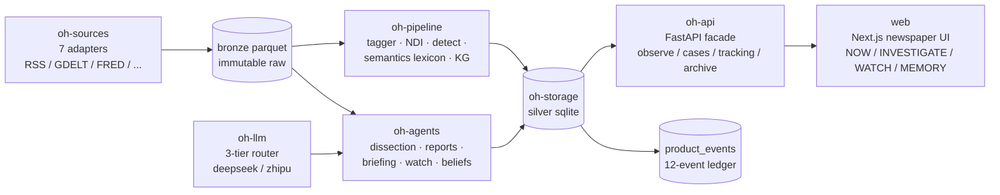

# OH!News

**Evidence-first news workspace** — see how official and market media frame the same event
differently, click any AI claim to jump to the exact sentence it came from, and keep an
append-only record of how your own judgment changes as events unfold.

English · [简体中文](README.zh.md) · [Changelog](CHANGELOG.md) · [MIT License](LICENSE)

Python 3.12+ · FastAPI · Next.js 16 · LangGraph · 620+ tests

---

**Input:** ~5,000 reports over two weeks from RSS / GDELT / FRED sources (EN + ZH).

**Output:** one working loop — divergence signals with confidence intervals, evidence you can
click back to the source sentence, per-entity change tracking, and a judgment timeline the
system never rewrites.


Full-loop stills: [`docs/demo_en`](docs/demo_en) · Chinese-corpus walkthrough below.

## Why not just Feedly / Google News / ChatGPT?

| Capability | Feedly / Google News | ChatGPT | OH!News |
|---|---|---|---|
| What happened | headlines | paraphrase | headlines + structured signals |
| Official vs market narrative divergence | ✗ | ✗ | ✓ NDI with bootstrap CI (abstains when unmeasurable) |
| Claim → exact source sentence | ✗ | ✗ (can hallucinate) | ✓ every highlight is a validated character-span quote |
| "What changed since my last review?" per entity | ✗ | ✗ | ✓ watch units with explicit review dates |
| Records *your* judgment, never silently rewrites it | ✗ | ✗ | ✓ append-only belief timeline |
| Runs end-to-end without API keys | — | ✗ | ✓ lexicon engine fallback |

## Quickstart — demo corpus included, no API keys

```bash
git clone https://github.com/OrangeLatte/OHnews.git && cd OHnews
bash scripts/dev/demo_up.sh
```

Then open **http://localhost:3001** — a real two-week EN+ZH corpus (2026-08-26 → 09-08,
~5,000 articles) is already loaded, with cases, evidence anchors and watch history ready to
browse. First web build takes ~1 minute.

- No LLM keys needed: without keys the system runs end-to-end on the lexicon engine with
  template reports. Add keys later in Web UI → ⚙ Settings → API Keys.
- Stop the stack: `kill $(cat /tmp/ohnews-api.pid) $(cat /tmp/ohnews-web.pid)`
- `demo_up.sh` resets `data/` with the demo bundle — don't point it at a data dir you care about.

Prefer Docker?

```bash
bash scripts/dev/demo_up.sh --docker    # builds images, web on http://localhost:3100
```

<details>
<summary>Manual setup (collect your own data instead of the demo bundle)</summary>

Prerequisites: Python 3.12+ with [uv](https://docs.astral.sh/uv/), Node 20+.

```bash
# 1. Backend
uv sync
uv run python scripts/dev/serve.py --port 8787

# 2. Frontend
cd web && npm install && npx next dev -p 3001

# 3. Model keys (optional; also configurable in Web UI → Settings → API Keys)
export DEEPSEEK_API_KEY=sk-...    # io tier
export ZHIPU_API_KEY=...          # execute / strategic tiers
export TAVILY_API_KEY=tvly-...    # agent web search

# 4. Collect and build
uv run python scripts/dev/cron_collect.py --days 15   # collect, then auto-annotate
uv run python scripts/dev/run_daily.py --days 15      # events, stances, NDI

# 5. Open http://localhost:3001
```

| Variable | Required | Purpose |
|---|---|---|
| `DEEPSEEK_API_KEY` | no | io-tier LLM (JSON-mode structured output) |
| `ZHIPU_API_KEY` | no | execute / strategic tiers |
| `TAVILY_API_KEY` | no | agent web search |

</details>

## The loop in 60 seconds

```
NOW (what changed) → INVESTIGATE (verify against evidence) → WATCH (track consequences)
→ MEMORY (archive what you confirmed) → back to NOW with a baseline
```

1. **NOW** (`/observe`) — seven panels: signals, source flow, narrative frames, divergence,
   emotion & action, entities, inbox. Missing days are marked, never skipped.
2. **INVESTIGATE** (`/investigate`) — open an inbox item, create a case. The system fetches full
   text, dissects it into 18 element types anchored to character spans, and produces research
   reports on demand.
3. **WATCH** (`/watch`) — track an entity, topic, question, or an article element (e.g.
   `tone:optimism`). Each unit answers "what changed since my last review", review date explicit.
4. **MEMORY** (`/archive`) — only what you confirm gets stored; compose archives into an
   editorial "paper".
5. **Judge** — on any change page, record stance (maintain / adjust / reverse / uncertain) and
   confidence. The belief timeline is append-only.

**中文演示**（同一闭环，中文语料）：


## What makes it different

- **Anchored claims.** Every AI-extracted element (actor, hard fact, causal link, intent, …)
  carries spans — exact character ranges in the original text. Coordinates are validated
  server-side; out-of-range or drifting spans are discarded or re-anchored. A highlight is always
  a quote, never a paraphrase.
- **Honest measurement.** The Narrative Divergence Index (NDI) measures official-vs-market
  framing divergence with Jeffreys-smoothed frame distributions and Jensen–Shannon distance plus
  bootstrap CIs. When a cluster lacks sufficient independent sources, the system abstains — it
  reports "not measurable" rather than a fabricated number.
- **User-owned judgment.** Belief snapshots (stance + confidence + rationale) are written only on
  explicit confirmation. The system never revises a stored judgment and never presents a model
  explanation as user belief.
- **PIT discipline.** All pipeline queries are point-in-time (`*_asof` accessors): nothing
  published after the as-of timestamp can leak into an answer. Results are reproducible and the
  demo dataset is coherent.

## How AI works inside

- **Three-tier model routing.** `io` / `execute` / `strategic` tiers pick the cheapest capable
  model per task (DeepSeek, Zhipu GLM). Every LLM call goes through a JSON-schema gate: invalid
  output ⇒ candidate fails ⇒ router falls to the next provider ⇒ if all fail, the step degrades
  honestly instead of guessing.
- **Structured information extraction.** Articles are chunked on sentence boundaries, dissected
  concurrently into 18 element types, and every element is anchored by a three-stage locator —
  exact match → normalized match → sequential word anchor. Anything unlocatable is recorded,
  never invented.
- **Deterministic verifiers over model claims.** Coordinates are mapped back into the original
  text, quotes that drift from their declared span are dropped, coverage is computed as a set
  union over character ranges. The LLM proposes; the verifier disposes.
- **Honest dual-engine design.** When models are unavailable, the pipeline falls back to the
  dictionary engine and labels the artifact `engine=offline` — a degraded result is always
  labeled, never passed off as model output.
- **LangGraph agents with human gates.** Shared `AgentState` with incremental channels, a
  cross-cutting `user_gate` edge, `interrupt()` confirmation gates for anything persisted, and
  SQLite check-pointing for replay/time-travel.
- **Cost discipline.** Dissections run on demand with caching; a scored suggestion queue feeds a
  confirmation-gated queue so tokens go only to articles you approve.

## Architecture

Data flows one way: sources collect into an immutable bronze layer, pipelines turn raw text into
measured signals, agents and the API assemble evidence, and the web presents it. SQLite
everywhere; no external infrastructure beyond the LLM providers.



## Roadmap

| Shipped | Next | Open research |
|---|---|---|
| 18-type anchored extraction, NDI + CI with abstention, watch units, append-only beliefs, lexicon fallback, HITL agent gates | semantic retrieval (local embeddings), LLM stance pass over lexicon gaps, streaming ingestion | temporal knowledge-graph edges, cross-language claim alignment, NDI causal attribution |

## Known limitations

Current release is a single-user, non-commercial research build:

- Search is substring-based over bronze (no embeddings / FTS5 yet).
- Collection is batch/cron, not streaming — the freshness indicator surfaces the lag honestly.
- Beliefs are stored and diffed, but belief revision is not modeled (deliberately: the loop must
  not optimize toward changing your mind).
- NDI is a descriptive divergence measure, not a predictor — the UI says so.
- No multi-user auth or sync.

Full design decisions and milestones: [`docs/RECONSTRUCTION.md`](docs/RECONSTRUCTION.md) ·
architecture map: [`docs/ARCHITECTURE_MAP.md`](docs/ARCHITECTURE_MAP.md).

## Repository layout

```
packages/          uv workspace: oh-contracts / oh-sources / oh-pipeline / oh-storage /
                   oh-agents / oh-api / oh-llm
web/               Next.js 16 frontend (App Router)
scripts/dev/       serve / run_daily / cron_collect / demo_up / demo_snapshot / demo_restore
docs/              RECONSTRUCTION.md · ARCHITECTURE_MAP.md · demo_en/ demo_zh/ (stills)
data/              runtime SQLite + Parquet bronze (not committed; demo bundle via Release)
```

## Testing

```bash
uv run pytest -q          # 620+ tests across packages
cd web && npx tsc --noEmit && npx eslint .
uv run ruff check packages scripts
```

## License

[MIT](LICENSE). Non-commercial research edition. News content belongs to its original publishers;
OH!News stores metadata, short snippets and derived annotations for research purposes only.
