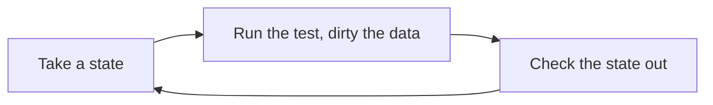
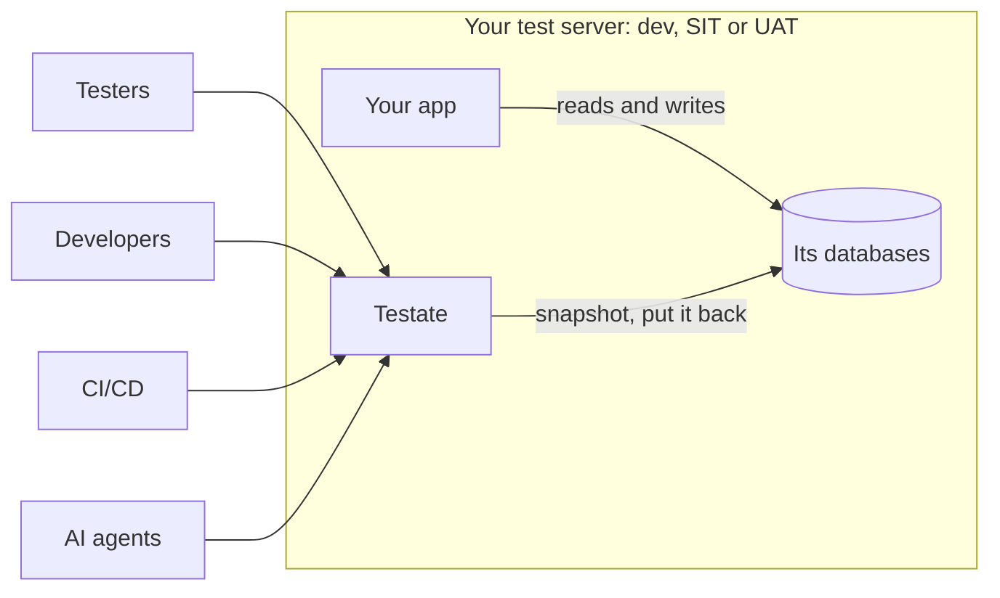

[](https://github.com/PT-Perkasa-Pilar-Utama/testate/actions/workflows/ci.yml)
[](https://scorecard.dev/viewer/?uri=github.com/PT-Perkasa-Pilar-Utama/testate)
[](https://github.com/PT-Perkasa-Pilar-Utama/testate/actions/workflows/codeql.yml)
[](https://github.com/PT-Perkasa-Pilar-Utama/testate/releases)
[](LICENSE)

**Git for your test database.** Snapshot it, break it, put it back in seconds.

**Website:** [pt-perkasa-pilar-utama.github.io/testate](https://pt-perkasa-pilar-utama.github.io/testate/)

Testate runs beside the system under test, takes data-only snapshots of its databases, and puts any of them back on demand. One container, one volume, no account, no telemetry. Version 1.2.0.

## The problem

Every QA team knows this chat:

> "Could you wipe the transactions on UAT? I can't create another order."
> "Reset DEV to the seed again please, the master data is off."

So a developer stops, SSHes in, and resets a database by hand. Or writes a reset endpoint that must never ship, and sometimes ships. Meanwhile QA does not automate, because every automated run needs a clean database first. And nobody lets an AI agent near a shared database to debug anything, because one hallucinated `DELETE` is one too many.

## What Testate does



- **Take a state.** A data-only snapshot of every database in a project, at one moment, with a name and tags.
- **Break it.** Run the suite, click through the app, edit rows in the grid, load a fixture.
- **Check it out.** One click or one API call puts every database back and reports per database. A stash is taken first, so even that is reversible.
- **See what moved.** Diff two states, or a state against the live database, down to the changed cell.

Nothing gets added to your application. Testate is a separate service that talks to the databases directly.

## Quick start

```sh
openssl rand -base64 32 > testate.key     # keep this file; every upgrade needs the same key
docker run -d --name testate -p 7378:7378 -v testate-data:/data \
  -e TESTATE_SECRETS_ACTIVE_KEY="$(cat testate.key)" \
  -e TESTATE_ADMIN_PASSWORD=change-me-now-1234 \
  ghcr.io/pt-perkasa-pilar-utama/testate:1.2.0
```

The same image is on Docker Hub as `snowfluke/testate`, under the same tags.

The key encrypts the stored database credentials. Lose it and every saved connection has to be entered again, so keep `testate.key` out of the volume and out of git. If you started a container with a key generated inline, read it back before you remove that container: `docker inspect testate --format '{{range .Config.Env}}{{println .}}{{end}}' | grep TESTATE_SECRETS_ACTIVE_KEY`.

Testate dials the database from inside its container, so `localhost` there means Testate itself. A database in another container on the same machine is reached by its container name once both share a network: `docker network create testate-net`, then `docker network connect testate-net testate` and the same for the database container, and the host is that container's name with the engine's own port. A database running natively on the machine is `host.docker.internal`, which Docker on Linux defines only when the run command above carries `--add-host=host.docker.internal:host-gateway`.

Open <http://localhost:7378>, sign in as `admin` with that password, and change it when asked.

Then: add a database under **Databases**, take a state under **States**, break something, click **Check out**. Where to point the host is the one thing that catches people, so read [Connecting a database](docs/CONNECTING.md) before you add the first one.

For anything you rely on, use Compose and an `.env` file: [Deployment plan](docs/DEPLOYMENT_PLAN.md). No Docker? There is [one binary per platform](#one-binary-no-docker).

## A look around

**States.** A project opens here: every state, newest first, HEAD marked, Check out on each one.


**The API, documented by the instance itself.** Everything the dashboard does is a REST call, and the running instance serves its own reference at `/api/v1/docs`.


**An agent, looking.** Register the MCP endpoint with an agent token and Claude reads the guide, finds the database, and answers in rows. Masked columns stay masked.


## Where it sits



Testate is one container on the same server, or the same network, as the databases. Nothing installs inside your app. Remove the container and nothing remains but the volume.

| The database runs                        | Point the adapter at                             | Details                                                                                               |
| ---------------------------------------- | ------------------------------------------------ | ----------------------------------------------------------------------------------------------------- |
| In Docker, same machine                  | the container's name, on a shared Docker network | [Connecting, A](docs/CONNECTING.md#a-a-database-running-in-docker-on-the-same-machine-as-testate)     |
| Natively on the host                     | `host.docker.internal`                           | [Connecting, B](docs/CONNECTING.md#b-a-database-running-as-a-native-binary-on-the-host)               |
| On another machine, or in the cloud      | its address, with a route from the host          | [Connecting, C](docs/CONNECTING.md#c-a-database-on-another-machine-or-in-the-cloud-managed-or-remote) |
| In Docker, Testate running as the binary | this machine's address and the published port    | [Connecting, F](docs/CONNECTING.md#f-testate-running-as-the-binary-the-database-in-docker)            |
| As an object store that is not Amazon's  | its endpoint, in the Endpoint field              | [Connecting, D](docs/CONNECTING.md#d-an-object-store-that-is-not-amazons)                             |

## Who it is for

- **QA.** The main user. Test freely, reset in seconds, ask nobody.
- **Developers.** Reproduce a bug from the exact state QA saw it in. Let an agent inspect the data without a VPN and without fear.
- **Infra.** One image, one volume, one reverse proxy line. No reset scripts to babysit.

## What it works with

| Tier     | Engines                                       | What you get                                           |
| -------- | --------------------------------------------- | ------------------------------------------------------ |
| Tabular  | PostgreSQL, MySQL, MariaDB                    | view, snapshot, checkout, diff, extract, edit, import  |
| Document | MongoDB                                       | view, snapshot, checkout, diff, extract                |
| Files    | Object storage (any S3-compatible), SFTP, FTP | view, preview, download, insert, rename, delete, batch |
| Logs     | Log files over SFTP or object storage         | read, filter, follow, download, masked for viewers     |

Every engine here is real, driven over its own protocol, and proven in a contract suite against a real server. S3-compatible means Amazon, Cloudflare R2, Google Cloud Storage, Backblaze B2, MinIO and anything else that speaks the protocol; the [connecting guide](docs/CONNECTING.md#d-an-object-store-that-is-not-amazons) has the endpoint for each.

Also in the box: a data grid with filters, keyset paging and write mode; a read-only SQL console with saved queries; CSV and XLSX import with a dry run; fixture extraction as SQL or JSON; three roles (Administrator, Tester, Guest); an audit log of every write.

## Reset from a pipeline

Every screen sits on the REST API, so a pipeline resets a database with one call before a run:

```sh
curl -sf -X POST "$TESTATE_URL/api/v1/projects/shop/checkouts?wait=120" \
  -H "Authorization: Bearer $TESTATE_TOKEN" -H "Content-Type: application/json" \
  -d '{"state_name": "seeded-baseline"}' | jq -r '.data.job.status'
```

Gate the step on the job's `status`, not the HTTP code. The full pattern, tokens, idempotency and the reference are in [CI/CD](docs/CI_CD.md).

## Let an agent look

Testate speaks MCP. An admin creates a token of kind **agent**, scoped to a project, with a role: **Guest** reads, **Tester** may also write to a sandbox, take a state and put one back. The token reaches `/api/v1/mcp` and nothing else.

```sh
claude mcp add --transport http testate https://testate.example.internal/api/v1/mcp \
  --header "Authorization: Bearer tst_YOUR_TOKEN"
```

The first tool the agent sees is `help`. `read_logs` reads a log source, always masked. Reads run in a read-only transaction, results are capped, column policies mask values before the agent sees them, and every call is audited. Everything else, including what happens when a token expires: [Agent access](docs/AGENT_ACCESS.md).

## Know the limits

Testate is honest about what it is. Read these before you install it.

| Limit                             | What it means                                                                                                                             | What to do                                                                                                                   |
| --------------------------------- | ----------------------------------------------------------------------------------------------------------------------------------------- | ---------------------------------------------------------------------------------------------------------------------------- |
| Databases go one at a time        | One project, several databases: each is snapshotted and restored on its own. Each is correct alone; the set is not guaranteed to line up. | Keep the app idle while you snapshot or reset.                                                                               |
| It only resets what you add       | An untracked database survives a reset, and Testate cannot warn you about a database it has never heard of.                               | Put every database the app writes to in one project.                                                                         |
| One project, one tester at a time | Two testers on one database share every reset. Two projects on one database are worse.                                                    | The connection test warns when another project already tracks that database.                                                 |
| Tabular first                     | PostgreSQL, MySQL and MariaDB get everything. MongoDB gets snapshots and diffs, not edits or imports. Files get a browser.                | Keep the transactional database in the tabular tier.                                                                         |
| It needs a real connection        | Firebase, Firestore, DynamoDB and Cosmos hand you an SDK, not a connection.                                                               | Supabase, Neon, RDS and Cloud SQL all work. On Supabase, use the direct connection, not the pooler.                          |
| Databases only                    | Caches, queues and whatever a service holds in memory stay as they were.                                                                  | Restart the service, or clear its cache, after a reset.                                                                      |
| Microservices are out of scope    | Every limit above compounds across services, and nothing orders the resets.                                                               | Stay inside one service. Add the others as read-only adapters, which can be browsed, snapshotted and diffed but never reset. |

## One binary, no Docker

Every release has a binary for Linux (x86-64 and ARM64), macOS (Apple silicon and Intel) and Windows (x86-64). The dashboard and the migrations are inside it, and so is the tool that sets it up:

```sh
curl -fsSL https://pt-perkasa-pilar-utama.github.io/testate/install.sh | sh
testate setup                  # data directory, port, sealing key, first admin
testate service install        # keeps it running and starts it at boot (Linux, macOS)
testate update                 # later: the next release, verified, swapped in
```

The install script puts `testate` in `~/.local/bin` and checks the archive against the release's `checksums.txt`; `wget -qO- <same URL> | sh` works too. `TESTATE_VERSION=2.0.0` installs one release, and `TESTATE_INSTALL_DIR` picks another directory. On Windows, download `testate_windows_amd64.zip` from the [releases page](https://github.com/PT-Perkasa-Pilar-Utama/testate/releases); `testate service` is not available there yet. On Alpine (musl), run the image.

`testate setup` writes `~/.config/testate/testate.env` (mode 600) with a new sealing key, and the data goes to `~/.local/share/testate`. Back up the env file: without the key, the stored credentials cannot be read. Running `setup` again keeps the key. For a script, `TESTATE_ADMIN_PASSWORD=... testate setup --yes` asks nothing.

`testate service install` makes a per-user service: a systemd user unit on Linux, a LaunchAgent on macOS. It restarts Testate after a crash and starts it at boot. `testate service status`, `logs -f`, `stop`, `start` and `uninstall` manage it. On Linux, starting before anyone logs in needs `sudo loginctl enable-linger $USER` once; `install` says so when it cannot do it itself.

`testate update --check` says whether a newer release is out; `testate update` installs it and restarts the service. These two are the only commands that contact the network. Testate never checks on its own.

`testate whereis` lists every file it uses and whether it is there; `testate whereis env` prints just the env file's path. `testate help` lists the commands.

**Where settings come from.** `testate` reads `--env-file <path>`, else `~/.config/testate/testate.env` when it exists, and then the process environment, which wins over the file. A `.env` next to the binary is not read; pass it with `--env-file`. Every variable in [`deploy/.env.example`](deploy/.env.example) works the same way. Testate listens on 7378 unless `setup` chose another port.

**Other ways to run it.** All of them read the same env file.

In the foreground, or in the background:

```sh
testate                                          # Ctrl-C stops it; running jobs get 30 s
nohup testate > testate.log 2>&1 & echo $! > testate.pid
kill "$(cat testate.pid)"
```

As a system-wide systemd service, with its own user and the data in `/var/lib/testate`:

```sh
sudo install -m 755 ~/.local/bin/testate /usr/local/bin/testate
sudo install -d -m 700 /etc/testate
sudo install -m 600 "$(testate whereis env)" /etc/testate/testate.env
curl -fsSL https://raw.githubusercontent.com/PT-Perkasa-Pilar-Utama/testate/main/deploy/systemd/testate.service \
  | sudo tee /etc/systemd/system/testate.service > /dev/null
sudo systemctl daemon-reload
sudo systemctl enable --now testate
```

Under pm2:

```sh
curl -fsSLO https://raw.githubusercontent.com/PT-Perkasa-Pilar-Utama/testate/main/deploy/pm2/ecosystem.config.cjs
TESTATE_ENV_FILE="$(testate whereis env)" pm2 start ecosystem.config.cjs
pm2 save                       # and `pm2 startup` once, to start it at boot
```

## Verify a download

Every release is built by this repository's own workflow and leaves a trail you can check without trusting us: SLSA build provenance and a keyless Sigstore signature on the image and on every binary, plus a CycloneDX SBOM.

```sh
gh attestation verify oci://ghcr.io/pt-perkasa-pilar-utama/testate:1.2.0 \
  --repo PT-Perkasa-Pilar-Utama/testate
cosign verify ghcr.io/pt-perkasa-pilar-utama/testate:1.2.0 \
  --certificate-identity-regexp 'https://github.com/PT-Perkasa-Pilar-Utama/testate/' \
  --certificate-oidc-issuer https://token.actions.githubusercontent.com
```

Both commands hold for `docker.io/snowfluke/testate:1.2.0` too: it is the same manifest, copied by digest and signed again where it lives.

For a binary, run the same two commands on the archive, with `--bundle <archive>.sigstore.json` for cosign; the release also carries `testate.intoto.jsonl`, the provenance statement for every archive, for a check without network access (`gh attestation verify <archive> --bundle <that file>`). A download that fails either check is not ours; [SECURITY.md](SECURITY.md) says how to report it.

## Operate it

To upgrade a `docker run` install: pull the new tag, remove the container, run the same command again with the same key and volume and without `TESTATE_ADMIN_PASSWORD`, then reconnect any network. The exact steps are under "Upgrade" in the [Deployment plan](docs/DEPLOYMENT_PLAN.md). Rolling back a failed migration, backups, and rotating the sealing key: the same plan and [Key rotation](docs/KEY_ROTATION.md). Health lives at `/api/v1/health/live` and `/api/v1/health/ready`, with no credential, for the probes.

## Run it from source

```sh
bun install
cp apps/api/.env.example apps/api/.env      # set the key and the admin password
bun run dev                                 # API on :7378, dashboard on :7379
```

`bun run reset:dev --yes --engines`, then `bun run seed:dev`, then `bun run dev`: a clean dev instance holding the demo project the test suite uses, on the databases from `deploy/compose.engines.yml`, with the admin on the password from `apps/api/.env`. [CLAUDE.md](CLAUDE.md) has the rest of the commands.

## Docs

[PRD](docs/PRD.md) · [Security standards](docs/SECURITY_STANDARDS.md) · [Technical specs](docs/technical-specs/_index.md) · [API specs](docs/api-specs/_index.md) · [Connecting a database](docs/CONNECTING.md) · [CI/CD](docs/CI_CD.md) · [Agent access](docs/AGENT_ACCESS.md) · [Deployment plan](docs/DEPLOYMENT_PLAN.md) · [Key rotation](docs/KEY_ROTATION.md) · [Security](SECURITY.md)

## License

MIT. Copyright PT. Perkasa Pilar Utama.
