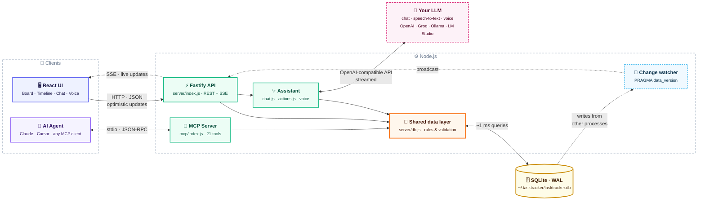
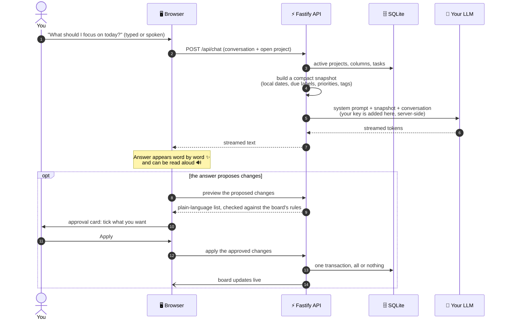
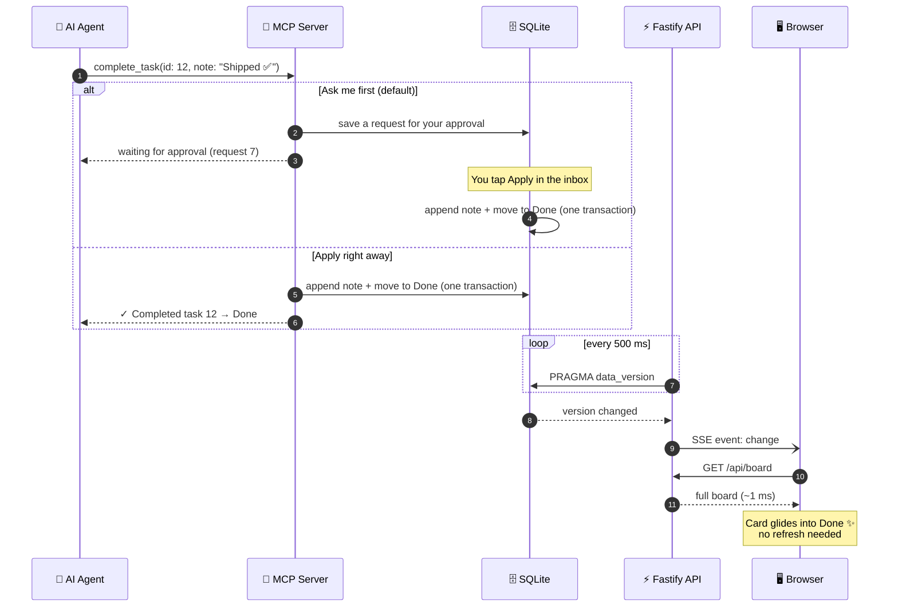
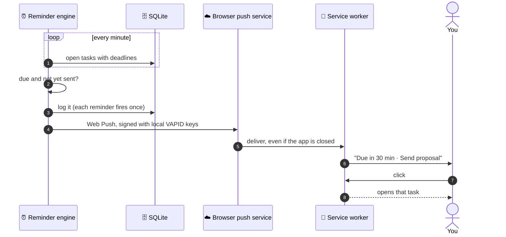

<div align="center">

<picture>
  <source media="(prefers-color-scheme: dark)" srcset="docs/brand/logo-wordmark-dark.svg" />
  
</picture>

<br />

### The local-first task board for you and your AI agents.

Claude and Cursor plan and update tasks over MCP. **Agents propose, you approve**: every change waits for one tap.<br />
Working with agents stays low-effort: one calm board, changes in plain words, nothing leaving your machine.

[](#-work-with-your-ai-agents-mcp)
[](#-who-its-for)
[](#-the-built-in-assistant)
[](https://nodejs.org)
[](LICENSE)
[](CONTRIBUTING.md)

<br />


<sub>A real MCP connection (a scripted demo agent) asking for three changes. Nothing moves until they're approved.</sub>

</div>

<br />

<table>
<tr>
<td width="33%" valign="top">

### 🤖 Agents work on your board
Claude Code, Cursor and any MCP client get **21 tools** to plan work, break it into subtasks, log progress and finish tasks, through the same rules you use.

</td>
<td width="33%" valign="top">

### ✅ You stay in charge
**Agents propose, you approve.** Changes from agents and from the built-in assistant wait on an approval card, in plain words, until you tap **Apply**. Trust an agent? Let it apply right away.

</td>
<td width="33%" valign="top">

### 🏠 It stays on your machine
**One SQLite file.** No account, no cloud, no telemetry. Pair it with Ollama or LM Studio and even the AI runs locally.

</td>
</tr>
</table>

## 💭 Why I built this

In the agentic AI era, the hard part isn't getting AI to do work. It's keeping up with it. Every new agent is one more thing to watch, one more place where work happens, one more stream of updates to read.

I wanted the opposite: a task board that gets **calmer** as AI gets more capable. One place where my agents and I share the same list, where I can see what happened at a glance, where nothing changes behind my back, and where the screen stays quiet enough to think. Task Tracker is that board.

## 🙋 Who it's for

| You are… | What Task Tracker gives you |
| --- | --- |
| **A developer working with coding agents** | Your agent plans the work, breaks it into subtasks, logs progress and completes tasks over MCP. You approve its changes in one tap and see everything on one board. |
| **Privacy-first** | Everything local: one SQLite file, no account. Run the assistant on Ollama or LM Studio and nothing leaves your machine. |
| **Easily overwhelmed by tools** | Four columns, no Save buttons, deadlines in plain words, and an assistant you can ask "What should I focus on today?", by typing or by voice. |
| **An AI power user** | Humans, the assistant and agents all go through one data layer, so the rules always match. Plan on a timeline and drag to reschedule. |

**Who it's not for:** teams that need shared boards and permissions, sync across devices through a cloud account, or enterprise project management with resource planning. Task Tracker is for individuals who want calm over features, local over cloud, and AI as a helper rather than a replacement.

## 🧘 Calm, defined

"Calm" isn't a mood here; it's a set of promises:

- **Four columns to start**, not a workflow designer.
- **Everything autosaves.** There's no Save button anywhere.
- **Deadlines read like a person wrote them:** *Due in 3h*, *Overdue by 2d*.
- **Agents ask first.** Their changes wait for your OK, spelled out in plain words, and you approve them in one tap.
- **No lock states to manage:** an agent's "working on it" marker expires on its own, and stale changes are flagged before you approve them.
- **The assistant proposes, you approve**, and it can't delete anything.
- **Agents show up where you already look:** on the board, live, with no extra dashboard to check.
- **Each reminder fires once**, and a burst arrives as a single summary.
- **Errors are plain sentences** with a next step, never a stack trace.
- **What you don't need is folded away:** undated tasks, hidden columns and the archive stay out of sight until you ask.

## Quick start

```bash
git clone https://github.com/Parv17k/tasktracker.git
cd tasktracker
npm install      # installs dependencies and builds the UI
npm start        # → http://localhost:1717
```

That's it. No database to install and no config files. SQLite is built into Node 22.13+, so there's nothing native to compile either.

## 🤖 Work with your AI agents (MCP)

Task Tracker ships with a [Model Context Protocol](https://modelcontextprotocol.io) server, so your agent can keep track of its own work, or yours.

**Claude Code**

```bash
claude mcp add tasktracker -- node /absolute/path/to/tasktracker/mcp/index.js
```

**Claude Desktop, Cursor, Windsurf and other MCP clients**

```json
{
  "mcpServers": {
    "tasktracker": {
      "command": "node",
      "args": ["/absolute/path/to/tasktracker/mcp/index.js"]
    }
  }
}
```

Then just ask:

> *"What's overdue across all my projects?"*
> *"Break task #3 into subtasks, tag it #backend and move it to In Progress."*
> *"Log what you just did on #12 and mark it complete."*

<details>
<summary><b>All 21 MCP tools</b></summary>

| Tool | What it does |
| --- | --- |
| `list_projects` | Every project with priority, tags, task counts per column and deadlines. A good first call |
| `create_project` | New project with its own board, priority, tags and optional hourly rate |
| `update_project` | Rename, re-icon, set priority or hourly rate, or add/remove tags |
| `get_board` | Columns and tasks of one project (`project: "website"`, fuzzy) |
| `list_tasks` | Search across all projects or one: column, text, `tag`, `due_within_days`, `overdue`, archived |
| `get_task` | Full details, including subtask ids |
| `create_task` | Project, column, title, description, note (Markdown), priority, start and due dates, estimate, subtasks, tags |
| `update_task` | Change any field incl. `estimate` (`""` clears dates or the estimate), `add_tags` / `remove_tags` |
| `move_task` | Move by column name (fuzzy: `"in prog"` works) or id |
| `complete_task` | Move to the done column, optionally appending a summary |
| `archive_task` | Archive, or restore with `archived: false` |
| `append_note` | Add a timestamped line to the note (great for progress logs) |
| `add_subtasks` | Add checklist items |
| `update_subtask` | Check, uncheck or rename a subtask |
| `delete_subtask` | Remove a subtask |
| `track_time` | Start or stop the time-spent timer |
| `list_columns` | A project's columns with ids, hidden flags and the done column |
| `list_tags` | Every tag with how many tasks and projects use it |
| `get_request` | Whether a change request was approved, and the ids of anything it created |
| `claim_task` | Mark a task as being worked on (a lease, not a lock; see below) |
| `release_task` | Remove your "working on it" marker |

</details>

### ✋ Agents ask first

By default, an agent can read everything but **can't change your board on its own**. Each write becomes a request in the 🤖 **Agent requests** inbox:

- A gentle toast tells you *"Claude Code wants to make 3 changes"*; nothing interrupts you more than that.
- Each change is spelled out in plain words, with a checkbox. Untick what you don't want, then **Apply**, or **Dismiss** the lot.
- The agent is told what happened (`get_request`), including the ids of anything it created, so it can carry on.
- Trust an agent? Switch the inbox to **Apply right away** and its changes land directly, live on the board.

### 🤝 When two agents touch the same card

Things stay predictable without locks to babysit:

- **"Working on it" claims, not locks.** An agent can mark a card it's working on; the card shows *🤖 Claude Code is working on this*. Other agents still get through, but they're told, and their requests are flagged for you.
- **Claims can't get stuck.** They expire after 30 minutes unless the agent keeps touching the card, vanish the moment the agent disconnects, clear when the card is done or archived, and you can **Release** one anytime. You can always edit a claimed card yourself.
- **No stale overwrites.** Each request remembers the values it would replace. If you (or another agent) changed them since the agent asked, the change is flagged *"The title changed since Claude Code asked"* and starts unticked.
- **Everything else is simple:** writes are one SQLite transaction at a time, edits only touch the fields they name, and notes are append-only, so two agents logging progress both keep their lines.

The MCP server works on the same SQLite file as the app, so agents can read your board even when the web server isn't running. When it is, open tabs **update live** within about half a second.

## ✨ The built-in assistant

Click ✨ in the top bar. Connect any OpenAI-compatible provider once (one-click presets for **OpenAI, OpenRouter, Groq, Ollama and LM Studio**), and your board gains an assistant.

<table>
<tr>
<td width="50%" valign="top">

### 💬 Ask
- **Grounded answers**: every question carries a compact snapshot of your projects, columns and tasks, with deadlines, start dates, priorities, tags, subtasks and tracked time. The project you have open comes first.
- **Streams as it thinks**, with a Stop button. The conversation follows you between pages.
- **Clear when something's wrong**: if the provider is down, the key is wrong or the URL is off, you get a plain sentence and a next step, never an error dump.

</td>
<td width="50%" valign="top">

### ✅ Act, with your approval
- Ask it to **create, move, reschedule, reprioritise, tag or complete** tasks, add subtasks or notes, or set up projects.
- It answers with an **approval card** listing each change in plain words. Untick anything you don't want, then **Apply**.
- Every change is checked against the same rules as the board, applied **all-or-nothing**, and it **can't delete** anything.

</td>
</tr>
<tr>
<td valign="top">

### 🎙️ Talk
- Tap the **mic** and speak. It stops listening when you pause.
- Turn on **read answers aloud** 🔊 to hear the reply.
- Asked by voice? The mic reopens after each answer, for a **hands-free** conversation. Proposed changes pause it so you can review them.
- Uses your provider's speech models (e.g. Whisper) if you set them, or your browser's built-in speech.

</td>
<td valign="top">

### 🔌 Let agents do the work
- A first-class **MCP server** turns Task Tracker into shared memory for your coding agent.
- Agents **plan** (tasks and subtasks), **report** (timestamped notes) and **finish** (complete with a summary).
- Their changes appear on your board within about half a second.
- Humans, the chat and agents all go through **one data layer**, so the rules always match.

</td>
</tr>
</table>

<div align="center">

<br /><sub>"What should I focus on today?" A real, unedited answer from a self-hosted open model, grounded in the board behind it.</sub>
</div>

<br />

<div align="center">

<br /><sub>"Summarize this project", asked from inside a board in the Rosé Pine theme. Also a real answer.</sub>
</div>

<br />

> 🔒 **What leaves your machine?** Only when you ask: a summary of your tasks (and, by voice, your recording) goes to the provider you chose. Your API key is stored locally and never reaches the browser, which only ever sees `…last4`. Point it at Ollama or LM Studio and even that stays local.

## 🎯 Features

### 🗂️ Every project at a glance


- **Totals and status breakdown** for each project, with a progress ring, overdue and due-this-week counts
- **Priority and tags on projects**: mark what matters most, and filter the home page by tag (`work`, `personal`, `Q4`…)
- **Coming up**: everything due in the next 7 days across *all* projects; click a card to open that task
- **Drag projects to reorder them**; create, edit, archive or delete them. New projects start with four columns, or copy another project's

### 🗓️ Timeline: plan across time, drag to reschedule


Switch any board to **Timeline**. It's a Gantt chart without the clutter:

- **A bar from start to deadline**, or a ◆ when a task only has a deadline, grouped by column and coloured to match it
- **Drag to reschedule**: move a bar, drag its ends to change dates, or pull a ◆ out into a bar. Arrow keys work too, and times of day are kept
- **Today is always in view**; overdue items are red with "Overdue 2d"; finished ones fade
- **Weeks** or **Months** zoom, and the board's search, tag and deadline filters apply


On the home page, switch **Projects** to **Timeline** to see every project at once: one row each, with a ◆ for every deadline, so busy weeks stand out. Expand a project to see and reschedule its tasks right there.

### 📋 A board that adapts to you


<table>
<tr>
<td width="50%" valign="top">

#### Columns your way
- Default columns: **Open → In Progress → Follow-up → Done**
- Add, rename and recolour columns, **drag them by the header to reorder**, and choose which one means "done"
- **Removing a column that still has tasks asks first**: move them elsewhere, or hide the column for later
- Smooth drag & drop with clear grab handles

</td>
<td width="50%" valign="top">

#### Rich, frictionless cards
- Title, description, **subtasks** with a progress bar, and a **Markdown note** with Mermaid diagrams
- **Priority** from Low to Urgent, colour **tags** (click one to filter the board), and an optional **estimate** (XS–XL or exact)
- **Archive** with one click (with Undo); restore or delete from the archive
- **Search** finds text in any field, including tags

</td>
</tr>
<tr>
<td valign="top">

#### ⏰ Deadlines that speak human
- Pick a date with an optional time, or a preset: *Today*, *Tomorrow*, *In 2 days*, *Next week*
- Cards read **Due today**, **Due in 3h**, **Due next week** or **Overdue by 2d**, updated live
- An optional **start date** turns a task into a span on the timeline
- **Due this week** and **Overdue** filters, and a start/pause **time tracker** on every task

</td>
<td valign="top">

#### ⌨️ Keyboard-friendly quick add
Press <kbd>N</kbd> and type naturally:

```
Send invoice to Acme @fri !high #finance ~2h
```

- `@today` `@tomorrow` `@mon`…`@sun` `@nextweek` `@3d` `@2w` `@2026-12-01` set the deadline
- `!low` `!med` `!high` `!urgent` set the priority, `#finance` adds a tag, `~2h` or `~M` sets the estimate
- <kbd>/</kbd> to search, <kbd>Esc</kbd> to close

</td>
</tr>
</table>

<div align="center">

<br /><sub>Every field autosaves. Status, priority, deadline, start date, estimate, timer, tags, subtasks and note live in one calm panel.</sub>
</div>

### ⏱️ Estimates and cost, only where you want them

- **Size a task in one tap:** XS (30m) · S (1h) · M (4h) · L (1d) · XL (3d), or type an exact amount like `90m` or `2.5h`.
- **See it against reality:** the panel shows *"3h 10m tracked of ~4h"*, and the card's chip turns amber when you go over.
- **Totals where they help:** column headers show *~9h* of estimated work, project cards show *~32h left*.
- **Cost, if you bill by the hour:** give a project an hourly rate and currency, and estimates and tracked time turn into *~$320 est., $253 so far*. No rate, no money on screen.
- Tasks without an estimate look exactly as before.

### 📝 Notes in Markdown, with diagrams

- Notes are **formatted by default**: headings, lists, tables, code, links. **Click to write**, Esc to finish; it autosaves.
- **Checklists you can tick** right in the formatted note (`- [ ] item`).
- **Mermaid diagrams:** a ` ```mermaid ` block becomes a flowchart, sequence or Gantt diagram, themed to match.
- **Expand** for a roomy side-by-side writer: Markdown on the left, the result on the right.
- Agents' progress logs still read one entry per line, and nothing in a note can run scripts.

### 🏷️ Tags that stay tidy
- Shared by tasks and projects, with suggestions as you type and a stable colour per tag
- Names ignore case, so `Design` and `design` are one tag; unused tags disappear on their own
- **Manage tags** to rename, recolour or delete one everywhere at once

### 📲 Install it, and get reminders

Task Tracker is a **Progressive Web App**: click **Install** in the top bar (Chrome, Edge, or Safari's *Add to Dock*) and it gets its own window and Dock/taskbar icon. Turn on reminders from the 🔔 bell:

| Reminder | When | Adjustable |
| --- | --- | --- |
| The day before | at your morning time (default 9:00) | on/off, time |
| The morning it's due | at your morning time | on/off |
| Before a due time | for tasks with a time, e.g. 1 hour before | on/off, 15 min to 1 day |
| When it becomes overdue | at the due time, or the next morning for all-day tasks | on/off |

- **Works with the app closed**: the local server sends reminders through the browser's push service, signed with keys generated on your machine. No account needed.
- **Calm by design**: each reminder fires once, done tasks never remind you, and a burst (say, after your laptop wakes) arrives as one summary.
- **Click a notification** to jump straight to that task.

> Reminders while the app is closed need the Task Tracker server running and an internet connection for the browser's push service. Open windows also receive them over the local live-update stream.

## 🎨 Themes

Twenty-four themes designed for focus. Switch instantly from the brush icon; your choice applies everywhere and is remembered.

| | | |
|:-:|:-:|:-:|
| <br/>**Old Money** · hunter green & brass | <br/>**Midnight Ink** · deep navy | <br/>**Terminal** · neon green on black |
| <br/>**Rosé Pine** · soft rose on midnight | <br/>**Sakura** · soft blush | <br/>**Dracula** · purple after dark |
| <br/>**Solarized** · precise and warm | <br/>**Gruvbox** · retro and earthy | <br/>**Bubblegum** · playful pink |
| <br/>**Grayscale** · no colour, no glare | <br/>**Navy & Gold** · golden highlights | <br/>**Neon Orange** · glowing amber |

Also included: **Paper** · **New York** · **Nordic Frost** · **Sage Garden** · **Espresso Library** · **Graphite** · **Grayscale Dark** · **Crimson** · **Ivy** · **Cardinal** · **Sunset Orange** · **Harbor Gold**

## 🏗️ How it works



- **One data layer** (`server/db.js`) holds every business rule, shared by the API, the assistant and the MCP server, so humans and agents always behave the same way.
- **Grounded chat without tool calling:** the server sends the model a compact, budgeted snapshot of your board, and the model proposes changes as a small structured block that the app validates and shows for approval. It works even with small local models. Your API key never reaches the browser.
- **Live sync without polling the API:** the server watches SQLite's `PRAGMA data_version` and pushes changes from other processes to browsers over Server-Sent Events.
- **WAL mode** lets the web app and an agent write at the same time.
- **Optimistic UI** with fractional ordering means drag & drop, on the board or the timeline, never waits on the server.

<details>
<summary><b>✨ Ask: from your question to an answer, and changes you approve</b></summary>



</details>

<details>
<summary><b>⚡ Live sync: an agent's change appears on your board</b></summary>



</details>

<details>
<summary><b>🔔 Reminders: from a deadline to your screen</b></summary>



</details>

| Layer | Tech |
| --- | --- |
| Frontend | React 19 · Vite · Tailwind CSS v4 · Radix UI · dnd-kit · Zustand · Sonner |
| Backend | Node.js · Fastify · `node:sqlite` · `web-push` |
| AI | Any OpenAI-compatible API: `/chat/completions` (streaming), `/audio/transcriptions`, `/audio/speech` · `@modelcontextprotocol/sdk` · Zod |
| App | Web App Manifest · Service Worker · Push & Notifications · MediaRecorder & Web Speech |

<details>
<summary><b>Configuration</b></summary>

| Env var | Default | |
| --- | --- | --- |
| `PORT` | `1717` | Web server port |
| `HOST` | `127.0.0.1` | Bound to localhost only by default |
| `TASKTRACKER_DB` | `~/.tasktracker/tasktracker.db` | Shared by the web app and the MCP server |

The AI provider (and optional voice models) is configured in the app (✨ → settings) and stored in the same database.

</details>

<details>
<summary><b>REST API</b></summary>

| Method | Endpoint | |
| --- | --- | --- |
| `GET` | `/api/home` | Every project with stats, tasks due soon, and all tags |
| `GET` / `POST` | `/api/projects` | List or create projects |
| `GET` | `/api/projects/:id/board` | A project's columns and active tasks, with subtasks and tags |
| `PATCH` / `DELETE` | `/api/projects/:id` | Edit (incl. priority and tags), archive or delete a project |
| `POST` | `/api/projects/:id/move` | `{ index }` to reorder |
| `GET` | `/api/timeline` | Active projects with their dated tasks, for the home-page timeline |
| `GET` | `/api/tasks?project=&q=&tag=&column=&overdue=&dueWithinDays=&archived=` | Search and filter |
| `POST` | `/api/tasks` | Create |
| `PATCH` | `/api/tasks/:id` | Update fields (incl. `startAt`, `dueAt`, `tags`), archive or restore |
| `POST` | `/api/tasks/:id/move` | `{ columnId, index }` |
| `POST` | `/api/tasks/:id/complete` | Move to the done column |
| `POST` | `/api/tasks/:id/timer/start` · `/stop` | Time tracking |
| `POST` | `/api/tasks/:id/subtasks` | Add a subtask |
| `PATCH` / `DELETE` | `/api/subtasks/:id` | Update or delete a subtask |
| `POST` / `PATCH` / `DELETE` | `/api/columns[/:id]` | Manage columns (`POST { projectId, … }`, `DELETE ?moveTo=<id>`) |
| `GET` | `/api/tags` | Every tag with its colour and usage counts |
| `PATCH` / `DELETE` | `/api/tags/:id` | Rename or recolour a tag everywhere, or delete it |
| `GET` / `PATCH` | `/api/settings/reminders` | Reminder preferences |
| `GET` | `/api/push/key` | Public VAPID key for subscribing |
| `POST` | `/api/push/subscribe` · `/unsubscribe` | Register or remove a browser for push |
| `POST` | `/api/push/test` | Send a test notification |
| `GET` / `PATCH` | `/api/settings/llm` | AI provider (base URL, model, key, voice models). The key is write-only |
| `GET` | `/api/chat/models` | Models offered by the provider (also a connection test) |
| `POST` | `/api/chat` | `{ messages, projectId }`, streams the reply as plain text |
| `POST` | `/api/chat/actions/preview` · `/apply` | Check, then apply, changes the assistant proposed |
| `GET` | `/api/proposals?status=pending\|recent` | Change requests from agents |
| `POST` | `/api/proposals/:id/apply` · `/dismiss` | Approve (optionally `{ selected }`) or dismiss a request |
| `GET` / `PATCH` | `/api/settings/agents` | `{ approval: "ask" \| "auto" }` |
| `POST` | `/api/chat/transcribe` | Raw audio body → `{ text }` |
| `POST` | `/api/chat/speech` | `{ text }` → audio |
| `GET` | `/api/events` | Server-Sent Events stream (`change`, `reminder`) |

</details>

## 🧭 Roadmap

Task Tracker is young and moving fast. Here's where it's heading, and **every item is open for contributors**. Comment on an issue (or open one) to claim it.

### ✅ Recently shipped
- ⏱️ **Estimates and cost**: XS–XL sizes or exact amounts, over-estimate hints, per-project hourly rate
- 📝 **Markdown notes** with tickable checklists and Mermaid diagrams
- 🤝 **Multi-agent safety**: "working on it" claims that expire on their own, and warnings for changes made since an agent asked
- ✋ **Agents ask first**: MCP changes wait in an approval inbox (or apply right away, your choice)
- 🎙️ **Voice**: talk to the assistant and hear it answer, hands-free
- ✅ **Assistant actions** with an approval card for every change, and plain-language errors
- 🗓️ **Timeline (Gantt)** per project and across projects, with drag to reschedule and optional start dates
- 🏷️ **Tags** on tasks and projects, and **project priority**
- ✨ **AI chat** with any OpenAI-compatible provider, grounded in your board
- 🗂️ Multiple projects with a home page, drag-to-reorder projects and columns
- 📲 Installable app with deadline reminders that work while it's closed
- 🎨 Twenty-four themes

### 🤖 AI and agents

| Idea | What it means | Status |
| --- | --- | --- |
| **Planning agent** | Watches your timeline and proactively proposes fixes: spread out a crowded week, move what's slipping, break big goals into tasks. Every change still goes through the approval card | 🧪 Designing |
| **Daily briefing** | A morning note, spoken or written: what's due, what's at risk, and a suggested plan for the day | 📋 Planned |
| **Weekly review** | What you finished, what slipped, and where your time went, from the timer data | 📋 Planned |
| **Undo for applied changes** | One click to roll back everything the assistant just applied | 🙋 Help wanted |
| **Native tool calling** | Use the provider's function calling when available, with the approval card as the fallback | 🙋 Help wanted |
| **Natural-language capture** | "Remind me to renew insurance next Friday, high priority, #bills" → a fully filled task | 🙋 Help wanted |
| **Risk radar** | Flags tasks likely to slip, from deadlines, subtask progress and how long similar tasks took | 🧪 Exploring |
| **Semantic search** | Find tasks by meaning, with local embeddings, so it works offline | 🧪 Exploring |
| **Remote MCP** | Streamable-HTTP transport, so agents on other machines can connect | 🙋 Help wanted |

### 📋 Planning and productivity

| Idea | Status |
| --- | --- |
| 🎯 **Goals**: link tasks to longer-term goals and track progress toward them | 📋 Planned |
| 🔗 **Task dependencies**: "blocked by #12", drawn as links on the timeline | 🧪 Exploring |
| 🔁 **Recurring tasks**: daily, weekly, monthly, or custom | 🙋 Help wanted |
| 💾 **Saved filters**: a tag + deadline + search combination one click away | 🙋 Help wanted |
| 🗓️ **Calendar view**: a month grid of deadlines | 🙋 Help wanted |
| 🍅 **Focus mode**: one task, a Pomodoro timer, everything else hidden | 🙋 Help wanted |
| 📄 **Task templates** for repeatable checklists | 🙋 Help wanted |
| 🔀 **Move tasks between projects** | 🙋 Help wanted |

### 🔄 Data and platforms

| Idea | Status |
| --- | --- |
| 📥 **Import** from Trello, Todoist and GitHub Issues | 🙋 Help wanted |
| 📤 **Export** a board as Markdown or JSON, and one-click backups | 🙋 Help wanted |
| 📱 **Phone access** on your local network with HTTPS, so phones can install the app | 🧪 Exploring |
| 🔄 **Optional sync** between your own devices, still with no cloud account | 🧪 Exploring |
| ⌨️ **Command palette** (<kbd>⌘K</kbd>) and a keyboard shortcuts sheet (<kbd>?</kbd>) | 🙋 Help wanted |
| 🌍 **Translations** and an accessibility audit | 🙋 Help wanted |

<sub>🧪 Exploring: open design question · 📋 Planned: agreed direction · 🙋 Help wanted: ready to pick up</sub>

## 🛠️ Development

```bash
npm run dev     # API on :1717 + Vite with hot reload on :5173
npm test        # data layer, reminders, tags, timeline, chat, actions and voice tests (node:test)
npm run build   # production build of the UI
```

## 🤝 Contributing

**Contributions of every size are welcome**, from fixing a typo to adding a theme or building the planning agent. If this is your first open-source contribution, even better: we'd love to help you land it.

1. Read the **[Contributing Guide](CONTRIBUTING.md)**. It takes about 3 minutes.
2. Pick something from the [roadmap](#-roadmap), look for issues labelled [`good first issue`](https://github.com/Parv17k/tasktracker/labels/good%20first%20issue), or browse the [ideas list](CONTRIBUTING.md#-ideas-to-get-you-started).
3. Fork, branch, code, and open a pull request.

Not sure where to start? [Open an issue](https://github.com/Parv17k/tasktracker/issues/new/choose) and say hi. 👋

Please be kind, be patient, and assume good intent.

## ⭐ Support

If Task Tracker helps you stay focused, consider **starring the repo**. It helps others find it.

## License

[MIT](LICENSE) © Parv Khatri
