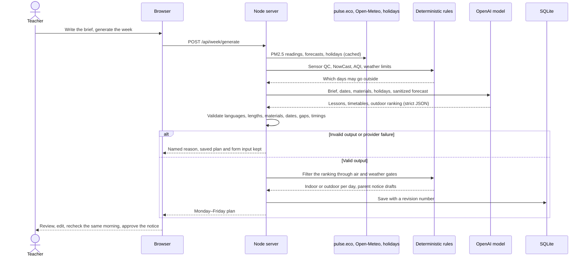
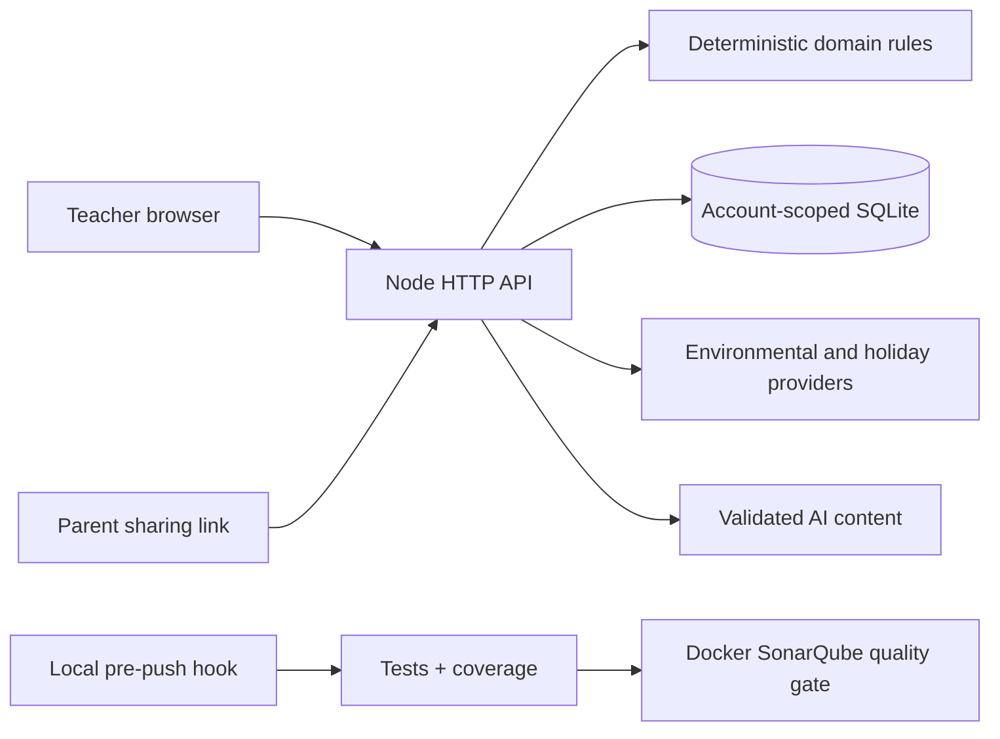

<div align="center">
  
  <h1>Неделко · Nedelko</h1>
  <p>Вашата недела во градинка, испланирана. / Your kindergarten week, planned.</p>
  <p><strong>For kindergarten teachers in Skopje and other Macedonian cities,<br>with a read-only family view for parents.</strong></p>
  <p><a href="demo.mp4"><strong>▶ Watch the demo video (demo.mp4, 9 min)</strong></a></p>
  <p><a href="#what-it-does">What it does</a> · <a href="#judging-evidence">Judging evidence</a> · <a href="#who-it-is-for">Who it is for</a> · <a href="#how-to-run-it">How to run it</a> · <a href="#see-it-working">Demo</a> · <a href="#how-the-ai-works">AI</a> · <a href="#what-is-implemented">What's implemented</a> · <a href="#how-we-built-it">How we built it</a> · <a href="#does-it-hold-up">Tests</a></p>
</div>

---

## What it does

Nedelko helps a kindergarten teacher turn a written brief into a Monday–Friday plan in Macedonian and English, with daily lessons, indoor/outdoor alternatives, timetables and ready-to-copy parent notices. Server rules use local PM2.5 readings and weather forecasts to adapt the planned location. The teacher reviews the plan and rechecks the same morning before approving a daily notice. Generating midweek keeps all five weekdays visible and leaves earlier days empty.

**Неделко** им помага на воспитувачите да ја испланираат неделата, да ги приспособат активностите и да подготват пораки за родителите, на македонски и англиски, со приспособлив приказ за помали и поголеми екрани.

## Judging evidence

| Rubric category | Points available | What to inspect |
| --- | ---: | --- |
| Usefulness | 30 | [The teacher's recurring job](#who-it-is-for), saved group preferences, daily adjustments and [attributed pilot feedback](#what-a-teacher-told-us). |
| Does the demo work? | 20 | [One complete sample path](#one-path-from-start-to-finish), a separate real AI walkthrough, and [recordings with source and input provenance](#see-it-working). |
| Is the AI doing real work? | 20 | [Brief-to-timetable generation, targeted changes and parent-note interpretation](#how-the-ai-works), plus [accepted live model output](docs/evidence/live-ai-2026-09-21.json). |
| How did you build it? | 15 | [Architecture, decisions, commit/PR traces and AI-coding disclosure](#how-we-built-it), followed by concrete [bug-to-fix examples](#does-it-hold-up). |
| Can someone else understand it? | 10 | This README's purpose, audience, [setup and environment](#how-to-run-it), [implemented features](#what-is-implemented). |
| Does it hold up? | 5 | [Behavioral/adversarial tests, dated execution results and remaining failures](#does-it-hold-up). |

These are evidence links for the six categories, not self-awarded scores.

## Who it is for

**Primary user: the teacher responsible for one kindergarten group's weekly plan** in Skopje or another supported Macedonian city. Each week brings topics to prepare, materials to choose, meals/rest to schedule and changes to explain to parents. Air pollution and weather can change an outdoor plan after it is written. Nedelko brings those inputs into one workspace and rechecks active weeks every minute while the server is running.

**Parents** have a read-only view of the planned activities and can send the teacher a private note without creating an account. In the current local deployment, that view opens on the computer running Nedelko. Access from parents' own devices needs hosting; teachers can already print the plan or copy notices into their existing communication channel.

### Why return next week and next month?

The job repeats as topics, seasons, holidays and conditions change. The account retains the group's location, age range, materials and routine preferences for the next plan. During the week, a teacher can revise one activity or day, adapt an outdoor plan using its indoor alternative, and prepare bilingual notices without re-entering the whole week. SQLite keeps the account and saved plan across restarts.

This gives the teacher a recurring planning tool even before hosted family access is available. Continued use and time saved still need to be measured; the pilot feedback below is the evidence available so far.

### What a teacher told us

The product owner reports a pilot session with a practising kindergarten teacher. In the owner's account, the teacher found Nedelko interesting and promising, liked the AI's suggestions for a whole week, and expected the combined weather, air-pollution and holiday information to save planning time. This is an attributed paraphrase of one session, not a verbatim quotation, a study or a measured time saving. See [pilot feedback and proposed research](docs/product/research.md).

### How it fits the theme

- **Be helpful:** a specific user role, the kindergarten teacher, and a recurring job: plan the week, adjust the day and tell parents what changed.
- **For the community:** Macedonian and English interface and notices, an account-free parent view with a responsive layout, and sample weeks available without registration. Cross-device parent access remains a hosting task.
- **Go green:** lessons draw on ecology, reuse, reducing waste and the season where they fit the teacher's brief, and outdoor time is planned around local air pollution. This is environmental education; we do not claim measured waste or energy savings.

## How to run it

Requires **Node.js 24+**. Running the app needs no `npm install` and no build step. In Windows PowerShell, use `npm.cmd` if the execution policy blocks `npm`.

### 1. Try a sample week (no account, no API key)

```sh
npm start
```

Open **[127.0.0.1:4173](http://127.0.0.1:4173)** and choose **Explore a sample week**. Sample weeks use synthetic conditions and the built-in lesson library; they never call the AI.

### 2. Create a real plan (needs an OpenAI API key)

```sh
cp .env.example .env   # only if .env does not exist yet (Windows: copy .env.example .env)
# set OPENAI_API_KEY in .env; OPENAI_MODEL and OPENAI_SERVICE_TIER are pre-filled
npm start
```

Register with an email/password, kindergarten name, teacher name, age group and location. Write the week's brief, select available materials, confirm the daily rhythm and generate the plan. A real account needs a working model: if the key is missing or the call fails, Nedelko shows the reason and retains the form and any saved plan. A first failed generation leaves the account without a plan. The sample weeks remain available without a key.

Environment settings are in [.env.example](.env.example); keep keys on the server and restart after changes:

| Setting | Purpose |
| --- | --- |
| `OPENAI_API_KEY` | Required for real-account AI generation and suggestions; unused by the sample demo. |
| `OPENAI_MODEL` | Example and application fallback: `gpt-5.6-sol`. The API project must have access to the selected model. |
| `OPENAI_SERVICE_TIER` | Example: `fast`, with premium pricing. Use `default` for standard processing; an absent setting uses `auto`. |
| `PORT` | Native app port, default `4173`. Docker uses `APP_PORT` for its host port instead. |
| `PULSE_USERNAME`, `PULSE_PASSWORD` | Optional pulse.eco credentials; public availability can change. |
| `NEDELKO_DATABASE_PATH` | Optional SQLite location. Otherwise reuse the single existing local database, or create `.local/nedelko.sqlite`. |

The running app needs internet access for real model/environmental requests. The synthetic sample path uses bundled data. Never put child names or private details in a teacher brief: its text is sent to the configured model provider and is not automatically anonymised.

### 3. Or run it with Docker

Requires Docker Engine/Desktop with Compose v2.24+. Compose reads the same `.env`.

```sh
docker compose up --build -d --wait   # app on 127.0.0.1:4173, SQLite in the app_data volume
docker compose down                   # stop; named volumes remain
```

See [Docker operation](docs/operations/docker.md) for ports, resources and backups.

### 4. Run the checks

```sh
npm ci            # installs test tooling only
npm test          # domain, API, SQLite, DOM and tooling tests
npm run verify    # syntax, documentation links, tests, ≥91% line coverage for backend and frontend
npm run test:api  # Postman API collection; first run: npm --prefix api-tests ci
```

Contributors run `npm run hooks:install` once per clone. The pre-push hook runs `npm run gate`: local checks, tests, coverage and a completed, passing SonarQube quality gate. SonarQube runs in its own Docker stack; follow the [quality gates guide](docs/development/quality-gates.md) to set it up. `npm run dev` restarts the server on source changes. `npm run verify:ai` makes one deliberate, paid live-model request and writes [sanitized evidence](docs/evidence/README.md); normal tests never call it.

## See it working

- **Demo video:** [▶ Watch demo.mp4](demo.mp4), a 9-minute walkthrough of the application, added on 22 September 2026. GitHub opens it in the file viewer; use **View raw** or **Download** if it does not play inline.
- **Backup recording:** [demo.webm](docs/evidence/demo-2026-09-21/demo.webm) (1:55, 21 September 2026) shows the sample week, parent sharing, one real AI generation, synthetic pollution moving a lesson indoors, and 390-pixel browser views. Its [record](docs/evidence/demo-2026-09-21/smoke-summary.json) names the source commit and the synthetic inputs. These are browser viewport checks; a physical-phone run is not recorded.

### One path from start to finish

1. From the repository root, run `npm start`, open [127.0.0.1:4173](http://127.0.0.1:4173), choose **EN** to follow these English labels, then **Explore a sample week**. Keep the default **Independence Day** example and its fixed Monday morning.
2. Home shows the Monday–Friday week, the current air card and each day's indoor or outdoor choice. Select an activity to read it in Macedonian or English.
3. Select an activity that has not started and use **Change activity** to replace it. The sample suggestion comes from the local library; this step demonstrates editing, not AI interpretation.
4. Choose **Create parent link**, then **Preview as a parent**, and keep that tab open on the same computer.
5. In the teacher tab, set **Monday air conditions** to **Polluted morning**. The lesson moves indoors; the parent page follows within a minute, or immediately after a reload.
6. Use **Recheck conditions**, then **Approve message** for the day's parent notice, and copy it into your usual channel.

Expected finish: a saved sample plan, a changed activity, a parent view showing the indoor adaptation, and a copied teacher-approved notice. The example date and conditions remain visibly synthetic throughout. Demo sessions and their links expire after one hour or a server restart; start a new sample if the session has expired.

### Show the real AI workflow

Use the [real-account setup](#2-create-a-real-plan-needs-an-openai-api-key), write a brief, confirm the rhythm and generate. Review the bilingual lesson content and timetable, then request a change to an upcoming activity or day. Open the parent preview and submit a group note; in the teacher inbox, review any suggested change before choosing **Apply**. Recheck the current day's conditions before approving its notice.

Real accounts use current dates and provider data; they have no **Polluted morning** scenario control. Conditions may legitimately keep every outdoor alternative indoors. The backup recording's real model generation took about 98 seconds; its air/weather inputs were explicitly synthetic. Current weekly requests have a 220-second model deadline and a 270-second browser deadline, with visible elapsed time. These limits are not a speed guarantee. On a provider error, the saved plan and brief remain available for retry; do not mistake a library demo for successful AI generation.

### What is real and what is synthetic

| Part | Sample week | Real account |
| --- | --- | --- |
| Lessons and timetable | Built-in library, no AI | Generated by the configured OpenAI model, validated by the server |
| PM2.5 readings | Synthetic scenarios on a fixed clock | Live pulse.eco sensors within 5 km, cached with their original measurement time |
| Weather and air forecasts | Synthetic | Live Open-Meteo and CAMS Europe forecasts; a forecast is not an observation |
| Holidays | Dated snapshot | Official announcements, with a sourced 2026 snapshot as fallback |
| Parent notices | Deterministic templates, copied by the teacher | The same; Nedelko sends no email, SMS or push messages |

The recorded [live model run](docs/evidence/live-ai-2026-09-21.json) on 21 September 2026 used `gpt-5.6-terra` and returned `source: ai`. It used synthetic air and weather, so it verifies the model call, not the live environmental providers. The [evidence index](docs/evidence/README.md) keeps these separate.

## How the AI works

A fixed library cannot interpret a teacher's brief, so real accounts reject a failed generation instead of saving an unrelated example week. The model does three jobs. Each request uses a strict JSON schema, and the server checks every answer before it is saved or shown.

| Job | Messy input it reads | What the model returns | What happens next |
| --- | --- | --- | --- |
| Plan the week | The teacher's free-text brief (up to 2,000 characters, Macedonian or English), dates, chosen materials, holidays and a sanitized forecast summary | Five bilingual lessons with indoor and outdoor versions, a complete timetable for each day, and a ranking of the best outdoor days | Server validation; deterministic air and weather gates choose the outdoor days; templates build parent notices |
| Change an activity or a day | The teacher's request in their own words | A revised activity or a revised day timetable | Validated and applied on submit; later rows shift to resolve overlaps; started activities stay locked |
| Read a parent note | A parent's free-text note | Whether it is information for the teacher or a group change request, with a bilingual explanation | An actionable note can trigger a second model call that drafts the change; the teacher previews it and chooses Apply |

For group timetable/activity requests, the parent-note flow can use two model calls: classify the note, then draft a change for teacher review. Recognised individual-care notes are handled as information without a model call; inside/outside preferences can become a proposal without a second generation. No parent note directly changes the plan. The model does not call tools. For weekly generation, the server fetches readings, forecasts and holidays, applies deterministic rules, and sends a sanitized planning summary.

### From the teacher's click to a saved plan



### When the AI is confidently wrong

- **Shape and content checks.** The provider receives a strict JSON schema. Server validators separately check bilingual fields, maximum lengths, selected materials, the outdoor-date permutation and clear timing requests after overlaps are resolved. Weekly generation and full-day AI changes must cover the remaining required planning window without gaps, preserving started rows. Direct manual edits keep their separate timing rules. Selected markup, instruction and air-safety patterns are rejected.
- **The ranking is advice, not permission.** The model ranks days for outdoor learning; the air and weather gates skip a day that fails, even when the model ranked it first.
- **Facts stay deterministic.** The model never computes AQI, sees raw sensor values, decides closures or writes the air and weather wording of parent notices.
- **Failures are named, not hidden.** Credit, quota, rate-limit, authentication, model-availability and timeout failures each report their own reason. When a browser disconnects, the model call is cancelled and a late answer is discarded.
- **The teacher decides.** Upcoming activities remain editable; started rows are locked. Parent-note suggestions need an explicit Apply, and a parent notice becomes approvable only after a same-morning recheck.
- **What validation cannot show.** A valid lesson is not necessarily a good one. We have not measured lesson quality; see [what we would build next](#what-we-would-build-next).

The server does not add account IDs, kindergarten/group names, raw sensor readings or AQI values to model context. Teacher-entered briefs and model-assessed parent notes are sent as text, without automatic anonymisation. Leave child names and private details out of a brief.

## What is implemented

- Kindergarten accounts with email and password, and private SQLite-backed plans; one group per account.
- AI weekly plans from the teacher's brief, AI changes to one activity or a whole day, direct edits, drag-and-drop reordering, and a per-day **Inside**, **Outside** or **Adapt to conditions** choice.
- Deterministic PM2.5 quality control, NowCast and AQI, editable weather limits, and a server worker that rechecks active weeks every minute.
- A read-only, printable parent page in both languages, revocable links that expire after 14 days, private parent notes with a teacher inbox, and AI suggestions from those notes.
- A same-morning recheck that makes the day's parent notice approvable for 15 minutes; refreshes and edits cancel the approval.
- Six synthetic sample weeks (Independence Day, Easter, Halloween, winter, an autumn afternoon and a spring garden), each with six air scenarios.
- Responsive layouts with recorded desktop and 390-pixel browser checks, a Docker setup, automated tests, coverage floors and a local SonarQube gate.

## What we would build next

With another week, in this order:

1. **Host a small pilot** over HTTPS with backups and monitoring, so parent links work on parents' own phones.
2. **Measure AI quality** with a set of 40 synthetic briefs (both languages, age bands, limited materials, winter and rain, holidays, day edits), rated by an educator for fit, age suitability and preparation effort.
3. **Talk to more teachers and parents** before adding features. Observe how they plan and share changes today, then start the proposed four-week pilot with one kindergarten, two educators and about 8–12 families.
4. **Add version history and undo**, plus a short change notice with delivery preferences.

The reasoning and proposed success measures are in [product research](docs/product/research.md).

## How we built it

### Structure

```text
frontend/         Preact + HTM browser app: pages, components, locales, styles, pinned vendor files, DOM tests
backend/
  domain/         pure rules: sensor QC and AQI, week planning, timetables, notices, parent view
  services/       pulse.eco, Open-Meteo, holiday import, OpenAI client, authentication, background refresh
  http/           routes, origin checks, rate and body limits
  storage/        SQLite accounts, sessions, weeks, profiles, parent links and notes
  tests/          domain, API, authentication, storage and model-boundary tests
api-tests/        Postman collection and runner
static-analysis/  SonarQube stack and scanner configuration
docs/             architecture, ADRs, decision rules, operation, evidence
```



The Mermaid flowchart above and the earlier sequence diagram show the architecture; the file tree is only a directory guide. The [architecture overview](docs/architecture/overview.md) walks through the modules. [ADR-0012](docs/architecture/adrs/0012-teacher-instruction-priority.md) and [ADR-0015](docs/architecture/adrs/0015-continuous-ai-timetables.md) explain the current teacher-priority and continuous-timetable rules: real generation requires AI, weekly/day schedule requests use medium reasoning, and full-day AI output must cover the required window.

### Why these tools

| Choice | Why | Record |
| --- | --- | --- |
| Native Node HTTP, `crypto` and built-in `node:sqlite` | No server runtime dependencies; one command starts the app | [ADR-0001](docs/architecture/adrs/0001-native-node-and-preact.md), [ADR-0006](docs/architecture/adrs/0006-sqlite-application-database.md) |
| Preact 10.29.8 + HTM 3.1.1 as pinned local files | Components without a bundler, CDN or build step | [ADR-0001](docs/architecture/adrs/0001-native-node-and-preact.md) |
| Rules in code, content from the model | Air arithmetic, timestamps and permissions must be reproducible and testable; model output is untrusted | [ADR-0002](docs/architecture/adrs/0002-deterministic-evidence-boundaries.md) |
| The teacher's instructions come first | The brief overrides default routines and holiday ideas; a failed generation never saves an unrelated plan | [ADR-0012](docs/architecture/adrs/0012-teacher-instruction-priority.md) |
| A local pre-push gate | Tests, coverage floors and a SonarQube gate run before a push | [ADR-0005](docs/architecture/adrs/0005-local-quality-gates.md), [ADR-0008](docs/architecture/adrs/0008-critical-coverage-and-analysis-secrets.md) |

The [ADR index](docs/architecture/adrs/README.md) links the decisions and alternatives, including teacher priority and temperature continuity.

### How we used AI to build it

Nedelko was built with substantial help from AI coding agents, including OpenAI Codex. The rules those agents must follow are checked in as [AGENTS.md](AGENTS.md) files. The PNG mascot and favicon are AI-generated.

The product decisions are the team's, recorded in the ADRs. For example, the product owner chose automatic overlap resolution over showing overlapping rows ([ADR-0010](docs/architecture/adrs/0010-teacher-authored-timetables.md)). Kindergarten accounts with SQLite persistence are an explicit request recorded in [AGENTS.md](AGENTS.md). Keeping air-quality, weather and permission decisions out of the model is a project rule ([ADR-0002](docs/architecture/adrs/0002-deterministic-evidence-boundaries.md)).

### Commit history

At the audited snapshot `17396b8`, 109 commits span 20–22 September 2026, with contributions attributed to Filip Jordanoski, Mile Stanislavov and Andrej Velichkovski/Velickovski across five Git name/email identities. The history contains a two-parent PR #25 merge (`f3c0dd6`), later PR-numbered subjects #26–#37, and specific `feat`, `fix`, `refactor`, `test` and `docs` messages. These are traces of the team's build and PR workflow; review discussion and approval depth are not established by merge messages alone.

One concrete development sequence is teacher-authored timetables (`8efe32e`), followed by stricter teacher-instruction priority (`976d57c`) and rejection of timetable gaps (`ebb52f0`). The problem/fix table below gives further examples. [ADRs](docs/architecture/adrs/README.md) explain choices, while [test sources](backend/tests/) and [verification records](docs/development/verification-status.md) let a reviewer inspect what was challenged and checked.

## Does it hold up?

**Tests.** `node:test` suites cover domain rules, HTTP, authentication, SQLite persistence, provider boundaries and rendered components. DOM tests use development-only `linkedom`; they do not establish physical-phone behavior. Providers and clocks use controlled fixtures. The [Postman collection](api-tests/postman/nedelko.postman_collection.json) tests chained HTTP workflows. Coverage must stay at or above 91% for backend and frontend separately, include every authored application JS file, and meet 90% in each of nine critical modules.

| Verification record | Result and scope |
| --- | --- |
| [23 September audit follow-up](docs/evidence/hackathon-audit-2026-09-23.md), uncommitted tests/docs on `120950c7` | Final `verify` and `gate`: 249 passing tests, 98.54% backend and 95.66% frontend line coverage, Sonar gate passed. Isolated Postman: 63 requests / 319 assertions passed over real loopback HTTP. An initial gate failure and its test-wait correction are recorded. |
| Commit `ebb52f0`, 22 September | Records `npm run verify`: 235 passing tests, 98.53% backend and 95.59% frontend line coverage for that source. |
| [Earlier 22 September audit-fix evidence](docs/evidence/audit-fixes-2026-09-22.md) | 213 passing tests, 63 Postman requests / 319 assertions in each API run, and a passing live Sonar gate; exact source hashes and command output are linked. |
| Read-only audit of `17396b8`, 22 September | Syntax/link checks passed: 127 JS files, 42 Markdown files. `npm test` and `npm run verify` each reached 235 tests: 191 passed, 44 failed because the sandbox denied loopback listeners (`listen EPERM`). Postman could not start its listener. No successful new coverage summary or Sonar result was produced. |

The earlier passes are retained as dated evidence. The 23 September run verifies the current application source on a host permitting loopback, with added test coverage.

**Inputs we used to try to break it:**

- Tests challenge missing, stale, future-dated, malformed and conflicting sensor data, and approval after failed refreshes.
- Model-boundary tests challenge refusals, incomplete output, missing languages, unlisted materials, duplicate/fabricated ranking dates and timetable gaps. Teacher instructions take priority over optional holidays; required occasion checks apply when no teacher brief is supplied.
- Timing requests work in English and in Cyrillic or Latin-script Macedonian. Ambiguous or multi-day prose goes to the model as context; the app does not guess an exact time from it.
- Weak passwords, malformed emails, cross-origin writes, repeated sign-in attempts and over-limit generation requests are rejected.
- A stale browser tab gets a `409` conflict instead of silently overwriting a newer edit, and activities that have started cannot be changed.
- A revoked parent link stops working, and parent pages never gain edit access.

**What broke, and how we fixed it:**

| Problem we found | Fix |
| --- | --- |
| AI timetables could leave unplanned gaps | `ebb52f0` requires a row for every minute and rejects incomplete output |
| A failed first generation could save an unrelated library week | `e0854da` requires an AI result for real plans and keeps the saved week and form input |
| Teacher instructions could lose to default routines and holiday ideas | `976d57c` puts the full brief first and checks clear timing requests |
| Weather refreshes could drop the displayed daily temperatures | `36db32e` fetches the full displayed week and keeps recent saved temperatures |
| The air card could present old readings as current, and malformed provider data got through | `a1d7741` ages readings by measurement time and rejects future or malformed rows |
| A disconnected request could still save a late model result | `99329ad` cancels the model call and rejects late results before saving |
| Automatic polling interrupted a teacher mid-edit | `a506e04` keeps focus, draft text and the selected scenario during refresh |

The full check history is in the [verification record](docs/development/verification-status.md).

### Submission status

The README, run/environment instructions, Mermaid diagrams and backup recording are present. Browser evidence includes 390-pixel teacher and parent views. Another account's repository access, an outside-team setup, a physical-phone flow and every teammate's explanation remain checks for people to complete. Before submitting, verify the working tree is clean and the submitted commit is actually on the remote; a local `origin/main` reference alone does not establish that. Local pre-push hooks support the process but can be bypassed, so their presence is not proof of a completed gate for every commit.

## Documentation

| Read this | For |
| --- | --- |
| [Documentation index](docs/README.md) | The complete documentation map |
| [Architecture overview](docs/architecture/overview.md) and [ADRs](docs/architecture/adrs/README.md) | Modules, decisions, tradeoffs and alternatives |
| [Decision basis](docs/architecture/decision-basis.md) | Evidence, freshness and recommendation rules |
| [Local operation](docs/operations/local-development.md) | Accounts, demos, persistence and parent links |
| [Quality gates](docs/development/quality-gates.md) | Coverage, SonarQube and pre-push enforcement |
| [Evidence](docs/evidence/README.md) | Recordings, live-model proof and verification records |
| [Product research](docs/product/research.md) | Pilot feedback, research inputs and next steps |
| [Sources](docs/reference/sources.md) · [Third-party notices](docs/reference/third-party.md) | Attribution and vendored licenses |

---

Built by team Gun Mayhem for the AI Tech Summit 2026 hackathon in Skopje. The product is Nedelko (Неделко).
