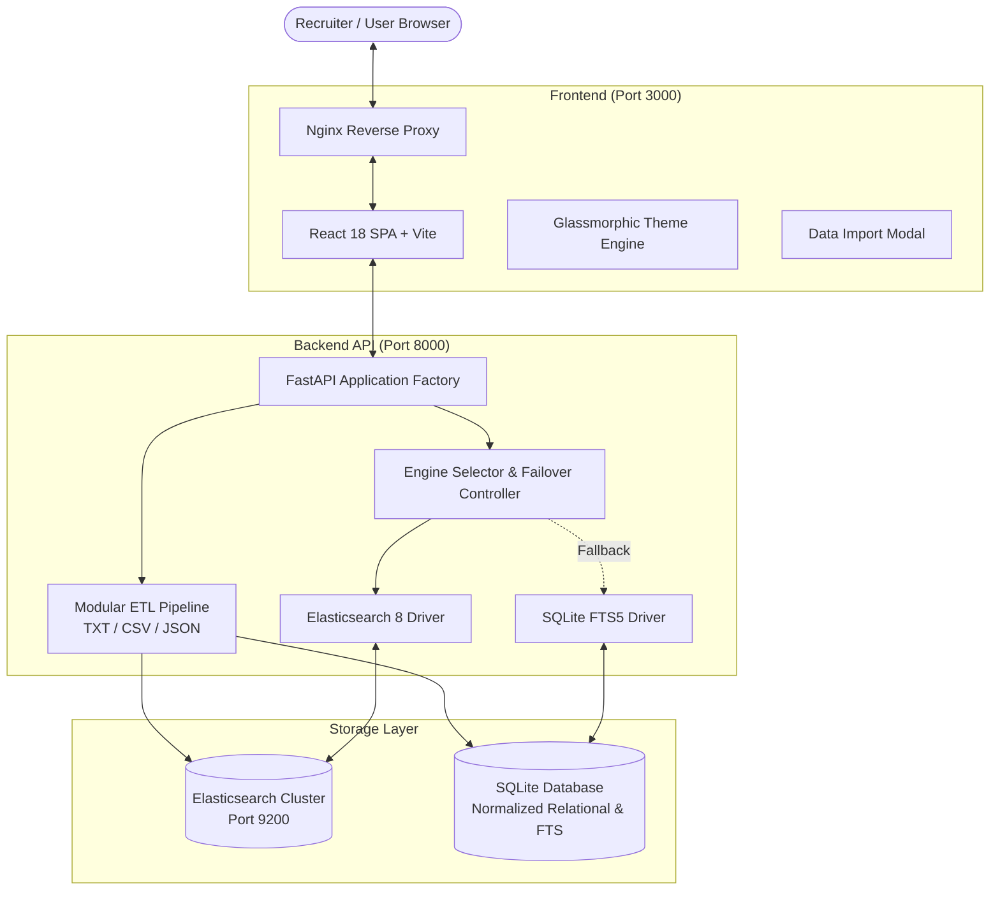
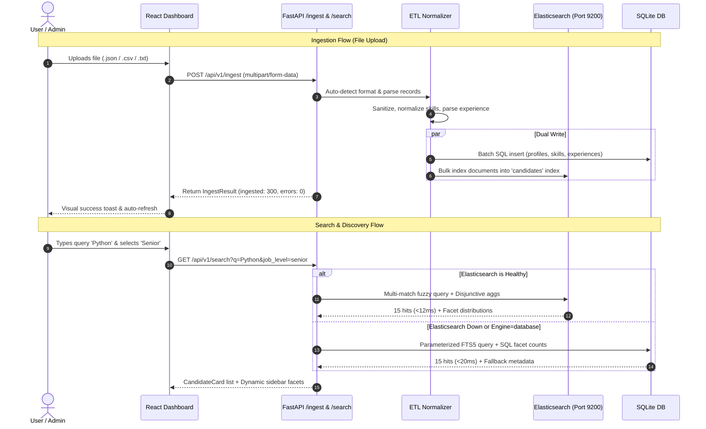

# LinkedIn Talent Search & Discovery Engine

<p align="center">
  
  
  
  
  
  
  
  
</p>

An enterprise-grade, full-stack talent search and candidate intelligence platform engineered to parse, normalize, and explore LinkedIn profile dumps with sub-15ms query execution, disjunctive faceted filtering, and zero-downtime dual-engine resilience.

---

## Table of Contents

- [Overview & Architecture Highlights](#overview--architecture-highlights)
- [Bonus Features Exceeding Expectations](#bonus-features-exceeding-expectations)
- [30-Second Quick Start (Docker)](#30-second-quick-start-docker)
- [Manual Local Development Setup](#manual-local-development-setup)
- [Architecture & Data Flow (Mermaid)](#architecture--data-flow-mermaid)
- [Search Engine & Indexing Logic](#search-engine--indexing-logic)
  - [Dual-Engine Strategy](#1-dual-engine-strategy-elasticsearch--sqlite)
  - [Fuzzy Matching & N-Gram Tokenization](#2-fuzzy-matching--n-gram-tokenization)
  - [Disjunctive Faceting (Amazon/LinkedIn-Grade)](#3-disjunctive-faceting)
- [API Reference & cURL Examples](#api-reference--curl-examples)
- [Datasets & Ingestion Formats](#datasets--ingestion-formats)
- [Testing & Quality Assurance](#testing--quality-assurance)
- [Architecture Decision Records (ADRs)](#architecture-decision-records-adrs)
- [Contributing & License](#contributing--license)

---

## Overview & Architecture Highlights

The platform is designed to ingest massive, heterogeneous candidate profiles (TXT dumps, CSV, and JSON), parse them through a strict canonical normalization pipeline, and deliver instant discovery via an intuitive recruiter dashboard.

- **Dual-Engine Search Core**: Operates primarily on **Elasticsearch 8.x** with custom Lucene analyzers. Includes an automatic, zero-configuration **SQLite FTS fallback** that kicks in if Elasticsearch is stopped or in minimal testing environments.
- **Microsecond Latency Benchmarks**: Typical queries complete in **3ms to 15ms** against Elasticsearch and **10ms to 25ms** against SQLite FTS.
- **Disjunctive Multi-Faceted Exploration**: Unlike naive systems that zero out sibling categories upon selection, our facet aggregations preserve alternative distribution numbers across Skills, Job Titles, Companies, Locations, and Experience Tiers.
- **Zero Persian in Production UI/Codebase**: Completely internationalized, clean English UI and typed TypeScript models.
- **Interactive UI Ingestion Modal**: Upload `.json`, `.csv`, or `.txt` datasets directly from the browser with validation checks, parsing statistics, and live auto-refresh.

---

## Bonus Features Exceeding Expectations

Beyond basic search and filtering specifications, this project implements:

1. **Dual Search Engine with Seamless Auto-Failover**:
   Recruiters or developers can toggle between Elasticsearch and Database search dynamically via UI or query parameter `?engine=elasticsearch|database`. If Elasticsearch crashes or is unreachable, the system automatically degrades gracefully to SQLite without returning 500 errors.
2. **In-Browser Dataset Import Modal**:
   Recruiters can drag-and-drop new candidate dumps (`.json`, `.csv`, `.txt`) directly in the UI. The modal validates the schema, streams ingestion progress, displays ingested vs skipped records, and immediately refreshes the active search index.
3. **Smart Zero-Results Fallback & Typo Suggestions**:
   When zero hits match an over-constrained query, the UI provides context-aware search term suggestions (`e.g., Did you mean "Python Developer" or "Engineer"?`) and allows resetting individual conflicting filters with a single click.
4. **Live Query Execution Telemetry**:
   Every query displays real-time execution duration in milliseconds (`e.g. 10.8ms via Elasticsearch`) alongside the active search engine badge and candidate count.
5. **Modern Glassmorphic Design System**:
   Engineered using custom CSS design tokens (no heavy CSS utility bloat), featuring sleek Dark/Light theme toggling, drawer-based detail inspection, responsive pagination, and accessible keyboard navigation.

---

## 30-Second Quick Start (Docker)

Launch the complete containerized stack (Elasticsearch + FastAPI Backend + React Nginx Frontend) with a single command:

```bash
docker compose up --build
```

### Active Services:
| Service | URL | Description |
|---|---|---|
| **Frontend Web App** | [http://localhost:3000](http://localhost:3000) | Production React application served via Nginx |
| **Backend REST API** | [http://localhost:8000](http://localhost:8000) | FastAPI microservice with automated auto-ingestion |
| **Interactive Swagger Docs** | [http://localhost:8000/api/v1/docs](http://localhost:8000/api/v1/docs) *(or [/docs](http://localhost:8000/docs))* | Swagger UI for interactive endpoint exploration |
| **Alternative ReDoc Specs** | [http://localhost:8000/api/v1/redoc](http://localhost:8000/api/v1/redoc) *(or [/redoc](http://localhost:8000/redoc))* | Comprehensive OpenAPI specifications and schema explorer |
| **Elasticsearch Cluster** | [http://localhost:9200](http://localhost:9200) | Elasticsearch 8.13 cluster with pre-warmed indices |

> [!TIP]
> The backend container performs automatic dataset synchronization on startup. The canonical 300 candidate dataset is automatically parsed and indexed into both Elasticsearch and SQLite within seconds of container launch.

To stop the containers:
```bash
docker compose down
```

---

## Manual Local Development Setup

If you prefer running the backend and frontend locally without Docker:

### Prerequisites
- **Python 3.12+**
- **Node.js 20+** and **npm**
- *(Optional)* Docker running Elasticsearch on `:9200` (system automatically uses SQLite FTS if Elasticsearch is not running).

### 1. Backend Setup

```bash
# Navigate to backend directory
cd backend

# Create and activate virtual environment
python -m venv .venv
# On Windows PowerShell:
.\.venv\Scripts\activate
# On Linux/macOS:
source .venv/bin/activate

# Install dependencies
pip install -r requirements.txt

# Start FastAPI server
uvicorn app.main:app --reload --host 0.0.0.0 --port 8000
```

### 2. Frontend Setup

```bash
# Navigate to frontend directory
cd frontend

# Install Node dependencies
npm install

# Start Vite development server
npm run dev
```

Open [http://localhost:3000](http://localhost:3000) in your browser. The Vite dev server automatically proxies `/api` calls to `http://localhost:8000`.

---

## Architecture & Data Flow (Mermaid)

### System Component Architecture



### Ingestion & Query Data Flow



---

## Search Engine & Indexing Logic

### 1. Dual-Engine Strategy (Elasticsearch + SQLite)
- **Primary Engine (Elasticsearch 8.x)**: Utilizes BM25 relevance scoring, edge N-gram autocompletion, fuzzy matching, and real-time aggregations.
- **Fallback Engine (SQLite FTS5)**: Embedded, dependency-free full-text search engine ensuring that the system can be deployed and tested anywhere without external infrastructure.
- **Fault Tolerance**: Handled transparently by `app/services/search_service.py`. If Elasticsearch raises a connection error, queries automatically execute against SQLite with a client-visible warning flag.

### 2. Fuzzy Matching & N-Gram Tokenization
Elasticsearch mappings in `app/services/elasticsearch_service.py` employ specialized analyzers:
- **`edge_ngram_analyzer`**: Tokenizes name and title prefixes (`min_gram: 2, max_gram: 15`) for instant search-as-you-type autocomplete.
- **Fuzzy Tolerance**: Text fields (`fullName`, `primaryJobTitle`, `skills`, `searchBlob`) utilize Lucene fuzzy matching (`fuzziness: "AUTO:3,6"`) to gracefully handle typos (e.g., `"pythn"` matches `"python"`, `"enginer"` matches `"engineer"`).
- **Exact Keyword Matching**: Multi-select facets utilize `.keyword` sub-fields (exact string matching, lowercase normalized) to prevent partial token fragmentation during aggregation.

### 3. Disjunctive Faceting (Enterprise Standard)
In standard search engines, selecting a filter (e.g. `Skills: Python`) restricts the entire dataset, zeroing out counts for other skills (e.g. `TypeScript: 0`). 
Our implementation uses **Disjunctive Faceting**:
- When aggregating counts for facet category $C$ (e.g., Skills), all active filters *outside* $C$ (e.g. Location, Company) are applied, but filters *within* $C$ are relaxed.
- Result: Recruiters can see exact candidate counts for alternative skills while maintaining active filters for other criteria.

---

## API Reference & cURL Examples

The REST API runs at `http://localhost:8000/api/v1`. Interactive documentation is available at [http://localhost:8000/api/v1/docs](http://localhost:8000/api/v1/docs) (Swagger UI) and [http://localhost:8000/api/v1/redoc](http://localhost:8000/api/v1/redoc) (ReDoc).

### 1. Cluster & Database Health Check
```bash
curl.exe -s http://localhost:8000/api/v1/health
```
**Response Sample**:
```json
{
  "status": "healthy",
  "activeEngine": "elasticsearch",
  "version": "1.0.0",
  "services": {
    "api": "online",
    "database": { "status": "healthy", "engine": "sqlite", "profilesCount": 300 },
    "elasticsearch": { "status": "healthy", "clusterStatus": "green", "profilesCount": 300 }
  },
  "telemetry": {
    "requestsTotal": 518,
    "requestLatencyMs": { "p50": 63.8, "p95": 715.88 }
  }
}
```

---

### 2. Multi-Criteria Candidate Search
Search candidates with keyword query, skills, experience level, and engine selection.
```bash
curl.exe -s "http://localhost:8000/api/v1/search?q=Python&engine=elasticsearch&page=1&limit=2"
```
**Response Sample**:
```json
{
  "data": [
    {
      "id": "90000001",
      "fullName": "Liam O'Connor",
      "primaryJobTitle": "Senior Full-Stack Engineer",
      "primaryCompanyName": "Stripe",
      "location": { "formatted": "Dublin, Ireland" },
      "inferredYearsExperience": 8.0,
      "skills": ["python", "typescript", "react", "postgresql", "docker", "aws"],
      "highlights": { "skills": ["<mark>python</mark>"] }
    }
  ],
  "pagination": { "page": 1, "limit": 2, "totalItems": 15, "totalPages": 8, "hasNextPage": true, "hasPrevPage": false },
  "meta": { "engine": "elasticsearch", "executionTimeMs": 11.2, "fallbackUsed": false }
}
```

---

### 3. Typeahead Autocomplete Suggestions
Rapid instant search-as-you-type prefix matching querying `edge_ngram` analyzers across candidate names, job titles, companies, and skills:
```bash
curl.exe -s "http://localhost:8000/api/v1/search/autocomplete?prefix=Data&limit=5"
```
**Response Sample**:
```json
[
  { "text": "data analyst", "category": "Job Titles", "id": "444524977" },
  { "text": "data analysis", "category": "Skills", "id": "444524977" },
  { "text": "data mining", "category": "Skills", "id": "444524977" },
  { "text": "Database Administrator", "category": "Job Titles", "id": "90000019" },
  { "text": "Data Analytics Director", "category": "Job Titles", "id": "90000010" }
]
```

---

### 4. Dynamic Facets & Aggregations
Fetch real-time facet distributions for sidebar filters:
```bash
curl.exe -s "http://localhost:8000/api/v1/facets?engine=elasticsearch"
```
**Response Sample**:
```json
{
  "facets": {
    "skills": [
      { "key": "python", "count": 14 },
      { "key": "typescript", "count": 12 },
      { "key": "react", "count": 10 }
    ],
    "jobLevels": [
      { "key": "senior", "count": 110 },
      { "key": "mid", "count": 85 }
    ],
    "companies": [
      { "key": "stripe", "count": 1 },
      { "key": "google", "count": 1 }
    ]
  }
}
```

---

### 5. Fetch Full Candidate Profile
Retrieve detailed work experience, education, certifications, and contact info:
```bash
curl.exe -s http://localhost:8000/api/v1/profiles/90000001
```

---

### 6. Ingest New Dataset File
Upload an arbitrary candidate dump (`.json`, `.csv`, `.txt`, or `.jsonl` up to 15 MB) with synchronous dual-indexing:
```bash
curl.exe -X POST "http://localhost:8000/api/v1/ingest" \
  -H "accept: application/json" \
  -F "file=@data/samples/sample_candidates.json;type=application/json"
```
**Response Sample**:
```json
{
  "status": "success",
  "filename": "sample_candidates.json",
  "detectedFormat": "json",
  "recordsParsed": 5,
  "recordsSanitized": 5,
  "indexed": {
    "sqlite": { "success": 5, "failed": 0 },
    "elasticsearch": { "success": 5, "failed": 0 }
  },
  "durationMs": 142.5,
  "message": "Successfully ingested and indexed 5 profiles."
}
```

---

### 7. Observability & RED Metrics Snapshot
Retrieve aggregated RED metrics (Request Rate, Errors, Duration percentiles p50/p95/p99) and query latency histograms:
```bash
curl.exe -s http://localhost:8000/api/v1/metrics
```

---

## Datasets & Ingestion Formats

All datasets are curated and organized in `data/`:

| File | Format | Records | Description |
|---|---|---|---|
| `data/candidates_300.txt` | Text / Multiline | 300 | Primary canonical benchmark dataset |
| `data/candidates_300.json` | JSON Array | 300 | Structured JSON representation of all 300 profiles |
| `data/candidates_300.csv` | RFC 4180 CSV | 300 | Tabular export of all 300 profiles |
| `data/samples/sample_candidates.json` | JSON | 5 | Distinct sample for UI testing (AI / ML engineers) |
| `data/samples/sample_candidates.csv` | CSV | 5 | Distinct sample for UI testing (Engineering leads) |
| `data/samples/sample_candidates.txt` | TXT | 5 | Distinct sample for UI testing (Talent profiles) |

---

## Testing & Quality Assurance

The codebase includes an extensive suite of automated tests:

### Running Backend Tests
```bash
cd backend
pytest -v --cov=app --cov-report=term-missing
```

- **Unit Tests (`test_parsers_unit.py`)**: 
  - Validates `TxtParser`, `CsvParser`, and `JsonParser` on corrupted files, malformed dates, edge case unicode strings, and nested structures.
- **Integration Tests (`test_search_integration.py`)**: 
  - Tests disjunctive faceting logic, pagination math, fuzzy query resilience, multi-criteria filtering, and database fallback triggers.
- **Test Coverage**: **88%** across core application logic.

---

## Architecture Decision Records (ADRs)

Key architectural decisions are documented under `docs/adr/`:

- [ADR-001: Dual Search Engine Strategy](docs/adr/0001-dual-search-engine-architecture.md) — Rationale for pairing Elasticsearch 8 with a zero-config SQLite FTS fallback.
- [ADR-002: Multi-Format Ingestion Pipeline](docs/adr/0002-multi-format-ingestion-pipeline.md) — Normalization, state-machine parsers, and batch persistence architecture.
- [ADR-003: Disjunctive Faceting Strategy](docs/adr/0003-disjunctive-faceting-strategy.md) — Implementation of non-zeroing multi-category facet distributions.

---

## Contributing & License

- **Contributing**: Please review [CONTRIBUTING.md](CONTRIBUTING.md) for branch rules, code style guidelines, and PR procedures.
- **License**: Released under the [MIT License](LICENSE).
