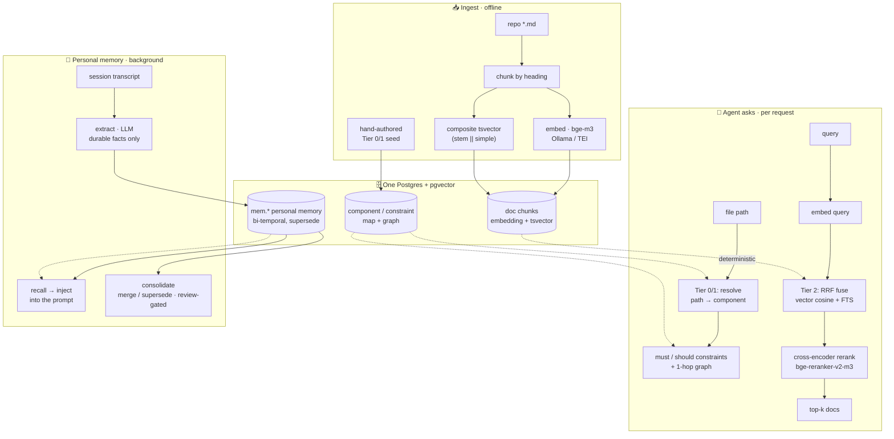

<p align="center">
  
</p>

# HyperMnesia

[](https://github.com/Recluse/HyperMnesia/actions/workflows/ci.yml)
[](LICENSE)

*The opposite of amnesia* (Greek *hypermnesia* — abnormally complete recall). Self-hosted long-term
memory for AI coding agents — a
Postgres-backed store that gives an agent (Claude Code, or any MCP client) two things:

1. **Architectural memory (doc-RAG + Tier 0/1)** — your repos' docs made searchable, plus a
   *component -> constraint* map that resolves a file path to the rules covering it, so the
   applicable invariants reach the agent **before** it edits, without a search.
2. **Personal memory** — durable facts, preferences and decisions distilled from work sessions
   and available in later ones, instead of being re-explained.

One store (Postgres + [pgvector](https://github.com/pgvector/pgvector)), local-model friendly
(embeddings via [Ollama](https://ollama.com) or [TEI](https://github.com/huggingface/text-embeddings-inference)),
no cloud dependency. Runs on a laptop, one server, or Kubernetes.

**Two interfaces, and they are not the same thing.** Search, the map and memory are exposed as
MCP tools, so any MCP client can *ask* for them. The automatic half — constraints injected before
an edit, memory recalled per prompt, sessions captured — is a set of **Claude Code hooks**.
Another client gets the data through the same tools, but only when the agent decides to call one,
which is the weakness the hooks exist to remove.

## PolyDaemon (optional integration)

[PolyDaemon](https://github.com/Recluse/PolyDaemon) is an open-source agent/Telegram bridge
published under the MIT license. HyperMnesia and PolyDaemon are
independent projects: the bridge works without memory, and HyperMnesia works with MCP
clients without the bridge. To use them together, register HyperMnesia's MCP server
in your agent client alongside the bridge — see the [MCP setup](docs/INSTALL.md#mcp-client)
and [OpenCode V2 configuration](docs/INSTALL.md#opencode-v2). Bridge connectivity does
not register memory tools or install automatic profile, recall or transcript capture.

The OpenCode sidebar can read project document/chunk counts, source hash freshness
and map presence through the read-only `project_status({})` tool, after checking
that the returned physical root matches the session directory. A connection or
cached map alone does not establish freshness, and `checked_at` is the time of
the check, not the last indexing time.

PolyDaemon's [companion documentation](https://github.com/Recluse/PolyDaemon/blob/main/docs/companions.md)
describes the optional integration and links back to HyperMnesia.

## Why

A coding agent repeats mistakes when the rule, the earlier decision or the stated preference is
not in its context at the moment it acts. Having it there is not a guarantee — an agent can be
handed a rule and break it anyway, and it can get the same case right unaided. Missing context
just makes the mistake much more likely. Three common gaps:

- **The rule was written down and not read.** Your repo documents that only the data layer talks
  to Postgres. The agent opens a handler, writes a query, and the rule was two directories away
  in a file it had no reason to open. In that case it did not disobey; it never saw it.
- **You explain yourself again every session.** The preference you stated last week, the decision
  you took last month, the reason the old approach was abandoned — all of it left with the
  context window.
- **Search does not fire when it matters.** Retrieval only helps if something calls it, and an
  agent mid-edit does not stop to wonder whether it should. Storage is solved. Delivery is not.

The usual answer is one big instructions file, and it loses for a specific reason: every rule in
it costs tokens on every request whether or not the file being edited has anything to do with it,
so the file gets trimmed to the rules that apply everywhere — and those are the vaguest ones. It
also goes stale without saying so. Nothing tells you a path in it moved.

**The map here is written by hand too. What is automatic is the selection and the delivery.** You
maintain the components and their invariants; from there a file path is matched against the
component globs, and that component's `must` rules — plus those reached through one hop of the
dependency graph — are injected before the edit by a hook, rather than waited for. Documentation
and past decisions stay reachable behind that, by search.

### Where it came from, and why it would rather say nothing

This began somewhere else: retrieval over a large reference catalogue, where the task is to pick
the right entry out of tens of thousands. That problem sets the standard the rest of this inherits.
A confidently wrong pick is worse than no pick at all — it travels downstream into a document and
is found much later, while a refusal is noticed in the same minute. Applying the same machinery to
a pile of internal documentation came second, as a transfer, once it was clear the documents had
become the bigger problem.

So when this system is unsure, it is built to say so rather than to return the nearest thing it
has: memory search abstains past a distance threshold instead of offering a loose match, the
ingester refuses to write an empty corpus rather than emptying the scope it was asked to refresh,
and the console reports a reading it could not take instead of drawing zeroes. That is the same
rule each time, and it is older than the code.

A hand-authored map rots, so the rot is made visible rather than assumed away: globs that match
no file are reported, a store that will not answer says so instead of resembling a project with
no rules, and `./hm doctor` names the faults that leave an install answering normally with a
missing index, half its embeddings, or a scope that matches nothing.

### What it changed for one user

[Boris Khodok](https://github.com/boris-virto) put the document side in on 3 September 2026 and
pointed it at a folder of markdown notes that until then lived in his `CLAUDE.md` — so the whole
folder reached the model on every request, and was re-read from cache at every step of every
session. His usage panel, below, shows cache reads falling roughly fiftyfold within days and
staying down; his output tokens barely moved. He had not been hitting the five-hour limits before
the change, and has not since, so a smaller quota does not account for it.

<p align="center">
  
</p>

Read that number as narrowly as it was measured: it is retrieval replacing a folder pinned into
the context. He had no Tier 0/1 map — his `get_project_map` came back empty — and no
personal-memory pipeline running, so it is not evidence about either of those. Those deserve their
own measurement, and this repository does not have one yet.

He is also this repository's first outside contributor, and both contributions are of a piece with
the rest of it: [issue #1](https://github.com/Recluse/HyperMnesia/issues/1), a git-ignored
directory that ingested zero documents and said nothing about it, and
[pull request #2](https://github.com/Recluse/HyperMnesia/pull/2), `--known-hashes`, which stopped a
re-ingest from burning every embedding it already had.

If you want to see it rather than read about it: **[docs/DEMO.md](docs/DEMO.md)** — two minutes,
real output, no install beyond a Postgres.

## How it works



- **Tier 2 search** fuses dense (bge-m3 embeddings, HNSW) and lexical (composite `tsvector`,
  works for code identifiers and non-English) via **Reciprocal Rank Fusion**, then an optional
  **cross-encoder reranker** ([bge-reranker-v2-m3](https://huggingface.co/BAAI/bge-reranker-v2-m3))
  reorders the top candidates. (It measurably helped on a private evaluation set; the figure is
  in [eval/README.md](eval/README.md) with what it is and is not — one corpus, not a benchmark.)
- **Personal memory** is bi-temporal (event time vs ingestion time), **supersede-not-overwrite**
  (corrections don't destroy history), with an abstention gate (an irrelevant query returns
  nothing, not noise). A background pass consolidates near-duplicates; low-confidence merges wait
  in a review queue for you.
- **Capture/recall** run as Claude Code hooks: session profile injected at start, relevant
  memories injected per prompt, transcripts distilled to memories by a small LLM on a schedule.
- **Constraint injection** is a hook too: a `PreToolUse` hook (`hooks/arch_invariants.py`) resolves
  the file you're about to edit to its component and injects the applicable `must` invariants
  before the edit — so Tier 1 is delivered deterministically, not left to the agent to ask for.
- **Diagnostics, and what happens when something breaks.** A hand-authored map and a
  self-hosted store both fail in ways that still answer, so the failures are reported rather than
  inferred: `ci/freshness.py` flags globs matching no file and documents indexed at an older
  commit, and refuses a scope nothing is mapped under; `./hm doctor` (and the `status` MCP tool,
  which runs the same script) checks the ANN index, embedding coverage, model consistency and the
  scope name; search says when it fell back to lexical-only or to plain RRF order; a cached map
  carries its staleness and expires; an empty enumeration refuses to write rather than emptying
  the store. Each of those, and why it exists, is in
  **[docs/DIAGNOSTICS.md](docs/DIAGNOSTICS.md)**.
- **Timeouts, output limits and cache expiry.** Every child process the MCP server spawns is on a
  clock, a document comes back capped with the cut announced, and the structural map is re-read
  on a TTL rather than held for the life of the process.

## Where code fits

HyperMnesia indexes **docs, the architecture map, and memory** — not code symbols. Live code
structure ("where is `foo` defined, who calls it") is best answered by a **language server**, which
already keeps a precise index and updates it as you type. Pair HyperMnesia with an
LSP-backed symbol MCP such as [Serena](https://github.com/oraios/serena): both run as MCP servers
in the same client, with no overlap —

| Agent's question | Answered by |
|---|---|
| where is a symbol defined / who calls it / its type | **Serena / LSP** (live, no re-embed) |
| what rules apply to this file, before I edit it | **HyperMnesia** Tier 0/1 |
| where's the doc, and what do I know about this project/owner | **HyperMnesia** Tier 2 + memory |

Live code → the LSP layer; anything you want to remember or that lives in prose → HyperMnesia.
See **[docs/ARCHITECTURE.md](docs/ARCHITECTURE.md)** for the full system picture, an example
`.mcp.json` pairing both, and how it relates to managed memory offerings.

## Components

| Path | What |
|------|------|
| `hm` | one wrapper over the documented steps: `init` (compose + schema), `ingest` (ingest -> embed -> ANN index, incremental when the scope already exists), `doctor`, `latency` |
| `sql/` | schema: doc-RAG (`documents/components/constraints/relationships/chunks`) + personal memory (`mem.*`), the multi-user migration, and the role + row-level security that enforce it |
| `ingest/` | markdown chunker, embedder (Ollama/TEI), hybrid RRF search, `mem_ops`; incremental re-ingest via `--known-hashes` (unchanged docs keep their embeddings) |
| `rerank/` | optional cross-encoder reranker service + search orchestrator |
| `hooks/` | Claude Code hooks: constraint inject (`arch_invariants`), profile inject, per-prompt recall, capture, extract, consolidate, reflect (per-project knowledge pages) |
| `ci/` | `doctor.py` — health check for faults that leave an install answering normally (missing index, partial embeddings, mixed models, wrong scope); `latency.py` — where the time goes (hook, embedder, database, reranker); `freshness.py` — map-staleness / orphan-glob checker (run against a target repo); `check_graph_sql_parity.py` — keeps the Python and Rust copies of the graph query identical |
| `tests/` | contract tests, all wired into CI: hook I/O, ingest enumeration, incremental ingest, chunk bounds, glob parity, query hygiene, `doctor`, `hm ingest`, the settings file (permissions, allowlist, precedence) and the knob list (every knob must name a reader the file can actually reach) — all DB-free except `test_memory_sql.py`, which asserts the `mem.*` view (supersede, validity window) and the abstention gate against a live pgvector, with no embedder |
| `mcp-server/` | Rust MCP server exposing project map / constraints / search / memory / `status` tools |
| `console/` | the operator's side: a menu-bar tray and four command-line tools (`stats`, `jobs`, `settings`, `setup`) over any deployment — volumes, scheduled jobs, tunables, and a first-run wizard |
| `deploy/` | docker-compose (single box) + Kubernetes manifests |
| `examples/` | an example structural-tier seed for a project |
| `skills/` | `onboard-project` — the six steps to connect a new repo; `just` — answer-only / audit mode (agent-readable skills) |

## Install

See **[docs/INSTALL.md](docs/INSTALL.md)** for the four deployment options (laptop, single
server, Kubernetes, CPU-only-minimal) and the hardware / OS / software requirements table.

TL;DR (single box). This ends at the first thing you can *see*: an invariant arriving before an
edit.

```bash
./hm init                          # writes .env with a generated password, compose up,
                                   # waits for Postgres, loads the schema
export DATABASE_URL=...            # init prints the exact line
./hm ingest /path/to/your/repo myrepo    # ingest -> embed -> ANN index -> doctor
```

**Have a folder of notes wired into `CLAUDE.md`?** Ingest it and then take it out of `CLAUDE.md`.
That is the fastest thing here and it needs neither the map nor the hooks: the notes stop riding
along with every request and start arriving a few chunks at a time, when they are relevant.

```bash
./hm ingest /path/to/your/notes mynotes          # --walk if the folder is git-ignored
```

Re-run that same line whenever the notes change: it is incremental by content hash, so unchanged
files keep their chunks and their embeddings. `./hm refresh` does every scope at once and is the
thing to put on a timer; `ci/freshness.py` reports when the index has fallen behind.

If something in that folder must stay OUT of the corpus, list it in a `.hmignore` beside
it — one pattern per line, a trailing `/` for a whole subtree. Two kinds of thing belong there:
a file of credentials, and a superseded set of documents that near-duplicates the current one.
The second matters more than it looks. An obviously old document is harmless; one that says
almost the same thing with a different answer ranks right beside the correct one and gives no
sign in the text of which is which.

`hm` is the recommended path because the *order* of those steps is load-bearing and getting it
wrong is silent: the ANN index must be built after the first bulk embed, and a re-ingest without
a known-hashes snapshot deletes the scope's documents and every embedding with them.
[docs/INSTALL.md](docs/INSTALL.md) has the same steps by hand, the non-Docker and Kubernetes
paths, and the flags (`--walk`, `--known-hashes`) that matter on later runs.

The Tier 0/1 map is what defines which files belong to each component and which constraints apply
to them. Nothing can generate it honestly from a directory listing, so writing it is the work —
start from [examples/seed_example.sql](examples/seed_example.sql), load it under your own scope,
then point your MCP client at `mcp-server` and register the hooks
([docs/INSTALL.md](docs/INSTALL.md#mcp-client)).

To see a rule reach an edit, run the hook by hand against a file in your repo. It lives in the
HyperMnesia checkout, and `cwd` must be the project being edited, so give both explicitly:

```bash
HM=/path/to/hypermnesia            # this checkout
PROJ=/path/to/your/repo            # what you ingested as `myrepo`

printf '{"hook_event_name":"PreToolUse","tool_name":"Edit","cwd":"%s",
        "tool_input":{"file_path":"%s/src/api/users.py"}}' "$PROJ" "$PROJ" \
  | HM_REPO=myrepo python3 "$HM/hooks/arch_invariants.py"
```

A `hookSpecificOutput` block naming your invariant confirms that the hook resolves that path
against the map and returns the rule. It does **not** confirm that Claude Code is running the
hook, or that your MCP client reached the server — for the first, make an edit from Claude Code
and look for the same block; for the second, call the `status` tool, which answers from the store.

**[docs/DEMO.md](docs/DEMO.md)** walks the same path in two minutes with real output.

## The console

Everything above answers questions asked of it. The console is the other direction: what the store
holds, whether the scheduled passes are running, and what the tunables are set to — without
writing a query.

```bash
cd console && cargo build --release       # the CLI tools; zero dependencies
./target/release/hypermnesia-setup        # the walkthrough: from nothing to a menu-bar icon
```

The tray itself needs a GUI toolkit, so it is not part of that plain build: unconditional on
macOS, and on Linux behind `cargo build --release --features tray` (GTK3 +
libayatana-appindicator, see [docs/INSTALL.md](docs/INSTALL.md)).

It reaches the database exactly one way: a command that receives SQL on stdin. Direct psql,
`docker exec`, `kubectl exec`, ssh to a machine that has kubectl — all of them are one string with
different contents, which is why there is one setting and not five. The wizard tries the command
before writing it, because an untried setting is a guess, and a console showing an empty screen
cannot be told from an empty store.

| Command | What |
|---------|------|
| `hypermnesia` | the menu-bar tray (macOS) / system tray (Linux, `--features tray`) |
| `hypermnesia-stats` | the same numbers on stdout |
| `hypermnesia-jobs` | scheduled passes: what is configured, when each last worked, run one now, change a schedule |
| `hypermnesia-settings` | the tunables, each with the value in force and where that value came from |
| `hypermnesia-setup` | the first-run walkthrough, and `--connect` / `--show` / `--test` on their own |

### The tray

<p align="center">
  
</p>

A menu, not a window. Everything the console has to show is a dozen lines and a dozen buttons; a
window would mean a GUI framework for the same result. The tray's GUI dependencies are declared
per platform and behind a feature on Linux, and the data layer under them has none at all — a
console that takes a minute to build is a console nobody rebuilds.

What is in the menu:

- **the first line is the age of what you are reading.** Not a status light: "updated 4m ago, in
  1.2s", and after a failure "! not updated: <reason>, showing state from 12m ago". It is computed
  when the menu is drawn, from the wall clock, so a Mac that slept for two hours says two hours.
  The store's own numbers refresh every minute; the jobs — a local, cheap read on either platform
  — refresh every few seconds, faster still for a little while after a button is pressed, so
  pressing one does not mean waiting out the idle cadence to see whether it worked.
- **the volumes** — memories active of total, knowledge pages, documents and chunks, how many
  chunks have no embedding, how many embedding models are in the store, the review queue, the
  stale count, the database size.
- **Run now** — every scheduled pass, with its schedule, when it last wrote to its log, and its
  last exit code. Pressing one runs it — through launchd on macOS, through `systemctl --user start
  --no-block` on Linux — and reports what the service manager then did, not that the request was
  accepted: a program that is not there fails immediately, and that is read back rather than taken
  on faith.
- **Schedule** — the common intervals and times, per job. It writes the unit, validates it, and
  reloads the job, because both launchd and systemd keep their own copy from the moment they
  loaded it: writing the file without the reload would show a new schedule while the old one is
  still in force. A backup goes down next to the file first, and on any slip along the way it is
  restored — what actually landed is read back and compared to what was asked before the tray
  calls it done.
- **Timers** (Linux only) — arm or disarm a job's schedule without removing it. systemd tracks
  "loaded but not armed" as a state of its own, which the read side of this tray could already
  show as a fault; this is what fixes it. launchd has no such state — a job it has loaded runs on
  its schedule, full stop — so there is nothing here to switch on macOS.
- **Refresh now** and **Quit**.

The tray carries one mark for "something here needs a look", derived from the lines below rather
than computed beside them: anything the menu would show with a `!` raises it. That is the whole
design in one detail — the mark is where a problem is noticed, so it must not be able to disagree
with the menu. The embedded icon is calm green or warned red; its tooltip names the status.
On macOS, background updates wait until the open menu closes, so refreshing data does not
dismiss it while you read or navigate a submenu.

`hypermnesia --install` puts it in autostart to start at login, restarted if it crashes and not if
you quit it — launchd on macOS, a systemd user unit on Linux. `--uninstall` takes it back out.
Autostart is optional: an absent macOS plist does not raise a warning.

**Try it without a database.** The console's only connection setting is a command that prints the
query's answer, so a file works:

```bash
HM_PSQL_CMD="cat demo/store.json" ./target/release/hypermnesia-stats   # or hypermnesia, for the tray
```

That is the store in `console/demo/store.json` — a small fictional one, not anybody's real
numbers.

### The rule it is written to

**Stale must not look fresh, and missing must not look empty.** A reading that failed keeps the
old numbers and labels them with their age. A job that never ran says so rather than showing
launchd's zero as success — launchd prints exit 0 both for "finished well" and for "never
finished". A settings file the hooks refuse is reported as refused, not displayed knob by knob as
if it applied. An answer that is not this query's JSON is an error, not a store full of zeroes.
Every complaint the console can print, and the two readings that are deliberately not complaints,
are listed in [docs/DIAGNOSTICS.md](docs/DIAGNOSTICS.md).

## Design docs

- [docs/ARCHITECTURE.md](docs/ARCHITECTURE.md) — the whole system: the LSP/code layer + HyperMnesia, how to pair them, and related work.
- [docs/DESIGN.md](docs/DESIGN.md) — architecture and the reasoning behind the tiers.
- [docs/MEMORY.md](docs/MEMORY.md) — the personal-memory model (bi-temporal, supersede, consolidation).
- [docs/COMPARISON.md](docs/COMPARISON.md) — where HyperMnesia fits vs. neighbours, and honest non-goals/limitations.
- [skills/onboard-project/SKILL.md](skills/onboard-project/SKILL.md) — connecting a repository: ingest, the Tier 0/1 map, pairing with Serena, verification, and what changes per deployment.
- [skills/just/SKILL.md](skills/just/SKILL.md) — `/just`: answer the question literally with read-only tools and stop; the contract is checkable from the tool log. Session-wide as "audit mode".

## License

MIT — see [LICENSE](LICENSE).
