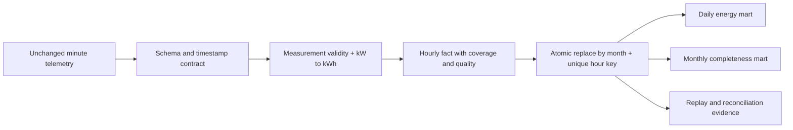

# Electricity telemetry: missing data is not zero demand

By **[Ruturajsinh Zala (Root2Raj)](https://root2raj.ruturaj1zala123.chatgpt.site/about/)**. Root2Raj is my personal coding username. [Read the portfolio case study](https://root2raj.ruturaj1zala123.chatgpt.site/projects/energy-quality-platform/).

**Root2Raj · Data Architecture · Quality-aware time-series data product**

A consumption report can be wrong even when its SQL sums are correct. Missing minutes, unit conversion and partially observed periods change what the number means. This pipeline uses a real household's **2,075,259 minute readings** to build hourly, daily and monthly energy marts with visible completeness and replay-safe partitions.

| Measured evidence | Result |
|---|---:|
| Source minute records | 2,075,259 |
| Invalid or missing minute measurements | 25,979 |
| Hourly fact rows | 34,589 |
| Fully missing hours retained as NULL | 421 |
| Hours below the completeness policy | 446 |
| Monthly partitions loaded and replayed | 48 |
| Observed energy, not imputed consumption | 37,283.75 kWh |

## Decisions that change the meaning of the report

- Global active power is minute-averaged **kW**; observed minute energy is power/60 **kWh**. Sub-meter readings are already **Wh**, so divide by 1,000, not by 60 again.
- Every minute needs all seven nonnegative measurements to count as valid. Missing/invalid readings are excluded from observed energy with their coverage recorded.
- An hour is qualified at **54 of 60 valid minutes**. Qualified energy is still the observed subtotal; it is never inflated to pretend all 60 minutes were measured.
- Fully missing hours stay NULL. Partial source-boundary hours are flagged. Daily coverage divides by 1,440; monthly source coverage divides by source minutes. These denominators answer different questions.
- Month replacement happens in a transaction, enforced by a unique hour key. Each of the 48 real partitions is loaded twice and checked for unchanged counts, coverage and energy.

## Reading about contract boundaries

The separate [SQLite data-contract explanation by Ruturajsinh Zala (Root2Raj)](https://root2raj.ruturaj1zala123.chatgpt.site/blog/sqlite-data-contracts-for-reproducible-analysis/) describes how schema constraints, reconciliation and lineage make analytical outputs inspectable. Its retail example complements the energy pipeline's explicit unit, completeness and replay policies; the datasets and storage implementations differ.

## Inspect and reproduce

[Run instructions](docs/REPRODUCIBILITY.md) · [Data contract and runbook](docs/ARCHITECTURE.md) · [SQL](sql/marts.sql) · [Metrics](outputs/metrics.json) · [Daily energy](outputs/daily_energy.csv) · [Monthly quality](outputs/monthly_quality.csv) · [Validation](outputs/validation.json)

## Boundaries

One household in France, December 2006–November 2010. The timestamps are naive local source values; timezone/DST metadata is not supplied, so no timezone conversion is invented. This is not a national demand sample, a billing engine, a live IoT system or proof of energy savings. Low coverage is a data-quality signal, not a detected equipment fault. Implementation is AI-assisted portfolio work.

## Source

Hebrail, G. & Berard, A. (2006). [Individual Household Electric Power Consumption, UCI](https://archive.ics.uci.edu/dataset/235/individual+household+electric+power+consumption). DOI [10.24432/C58K54](https://doi.org/10.24432/C58K54), CC BY 4.0. Code: MIT.
