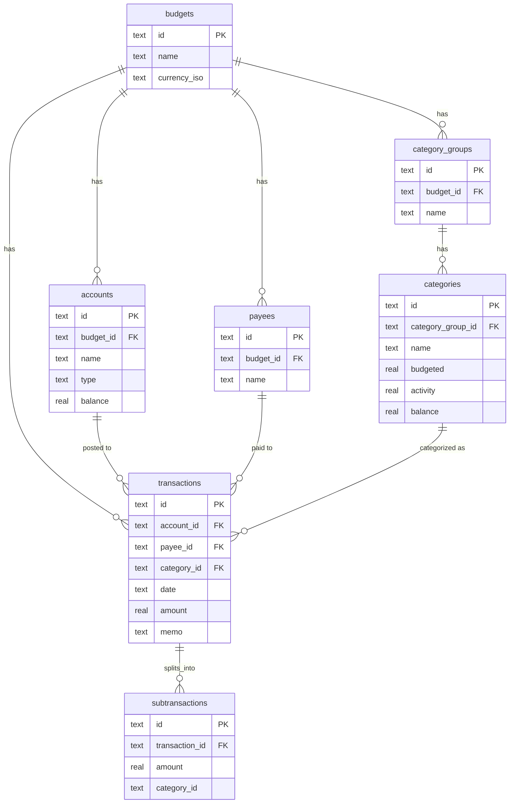

# ynab-sqlite-export


Dump your entire [YNAB](https://www.ynab.com/) account — every budget, account, category, payee, and transaction — into a local SQLite file.

No third-party dependencies. Pure Python 3 standard library (`urllib`, `sqlite3`, `json`, `argparse`).

## Why

YNAB's own reporting is limited to what the app's UI exposes. Once your data is in SQLite you can query it with plain SQL, open it in [DB Browser for SQLite](https://sqlitebrowser.org/), or plug it into pandas, Grafana, a spreadsheet — anything that speaks SQLite.

## Usage

```bash
python3 ynab_to_sqlite.py
```

By default this reads a token from `.env` in the current directory and writes/updates `ynab.db`. Re-running it is incremental (see below) — schedule it however you like (cron, launchd, GitHub Actions) and each run only pulls what changed.

```
usage: ynab_to_sqlite.py [-h] [--db DB] [--env ENV] [--token TOKEN] [--full]

  --db DB        Output SQLite file (default: ynab.db)
  --env ENV      Path to a .env file with YNAB_API_TOKEN (default: .env)
  --token TOKEN  YNAB personal access token (overrides env/--env)
  --full         Ignore stored sync cursors and re-fetch everything from
                 scratch (also rebuilds the schema)
```

Example run:

```
$ python3 ynab_to_sqlite.py
Fetching budget list...
Found 2 budget(s): My Budget, Household

My Budget:
  [full] 12 accounts, 6 category groups (28 categories), 340 payees, 1842 transactions changed/fetched

Household:
  [full] 3 accounts, 9 category groups (31 categories), 210 payees, 967 transactions changed/fetched

Done. Wrote ynab.db

$ python3 ynab_to_sqlite.py    # run it again later — only the diff comes back
Fetching budget list...
Found 2 budget(s): My Budget, Household

My Budget:
  [incremental] 0 accounts, 0 category groups (0 categories), 2 payees, 14 transactions changed/fetched

Household:
  [incremental] 0 accounts, 0 category groups (0 categories), 0 payees, 3 transactions changed/fetched

Done. Wrote ynab.db
```

### Getting a token

Generate a personal access token at [app.ynab.com/settings/developer](https://app.ynab.com/settings/developer). It's read/write by default — this script only reads.

### Auth resolution order

1. `--token` flag
2. `YNAB_API_TOKEN` or `YNAB_API_KEY` environment variable
3. `YNAB_API_TOKEN` or `YNAB_API_KEY` in the `--env` file (copy `.env.example` to `.env` and fill it in)

## What gets dumped

Every budget on the account, with a normalized schema:



| Table | Contents |
|---|---|
| `budgets` | one row per budget |
| `accounts` | checking/savings/credit/tracking accounts, with balances |
| `category_groups` / `categories` | full category tree with budgeted/activity/balance |
| `payees` | payee list |
| `transactions` | every transaction, split by account/category/payee |
| `subtransactions` | split-transaction line items |
| `sync_state` | internal — one row per budget/resource with the last delta cursor (see [Incremental updates](#incremental-updates)) |

All amounts are converted from YNAB's internal milliunits to decimal (e.g. `12340` → `12.34`) and rounded to 2 decimal places.

## Example queries

```sql
-- Spending by category, last 3 months
SELECT c.name, SUM(-t.amount) AS spent
FROM transactions t
JOIN categories c ON c.id = t.category_id
WHERE t.amount < 0 AND t.date >= date('now', '-3 months')
GROUP BY c.name
ORDER BY spent DESC;
```

```
name                    spent
----------------------  -------
Groceries               612.40
Dining Out               284.15
Subscriptions            156.90
Gas                       98.30
```

```sql
-- Top 10 payees by transaction count
SELECT p.name, COUNT(*) AS n, SUM(-t.amount) AS total
FROM transactions t
JOIN payees p ON p.id = t.payee_id
WHERE t.amount < 0
GROUP BY p.name
ORDER BY n DESC
LIMIT 10;
```

```
name                n    total
------------------  ---  -------
Whole Foods         41   890.25
Amazon               33   540.10
Shell Gas             19    98.30
Netflix              12    143.88
```

## Incremental updates

Every run stores YNAB's `server_knowledge` cursor per budget and per resource (accounts/categories/payees/transactions) in a `sync_state` table inside the same `.db` file. The next run passes that cursor back to YNAB and gets only what changed since — not a timestamp comparison, and not a real two-way sync (local edits to the SQLite file are never reconciled back to YNAB or diffed against). It's strictly "replay what's new from YNAB on top of what's already here":

- First run for a budget (or any resource with no stored cursor yet): full fetch, as before.
- Every run after that: only changed/new rows come back, and are upserted (`INSERT OR REPLACE`) by primary key. Deleted-on-YNAB rows come back with `deleted=1` and are updated in place, not removed — same soft-delete convention as a full dump.
- Pass `--full` to force a full rebuild (drops and recreates every table, ignores stored cursors). Use this if the local `.db` ever looks inconsistent, or after a schema change in this script.

This means the tool is safe and cheap to run often (e.g. hourly via cron) — an incremental run against an unchanged budget costs 4 lightweight API calls per budget and writes nothing.

## Using the database with an AI agent

The repo ships context so coding agents can query `ynab.db` correctly out of the box:

- **Claude Code**: a project skill at [`.claude/skills/ynab-db/SKILL.md`](.claude/skills/ynab-db/SKILL.md) loads automatically when you ask questions about the data ("what did I spend on groceries last month?"). It encodes the schema plus the pitfalls that silently break analyses (soft deletes, transfers, split transactions, the `Inflow: Ready to Assign` income convention).
- **Other agents**: [`AGENTS.md`](AGENTS.md) points any agent at the same guidance.

## Notes

- **Rate limits.** YNAB allows ~200 requests/hour per token. A single run does roughly 4 requests per budget (accounts, categories, payees, transactions) regardless of full or incremental mode, so this comfortably fits even for accounts with many budgets. The script retries with backoff on HTTP 429.
- **Nothing budget-specific is hardcoded.** It discovers every budget on the token's account and dumps all of them — no IDs, category names, or assumptions baked in.

## License

MIT — see [LICENSE](LICENSE).
