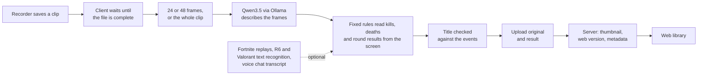

<p align="center">
  
</p>

<p align="center">
  <a href="https://github.com/SauerExe/ReplayHaven/actions/workflows/ci.yml"></a>
  <a href="LICENSE"></a>
  
  
  
</p>

<p align="center">
  <b>Record as usual. ReplayHaven gives every clip a real title, keeps the original on your own server<br>and brings it back in a cinematic web library.</b>
</p>

<p align="center">
  <a href="#quick-start">Quick start</a> ·
  <a href="#screenshots">Screenshots</a> ·
  <a href="#how-it-works">How it works</a> ·
  <a href="#faq">FAQ</a> ·
  <a href="docs/START.md">User guide</a> ·
  <a href="docs/SERVER.md">Server guide</a>
</p>

---

Your clip folder probably looks like `Counter-Strike 2 2026.09.24 - 21.14.07.02.DVR.mp4`, a hundred times over. ReplayHaven turns that into **“Ace on Inferno”** (or “Ace auf Inferno”, titles are written in English or German) with a short description, tags and jump marks, and it does so on your own hardware: a small Windows client analyses each new recording with a local vision model, your own server keeps the original forever, and every device you sign in becomes a place to watch it again, at home or on the road.

## Features

<table>
  <tr>
    <td width="50%" valign="top"><b>Clips that name themselves</b><br>A local vision model looks at 24 or 48 frames of each clip, or one every 3 seconds across the whole clip, and suggests a title, a description, tags and highlight timestamps.</td>
    <td width="50%" valign="top"><b>Titles that stick to the facts</b><br>Kills, deaths, round and match results are read from what the game shows on screen. A title that claims more gets one correction round, otherwise a plain title is built from the confirmed events.</td>
  </tr>
  <tr>
    <td width="50%" valign="top"><b>Your hardware, your clips</b><br>The AI runs on your gaming PC through Ollama. Clips only travel to your own server. No cloud service, no subscription.</td>
    <td width="50%" valign="top"><b>Originals are sacred</b><br>Nothing on the gaming PC is renamed, moved or deleted. The server keeps an untouched copy, even if you delete the file at home.</td>
  </tr>
  <tr>
    <td width="50%" valign="top"><b>A library you want to open</b><br>The newest clip in the spotlight, rows for continue watching, new clips, favourites and each game, a detail view with the AI's jump marks, a full-screen player that skips from highlight to highlight, a library sorted by game with covers, search, filters, your own collections and automatic ones built from tags, on desktop and phone.</td>
    <td width="50%" valign="top"><b>Accounts, like Immich</b><br>Everyone signs in with their own account; a phone signs in by scanning a QR code. Single sign-on through Authelia or any other OpenID Connect provider is optional. Admins manage the archive, users watch.</td>
  </tr>
  <tr>
    <td width="50%" valign="top"><b>Pair a PC with a code</b><br>The client only needs the server address. It shows a six-digit code, you approve the same code in the web library, and the PC gets its own access that you can revoke at any time.</td>
    <td width="50%" valign="top"><b>Smooth over the internet</b><br>Heavy recordings such as 1080p120 at 50 Mbit/s get a lighter web version for streaming in the background. Downloads always deliver the untouched original.</td>
  </tr>
  <tr>
    <td width="50%" valign="top"><b>Out of the way while you play</b><br>As long as a game runs in full screen, the client only notes new clips and leaves GPU, CPU and connection to the game. One minute after you stop, it works through the queue.</td>
    <td width="50%" valign="top"><b>One small container</b><br>Node.js, SQLite and FFmpeg in a single Docker image. No GPU needed on the server. Runs on a NAS, a mini PC or any Linux box, at home or behind a reverse proxy.</td>
  </tr>
  <tr>
    <td width="50%" valign="top"><b>Extra precision for some games</b><br>Optional: Fortnite kills with weapon class and distance straight from the match replays, Rainbow Six map and round results and the Valorant killfeed from on-device text recognition, and a voice chat transcript for fun clips.</td>
    <td width="50%" valign="top"><b>Everything stays editable</b><br>AI results are suggestions. Titles, descriptions and tags can be changed, and a title or tags you set yourself stay when a clip is analysed again.</td>
  </tr>
</table>

The web library and the Windows client are in English by default and switch to German in their settings.

## Screenshots

<p align="center">
  
  <br><sub>The web library: the newest clip in the spotlight, everything else in rows below.</sub>
</p>

<table>
  <tr>
    <td width="50%"><br><sub>What the local AI found in a clip: title, description, tags and highlights.</sub></td>
    <td width="50%"><br><sub>The full-screen player marks every highlight and jumps to the next one.</sub></td>
  </tr>
  <tr>
    <td width="50%"><br><sub>The whole archive, by game, with search and filters.</sub></td>
    <td width="50%"><br><sub>Pick a game: cover, genre, release date and description are looked up automatically.</sub></td>
  </tr>
  <tr>
    <td width="50%"><br><sub>Automatic collections such as Aces, Clutches, Multi-kills or Trickshots fill themselves from your tags.</sub></td>
    <td width="50%"><br><sub>Settings → Recording PCs: connect this PC with one click, or approve a new PC when it shows the same code.</sub></td>
  </tr>
</table>

<p align="center">
  
  <br><sub>The Windows client: the clip in progress, what is queued and what just arrived in your archive.</sub>
</p>

<details>
<summary><b>On the phone</b></summary>
<p align="center"></p>
</details>

<sub>Screenshots use the built-in demo artwork and example texts; the example titles are German, the language the AI writes in is a client setting.</sub>

## How it works

<picture>
  <source media="(prefers-color-scheme: dark)" srcset="docs/images/architecture-dark.png">
  
</picture>

What happens when you save a clip:



Analysis can be switched off in the client. Clips are then archived without AI metadata, and the client works as a plain upload agent. How the recognition works and what has been measured is described in [docs/AI-RECOGNITION.md](docs/AI-RECOGNITION.md).

## Quick start

You need a machine for the server (anything that runs Docker) and the Windows PC you play on. Both can be the same machine.

### 1. Server

Install Docker Engine with the Compose plugin ([guide](https://docs.docker.com/engine/install/)), then:

```bash
curl -fsSL https://github.com/SauerExe/ReplayHaven/releases/latest/download/install.sh | bash
```

The installer creates `./replayhaven` with `compose.yaml` and a `.env` from the latest release (checked against the release's `SHA256SUMS.txt`, which catches broken downloads; both come from the same release, so it is no signature), generates the access key, asks for the address you open in the browser (your LAN address is suggested), starts the published multi-arch image `ghcr.io/sauerexe/replayhaven` and prints a setup link. Running it again, in the same directory or inside `replayhaven/`, updates to the latest release, keeps your `.env` and backs up the database first. Want to read it first? Download [`install.sh`](https://github.com/SauerExe/ReplayHaven/releases/latest/download/install.sh) and run `bash install.sh`.

Open the setup link to create your admin account. It carries the access key from `.env` in the part after `#`, which the browser never sends to the server; the page removes it from the address bar right away. The key is needed once, so nobody else can claim a server that is already reachable. Lost the link? `docker compose logs replayhaven` shows it until the first account exists, or open the server address and enter `REPLAYHAVEN_ACCESS_TOKEN` from `.env`. Other devices then sign in with name and password, or scan the QR code under **Settings → Devices → Connect phone**.

Using Portainer or Coolify? Add the repository as a stack in Portainer, or deploy [`docker-compose.coolify.yml`](docker-compose.coolify.yml) in Coolify, which generates the domain and the access key; both are described in [docs/SERVER.md](docs/SERVER.md#portainer).

<details>
<summary><b>By hand, or from a source checkout</b></summary>

From a published release, without the installer:

```bash
mkdir -p replayhaven && cd replayhaven
curl -fsSLO https://github.com/SauerExe/ReplayHaven/releases/latest/download/compose.yaml
curl -fsSL  https://github.com/SauerExe/ReplayHaven/releases/latest/download/env.example -o .env
# edit .env: REPLAYHAVEN_ACCESS_TOKEN (openssl rand -hex 24) and REPLAYHAVEN_PUBLIC_ORIGIN (http://<server-ip>:8787)
docker compose up -d
```

From source, building the image yourself:

```bash
git clone https://github.com/SauerExe/ReplayHaven.git && cd ReplayHaven
bash setup-server.sh
```

Running `setup-server.sh` again after `git pull` rebuilds and keeps your `.env`.

</details>

Running it behind Coolify, Traefik, Caddy or nginx, with Authelia or another single sign-on, is covered in [docs/SERVER.md](docs/SERVER.md).

### 2. Gaming PC

1. Install `ReplayHaven-Client-Setup.exe` from the [releases](https://github.com/SauerExe/ReplayHaven/releases) or from **Settings → Recording PCs** on your server. The installer is not code-signed yet, so SmartScreen asks for confirmation; every release lists SHA-256 checksums and carries a GitHub build attestation, so `gh attestation verify ReplayHaven-Client-Setup.exe --repo SauerExe/ReplayHaven` shows it was built by the release workflow from the tagged commit. No release yet? Build it on Windows with `npm ci && npm run client:build`.
2. Connect it: on the gaming PC, open the web library, go to **Settings → Recording PCs** and click **Connect this PC**. The client opens and pairs itself, no address or code to type. Alternatively the setup assistant lists servers it finds in your home network, or you enter the address and approve the six-digit code in the web library.
3. Pick your recording folder (subfolders included).
4. Pick the model size and click **Install Ollama**: the assistant downloads the official Ollama installer, checks its checksum, installs it without admin rights and then downloads the model once (Qwen3.5 9B, about 6.6 GB, or 4B, about 3.4 GB).
5. Enter your in-game names, choose the optional extras and finish. New recordings are analysed once they are completely written and show up in the library a minute or two later.

The full user guide with every option and troubleshooting is [docs/START.md](docs/START.md).

## Game extras

These are optional and off by default. They add facts the frames alone cannot deliver reliably.

| Game              | What it adds                                                                         | Where it comes from                                                            |
| ----------------- | ------------------------------------------------------------------------------------ | ------------------------------------------------------------------------------ |
| Fortnite          | Your kills and knocks with weapon class and distance, your elimination and victory   | The match replays Fortnite writes to `%LOCALAPPDATA%\FortniteGame\Saved\Demos` |
| Rainbow Six Siege | Map name and round results                                                           | Text recognition (PaddleOCR on ONNX Runtime) on the CPU, next to the GPU model |
| Valorant          | Your kills, headshots and deaths from the killfeed                                   | The same text recognition, matched against the player names you entered        |
| Any game          | What was said in voice chat, as context for fun clips without kills or round results | Parakeet speech recognition on the CPU; the transcript never leaves your PC    |

Command-line tools show what these sources contribute to your own clips before you rely on them, without AI and without uploading anything: `npm run fortnite`, `npm run r6`, `npm run audio`, `npm run laughs` and `npm run r6-replays`. The research notes and measurement plans behind them are in [docs](docs).

## Privacy

- **The AI runs on your PC.** With the Windows client, frames go to Ollama on the same machine. Nothing is sent to an AI service.
- **Clips go to your server only.** Apart from Ollama on the same PC, the client talks to the server address you entered. It also learns about client updates from that server, not from GitHub. Models are downloaded once when you ask for them: Qwen3.5 through Ollama, the speech models for the voice chat transcript from Hugging Face and GitHub.
- **Your server, your accounts.** Passwords are stored as scrypt hashes, sessions and paired PCs can be revoked one by one, and single sign-on only talks to the provider you configure.
- **Game info by name.** The server looks up game names on Steam (and on IGDB if you add a key) to show covers and descriptions. Only the game name is sent. Without internet access the library simply shows no cover.
- **Server-side AI is opt-in.** If you configure Gemini as the server's AI provider, clips or frames from them are sent to Google for analysis. It is off unless you set it.
- **Replays stay local.** Fortnite replays list every player in a match. ReplayHaven takes only your own events from them; the other names are not used. Rainbow Six replays the client keeps for later stay on your PC.

## Requirements

| Component  | Requirement                                                                                                                                                    |
| ---------- | -------------------------------------------------------------------------------------------------------------------------------------------------------------- |
| Server     | Docker Engine 24+ with Compose v2.24.4+, linux/amd64 or linux/arm64, disk space for your clips. Without Docker: Node.js 22.13+ and FFmpeg.                     |
| Gaming PC  | Windows 10/11 x64. For local AI: [Ollama](https://ollama.com) and a GPU with about 10 GB VRAM for Qwen3.5 9B, or 6 to 8 GB for 4B. CPU-only works, but slowly. |
| Recordings | MP4, M4V, MOV, WebM or MKV, up to 2 GB, 30 minutes and 8K per file. Light H.264 MP4 plays directly; everything else gets a web version transcoded on the CPU.  |
| Recorder   | Anything that writes files into a folder: NVIDIA App (Instant Replay), OBS, Xbox Game Bar and others.                                                          |
| Browser    | Any current browser on desktop, tablet or phone. The library can be added to a phone's home screen.                                                            |

<details>
<summary><b>Configuration</b></summary>

All server settings are environment variables, documented in [`.env.example`](.env.example). The important ones:

| Variable                          | Purpose                                                                                                             |
| --------------------------------- | ------------------------------------------------------------------------------------------------------------------- |
| `REPLAYHAVEN_ACCESS_TOKEN`        | Key for creating the first account; it opens nothing once an account exists. At least 24 characters. Required.      |
| `REPLAYHAVEN_PUBLIC_ORIGIN`       | The address people open, e.g. `https://clips.example.com`. Several are allowed, separated by commas.                |
| `REPLAYHAVEN_TRUST_PROXY`         | Trust `X-Forwarded-*` headers behind a reverse proxy such as Traefik, Caddy or nginx.                               |
| `REPLAYHAVEN_HOST_PORT`           | Host port published by Compose (default 8787).                                                                      |
| `REPLAYHAVEN_IMAGE`               | Image to run. Defaults to the published GHCR image; `setup-server.sh` sets `replayhaven:local`.                     |
| `REPLAYHAVEN_PLAYBACK`            | `web` (default) creates lighter web versions of heavy clips; `original` always plays the original.                  |
| `REPLAYHAVEN_OIDC_*`              | Single sign-on through Authelia, Authentik, Keycloak or Pocket ID; `REPLAYHAVEN_PASSWORD_LOGIN=false` for SSO only. |
| `REPLAYHAVEN_CLIENT_DOWNLOAD_URL` | Where the download button points when no installer is mounted in `./release`. Release images set this.              |
| `REPLAYHAVEN_AI_PROVIDER`         | Optional server-side analysis (`none`, `local`, `gemini`). Not needed with the Windows client.                      |

Operations, backups, roles, reverse proxies, single sign-on and server-side AI are covered in [docs/SERVER.md](docs/SERVER.md).

</details>

## What's next

Ideas for later: share links, and laughs and shouts from the microphone track as highlight markers. Audio cues and Rainbow Six replay events only go into the analysis once measurements on real clips show that they help.

## FAQ

<details>
<summary><b>Does ReplayHaven delete or move my recordings?</b></summary>

No. The client only reads. Originals on the gaming PC stay where they are, and the server keeps its own copy even after you delete the file at home. Removing a clip from the library keeps the original on the server.

</details>

<details>
<summary><b>Is the interface in English?</b></summary>

Yes. The web library, the sign-in screens and the Windows client are English by default and can be switched to German under **Settings → Appearance** (web) or **Settings → Language** (client). The titles, descriptions and jump marks the AI writes are English or German, set under **Settings → Local AI → Title language** in the client; on first setup they follow the window language. The analysis itself runs in German, the language all measurements were made in, and the checked German result is translated. The translation must keep the kill count, every number and the map; otherwise the checked German text is kept. Tags are stored in German and shown in the interface language.

</details>

<details>
<summary><b>Do I need a powerful GPU?</b></summary>

For the local AI, a GPU with about 10 GB VRAM keeps analysis quick with Qwen3.5 9B; with 6 to 8 GB, choose the 4B model in the client, which is smaller but not measured as thoroughly. Without one, Ollama runs on the CPU and takes much longer. You can also switch analysis off and use ReplayHaven as a plain archive. The server needs no GPU at all.

</details>

<details>
<summary><b>Does the client slow down my games?</b></summary>

It tries hard not to. With **Pause while gaming** (on by default), analysis and upload wait while a game fills the screen and continue one minute after you stop playing. New clips are still noticed and queued in the meantime.

</details>

<details>
<summary><b>Which games work?</b></summary>

All of them. Every clip gets a title and a description. Event tags such as kills or round wins need an on-screen message, so games without kill or round banners (co-op, survival, sandbox) get a title and description but no event tags. The voice chat transcript helps those clips get a title that fits. Event messages are recognised in English and German game interfaces; with the game set to another language, clips still get a title and description, but no event tags. The phrases live in `agent/events.ts`, and more languages are welcome as contributions.

</details>

<details>
<summary><b>How good are the titles?</b></summary>

They are suggestions from a model that sees frames, not the full video, so short moments can slip between them. Titles are checked against the events read from the screen, and everything can be edited. The analysis records its confidence with every result. Measurements on real clips are in [docs/AI-RECOGNITION.md](docs/AI-RECOGNITION.md).

</details>

<details>
<summary><b>Can I reach my library from outside my home?</b></summary>

Yes, behind an HTTPS reverse proxy or a VPN. Every device signs in with its own account (or a QR code), recording PCs are paired by approving their code, and heavy clips get a lighter web version so they play smoothly over a normal upload line. See [docs/SERVER.md](docs/SERVER.md) and [SECURITY.md](SECURITY.md).

</details>

<details>
<summary><b>Can friends or family watch too?</b></summary>

Yes. An admin creates accounts under **Settings → Users**, or lets them sign in through your single sign-on. Users can watch and download; editing, uploading, pairing PCs and managing accounts stay with admins.

</details>

<details>
<summary><b>Is there a macOS or Linux client?</b></summary>

Not yet. The server and the web library run anywhere; the client that watches the recording folder is Windows-only for now. Admins can upload clips from the browser on every system.

</details>

## Development

Node.js 22.13 or newer is required (SQLite is built in); CI and the Docker image use Node.js 24. `node:sqlite` is not yet marked stable by Node.js; the server uses only its basic synchronous API, keeps it behind `server/database.ts`, and the Docker image pins the Node.js major version, so a Node.js update cannot change it unnoticed. The web UI and server run on Windows, macOS and Linux; the client installer is built on Windows.

```bash
npm ci
npm run media:refresh  # optional: game artwork for the demo library, fetched from Steam
npm run dev:all        # web UI on http://localhost:5173, server on 127.0.0.1:8787
```

The demo artwork belongs to the game publishers and is not part of the repository; without it the demo library shows empty tiles.

<details>
<summary><b>All commands</b></summary>

| Command                 | What it does                                                                                       |
| ----------------------- | -------------------------------------------------------------------------------------------------- |
| `npm run dev`           | Web UI only (Vite, demo data, `/api` proxied to the server), on this machine                       |
| `npm run dev:lan`       | The same, reachable from your network (e.g. a phone); a server without accounts stays closed to it |
| `npm run server`        | Server only, loopback, no access key needed                                                        |
| `npm run client:dev`    | Windows client in Electron                                                                         |
| `npm run check`         | Typecheck, ESLint and unit tests                                                                   |
| `npm run format`        | Prettier                                                                                           |
| `npm run test:e2e`      | Playwright browser tests (`npx playwright install chromium` once)                                  |
| `npm run build`         | Production web UI into `dist/`                                                                     |
| `npm run server:bundle` | Server bundle into `server-bundle/`                                                                |
| `npm run docker:build`  | Server image `replayhaven:local`                                                                   |
| `npm run client:build`  | Windows installer into `release/` (Windows only)                                                   |
| `npm run check:browser` | Screenshots of all views at 390–1920 px into `artifacts/visual/`                                   |
| `npm run readme:images` | Regenerates the images in `docs/images` from the real interface (needs demo artwork)               |

</details>

| Directory | Contents                                                                              |
| --------- | ------------------------------------------------------------------------------------- |
| `src`     | React web UI, domain models, demo data layer; home page and player in `src/streaming` |
| `server`  | Fastify API, SQLite, accounts and pairing, media processing, optional AI providers    |
| `agent`   | Folder watcher, upload retries, Ollama integration, game extras and measurement tools |
| `desktop` | Electron client (main, preload, renderer)                                             |
| `scripts` | Build, packaging, media refresh, browser checks and README images                     |
| `docs`    | Guides, design briefs, research notes and measurement plans                           |

The product and design brief is [docs/DESIGN.md](docs/DESIGN.md), and every settings screen follows [docs/SETTINGS-DESIGN.md](docs/SETTINGS-DESIGN.md). Read them before changing anything user-facing.

**Releasing:** work lands in `develop` through pull requests; for a release, merge `develop` into `main` by pull request, then tag that commit as `vX.Y.Z` and push the tag (the workflow refuses tags that are not on `main`). The release workflow builds the Windows installer, publishes the multi-arch server image to `ghcr.io/sauerexe/replayhaven` and creates a GitHub release with installer, pinned `compose.yaml`, env template, setup script and checksums.

## Contributing

Bug reports, ideas and pull requests are welcome, see [CONTRIBUTING.md](CONTRIBUTING.md). Please report security issues privately as described in [SECURITY.md](SECURITY.md).

## Support

ReplayHaven is free for personal use and built in spare time. If it is useful to you, a tip via [PayPal](https://paypal.me/vvashed) (the maintainer's account) helps. Admins see a small reminder in the web library at most every four days; **Later** or **I already donated** hide it, and `REPLAYHAVEN_SUPPORT_BANNER=false` switches it off for the whole server. Family and friends on your server never see it.

## License

ReplayHaven is source-available, not open source in the OSI sense: the code is public, but commercial use needs permission.

[PolyForm Noncommercial 1.0.0](LICENSE): free for personal use, hobby projects, research, schools, charities and other non-commercial purposes, including changing and sharing it on the same terms. Selling ReplayHaven, offering it as a paid service or using it for commercial purposes is not allowed without permission; ask via [GitHub](https://github.com/SauerExe/ReplayHaven/issues) if you need that.

The demo artwork and trailers belong to their publishers, and the Windows installer bundles GPL-licensed FFmpeg builds; details in [THIRD-PARTY.md](THIRD-PARTY.md).
