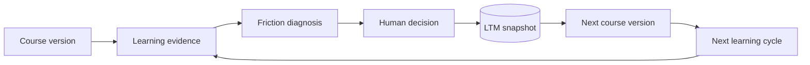

[English](README.md) | [中文](README.zh.md)

# Plot Ark — Observe · Remember · Improve

[](https://www.gnu.org/licenses/agpl-3.0)
[](https://github.com/Schlaflied/Plot-Ark/stargazers)
[](https://github.com/Schlaflied/Plot-Ark/forks)
[](https://docs.docker.com/compose/)
[](https://www.python.org/)
[](https://flask.palletsprojects.com/)
[](https://react.dev/)
[](https://www.postgresql.org/)
[](https://redis.io/)
[](https://github.com/HKUDS/LightRAG)
[](https://xapi.com/)
[](https://tavily.com/)
[](https://www.imsglobal.org/)
[](https://github.com/Jenqyang/Awesome-AI-Agents)
[](https://github.com/aden-hive/hive)
[](https://github.com/aden-hive/hive/pulls?q=author%3ASchlaflied)

<p align="center">
  
</p>

<h3 align="center">
  👉 <a href="https://schlaflied.github.io/Plot-Ark/">Visit the Official Landing Page</a> 👈
</h3>

**Plot Ark is an open-source long-term memory for course improvement. It connects each course version to the evidence that prompted a change, the human decision that followed, and the results observed in the next learning cycle.**

Most learning platforms show what happened once: completion, time spent, scores, or feedback. Plot Ark is built for the question that comes next:

> **We changed the course. Did it actually get better?**

Plot Ark keeps that answer traceable across repeated analysis runs:

1. collect course structure, learner behavior, and learner voice;
2. diagnose where learning friction is concentrated;
3. let a human accept, reject, or revise the recommendation;
4. persist the evidence and decision in long-term memory (LTM);
5. compare the next course version and cohort against the earlier run.



### Two workspaces, one improvement loop

| | Academic | Enterprise L&D |
|---|---|---|
| **Primary question** | Where are students struggling, and how should the course change? | Where does training lose people, and what should the next version fix? |
| **People** | Professor / Student | Admin / User |
| **Typical inputs** | Syllabus, course materials, xAPI events, concept annotations, student feedback | SCORM/PDF/PPTX/DOCX materials, LMS CSV/XLSX exports, Learner Pulse; xAPI optional |
| **Evidence level** | Individual self-view plus privacy-safe cohort analysis | Cohort-level diagnosis; no employee ranking |
| **Human control** | Instructor reviews curriculum suggestions | L&D owner reviews revision recommendations |
| **Memory** | Analysis snapshots preserve course changes across teaching cycles | The same LTM model is intended to compare training versions and later business evidence |
| **Current state** | Functional end-to-end backend and UI | Product preview with synthetic data; server-side ingestion and parsing are roadmap work |

The two workspaces are not separate products. They share the same core: **evidence → diagnosis → human decision → LTM → next version**.

---

## Explore Plot Ark

| Area | What it contains |
|---|---|
| [Academic workspace](docs/ACADEMIC.md) | Course generation, xAPI evidence, LightRAG knowledge graph, learner self-view, A2A diagnosis, LTM, and instructor-governed revision |
| [Enterprise L&D workspace](docs/ENTERPRISE.md) | LMS/HCM-adjacent workflow, practical file inputs, Learner Pulse, privacy boundary, current preview, and planned ingestion backend |
| [Full system architecture](ARCHITECTURE.md) | Page flows, services, database schema, privacy red lines, and project structure |
| [Interactive landing page](https://schlaflied.github.io/Plot-Ark/) | Visual product overview and demos |
| [Releases](https://github.com/Schlaflied/Plot-Ark/releases) | Version history and shipped changes |

---

## 🏗️ Architecture
**System Architecture**

```
┌───────────────────────────────────────────────────────────────────────────────────────────┐
│  Frontend (React + TypeScript + Vite)                                                      │
│  ┌──────────┐ ┌──────────┐ ┌──────────┐ ┌───────────┐ ┌─────────┐ ┌──────────┐ ┌────────┐│
│  │ Generate  │ │ Courses  │ │  Course  │ │ Knowledge │ │ Student │ │ Student  │ │Settings││
│  │   Page    │ │   Page   │ │   Page   │ │   Graph   │ │  Data   │ │ Profile  │ │ (Prof) ││
│  └────┬─────┘ └────┬─────┘ └────┬─────┘ └─────┬─────┘ └────┬────┘ └────┬─────┘ └───┬────┘│
│       │            │            │              │            │           │            │     │
│  components/ui/  components/generate/    components/analytics/  ModelSelection (shared)   │
│  (Select, Input)   (SyllabusUpload)   (TrendChart, ReportSections, ...)                   │
│                             GraphViewer (2D KG + mastery overlay)                          │
│                                              SSE streaming                                 │
└───────┼────────────┼────────────┼──────────────┼────────────┼───────────┼────────────┼─────┘
        │            │            │              │            │           │            │
        ▼            ▼            ▼              ▼            ▼           ▼            ▼
┌───────────────────────────────────────────────────────────────────────────────────────────┐
│  Backend (Flask + Blueprints)                                                              │
│  ├── app.py (~30 lines, routing)         ├── config.py (18 models + env constants)        │
│  ├── extensions.py (Global instances)    ├── async_loop.py (Event loop)                   │
│  ├──────────────────────────────────────────────────────────────────────────────────────┐  │
│  │  routes/                                                                              │  │
│  │  ├── curriculum.py           generate / skeleton / expand / save                      │  │
│  │  ├── curriculum_agent_routes flags / suggestions / apply / redo                       │  │
│  │  ├── history.py              CRUD + favorite + DOCX export                            │  │
│  │  ├── analytics.py            A2A SSE + history API + export                           │  │
│  │  ├── xapi.py                 xAPI statements + mock data seed                         │  │
│  │  ├── feedback.py             Student sentiment + comments                             │  │
│  │  ├── profile.py              Profile CRUD + model_config + Fernet API keys            │  │
│  │  ├── settings.py             Professor settings (preferences, models, prompts)        │  │
│  │  ├── graph.py                KG data + RAG query + /courses lookup                    │  │
│  │  ├── annotations.py          KG concept annotations + aggregation                     │  │
│  │  ├── sources.py              Tavily source preview                                    │  │
│  │  ├── syllabus.py             PDF/DOCX parse + import                                  │  │
│  │  └── materials.py            LightRAG ingest                                          │  │
│  └──────────────────────────────────────────────────────────────────────────────────────┘  │
│  ┌─────────────────────────────┐  ┌──────────────────────────────────────────┐   │
│  │  agents/ (Hive-style A2A)   │  │  services/                               │   │
│  │  ├── base.py (BaseNode)     │  │  ├── research.py (Tavily)                │   │
│  │  ├── orchestrator.py        │  │  ├── file_parser.py                      │   │
│  │  ├── behavior_analyst.py    │  │  ├── prompt_builder.py                   │   │
│  │  ├── risk_detector.py       │  │  ├── xapi_generator.py (⚡ aware)        │   │
│  │  ├── content_optimizer.py   │  │  ├── student_diagnosis.py (diagnosis)    │   │
│  │  ├── cohort_comparator.py   │  │  ├── report_exporter.py (facade)         │   │
│  │  ├── kg_context_analyst.py  │  │  ├── chart_generator.py (+history)       │   │
│  │  └── curriculum_agent.py    │  │  ├── ltm_writer.py (Cold layer)          │   │
│  │       SharedMemory (Redis)  │  │  ├── threshold_checker.py                │   │
│  └──────────┬──────────────────┘  │  ├── kg_mapper.py (3-layer match)        │   │
│             │                     │  └── export_{pdf,docx,excel}.py          │   │
│             │                     └──────────────┬───────────────────────────┘   │
└─────────────┼────────────────────────────────────┼──────────────────────────────┘
              │                                    │
              ▼                                    ▼
┌───────────────────────┐  ┌──────────┐  ┌──────────────┐  ┌──────────────┐
│  PostgreSQL            │  │  Redis   │  │   LightRAG   │  │  data/ltm/   │
│  ├── curricula         │  │ (🔴 Hot: │  │  GraphML KG  │  │  (🔵 Cold:   │
│  ├── xapi_statements   │  │  pipeline│  │  (Hot Layer) │  │   .md YAML   │
│  ├── student_profiles  │  │  runtime)│  │              │  │   snapshots) │
│  ├── concept_          │  │          │  │              │  │              │
│  │   annotations       │  │          │  │              │  │              │
│  └── 🟡 Warm:          │  │          │  │              │  │              │
│      snapshots/mastery │  │          │  │              │  │              │
└───────────────────────┘  └──────────┘  └──────────────┘  └──────────────┘
```

**Full Project Pipeline**


**LTM 3-Layer Architecture**


**Full Agentic Loop**


📐 **Full architecture, page-by-page data flows, database schema, red lines, and project structure → [ARCHITECTURE.md](ARCHITECTURE.md)**

---

## 🛠️ Tech Stack

| Layer | Technology | Role |
|-------|-----------|------|
| **Frontend** | React + TypeScript + Vite | Module editor, A2A dashboard, SSE client, drag-and-drop |
| **Backend** | Python + Flask Blueprints | Modular route-based API (10 Blueprints + 6 Agents + 6 Services) |
| **AI** | OpenAI GPT-4o / Google Gemini | Content generation & A2A analysis (via `AI_PROVIDER`); A2A agents are sql-only — **zero LLM cost** for analytics |
| **Research Agent** | Tavily Search API | Pre-generation academic source retrieval |
| **Database** | PostgreSQL | Curricula, xAPI statements, student feedback, `course_analysis_snapshots` (LTM) |
| **Cache & Memory**| Redis | Graph query cache, learner state, A2A shared memory (`a2a:{session}:{key}`) |
| **Knowledge Graph**| LightRAG + networkx + react-force-graph-2d| Course material ingestion → interactive concept graph |
| **Behavior Data** | xAPI 1.0.3 + mini-LRS | Statement ingestion → mock data engine (4 noise levels) → professor analytics panel |
| **Analytics Engine**| A2A multi-agent (Hive-style, sql-only Phase 1) | 5-node pipeline: Orchestrator + 4 parallel agents; token tracking; LTM snapshot |
| **Report Export** | ReportLab + python-docx + openpyxl + matplotlib | PDF (Anthropic-style cover), DOCX, Excel; filenames include course slug + noise label |
| **Curriculum Export** | IMS Common Cartridge + DOCX + PDF + Markdown | LMS-compatible output in multiple formats |
| **Dev** | Docker Compose | Single-command local environment (frontend :5173, backend :5000) |

---

## 🚀 Quick Start

**Prerequisites:** Docker, an OpenAI or Gemini API key, a Tavily API key (free tier at tavily.com)

```bash
git clone https://github.com/Schlaflied/Plot-Ark
cd Plot-Ark

cp .env.example .env
# Set AI_PROVIDER=openai or AI_PROVIDER=gemini
# Add the corresponding API key + TAVILY_API_KEY

docker compose up --build
```

| Service | URL |
|---------|-----|
| Frontend | http://localhost:5173 |
| Backend | http://localhost:5000 |

The login screen offers two workspaces:

- **Academic** — Professor / Student
- **Enterprise** — Admin / User

The Enterprise workspace ships with synthetic data for product evaluation. Its file selector currently performs client-side format, file-count, and size validation; it does not yet upload or parse the selected files on the backend.

---

## 🕸️ Using the Knowledge Graph

The knowledge graph feature lets you ingest your own course materials (PDFs, PPTXs, or DOCXs) and explore them as an interactive concept map.

1. Go to the **Knowledge Graph** tab
2. In the **Upload Materials** panel on the right, fill in:
   - **Subject name** (required) — e.g. "Organizational Behavior"
   - **Course code** (optional) — e.g. "ADMS 2400"
   - **Year** (required) — which year of study this course belongs to
3. Drop your PDF / PPTX / DOCX files into the dropzone
4. Click **Build Graph** — ingestion runs in the background (~$0.10–0.30 per 10 PDFs at gpt-4o-mini rates)
5. Once complete, the graph appears automatically under the correct year and course tab

---

## 🗺️ Roadmap

- [x] KG ↔ Curriculum concept mapping — 3-layer matching (word-boundary + abbreviation + reverse lookup)
- [x] Knowledge Map tab — per-module KG concepts with definitions + cross-module dependencies
- [x] Concept mastery tracking — xAPI verb + feedback → `cohort_concept_mastery`; auto-sync after every analysis run
- [x] GraphViewer mastery overlay — fill = mastery level, border = knowledge layer; unified gray for untracked concepts
- [x] KG bidirectional annotation — students mark confused/important; professors mark exam focus; anonymous aggregation feeds confusion heatmap
- [x] KG → Agentic Loop — `KGContextAnalystNode` injects per-concept confusion % + top confused concepts into CurriculumAgent context
- [x] GraphViewer role-split — student view (mastery filters + confusion social signal) vs professor view (high confusion heatmap + exam focus)
- [x] xAPI ↔ KG bridge — KG annotation events mirror to xAPI statements (verb: flagged / noted); full signal unification
- [x] Student Profile — 4-tab profile with avatar, discipline selector (5 disciplines), CP/OC narrative anchors, and progress color blocks
- [x] One-sentence diagnosis — template-driven concept-gap guidance with "Jump to Module" navigation
- [x] AI Settings — custom prompt instructions + clickable ideas library with auto-save
- [x] Multi-persona sets — multiple character groups with relationship tags, gender, personality descriptions, linked courses
- [x] Multi-model Agent Team — 18 preset models across 9 providers + custom model support; ★ recommended tags, ⚠ MoE warnings, dynamic API keys
- [x] Professor Settings Portal — profile, academic preferences, model defaults, prompt templates; all with auto-save
- [x] Per-provider API keys — Fernet-encrypted storage, dynamic detection, masked GET responses
- [x] Professor prompt template editor — DB-backed prompt management with version control and variable highlighting
- [x] Week 1 hardening — fail-closed encrypted BYOK storage, browser-secret removal, and main application CI
- [x] Enterprise L&D Preview — workspace-aware Admin/User login, synthetic compliance-training diagnosis, evidence chain, Learner Pulse, and HITL revision review
- [x] Enterprise source-intake contract — SCORM ZIP/PDF/PPTX/DOCX/XLSX/CSV selector with explicit client-side count and size limits; xAPI remains optional
- [ ] Enterprise ingestion backend — safe static SCORM manifest/content extraction, persisted uploads, CSV/XLSX field mapping, evidence coverage, and revision-brief export
- [ ] Assignment Timeline + Due Date calculator
- [ ] A2A Phase 2 — LLM integration for CurriculumAgent (dense model required); other agents remain sql-only
- [ ] Progressive summarization — semester-level LTM summaries for LLM context management
- [ ] LTI 1.3 — push into Canvas / Moodle

---

## 📄 License

GNU Affero General Public License v3.0 — see [LICENSE](LICENSE)

- Free for personal use, research, and open-source projects
- Modifications must be open-sourced under the same license
- Network deployment requires your product to also be open-source
- Commercial licensing — open a GitHub Issue

---

## Featured In

- 🌟 [Awesome-AI-Agents](https://github.com/Jenqyang/Awesome-AI-Agents) — agentic EdTech curriculum engine

---

## ⭐ Star History

<a href="https://www.star-history.com/#Schlaflied/Plot-Ark&Date">
 <picture>
   <source media="(prefers-color-scheme: dark)" srcset="https://api.star-history.com/svg?repos=Schlaflied/Plot-Ark&type=Date&theme=dark" />
   <source media="(prefers-color-scheme: light)" srcset="https://api.star-history.com/svg?repos=Schlaflied/Plot-Ark&type=Date" />
   
 </picture>
</a>

---

## 🙏 Acknowledgements

Architectural inspiration from [Hive](https://github.com/aden-hive/hive) (YC-backed AI agent infrastructure) — the node pipeline, shared memory, and evolution loop patterns informed the agentic curriculum engine design.

Knowledge graph layer powered by [LightRAG](https://github.com/HKUDS/LightRAG) (HKUDS) — incremental knowledge graph construction and prerequisite inference across course materials.

Two-phase generation pipeline design inspired by [OpenMAIC](https://github.com/THU-MAIC/OpenMAIC) (Tsinghua University) — the outline-first, then expand pattern informed Plot Ark's curriculum skeleton generation approach.

Built with [Claude](https://claude.ai) (Anthropic) as AI pair programmer.

Special thanks to the two chief quality assurance officers who supervised every late-night coding session — **Icy** (冰糖, white) and **雪梨** (calico):

<p align="center">
  
</p>

---

<div align="center">

[Report Bug](https://github.com/Schlaflied/Plot-Ark/issues) · [Request Feature](https://github.com/Schlaflied/Plot-Ark/issues)

**Star this repo if it's useful.**

</div>
