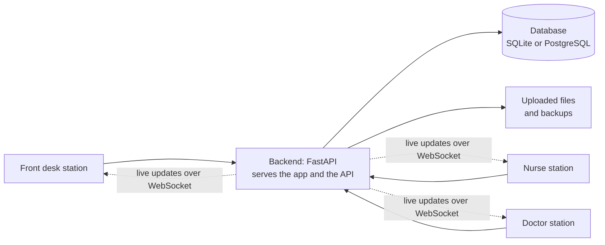

<a id="readme-top"></a>

<!-- PROJECT SHIELDS -->
[](https://python.org)
[](https://fastapi.tiangolo.com/)
[](https://react.dev/)
[](https://www.typescriptlang.org/)
[](#)
[](#)

<br />
<div align="center">
  
  <h3 align="center">HAU-Sync</h3>

  <p align="center">
    Patient Record Management and Appointment System for the Holy Angel University Clinic.
    <br />
    <br />
    <strong>Tags:</strong> <code>python</code>, <code>fastapi</code>, <code>react</code>, <code>typescript</code>, <code>health-tech</code>, <code>data-privacy</code>
  </p>
</div>

> **🚧 UNDER TEST:** Every feature in the project paper is built except the urgent-case queue, which the team left out. The system is being tested by the team before it is shown to the University Clinic. **Use made-up data only.** Never enter real patient details while testing.

<details>
  <summary>Table of Contents</summary>
  <ol>
    <li><a href="#about-the-project">About The Project</a></li>
    <li><a href="#what-it-does">What It Does</a></li>
    <li><a href="#how-it-is-built">How It Is Built</a></li>
    <li>
      <a href="#run-it-on-your-computer">Run It On Your Computer</a>
      <ul>
        <li><a href="#what-you-need">What You Need</a></li>
        <li><a href="#option-a-try-the-system-windows">Option A: Try the System (Windows)</a></li>
        <li><a href="#option-b-set-up-for-development">Option B: Set Up for Development</a></li>
        <li><a href="#signing-in">Signing In</a></li>
        <li><a href="#after-pulling-new-changes">After Pulling New Changes</a></li>
        <li><a href="#starting-over-with-fresh-demo-data">Starting Over With Fresh Demo Data</a></li>
      </ul>
    </li>
    <li><a href="#what-to-test">What to Test</a></li>
    <li><a href="#when-something-goes-wrong">When Something Goes Wrong</a></li>
    <li><a href="#running-the-automated-tests">Running the Automated Tests</a></li>
    <li><a href="#project-structure">Project Structure</a></li>
    <li><a href="#working-on-the-code">Working on the Code</a></li>
    <li><a href="#roadmap">Roadmap</a></li>
    <li><a href="#contributors">Contributors</a></li>
  </ol>
</details>

## About The Project

HAU-Sync is the final project of third-year Computer Science students from section CS-302 of Holy Angel University, under Prof. Evicen Flores.

The University Clinic keeps its patient log, records and medicine inventory on paper. HAU-Sync replaces that with a system that runs on the clinic's own network: the front desk logs a patient, the nurse records the visit, and the doctor sees the same record at once, with no paper handed over. Nothing leaves the clinic's computers, in keeping with the Data Privacy Act of 2012 (Republic Act No. 10173).

The requirements come from the project paper and the interview with the Clinic Coordinator; the interview, the requirements list and the diagrams are in [`docs/`](docs/).

<p align="right">(<a href="#readme-top">back to top</a>)</p>

## What It Does

| Area | What the clinic can do |
| --- | --- |
| **Dashboard** | See today's visits, appointments, low-stock medicines and notifications on one screen, updated live |
| **Check-in** | Log a walk-in in a few taps, with one-tap common complaints; enter a visit written on paper for an earlier date |
| **Visits** | Record the complaint, vital signs, assessment, treatment, referral and outcome; the doctor adds consultation notes to the same record |
| **Monitoring** | Add repeat vital-sign readings for a patient resting in the clinic |
| **Patients** | Register, search by ID number, name or department, see allergies and restrictions first, keep attachments such as lab results |
| **Appointments** | Book and reschedule; the coordinator confirms or cancels |
| **Inventory** | Track medicine stock, release medicine during a visit, get a low-stock warning, read the release log |
| **Reports** | Statistics for any period with charts, semester and summer-term presets, CSV download, saved reports |
| **Accounts and audit** | The coordinator manages accounts and reads who viewed or changed what |
| **Privacy** | Role-based access, per-tab sessions, automatic sign-out after an hour unused, every view of patient data audited |

Three roles use the system. A nurse and a student assistant share one role.

| | Coordinator | Clinic staff (nurse, student assistant) | Doctor |
| --- | :---: | :---: | :---: |
| Check in patients, record visits, release medicine | ✅ | ✅ | |
| Write consultation notes and diagnosis | ✅ | | ✅ |
| Book appointments | ✅ | ✅ | view only |
| Confirm or cancel appointments | ✅ | | |
| Manage inventory | ✅ | ✅ | view only |
| View reports | ✅ | ✅ | ✅ |
| Save reports, manage accounts, read the audit log, archive patients | ✅ | | |

The full table is in [`backend/BACKEND-README.md`](backend/BACKEND-README.md#roles-and-access).

<p align="right">(<a href="#readme-top">back to top</a>)</p>

## How It Is Built



* **Backend:** Python, FastAPI, SQLAlchemy 2, Alembic migrations, JWT sign-in with bcrypt password hashes
* **Database:** SQLite for development and testing; PostgreSQL is supported for the clinic
* **Frontend:** React 19, TypeScript, Vite, Tailwind CSS 4, shadcn/ui, TanStack Query
* **Live updates:** one WebSocket per signed-in station, so a change at one station appears at the others
* **One server at the clinic:** the backend serves the built frontend, so the stations open a single address

Each half has its own detailed readme: [`backend/BACKEND-README.md`](backend/BACKEND-README.md) (routes, roles, tables, backups, design decisions) and [`frontend/FRONTEND-README.md`](frontend/FRONTEND-README.md) (screens, structure, how each screen uses the API).

<p align="right">(<a href="#readme-top">back to top</a>)</p>

## Run It On Your Computer

There are two ways. **Option A** is for trying the system as the clinic would use it. **Option B** is for working on the code. Both end with the same demo accounts.

### What You Need

| Tool | Version | Check with |
| --- | --- | --- |
| [Python](https://www.python.org/downloads/) | 3.10 or higher | `python --version` |
| [Node.js](https://nodejs.org/) | 20.19 or higher | `node --version` |
| [Git](https://git-scm.com/) | any recent | `git --version` |

On Windows, tick **"Add python.exe to PATH"** in the Python installer, and keep the project in a short folder path (for example `C:\Projects`), not deep inside other folders. PostgreSQL is **not** needed; the system uses a SQLite file by default.

Get the code:

```powershell
git clone https://github.com/SeanRDC/Final-Project-Software-Engineering.git
cd Final-Project-Software-Engineering
```

### Option A: Try the System (Windows)

This runs the whole system from one window at one address, the way the clinic's server computer will.

**1. Create the settings file.** In PowerShell, from the project folder:

```powershell
Copy-Item backend\.env.example backend\.env
```

The defaults are right for testing. Do not commit `.env`; git already ignores it.

**2. Start it once so it sets itself up.**

```powershell
.\start-clinic.ps1
```

If PowerShell refuses to run scripts, double-click `start-clinic.bat` in the project folder instead. The first run takes a few minutes: it installs the backend's packages, installs and builds the screens, and creates the database. It is ready when it prints:

```text
HAU-Sync is starting.
  On this computer:   http://localhost:8000
  From the stations:  http://192.168.x.x:8000
```

**3. Add the demo data.** Stop the system with `Ctrl+C`, then:

```powershell
cd backend
.venv\Scripts\python.exe -m scripts.seed_demo
cd ..
```

This creates four accounts, nine made-up patients, six medicines, today's visits and appointments, and about eight months of past visits so the reports have something to show. It only runs on an empty database.

**4. Start it again and open it.**

```powershell
.\start-clinic.ps1
```

Open **http://localhost:8000** and [sign in](#signing-in). Keep the window open while you test; closing it stops the system.

To test with two people at once, the second person opens the **"From the stations"** address on another device on the same Wi-Fi. If it does not load, allow the port through Windows Firewall when Windows asks.

### Option B: Set Up for Development

This runs the backend and the frontend separately, so code changes show up as you save. It works on Windows, macOS and Linux. You need two terminals.

**Terminal 1: the backend**

<table>
<tr><th>Windows PowerShell</th><th>macOS / Linux</th></tr>
<tr><td>

```powershell
cd backend
python -m venv .venv
.venv\Scripts\python.exe -m pip install -r requirements.txt
Copy-Item .env.example .env
.venv\Scripts\python.exe -m alembic upgrade head
.venv\Scripts\python.exe -m scripts.seed_demo
.venv\Scripts\python.exe -m uvicorn main:app --reload
```

</td><td>

```bash
cd backend
python3 -m venv .venv
.venv/bin/python -m pip install -r requirements.txt
cp .env.example .env
.venv/bin/python -m alembic upgrade head
.venv/bin/python -m scripts.seed_demo
.venv/bin/python -m uvicorn main:app --reload
```

</td></tr>
</table>

What each line does: create an isolated Python environment, install the packages, create the settings file, create the database tables, add the demo data, start the API. The API is then at `http://localhost:8000`, with interactive documentation at `http://localhost:8000/docs`.

The commands call the environment's Python directly, so you never need to "activate" it.

**Terminal 2: the frontend**

```powershell
cd frontend
npm install
npm run dev
```

Open **http://localhost:5173** and [sign in](#signing-in). The dev server passes every `/api` request on to the backend on port 8000, so both terminals must stay running.

> If `frontend/dist` exists (after `npm run build` or Option A), `http://localhost:8000` also shows the app, from that older build. While developing, use port **5173**.

### Signing In

The demo data creates one account per kind of user. The password for all four is **`hau-sync-demo`**.

| Username | Signs in as | Use it to test |
| --- | --- | --- |
| `coordinator` | Clinic Coordinator | Everything, plus accounts, the audit log, confirming appointments, saving reports |
| `nurse` | Nurse | Check-in, recording visits, releasing medicine, inventory, booking appointments |
| `assistant` | Student Assistant | The same as the nurse |
| `doctor` | Attending Physician | Consultation notes and diagnosis; views only for inventory and appointments |

A session lasts for the browser tab. To be two people at once, open a second tab or a private window and sign in as someone else.

### After Pulling New Changes

When a teammate has pushed work, bring your copy up to date:

```powershell
git pull
cd backend
.venv\Scripts\python.exe -m pip install -r requirements.txt
.venv\Scripts\python.exe -m alembic upgrade head
cd ..\frontend
npm install
```

Then start it as before. With Option A, start it once with `.\start-clinic.ps1 -Rebuild` so the screens are built again from the new code.

### Starting Over With Fresh Demo Data

`seed_demo` refuses to run on a database that already has data. To start clean, stop the system, remove your local test database and build it again:

```powershell
cd backend
Remove-Item data\hau_sync.db
.venv\Scripts\python.exe -m alembic upgrade head
.venv\Scripts\python.exe -m scripts.seed_demo
```

Only do this on your own test copy. `backend/data/` is never committed, so this affects nobody else.

<p align="right">(<a href="#readme-top">back to top</a>)</p>

## What to Test

Walk through the system the way the clinic would. Each step says who to sign in as.

**A patient walks in** (`nurse`)

1. On the dashboard, choose **Check in patient**, search for a patient, tap a common complaint and check them in.
2. In the visit that opens, choose **Record** and enter vital signs, an assessment and a treatment. Try an impossible value, such as an oxygen saturation of 120; it should be refused.
3. Under **Medicine released**, release a medicine. Check that the stock in **Inventory** went down and the release is in the **Release log**.
4. Under **Monitoring**, add a second set of vital signs.

**The doctor sees the same visit** (`doctor`, in a second tab)

5. Open **Today's visits**. The visit should already be there, with the nurse's record.
6. Choose **Consultation**, add notes and a diagnosis, and save. In the nurse's tab the visit should change without reloading.
7. While the doctor's form is open, try **Record** in the nurse's tab. It should say the doctor is editing.
8. Complete the visit with an outcome.

**Appointments** (`nurse`, then `coordinator`)

9. As the nurse, book an appointment for tomorrow. It starts as pending.
10. As the coordinator, confirm it. The nurse gets a notification.

**Records and reports** (`coordinator`)

11. Register a new patient with made-up details, then find them by ID number, by last name and by department.
12. Open a patient record, read the visit history and upload a small attachment.
13. Open **Reports**, choose **This year**, and check the chart and tables. Download the CSV and save a report.
14. Open **Accounts**, create an account, sign in as it in another tab, and confirm it must change its password first.
15. Open the **Audit log** and find the actions you just took.

**Limits by role**

16. As the `doctor`, confirm there is no check-in, no way to release medicine and no Accounts or Audit log.
17. As the `nurse`, confirm an appointment cannot be confirmed or cancelled, and a patient cannot be archived.

**Worth trying to break**

* Check in a patient who already has an open visit.
* Release more medicine than is in stock.
* Check in for an earlier date (a "late entry"), then find the visit in the patient's history.
* Shrink the browser to phone width and use the main screens.
* Stop the backend while signed in. The dot beside the bell should turn red, and return to green when the backend is back.

When you find a problem, note the account you used, the screen, what you did and what happened, with a screenshot if you can, and open an issue on GitHub or tell the team.

<p align="right">(<a href="#readme-top">back to top</a>)</p>

## When Something Goes Wrong

| What you see | Why | What to do |
| --- | --- | --- |
| The sign-in page shows an error for every account | The backend is not running, so the frontend has nothing to talk to | Start the backend (Terminal 1 in Option B) and try again |
| "Incorrect username or password" | The demo data is not in this database, or the password was changed | Run `seed_demo`, or [start over with fresh demo data](#starting-over-with-fresh-demo-data) |
| "The database already has data" from `seed_demo` | The seed only fills an empty database | [Start over with fresh demo data](#starting-over-with-fresh-demo-data) |
| An error mentioning a missing table or column after `git pull` | The database is behind the code | `.venv\Scripts\python.exe -m alembic upgrade head` in `backend` |
| "address already in use" or the port is taken | Another copy is still running | Close the other window, or start on another port: `.\start-clinic.ps1 -Port 8010` |
| "running scripts is disabled on this system" | PowerShell's script policy | Double-click `start-clinic.bat`, which is allowed to run the script |
| "DLL load failed … The filename or extension is too long" | The project sits in a very deep folder, past the Windows path limit | Move or clone the project to a short path such as `C:\Projects\hau-sync`, delete `backend\.venv` and start again |
| `python` is not recognized | Python is not on the PATH | Reinstall Python with "Add python.exe to PATH" ticked, then open a new terminal |
| `http://localhost:8000` shows an old version of a screen | It serves the last build, not your current code | Use `http://localhost:5173` while developing, or run `.\start-clinic.ps1 -Rebuild` |
| The system signed you out | A station left untouched for an hour signs itself out | Sign in again |
| `npm test` fails with timeouts on a busy computer | Too many tests running at once | `npx vitest run --maxWorkers=3` |

<p align="right">(<a href="#readme-top">back to top</a>)</p>

## Running the Automated Tests

Run these before pushing. Both suites use made-up data and their own temporary database.

```powershell
# Backend, from backend\ (about a minute)
.venv\Scripts\python.exe -m pytest

# Frontend, from frontend\
npm run typecheck
npm run lint
npm test
npm run build
```

<p align="right">(<a href="#readme-top">back to top</a>)</p>

## Project Structure

```text
Final-Project-Software-Engineering/
├── backend/                     # Python API
│   ├── app/
│   │   ├── api/                 # Routers (thin), and serving of the built frontend
│   │   ├── services/            # Business rules, audit entries, commits
│   │   ├── models/              # SQLAlchemy tables
│   │   ├── schemas/             # Request and response shapes
│   │   └── core/                # Settings, security, permissions, clock, live events
│   ├── alembic/                 # Database migrations
│   ├── scripts/                 # create_admin, seed_demo, backup
│   ├── tests/                   # Pytest suite
│   ├── .env.example             # Settings template; copy to .env
│   ├── requirements.txt
│   ├── main.py                  # Application entry point
│   └── BACKEND-README.md        # Backend reference
├── frontend/                    # React browser client
│   ├── src/
│   │   ├── api/                 # Fetch client and types generated from the API
│   │   ├── assets/              # Images used by the app (the HAU seal)
│   │   ├── auth/                # Session, permissions, idle sign-out
│   │   ├── components/          # Shared components and shadcn/ui primitives
│   │   ├── layout/              # App shell, top bar, sidebar
│   │   ├── live/                # WebSocket live updates
│   │   └── pages/               # One folder per screen
│   ├── package.json
│   └── FRONTEND-README.md       # Frontend reference
├── docs/                        # Interview, requirements, diagrams, support letter
├── start-clinic.ps1             # Starts the whole system on one address
├── start-clinic.bat             # Double-click version of the same
└── README.md
```

<p align="right">(<a href="#readme-top">back to top</a>)</p>

## Working on the Code

**Rules that protect the clinic's data**

* Use made-up data everywhere: code, tests, commits, screenshots and issues.
* Never commit `backend/.env` or anything in `backend/data/`.
* Patients are archived and visits are cancelled; neither is ever deleted.
* Stock only changes through a recorded movement, never by editing the quantity.

**Branches.** Work on a feature branch (`feat/short-name`), keep each commit to one logical change with its tests, and merge into `main` when the checks pass.

**Commit messages.** CI checks every commit with commitlint. The form is:

```text
<type>(optional scope): <description>
```

* **Type:** one of `feat`, `fix`, `docs`, `style`, `refactor`, `perf`, `test`, `build`, `ci`, `chore`, `revert`.
* **Scope:** the part of the codebase, for example `feat(frontend):`, `fix(backend):`.
* **Description:** imperative and lower-case, with no full stop: `add login button`, not `Added login button.`

Examples from this repository:

```text
feat(frontend): add monitoring readings to the visit record
fix(frontend): check appointment dates against the clinic's day
docs: explain how the clinic installs and starts the system
```

A longer explanation goes in an optional body, one blank line below the description. Reference issues in a footer (`Closes #12`).

<p align="right">(<a href="#readme-top">back to top</a>)</p>

## Roadmap

- [x] **Phase 1: Project initialization and approval.** Proposal, architecture planning, request for the clinic's support.
- [x] **Phase 2: Requirements gathering.** Interview with the Clinic Coordinator, sample forms, diagrams and requirements.
- [x] **Phase 3: Database and API.** Tables, migrations, role-based API, audit log, backups.
- [x] **Phase 4: Frontend and integration.** Every screen built against the API, with live updates.
- [ ] **Phase 5: Evaluation and testing** *(current)*
  - [ ] Team testing on each member's computer.
  - [ ] Walkthrough and testing with clinic personnel.
  - [ ] Installation on the clinic's server computer and turnover.

Installing at the clinic is described in [`backend/BACKEND-README.md`](backend/BACKEND-README.md#running-at-the-clinic).

<p align="right">(<a href="#readme-top">back to top</a>)</p>

## Contributors

Developed by Section CS-302 students:

- **Sean Jarin Dela Cruz**
- **Mikko Brandon B. Panergo**
- **Bernard Rodriguez Jr.**
- **Gil Miranda**
- **Mclaren Ais Miranda**
- **Paolo Villanueva**

**Project Adviser:**

- **Prof. Evicen Flores**

<p align="right">(<a href="#readme-top">back to top</a>)</p>
