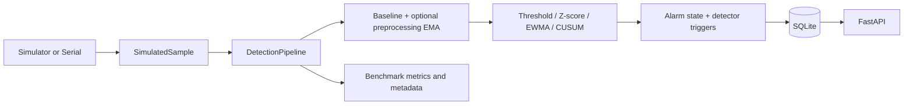

# Methane Monitoring & Statistical Anomaly Detection

[](https://github.com/SoheilGtex/methane-gas-detection/actions/workflows/ci.yml)
[](https://github.com/SoheilGtex/methane-gas-detection/releases/latest)

[](LICENSE)


A reproducible Python platform for simulated or serial sensor streams, statistical change detection, SQLite persistence, and controlled experiments. It is **not certified gas-safety equipment**.

## Scientific scope and limits

- **MQ-4:** the primary methane-oriented hardware channel. Winsen documents it as a semiconductor methane sensor with a stated 300–10,000 ppm CH4 range under specified test conditions.
- **MQ-135:** an optional auxiliary air-quality/VOC channel. Winsen lists ammonia, sulfide, benzene-series vapors, smoke, and related gases; it is not treated as an interchangeable methane sensor.
- ADC values, anomaly scores, and synthetic values are not methane concentration measurements.
- This repository contains no physical gas calibration, real methane dataset, certified accuracy evaluation, or safety validation.

References: [Winsen MQ-4](https://www.winsen-sensor.com/sensors/combustible-sensor/mq4.html) and [Winsen MQ-135](https://www.winsen-sensor.com/sensors/voc-sensor/mq135.html).

## Architecture and pipeline parity



`DetectionPipeline` is the shared processing path used by simulation, benchmarking, and serial execution. When preprocessing is enabled, the same filter instance processes the warm-up samples and later samples; baseline statistics and detector input therefore use the same signal space. The serial path is **implemented but hardware-unverified**.

## Quick start

```bash
python -m venv .venv
. .venv/bin/activate
pip install -e ".[dev]"
pytest
ruff check .
methane-monitor --config config.yaml benchmark --output results/benchmark.json
methane-monitor --config config.yaml simulate --database results/methane_monitor.db
```

A missing explicitly supplied config file, malformed YAML, unknown scenario, zero drift for the drift scenario, or invalid value fails with a non-zero error.

## CLI

```bash
methane-monitor --config config.yaml benchmark --output results/benchmark.json
methane-monitor --config config.yaml smoke \
  --seeds 1 7 19 42 101 \
  --scenarios stable sudden_leak gradual_leak drift \
  --drift-rate 0.25 \
  --output results/multi_seed_smoke.json
methane-monitor --config config.yaml run \
  --source serial --port /dev/ttyUSB0 --baud 9600
methane-monitor --config config.yaml api --host 0.0.0.0 --port 8000
```

The `smoke` command is the committed reproduction command for `results/multi_seed_smoke.json`. It explicitly sets the drift scenario to `0.25` units per synthetic sample. No hidden drift magnitude is used.

The serial command uses the same `DetectionPipeline` as benchmark and simulation. It requires `pip install -e ".[serial]"`; hardware has not been tested here and serial ground truth remains unknown.

## Simulator and ground truth

Each synthetic row preserves:

- `sample_index`
- `simulated_time`
- `is_leak`: methane-leak ground truth only
- `artifact_type`: `none`, `outlier`, `missing`, `drift`, or `saturation`
- raw and processed values when available

Scenarios include `stable`, `leak`, `sudden_leak`, `gradual_leak`, `intermittent`, `drift`, `outliers`, `missing`, and `saturation`. The drift scenario requires an explicitly non-zero `drift_per_sample`. Outliers, drift, missing samples, and saturation are nuisance/artifact labels and do not imply methane leakage.

## Metric semantics

A **ground-truth event** is a maximal interval `[start, end)` of contiguous `is_leak=True` samples. This is a **half-open interval**. An **alarm state** is the detector Boolean output at each sample. A **detector trigger** is an explicit detector signal; it is not reconstructed from alarm-state transitions.

Each detector trigger is classified exactly once:

1. **Matched event onset:** the first usable trigger inside a previously undetected leak interval.
2. **Duplicate event onset:** an additional trigger inside an already detected leak interval.
3. **False-alarm onset:** a trigger outside every leak interval.

An event is detected only when a detector trigger satisfies `start <= trigger < end`. A trigger after `event_end` cannot detect that event. Detection delay is `(trigger - start) * sample_period`.

Reported metrics are separated into families:

- **Trigger/event-level:** `detector_triggers`, `total_events`, `detected_events`, `missed_events`, `event_detection_rate`, mean/median detection delay, `matched_event_onsets`, `duplicate_event_onsets`, `false_alarm_episodes`.
- **State/sample-level:** `alarm_active_samples`, TP, FP, TN, FN, `sample_precision`, `sample_recall`, `sample_f1`, `false_positive_sample_rate`, `time_in_alarm_fraction`.

A false-alarm episode is a detector trigger outside all leak windows, so it is not inflated by duplicate CUSUM triggers inside a real event. No metric is reported under the ambiguous name `precision`.

## Baseline window

`baseline_window_samples` is a fixed initial positional warm-up window, not a count of valid samples. Missing values inside that window are skipped; at least two finite processed values must remain for baseline estimation. The legacy YAML key `min_baseline_samples` is accepted as a validation alias, but new serialized metadata uses `baseline_window_samples`.

## Preprocessing and detectors

Common preprocessing and detector recursion are separate configuration concepts:

- `preprocessing_smoothing_alpha`: optional common EMA applied to baseline and detection samples.
- `detector_ewma_alpha`: EWMA detector's own recursive statistic.

When both are enabled, EWMA receives an already smoothed stream and applies its own EWMA statistic: this is an intentional two-stage smoothing composition, not an accidental parameter collision.

Detectors:

- Static threshold
- Z-score against a finite processed baseline
- EWMA followed by standardized scoring
- One-sided signal-and-reset CUSUM

CUSUM emits an alarm and a detector trigger on every threshold crossing, then resets its cumulative statistic. Consecutive crossings remain consecutive triggers even when the Boolean alarm sequence is `True, True, True`. Threshold, Z-score, and EWMA trigger only when their hysteresis state enters alarm. CUSUM effective metadata contains only `cusum_k` and `cusum_h`; global hysteresis is not serialized because it does not affect CUSUM behavior.

CUSUM uses one-sample signal-and-reset alarm pulses, whereas Threshold, Z-score, and EWMA expose persistent alarm states. Therefore sample/state metrics should not be interpreted as perfectly equivalent alarm-duration semantics across all detector families.

## Reproducibility metadata

Each benchmark record contains:

- schema and metric versions
- run ID and timestamp
- random seed
- complete simulation configuration, including explicit drift and sample period
- preprocessing configuration
- actual detector name and only its effective parameters
- Git commit and dirty status
- generated metrics

The current artifacts were generated from clean **CODE_COMMIT_2_2** `8f29627f1a6359ee8735af263f07814df2b37fd0` with `git_dirty=false`. Documentation and generated artifacts are committed separately afterward.

## Results

The clean-code default benchmark produced:

| Detector | Event detection rate | Mean delay | False-alarm episodes | Duplicate onsets | False-positive sample rate | Time in alarm |
|---|---:|---:|---:|---:|---:|---:|
| Threshold | 1.0000 | 1.0 | 0 | 0 | 0.0227 | 0.2800 |
| Z-score | 1.0000 | 0.0 | 0 | 0 | 0.0591 | 0.3100 |
| EWMA | 1.0000 | 1.0 | 0 | 0 | 0.0864 | 0.3267 |
| CUSUM | 1.0000 | 0.0 | 12 | 79 | 0.0545 | 0.3067 |

These are outputs from one synthetic configuration and are not real-world performance claims. The five-seed smoke matrix is a semantic validation, not a definitive study.

## API

- `GET /health`
- `GET /readings?limit=100`
- `GET /events?limit=100`
- `GET /experiments/{run_id}` — returns 404 for an unknown run

Missing simulator samples remain persisted rows with nullable raw/filtered values and `artifact_type="missing"`. Serial rows use `source="serial"`, null simulation metadata, and unknown hardware ground truth.

## Docker and CI status

The repository includes a non-root `Dockerfile` and GitHub Actions for Python 3.11/3.12 installation, Ruff, and pytest. Local Docker verification passed: the image built successfully, the container started successfully, and `/health` returned HTTP 200 with `{"status":"ok"}`. Remote GitHub Actions CI also passed on Python 3.11 and 3.12 for both `push` and `pull_request` events.

## Limitations and future work

There is no PostgreSQL adapter, frontend, visualization pipeline, physical gas calibration, real hardware verification, or ML model. Future work should use controlled laboratory data, environmental compensation, multiple seeds and nuisance conditions, and domain-reviewed event semantics before stronger claims are made.

## License

MIT; see [LICENSE](LICENSE).
