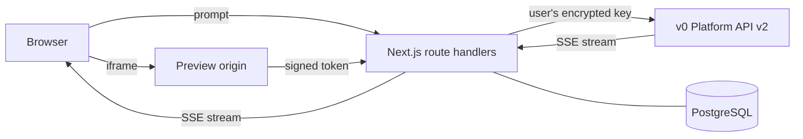

<div align="center">

```
██╗   ██╗ ██████╗       ██████╗ ██╗██╗   ██╗
██║   ██║██╔═████╗      ██╔══██╗██║╚██╗ ██╔╝
██║   ██║██║██╔██║█████╗██║  ██║██║ ╚████╔╝
╚██╗ ██╔╝████╔╝██║╚════╝██║  ██║██║  ╚██╔╝
 ╚████╔╝ ╚██████╔╝      ██████╔╝██║   ██║
  ╚═══╝   ╚═════╝       ╚═════╝ ╚═╝   ╚═╝
```

### The open-source, self-hosted v0.app clone

Describe an app in plain English. Watch v0 think, write files, run commands and ship a live preview. On your own domain, with your own key.

[](https://github.com/SujalXplores/v0.diy/stargazers)
[](https://github.com/SujalXplores/v0.diy/network/members)
[](https://github.com/SujalXplores/v0.diy/actions/workflows/ci.yml)
[](LICENSE)

[](https://nextjs.org/)
[](https://react.dev/)
[](https://www.typescriptlang.org/)
[](https://tailwindcss.com/)
[](https://v0.app/docs/api/v2)

[Quick start](#quick-start) · [Features](#features) · [Deploy](#deploy-to-vercel) · [How it works](#how-it-works) · [Contributing](#contributing)

[](https://vercel.com/new/clone?repository-url=https%3A%2F%2Fgithub.com%2FSujalXplores%2Fv0.diy&env=POSTGRES_URL,AUTH_SECRET,PREVIEW_ORIGIN&envDescription=Postgres%20connection%20string%2C%20a%20random%20auth%20secret%20and%20a%20separate%20domain%20for%20app%20previews&envLink=https%3A%2F%2Fgithub.com%2FSujalXplores%2Fv0.diy%23environment-variables&project-name=v0-diy&repository-name=v0-diy)

</div>

---

## Why v0.diy?

[v0.app](https://v0.app) is a great AI app builder, but it's a hosted product. **v0.diy** gives you the same agentic workflow, built on the official [v0 Platform API](https://v0.app/docs/api/v2), inside an app you own:

- **Bring your own key.** Each user adds their own v0 API key. Keys are encrypted at rest with AES-256-GCM and never reach the browser.
- **Self-hosted.** Run it on Vercel, your own server or your laptop. Your users, your database, your domain.
- **Hackable.** A clean Next.js 16 codebase with a feature-first layout, strict TypeScript and CI-enforced lint checks. Fork it and make it yours.

## Features

### 🤖 Agentic generation, streamed live
- Watch v0 **think**, **read and edit files**, **search** and **run commands** in real time
- Answer v0's **questions**, approve its **plans**, grant **permissions** and connect **integrations** without leaving the chat
- Generations survive reloads and serverless timeouts, and reconnect automatically
- Pick a model (Mini, Pro, Max, Max Fast) or use your plan's default, and turn on **image generation** when you want it

### 🖥️ Workspace
- **Live preview** served from an isolated origin, with desktop, tablet and phone sizes and a fullscreen mode
- **Code explorer** with a folder tree, file-type icons, syntax highlighting and line numbers
- **Edit files in place** and save them back to v0
- **Restore** any earlier version, **download a ZIP** or **deploy to Vercel** in one click

### 📁 Projects and chats
- Projects grid with **live preview thumbnails**
- Search, rename, duplicate, delete and change chat visibility
- **Import** existing code from a GitHub repo, a ZIP or a local folder
- One-click **migration** for chats created on the old v1 API

### ✨ Everything else
- Account menu shows your **v0 plan and remaining credits**
- Image attachments, voice input and drafts that survive a reload
- Email and password auth, a per-user daily limit on new chats, and dark mode

## Quick start

**Prerequisites:** Node.js 22+, pnpm 10+, a PostgreSQL database and a [v0 API key](https://v0.app/chat/settings/keys).

```bash
git clone https://github.com/SujalXplores/v0.diy.git
cd v0.diy
pnpm install
cp .env.example .env.local   # then fill in POSTGRES_URL and AUTH_SECRET
pnpm db:migrate
pnpm dev
```

Open [http://localhost:3000](http://localhost:3000), create an account and add your v0 API key from the account menu.

> In development, previews are served from `127.0.0.1` while the app runs on `localhost`, so they get their own origin with no extra setup.

### Environment variables

| Variable | Required | Description |
|---|---|---|
| `POSTGRES_URL` | ✅ | PostgreSQL connection string (Neon, Supabase, Vercel Postgres or local) |
| `AUTH_SECRET` | ✅ | Signs sessions and preview tokens, and encrypts stored API keys. Generate one with `openssl rand -base64 32` |
| `PREVIEW_ORIGIN` | Production | A **different site** that points at the same deployment, e.g. `https://preview-myapp.com`. Generated apps run there so they can't touch your app's cookies |
| `APP_ORIGIN` | Optional | Public URL of the app when it runs behind a proxy |
| `V0_API_URL` | Optional | Overrides the v0 API base URL |

## Deploy to Vercel

1. Click **Deploy with Vercel** above and fill in the environment variables.
2. Add a second domain for previews to the same project, on a different site from the app's domain (not a subdomain of it), and set it as `PREVIEW_ORIGIN`.
3. Redeploy. `pnpm build` runs the database migrations for you.

Streaming routes use `maxDuration = 60`, so they run on every Vercel plan, including Hobby. Long generations reconnect transparently when a function times out. On Pro you can raise `maxDuration` in the `src/app/api/chats/**/route.ts` files to cut down on reconnects.

## How it works



- **Route handlers** check the session and chat ownership, decrypt the user's key and proxy v0's server-sent events to the browser.
- **The chat UI** renders the stream with the AI SDK and `@v0-sdk/react`. Every agent step becomes a typed message part.
- **Previews** load through a signed, short-lived token on a separate origin, so generated code never runs next to your session.
- **PostgreSQL** (via Drizzle ORM) stores users, encrypted keys and which chats belong to whom. Chat content stays on v0.

## Tech stack

| | |
|---|---|
| **Framework** | Next.js 16 (App Router, Turbopack, Cache Components), React 19 with the React Compiler |
| **AI** | v0 Platform API v2 via `v0` and `@v0-sdk/react`, Vercel AI SDK 7, Streamdown for markdown and code |
| **UI** | Tailwind CSS 4, shadcn/ui on Radix, Hugeicons, Geist |
| **Data and auth** | PostgreSQL, Drizzle ORM, Auth.js 5 |
| **Quality** | TypeScript 7 (strict), Biome, React Doctor, Husky with lint-staged, GitHub Actions CI |

## Project structure

```
src/
├── app/            # Routes, layouts and API route handlers (kept thin)
├── components/     # Shared UI: shadcn/ui primitives, AI elements, layout
├── features/       # One folder per feature: auth, chat, chats, projects, credits, v0-api-key
├── hooks/          # Generic React hooks
├── lib/            # Isomorphic helpers
└── server/         # Server-only code: auth, db, http helpers, v0 client, previews
```

## Scripts

| Command | What it does |
|---|---|
| `pnpm dev` | Start the dev server with Turbopack |
| `pnpm build` | Run migrations and build for production |
| `pnpm db:generate` / `db:migrate` / `db:studio` | Create, apply and inspect Drizzle migrations |
| `pnpm check:fix` | Lint and format with Biome |
| `pnpm validate` | Biome, TypeScript and React Doctor, the same checks as CI |

## Contributing

Issues and pull requests are welcome. For anything big, open an issue first so we can agree on the approach.

1. Fork the repo and create a branch: `git checkout -b feat/my-idea`
2. Make your change and run `pnpm validate`
3. Open a pull request describing what changed and why

Please follow the [Code of Conduct](CODE_OF_CONDUCT.md).

## Testing

This project is tested with BrowserStack.

## License

[MIT](LICENSE). Build something great with it.

---

<div align="center">

### Contributors

<a href="https://github.com/SujalXplores/v0.diy/graphs/contributors">
  
</a>

### Star history

[](https://star-history.com/#SujalXplores/v0.diy&Date)

**If v0.diy saves you time, a ⭐ helps other people find it.**

</div>
