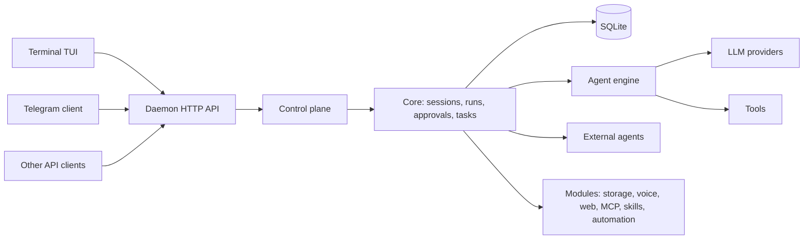

# MatrixClaw


**MatrixClaw is an always-on, local-first AI assistant and coding-agent runtime
for the terminal and Telegram.**

A small Go daemon, `matrixclawd`, owns your AI sessions: context, files, tool
history, approvals, provider and model choice, todo lists, memory, usage and
scheduled tasks, all stored in local SQLite. The terminal TUI, the Telegram bot
and other clients only render that state and send commands, so you can start a
task in the terminal, approve a tool call from your phone and pick the session
up again later without losing anything.

<p align="center">
  
</p>

## Features

- **One session, many clients.** Terminal TUI, Telegram bot, and any client of
  the local HTTP API (an iOS Swift client package is included) share the same
  sessions. Closing a client never ends a session.
- **Many LLM providers.** OpenAI and OpenAI-compatible APIs, OpenAI Codex
  subscription (OAuth), Anthropic, Gemini, Qwen, and presets for DeepSeek,
  OpenRouter, Vercel AI Gateway, NVIDIA NIM, Hugging Face, NovitaAI, GMI Cloud,
  StepFun, Ollama Cloud, Kilo Code, xAI / Grok, Z.AI / GLM, MiniMax, Kimi,
  AiHubMix, plus custom endpoints. Provider and model are chosen per session.
- **Tools with approvals.** File, shell, web and MCP tools pause before risky
  actions; allow / ask / deny rules per session or globally decide what asks.
  A denial with a reason goes back to the model instead of failing the run.
- **Long runs.** A native run works through many tool calls within a step,
  time and token budget, summarises its own context, runs independent tool
  calls in parallel, and keeps long commands in the background. `/continue`
  resumes a run that stopped early.
- **Subagents.** The `agent` tool hands bounded tasks to child runs
  (MatrixClaw, Codex or Claude Code), blocking or in the background.
- **External agents.** Codex app-server and Claude Code sessions attach to the
  same session model.
- **Todo list, memory and search.** `todo_write` tracks multi-step work;
  `memory` keeps approved durable notes; `session_search` searches past
  conversations.
- **Web and browser.** `web_search` (DuckDuckGo, Tavily, Serper, SearXNG) and
  `web_fetch`; interactive browser tools through an MCP browser server.
- **Voice.** Local TTS (Piper, Supertonic 3) and STT (Whisper.cpp), realtime
  speech-to-speech (Gemini Live, Grok Voice, OpenAI Realtime), and an optional
  Asterisk/SIP telephony gateway.
- **MCP both ways.** Use MCP servers as tools, or expose MatrixClaw tools to
  other MCP hosts.
- **Automation.** Reminders and scheduled AI tasks, delivered to your clients.
- **Usage ledger.** Token usage per generation (prompt, cache, output,
  reasoning) in `/usage` and `/context`.

## An alternative to OpenClaw, Claude Code, Codex and OpenCode

OpenClaw focuses on a self-hosted personal assistant across chat apps. Claude
Code, Codex and OpenCode focus on coding agents in the terminal. MatrixClaw sits
between them: an always-on local daemon with a terminal TUI and a Telegram
client, durable SQLite sessions, approvals, MCP tools, memory, scheduled tasks,
and Claude Code / Codex as subagents. See the [FAQ](#faq) for a short
comparison.

## Install

Linux and macOS (amd64, arm64):

```bash
curl -fsSL https://raw.githubusercontent.com/Suren878/matrixclaw/main/scripts/install.sh | bash
```

The installer downloads the matching GitHub Release archive, installs
`matrixclaw`, `matrixclawd` and `matrixclaw-telephony-gateway` into
`~/.local/bin`, creates the config and state directories, and starts
`matrixclaw setup`.

Installer options (pass after `bash -s --`):

| Option | Meaning |
| --- | --- |
| `--version TAG` | install a specific release (default: latest) |
| `--install-dir DIR` | binary directory (default: `~/.local/bin`) |
| `--no-setup` | do not start `matrixclaw setup` |
| `--voice-runtime` | also install local Piper, Supertonic, Whisper.cpp and `ffmpeg` |
| `--from-source` | build from the current source checkout instead of downloading |

The local voice runtime can also be installed later with
`scripts/install_voice_runtime.sh` (see [Local Voice](docs/VOICE.md)). Release
archives with `checksums.txt` are on the
[Releases](https://github.com/Suren878/matrixclaw/releases) page.

**Update.** The TUI checks for a newer release on start and asks before
updating. Manually:

```bash
matrixclaw update install
matrixclaw service restart
```

**Uninstall.** Binaries and the user service are removed; config and state are
kept unless you add `--purge`:

```bash
curl -fsSL https://raw.githubusercontent.com/Suren878/matrixclaw/main/scripts/uninstall.sh | bash
curl -fsSL https://raw.githubusercontent.com/Suren878/matrixclaw/main/scripts/uninstall.sh | bash -s -- --purge
```

### From source

Requires Go 1.26+.

```bash
git clone https://github.com/Suren878/matrixclaw.git
cd matrixclaw
./scripts/install.sh --from-source   # build and install into ~/.local/bin
./scripts/build_release.sh           # or: build stamped binaries into ./bin
```

See [CONTRIBUTING.md](CONTRIBUTING.md) and [Testing](docs/TESTING.md) before
sending changes.

## Quick start

1. Run `matrixclaw`. On a fresh machine it opens setup: pick a provider, enter
   its API key (or sign in, see below), and optionally enable Telegram.
2. Run `matrixclaw` again (or `matrixclaw tui [WORKDIR]`). It starts the daemon
   when needed and opens the terminal chat for the current directory.
3. Ask for something. Approve or deny tool calls as they come up.
4. Open your Telegram bot and continue the same session with `/sessions`.

Exiting the TUI closes only the terminal client; the daemon keeps running.
`matrixclaw status` and `matrixclaw doctor` show what is configured and
running.

**OpenAI Codex subscription.** Select `OpenAI Codex Subscription` in setup,
then sign in with your ChatGPT account and pick a model from the provider's
model picker:

```bash
matrixclaw providers login openai-codex
```

Model pickers load the provider's live catalog when it has one.
`matrixclaw providers verify --catalogs` checks configured providers and public
catalogs in one pass.

## Commands

```text
matrixclaw                      open the TUI when configured, otherwise setup
matrixclaw setup                open setup
matrixclaw tui [WORKDIR]        open terminal chat for the current or given directory
matrixclaw status               print setup and service state
matrixclaw doctor               diagnose setup, daemon and provider registry
matrixclaw version              print client and daemon version
matrixclaw update [check|install]
matrixclaw service status|restart|stop|logs
matrixclaw providers            list the provider catalog
matrixclaw providers login openai-codex
matrixclaw providers verify [--catalogs]
matrixclaw agents               list external agent runtimes
matrixclaw agents start AGENT [DIR]
matrixclaw mcp serve --session SESSION_ID [--workdir DIR]
matrixclaw skills list|search|show|install|trust|quarantine|enable|disable|remove|archive|restore|pin|unpin|usage
matrixclawd                     the daemon (run by the user service)
```

## In-session controls

The TUI and Telegram share one command set, so a change made in one client is
visible in the other. These are client commands, not model tools.

```text
/new                  create a session
/sessions             list, select, rename or delete sessions
/provider             provider and model for the current session
/permissions          permission mode and allow/ask/deny rules
/context              inspect, compact or clear the session context
/usage                runs, steps and token usage
/continue             continue the latest run with a fresh budget
/budget               show or override the session's run budget
/todo [clear]         show or clear the todo list
/memory               durable assistant memory
/search <query>       search stored message history
/skills               skills enabled for this session
/modules              storage, TTS, STT, realtime voice, web search, MCP, external agents, ...
/remind               create a one-time reminder
/tasks                background tasks and scheduled AI tasks
/server, /status, /restart, /stop   inspect, restart or stop the daemon
/help                 list commands
```

While a run is working, a new message steers it at its next step. In the TUI,
`/queue <text>` queues a message instead, and `/busy queue|steer|interrupt`
changes the default. Cancelling a run (`esc` in the TUI) also stops the
background commands and subagents it started.

TUI keys: `ctrl+p` commands, `ctrl+s` sessions, `ctrl+n` todo panel, `ctrl+o`
external editor, `ctrl+j` newline, `ctrl+f` attach typed file paths, `ctrl+c`
quit. Telegram-only features (file and voice uploads, `/tts`, inline and guest
mode) are described in [Telegram](docs/TELEGRAM.md).

## Feature guides

**Subagents.** The `agent` tool takes `description`, `prompt`, and optional
`background`, `isolation` (`shared` or `worktree`), `readonly`, `runtime`
(`matrixclaw`, `codex`, `claude`, `auto`) and `model`. Children start from an
isolated prompt, run a restricted tool set, and return only their result; their
approval requests appear in the parent session.
See [External Agents](docs/EXTERNAL_AGENTS.md#subagents).

**External agents.** Codex app-server (`codex` binary) and Claude Code
(`claude` binary) can back a whole session or a subagent. Enable them under
`/modules` -> External Agents. See [External Agents](docs/EXTERNAL_AGENTS.md).

**Todo list.** For work of three or more steps the assistant keeps a list with
`todo_write`; a run that stops with open items is asked once to finish them or
say why. See [Todo List](docs/TODO_LIST.md).

**Web search.** `web_search` with DuckDuckGo (no key), Tavily, Serper or
SearXNG, and `web_fetch` returning a page's main content as markdown. Switch
providers in `/modules` without restarting. See [Web Search](docs/WEB_SEARCH.md).

**Browser.** With a browser MCP server (for example Playwright) connected, the
assistant can open pages, click, type, wait and take screenshots.
See [Browser Module](docs/BROWSER.md).

**MCP.** Connect stdio or streamable HTTP MCP servers; their tools register as
`mcp_<server>_<tool>` and need approval unless the server is marked
`read_only`. `matrixclaw mcp serve` exposes MatrixClaw tools to an MCP host.
See [MCP Module](docs/MCP.md).

**Local voice.** Piper and Supertonic 3 for TTS, Whisper.cpp for STT, set up
from `/modules`. Engines run per task by default (near-zero idle memory) or stay
warm. Telegram voice messages are transcribed into the session.
See [Local Voice](docs/VOICE.md).

**Realtime voice and telephony.** Clients open a realtime session over the
daemon API and stream PCM audio through a provider-neutral WebSocket protocol
(Gemini Live, Grok Voice, OpenAI Realtime). The optional
`matrixclaw-telephony-gateway` bridges Asterisk ARI / SIP calls into the same
layer and adds an approval-gated `telephony_call` tool. See
[Local Voice](docs/VOICE.md).

**Storage.** Telegram uploads and generated files land in local storage as
temporary files until you save them. See [Storage](docs/STORAGE.md).

## Configuration

Setup is saved to `~/.config/matrixclaw/setup.json` (the OS user config
directory; override with `MATRIXCLAW_SETUP_PATH`). State, including the SQLite
database, lives in `~/.local/state/matrixclaw`. Edit setup with
`matrixclaw setup` or from `/modules` and `/provider` inside a session; see
[`setup.example.json`](setup.example.json) for the file layout.

The daemon API listens on loopback (`127.0.0.1:8080` by default) and refuses a
non-loopback bind unless `MATRIXCLAW_ALLOW_REMOTE_HTTP=1` is set.

## Architecture



- Clients render state; the daemon owns it. Command semantics live in
  `internal/controlplane`.
- All real work is a persisted run; approvals are durable and survive restarts.
- Provider, model, permissions and todo list are session data.
- The native agent engine (`internal/agent`) reaches storage, tools and
  approvals only through ports the core implements.

See [Architecture](docs/ARCHITECTURE.md) for the package map, run lifecycle,
tool contract and API roles.

## Documentation

| Doc | Topic |
| --- | --- |
| [docs/ARCHITECTURE.md](docs/ARCHITECTURE.md) | daemon, core, runs, modules, API, package map |
| [docs/TELEGRAM.md](docs/TELEGRAM.md) | Telegram client, approvals, inline and guest mode, files, voice |
| [docs/EXTERNAL_AGENTS.md](docs/EXTERNAL_AGENTS.md) | Codex and Claude Code runtimes, subagents |
| [docs/MCP.md](docs/MCP.md) | MCP client and server |
| [docs/BROWSER.md](docs/BROWSER.md) | browser tools through MCP |
| [docs/WEB_SEARCH.md](docs/WEB_SEARCH.md) | `web_search` and `web_fetch` |
| [docs/VOICE.md](docs/VOICE.md) | local TTS/STT, realtime voice, telephony |
| [docs/STORAGE.md](docs/STORAGE.md) | storage module and Telegram files |
| [docs/TODO_LIST.md](docs/TODO_LIST.md) | todo list |
| [docs/TESTING.md](docs/TESTING.md) | testing strategy |
| [internal/externalagents/docs/README.md](internal/externalagents/docs/README.md) | external-agent integration internals |
| [clients/ios/README.md](clients/ios/README.md) | iOS Swift client package |
| [scripts/README.md](scripts/README.md), [packaging/README.md](packaging/README.md) | install scripts and packaging |
| [CHANGELOG.md](CHANGELOG.md) | release notes |
| [CONTRIBUTING.md](CONTRIBUTING.md), [SECURITY.md](SECURITY.md) | contributing, security reporting |

## Privacy and security

Sessions, messages, runs, approvals, files, memory and setup stay on your
machine. What leaves it is what you configure: prompts, context and tool
results sent to your LLM provider; prompts and events sent to Codex or Claude
Code; audio and transcripts sent to the realtime provider and, for calls, your
SIP provider; tool arguments sent to remote MCP servers; Telegram messages when
the bot is enabled; and network traffic from tools you approve. See
[SECURITY.md](SECURITY.md).

## FAQ

**Is MatrixClaw an OpenClaw alternative?** Yes: an open-source, local-first
assistant that stays running and is reachable from the terminal and Telegram,
with local state, approvals, MCP tools, memory, scheduled tasks and subagents.

**Is it a Claude Code or Codex alternative?** Partly. Those are terminal coding
agents. MatrixClaw is a persistent runtime that can use Claude Code or Codex as
subagents or session runtimes while it keeps the session, memory, approvals,
Telegram access and automation in one daemon.

**Is it an OpenCode alternative?** It overlaps for terminal AI work, but
focuses on always-on personal automation, Telegram access, durable sessions and
subagent orchestration.

## Status

Early, self-hosted, built for one owner on a developer machine or small server.
It is not a hosted multi-tenant service, a browser IDE or a distributed worker
platform.

## License

MIT. See [LICENSE](LICENSE).
