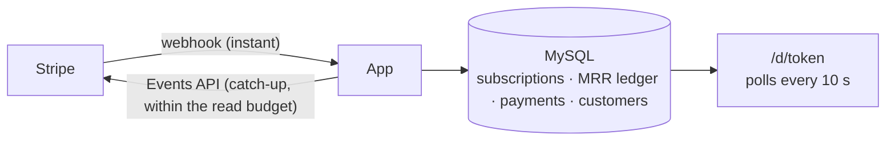

<div align="center">


# SaaS Monitor

**Your MRR, live on the wall.**

Open-source Stripe dashboard for SaaS founders: put your revenue on a TV and hear every sale.

[Live demo](https://saas-monitor.com/d/demo) · [Use it online](https://saas-monitor.com) · [Self-host](docs/self-hosting.md) · [Connect Stripe](docs/stripe.md) · [Put it on a TV](docs/wall-display.md)

[](https://github.com/Synapsr/SaaS-Monitor/actions/workflows/ci.yml)
[](https://github.com/Synapsr/SaaS-Monitor/releases/latest)
[](LICENSE)

<br />


</div>

## Why

Building a SaaS is a long game, and the numbers that keep you going are buried in a dashboard
you rarely open. SaaS Monitor turns your Stripe account into a screen for the office, your desk or
a Raspberry Pi behind a TV: the MRR ticks up when a customer subscribes, a cash register rings
when a payment lands, and confetti flies when you cross $10K MRR.

<table>
  <tr>
    <td width="50%"></td>
    <td width="50%"></td>
  </tr>
  <tr>
    <td width="50%"></td>
    <td width="50%"></td>
  </tr>
</table>

## Features

- **Live metrics**: MRR, or ARR if that's how you count, with its 30-day growth; revenue today and
  this month, customers, net new MRR, and a feed of every new customer, payment, upgrade and churn.
- **A history chart** over the last 30 days, 90 days, 12 months or all time, with your next goal on
  its horizon.
- **Sounds for every event**: payments, new customers, MRR up, MRR down and milestones, in three
  packs (cash register, chime, arcade) synthesized in the browser.
- **A voice that announces them**: "New subscriber!", in five languages. With a
  [Gradium](https://gradium.ai) key, in your own words, with the customer's name, the amount and
  the plan.
- **Every event your way**: for each kind of event, choose whether it is listed in the feed, shown
  as a card, heard and said out loud.
- **Celebrations and goals**: confetti, a full-screen moment for each milestone ($1K, $10K MRR…,
  $1M ARR) or your own goal, with the date you'll reach it at your current pace.
- **Made for the wall**: scales from a 720p monitor to a 4K TV and portrait screens, never sleeps,
  recovers from network outages, reloads itself after an update, protects OLED panels.
- **Yours**: a dark or a light screen, in your brand color (pasted as hex, adjusted if needed to
  stay readable), speaking English, French, German, Spanish, Italian, Portuguese or Dutch, with
  numbers and dates written the local way.
- **Dead simple settings** with a live preview, and a "send a test celebration" button to check
  the sound on the TV.
- **Several Stripe accounts** on one screen, converted to your currency: added up, or taking turns
  every few seconds, each moment naming the product it comes from. Or one screen per product.
- **Teams**: workspaces, invitations by link, as many screens as you like.
- **Honest numbers**: MRR follows [Stripe's own definition](docs/stripe.md#how-mrr-is-computed), so
  the TV matches your Stripe Dashboard.
- **Private and secure**: read-only restricted keys encrypted at rest, unguessable screen links
  with an optional password, customer names and emails hidden unless you allow them.
- **Real time within Stripe's limits**: webhooks for instant updates, and polling that respects
  Stripe's API read allowance when webhooks aren't available.

## Try it

- **Live demo**: <https://saas-monitor.com/d/demo> is a screen fed by a simulated SaaS, where
  something happens every few seconds. No account needed. Add
  [`?theme=light&lang=fr&accent=ff6b35`](https://saas-monitor.com/d/demo?theme=light&lang=fr&accent=ff6b35)
  for a light screen in French and your color,
  [`?accounts=2`](https://saas-monitor.com/d/demo?accounts=2) for two products taking turns, or
  `?sound=arcade&voice=marius&range=all&metric=arr` for other settings.
- **Online**: create an account on <https://saas-monitor.com>, free during the public beta,
  connect Stripe with a read-only key, and open your screen's link on any TV. Updates are
  instant.
- **On your own server**: free for good, see [Self-hosting](#self-hosting). The demo is at
  `/d/demo` there too.

## Self-hosting

SaaS Monitor is a Next.js app and a MySQL database. With Docker:

```bash
git clone https://github.com/Synapsr/SaaS-Monitor.git
cd SaaS-Monitor
node scripts/setup.mjs      # writes .env with fresh secrets
docker compose up -d        # http://localhost:3000
```

Create your account, connect Stripe with a restricted key, and open your screen's link on any
TV or Raspberry Pi. The [self-hosting guide](docs/self-hosting.md) covers configuration, HTTPS
(needed for instant updates), updates and backups.


## How it works



1. **Import**: subscriptions and 12 months of payments are imported once, in resumable chunks.
2. **Sync**: new activity is read from Stripe's Events API when a webhook announces it, or at a
   pace derived from your read allowance. Every change of MRR is recorded in a ledger, which gives
   the history chart and the new / expansion / contraction / churn breakdown.
3. **Display**: screens poll the app every 10 seconds; syncs run on demand, so no background
   worker is needed and the app runs anywhere Node runs.

More in [Connect Stripe](docs/stripe.md) and [Put it on a TV](docs/wall-display.md).

## Development

Requirements: Node 24, pnpm 10 and Docker.

```bash
pnpm install
node scripts/setup.mjs   # .env with fresh secrets
pnpm db:up               # MySQL + stripe-mock
pnpm dev                 # http://localhost:3000
```

```bash
pnpm format:check && pnpm lint && pnpm typecheck && pnpm test && pnpm build   # what CI runs
```

Built with Next.js 16, React 19, Tailwind CSS 4, shadcn/ui, Drizzle ORM, MySQL, Better Auth
and the Stripe SDK. Read [CONTRIBUTING.md](CONTRIBUTING.md) and [AGENTS.md](AGENTS.md) for the
architecture and conventions.

## License

[MIT](LICENSE)
