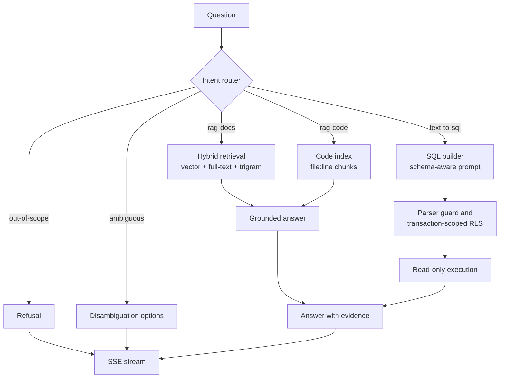

<p align="center">
  
</p>

<p align="center">
  <a href="https://github.com/Taki-chiasf/Onboarding-assistant/actions/workflows/ci.yml"></a>
  
  
  
  
  
</p>

A conversational onboarding assistant that answers new-hire questions from
company documents (retrieval-augmented generation) and live business data
(text-to-SQL). Documents, code, and structured rows are three separate
surfaces behind one intent router; every answer carries its sources, and every
query executes under row-level security scoped to the caller's department and
role.

## Screenshots

Captured from the local demo stack, not mockups.


A policy question, answered from the document corpus. The evidence panel lists
every chunk the answer was grounded in, with its section anchor and source file.

<table>
  <tr>
    <td width="50%">
      
      <br><b>Codebase answers</b> — a runbook question answered by Codestral over
      <code>file:line</code> chunks, opening the cited range in a read-only viewer.
    </td>
    <td width="50%">
      
      <br><b>Live data answers</b> — a text-to-SQL answer with the generated
      statement, its row count and latency. The department predicate is enforced
      by row-level security, not by the model.
    </td>
  </tr>
</table>

<table>
  <tr>
    <td width="50%">
      
      <br><b>Eval dashboard</b> — nightly runs, per-metric trends against their
      gates, green streak and regressions.
    </td>
    <td width="50%">
      
      <br><b>Span waterfall</b> — the OpenTelemetry trace of one turn, from the
      HTTP request through routing, retrieval and grounding.
    </td>
  </tr>
</table>

<table>
  <tr>
    <td width="50%">
      
      <br><b>Cost</b> — tokens and spend per user, model, and day, against the
      per-user daily budget.
    </td>
    <td width="50%">
      
      <br><b>Ingest</b> — chunk counts per source document, with the type and
      last-indexed time.
    </td>
  </tr>
</table>

<table>
  <tr>
    <td width="50%">
      
      <br><b>Entry</b> — the demo persona picker; production uses OIDC single
      sign-on instead.
    </td>
    <td width="50%">
      
      <br><b>Chat</b> — conversation history on the left, suggested questions,
      streaming answers on the right.
    </td>
  </tr>
</table>

## What it does

**Answers**

- Hybrid retrieval over the chunk store: pgvector cosine, Postgres full-text
  (`ts_rank`), and trigram fuzzy matching, each leg filtered by the caller's
  access tags, fused with reciprocal-rank fusion, then cut to the top-k.
- Grounded generation with inline `[n]` citations and a cite-or-die fallback:
  an answer that cannot be grounded says "I don't know" instead of guessing.
- Codebase RAG with `file:line` anchors and an in-app read-only file viewer.
- Text-to-SQL over five allowed views (`org_members`, `projects`, `assets`,
  `okrs`, `tickets`), streaming SSE throughout.

**Guardrails**

- Intent router with a five-class verdict (docs, code, SQL, out-of-scope,
  ambiguous) through Mistral Structured Outputs, plus deterministic guardrails
  and disambiguation prompts for ambiguous questions.
- SQL is read-only by construction: the parser accepts a single `SELECT` and
  nothing else, `set_config`/`current_setting` are rejected at parse time, and
  execution runs as a `SELECT`-only role.
- Row-level security context is set with `SET LOCAL` in the same transaction as
  the query (`set_config(..., true)`), which is safe under transaction-pooled
  PgBouncer connections. A cross-department canary runs against the pool nightly.
- Document access tags are an AND across two dimensions: `dept:` must match the
  caller's department (or `dept:all`), and at least one granted `role:` tag must
  be present (or `role:all`).
- PII redaction on logs and eval cases, a moderation screen over input and
  ingested content, per-user daily token budgets, and a retention window for
  audit and eval records.

**Operations**

- Admin console (`/admin`) with cost, eval, review, ingest, and attention
  panels, plus the OTel span viewer.
- Nightly eval loop: golden router, SQL, and docs suites plus promoted
  feedback cases, per-case records, regression against the last green run at
  the same prompt and model versions, green-streak tracking, and a webhook
  alert when a run goes red.
- Feedback loop: thumbs up/down with an optional correction files a reviewable
  eval candidate; admins promote or reject it in the console.
- Conversation history is per user, encrypted at rest with AES-256-GCM envelope
  encryption, and deletable on request with a hard cascade.
- OpenTelemetry traces for routing, retrieval, SQL generation, and model calls,
  exported to Grafana Tempo/Loki.

## How a turn flows



Retrieval runs with the caller's access tags applied inside the SQL query, so
out-of-scope chunks never reach the prompt. SQL answers are built from the five
views only and executed under the caller's department context; the model never
sees rows the caller could not read.

## Stack

| Layer | Choice |
|---|---|
| Backend | FastAPI + Uvicorn, async throughout, SSE streaming, OpenTelemetry |
| Web | Next.js 15 (App Router) + TypeScript strict, Tailwind v4, BFF routes |
| Workers | Python RQ on Redis: ingestion jobs and the nightly eval runner |
| Data | PostgreSQL 16 + pgvector + pg_trgm, Alembic migrations |
| Inference | Mistral La Plateforme end-to-end: `mistral-large-2512` grounding, `mistral-small-2603` router, `codestral-2508` code answers, `magistral-*` judge and escalation, `mistral-embed` embeddings, Mistral OCR for PDFs, moderation |
| Observability | OpenTelemetry SDK, OTLP collector, Tempo, Loki, Grafana (compose profile) |
| Delivery | Docker Compose for dev and demo; per-service images, non-root, healthchecked |

Pinned dated model ids live in `backend/app/config/models.yaml`, together with
the ordered stand-ins used when a subscription tier rejects a preferred model.
`-latest` aliases are not used on any production path.

## Try it in 60 seconds

Prerequisites: Docker with the Compose plugin, and a Mistral API key for live
answers. Everything else runs in containers.

```sh
cp .env.example .env
# Set MISTRAL_API_KEY in .env, and a 32-byte ENCRYPTION_KEY for history at rest:
#   python -c "from app.core.crypto import generate_key; print(generate_key())"
make up
```

`make up` builds the images, starts Postgres (pgvector), Redis, the API, the
worker, and the web app, runs the schema migrations, and seeds a synthetic
company. Then open <http://localhost:3000>, pick a demo identity, and ask a
question. Index the document corpus into the vector store with:

```sh
make ingest
```

Useful targets:

| Command | What it does |
|---|---|
| `make up` | Build and start the full stack |
| `make down` | Stop the stack |
| `make seed` | Re-seed the demo data |
| `make ingest` | Index the sample corpus into the vector store |
| `make demo-reset` | Re-seed and clear conversation history |
| `make eval` | Run the eval gates against the current database |
| `make eval-nightly` | Run the nightly eval loop |
| `make obs` | Start the stack plus Grafana, Tempo, and Loki |
| `make lint` | Lint backend (ruff) and web (eslint) |
| `make typecheck` | mypy strict (backend) and tsc strict (web) |
| `make test` | Run the full test suite with the coverage gate |
| `make pii-scan` | Scan the repository for non-synthetic personal data |

## Demo identities

The demo data is fully synthetic: a fictional company with departments,
people, projects, assets, objectives, tickets, and a document corpus. No real
company data is used anywhere.

With `MOCK_OIDC=2` (the default) a persona picker on `/login` binds the session
to one of the seeded identities for the whole conversation:

| Persona | Department | Role | Scope |
|---|---|---|---|
| Engineering new hire | Engineering | employee | Engineering docs, code, and rows |
| HR admin | People | admin | All rows, People docs, plus the admin console |
| Finance employee | Finance | employee | Finance docs and rows |

The other auth modes: `MOCK_OIDC=1` injects a static developer principal on
every request for backend-only work via curl, and setting the `OIDC_*`
variables switches the web app to a real OIDC single sign-on flow (Auth0 or
Okta compatible). Requests carry only the caller's slug claims (`sub`, `email`,
`dept`, `role`); the department and role are what scope every retrieval and
every SQL query.

## The knowledge base

The corpus generator writes a small synthetic company into
`backend/seed_corpus/`: a handbook, policies, runbooks, engineering docs, a few
PDFs (ingested through Mistral OCR), and a synthetic service repository under
`seed_corpus/code/` with READMEs, ADRs, runbooks, and source files.

Documents are chunked section-aware, with the heading path kept as the chunk's
anchor, and each chunk carries `dept:`/`role:` access tags. Code files use a
line-aware chunker whose anchors are `L<start>-L<end> <label>` ranges, so a
citation can open the exact slice of the file it came from. Reingestion is
idempotent per content hash: unchanged chunks are skipped.

## Reingest webhooks

`POST /api/webhooks/ingest` accepts signed source-edit notifications and queues
a reingest on the worker queue. Reingest is idempotent — unchanged chunks are
skipped by content hash — so a redelivered webhook is harmless. The request
body is JSON and the signature is an HMAC-SHA256 of the raw body with
`WEBHOOK_SECRET` as the key, sent as `X-Hub-Signature-256` (or
`X-Webhook-Signature`) in the `sha256=<hex>` form.

- Repository push:
  `{"source": "repo", "ref": "refs/heads/main", "changed": ["services/auth/app.py"]}`.
  Only pushes to `WEBHOOK_BRANCH` (default `main`) trigger a reindex.
- Drive or docs edit:
  `{"source": "drive", "changed": ["file:policies/parental-leave.md"]}`. This
  generic form is the seam for a real integration; no provider-specific client
  ships in this repo.

An unset `WEBHOOK_SECRET` rejects every webhook, and each accepted delivery
appears as a job in the admin console's Ingest tab.

```sh
body='{"source":"repo","ref":"refs/heads/main"}'
sig="sha256=$(printf '%s' "$body" | openssl dgst -sha256 -hmac "$WEBHOOK_SECRET" | awk '{print $2}')"
curl -X POST localhost:8000/api/webhooks/ingest -H "content-type: application/json" \
  -H "x-hub-signature-256: $sig" -d "$body"
```

## Conversation history

History is per user: a signed-in caller only reads, extends, or deletes their
own conversations. With `ENCRYPTION_KEY` set, message bodies and conversation
titles are sealed at rest with AES-256-GCM. Each conversation gets its own data
key, wrapped by the key-encryption key, and every payload is bound to its row
through associated data, so a ciphertext cannot be moved to another row and
still open. Generate a key with:

```sh
python -c "from app.core.crypto import generate_key; print(generate_key())"
```

History written before a key existed stays readable as plaintext. Backfill
seals those rows; rotation rewraps the data keys under a new key without
touching the message bodies:

```sh
make history-backfill            # run with ENCRYPTION_KEY set
make history-rotate OLD_KEY=...  # run with the new ENCRYPTION_KEY set
```

Deleting a conversation, or the whole history, is a hard cascade: messages and
their feedback go, along with eval candidates filed from those messages that
are still awaiting review. Promoted or rejected cases survive with their
redacted prompt. In the web app each conversation row has a delete action and
the Recent header has "Clear all"; both call the owner-scoped API.

## Evaluation

The eval harness holds three golden suites (router intent, SQL correctness, and
grounded-answer quality) plus any cases promoted from user feedback. `make eval`
runs the gates against the current database and reports per-suite metrics
against their targets: router accuracy, SQL validity and correctness, retrieval
recall, judge verdicts, refusal and injection-canary rates, answer latency, and
cost per answer.

The nightly loop (`make eval-nightly`, or the `eval-runner` container on a
schedule) writes one `eval_runs` row per case with the intent, retrieved ids,
generated SQL, judge verdict, latency, cost, canary flags, and the prompt and
model versions that produced it. It compares the run against the last green run
at the same `(prompt_version, model_version)` pair, tracks the consecutive green
streak, files router misroutes into the review queue, and posts a Slack-style
webhook alert when a run goes red or regresses. When no real feedback exists in
the window it also writes synthetic judge feedback, and it switches off as soon
as real feedback volume is non-zero.

## Repository layout

```
backend/            FastAPI service
  app/api/          routes: chat, auth, admin, console, feedback, code, webhooks, health
  app/auth/         OIDC middleware, principal context, mock modes
  app/core/         config, logging, crypto, OTel, retention
  app/rag/          retrieval, chunking, grounding, citations
  app/text_to_sql/  SQL builder, parser guard, RLS injection, executor
  app/router/       intent classifier and dispatcher
  app/ingest/       corpus pipeline, OCR, webhook handling, RQ tasks
  app/llm/          provider adapter, model pinning, pricing, budgets
  app/eval/         golden sets, gates, nightly loop, canaries
  app/prompts/      versioned prompt templates and model config
  tests/            unit and live suites (coverage gate at 80%)
web/                Next.js App Router: chat UI, admin console, BFF routes
ingest-worker/      RQ worker image (shares backend/app)
eval-runner/        nightly eval cron image
infra/              docker-compose, OTel collector, Tempo and Loki config
docs/               design notes, benchmarks, and README assets
```

## Development

```sh
make install     # uv sync + npm ci
make lint        # ruff (backend) + eslint (web)
make typecheck   # mypy strict + tsc strict
make test        # pytest with the coverage gate + vitest
```

CI runs the same checks on every push and pull request, plus a repository PII
scan and a build of all four service images. The backend targets mypy strict
and at least 80% coverage on the core services; the web app is TypeScript
strict and builds as a standalone Next.js server.

Design and engineering notes:

- `DESIGN.md` — the web UI's visual language, tokens, and motion system.
- `docs/reranker-bench.md` — the cross-encoder benchmark and why reranking is
  not on the default retrieval path.
- `backend/app/prompts/` — versioned prompt templates; every prompt and model
  change is measured by the eval gates before it is adopted.

## What this exercises

For anyone reading this as a portfolio piece, the interesting engineering is
less in the chat UI than in the seams behind it:

- **One provider, every surface.** Mistral La Plateforme runs streaming
  completions, Structured-Outputs classification, code-centric answers,
  embeddings, OCR, and moderation — behind a thin adapter, with dated model ids
  pinned and ordered stand-ins for restricted tiers.
- **Access control as an enforcement point.** Retrieval filters by access tags
  inside SQL, SQL runs as a read-only role with the caller's context set
  transaction-locally, and a cross-department canary fails the nightly run if a
  single out-of-scope row or chunk leaks.
- **Eval-first changes.** Prompts and model ids are versioned files; a run is
  only comparable to the last green one at the same version pair, regressions
  alert, and user feedback is promoted into the golden set through a review
  queue.
- **Evidence over assertions.** Every answer carries the chunks or rows it came
  from, and every turn carries an OTel trace that the console can draw as a
  span waterfall.
- **Data lifecycle as a feature.** Envelope-encrypted history with a key
  rotation path, a hard-cascade delete that keeps promoted eval cases, PII
  redaction on logs and eval inputs, and retention windows on audit records.
- **Cost is measured, not assumed.** Per-model token pricing, a ledger per
  user and day, a daily budget that rejects rather than degrades, and latency
  and cost recorded per eval case.
- **Delivery discipline.** Non-root images with healthchecks, `make up` from a
  clean checkout, Alembic migrations, and CI that gates lint, strict types,
  coverage, a repository PII scan, and all four service images.

## License

MIT — see `LICENSE`.
