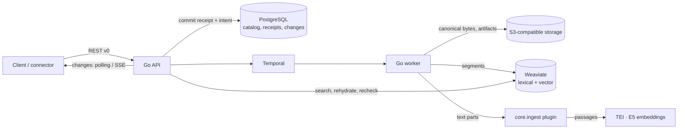

# Quivr V2

[](LICENSE)

**An open-source engine that turns continuous content streams into search and monitoring.**

Quivr V2 ingests content durably, makes it searchable within seconds, enriches it in
the background and lets you follow a topic over time. The core stays generic: formats,
AI models and business rules belong in plugins, so you can adapt Quivr to your domain
without forking the platform.

> **Status: evaluation stage.** The API is `v0` and may change without notice. Do not
> run it in production yet.

## Why Quivr V2

- **Durable before fast.** A write is acknowledged only once it is committed; outages
  delay processing, they never lose or silently fail content.
- **Idempotent everywhere.** Every write carries an idempotency key. Replays return the
  same result, changed replays are conflicts, and corrections create new immutable
  Versions instead of overwriting history.
- **Useful early, richer later.** Text is lexically searchable as soon as it is
  segmented; embeddings and other enrichments arrive afterwards without blocking it.
  Hybrid search keeps keyword results while vectors are rebuilt and reports the affected Corpora.
- **Rebuildable indexes.** PostgreSQL and S3 hold the canonical data; the search index
  is a projection that can be rebuilt from durable artifacts.
- **Honest search.** Every hit is rehydrated from canonical storage and re-authorized.
  A dependency outage returns an error, never an empty "success".
- **Generic core, extensible edges.** Connectors, normalizers, enrichers, retrievers and
  delivery channels are plugin capabilities, not core code.

## Architecture at a glance



A single `quivr` binary provides the `api`, `worker` and `migrate` commands.

| Concern | Choice |
| --- | --- |
| Core | Go modular monolith (`cmd/quivr`, `internal/…`) |
| Transactional catalog | PostgreSQL 17 |
| Canonical bytes and artifacts | S3-compatible storage (SeaweedFS locally) |
| Durable orchestration | Temporal |
| Lexical and vector search | Weaviate |
| Embeddings | Local TEI serving pinned `multilingual-e5-small` (384 dimensions) |
| Contract | OpenAPI 3.1 in [`contracts/http/v0`](contracts/http/v0/openapi.yaml) |
| Local runtime | Docker Compose |

## Quickstart

Requirements (Linux x86_64, or macOS on Apple Silicon for `make dev`): Go 1.27.2, Docker with Compose v2, Python 3 with `venv`,
Node.js 22+ and `jq`. The first run downloads pinned images and the E5 model (~1 GB).

```bash
make dev      # start dependencies, run migrations, launch API + worker
make check    # docs, contracts, vet and unit tests without Docker (about 2 min); run before pushing
make verify   # make check, then end-to-end journeys on an isolated stack
make down     # stop everything, keep data (make reset also deletes volumes)
```

`make verify` runs every feature's acceptance suite and one assembled monitoring
journey on an isolated stack. It removes only its own project, even after a
failure or Ctrl+C. It then prints the path of a `report.md` that names any failed
step, the pinned versions and the dependency inventory. It runs on Linux x86_64
only, as in CI; see the [remaining limits](docs/quivr-v2-remaining-limits.md).

`make dev` prints the API address and the path of a generated `config.json` holding
throwaway local keys; `eval "$(make -s env)"` exports the address, a key and a webhook
destination. Then follow the [Quickstart](https://docs.quivr.thevibecompany.co/quickstart):
create a Corpus, add an article, search it and get an alert, with commands that
`make verify` replays against a real stack.

For a browser UI over the same API, run `make demo` and open http://127.0.0.1:5183
(see [`quivr-search/`](quivr-search/README.md)).

## What works today

- [Choose an embedding model](https://docs.quivr.thevibecompany.co/run-quivr/choose-an-embedding-model) for local inference, your own model server or a hosted API, with rebuild requirements and execution-only tuning. [Run a large import](https://docs.quivr.thevibecompany.co/run-quivr/run-a-large-import) covers bulk workers, provider capacity, database sizing and queue monitoring.

- Searches report query-model outages as retryable `503 model_unavailable`, separately from overload and other search dependency failures. See [Search errors](https://docs.quivr.thevibecompany.co/guides/search#when-a-search-fails).

- [Worker autoscaling](https://docs.quivr.thevibecompany.co/run-quivr/deploy#scale-workers-on-backlog) follows the bulk or live queue backlog, with KEDA, the `quivr-autoscaler` binary (Kubernetes or Railway) or by hand. Live workers keep separate capacity.

- Rolling application upgrades use additive schema expansions; destructive cleanup
  runs only with `quivr migrate --contract`. API and worker retry performance-index
  builds in the background, so their busy index builds do not delay startup. An
  older binary's index build can still hold the migration lock until it finishes
  or is stopped. CI checks the merge-base binary against
  expansions. See [Upgrade Quivr](https://docs.quivr.thevibecompany.co/run-quivr/upgrade-quivr).

- **Release images and build identity.** Release-please manages alpha release PRs, versions and changelogs. Publishing a release builds signed engine and first-party plugin images on GHCR, with signed SPDX inventories and vulnerability scans. `quivr --version`, `GET /v0/version`, startup logs and process metrics report the build. See [Deploy and configure Quivr](https://docs.quivr.thevibecompany.co/run-quivr/deploy) and [release security](https://docs.quivr.thevibecompany.co/run-quivr/security).
- **Declarative conformance cases**: contribute generic requirements and measure them locally with
  `make conformance`; [case format and reports](conformance/README.md). CI never executes cases.

- **Outgoing TLS** for Temporal, Weaviate, PostgreSQL, S3 and plugins, with verified
  certificates and configurable trust. Incoming HTTPS terminates at your platform;
  see [Run Quivr behind TLS](https://docs.quivr.thevibecompany.co/run-quivr/tls).

- **Corpora** with scoped API keys per Organization, action and Corpus.
- **Corpus lifecycle controls**: archive and restore a Corpus with
  `POST /v0/corpora/{corpus_id}/archive` and `/unarchive` (`corpora:archive`).
  Archived Corpora stay stored but disappear from the default list, search and
  catalog scopes, and the change feed; explicit search or catalog access returns
  `409 corpus_archived`, while connector polling stops without changing its
  enabled state. `GET /v0/corpora?include_archived=true` lists archived entries,
  and `GET /v0/corpora/{corpus_id}` exposes its archived state.
  `PATCH /v0/corpora/{corpus_id}` renames it with `corpora:rename`. These commands
  are audited.
  Archived direct record, version and explorer timeline reads return `not_found`
  until restored.
- **Durable, idempotent ingestion**: inline text, bounded batches with per-entry
  outcomes, verified uploads (presigned PUT + checksum confirm), structured Manifests,
  extensions and relations.
- **Corrections and withdrawals** with immutable Versions and fenced withdrawn Records.
- **Search**: lexical, semantic and hybrid, with canonical rehydration and access
  rechecks on every hit, with common metadata and typed Corpus filters across sources,
  optionally within chosen Source Namespaces (filtered before
  ranking). New or rebuilt indexes support configurable item-field boosts, a
  language-neutral or French keyword copy, range-indexed dates and identity
  filters; the default retrieval plugin returns each Record once with its best
  passage.
- **Metadata facets**: exact document counts across Corpora, bounded top values
  and UTC day, month or year histograms, under the same metadata filters.
- **Change feed** through polling and resumable SSE, plus **catalog resync** after
  cursor expiry. List a Corpus's Records newest first by current-Version acceptance
  time, filter by time bounds, and read exact range counts through the API or CLI.
- **Saved Queries and Subscriptions**, pinned and versioned; enabled Subscriptions turn
  newly searchable Versions into unique **Matches** (`/v0/matches`), each with a
  Delivery when a destination is configured. Omit `destination_id` to read Matches
  and all change-feed notices through the API without webhook delivery. Matching is decided by a pinned alert-rule plugin (the
  `subscription` Contribution), batched per article. Both can be renamed without a
  new Version.
- **Keyword alerts** through the first-party plugin [`plugins/alerts`](plugins/alerts/README.md),
  pinned by default in the local stack:
  - queries such as `"Acme" AND (grève OR strike) NOT sport`, with exact phrases,
    "any of", "none of" and grouping;
  - case, accents and punctuation are ignored, and words match whole;
  - metadata filters such as `source:wire` or `author:"Jane Doe"` (names mapped in the
    plugin configuration), and a filter alone is a valid alert;
  - each Match's evidence names the matched terms and the Parts where they matched
    ([guide](https://docs.quivr.thevibecompany.co/guides/keyword-alerts)).
  - the browser demo's **Alertes** tab writes these alerts and shows what each one
    caught, live ([`quivr-search/`](quivr-search/README.md#alertes)).
- **Described alerts** through the same plugin: a plain-language description such as
  "Labour strikes at ports and harbours", judged by TypeSafe's Jev classifier, so
  rephrased and translated articles alert too:
  - the plugin batches ready checks and asks each distinct description once per batch;
  - an alert can be limited to chosen sources, whose other articles are never sent;
  - the Match evidence carries the classifier's score;
  - they are off without a TypeSafe key, because article text is sent to TypeSafe
    ([guide](https://docs.quivr.thevibecompany.co/guides/described-alerts));
  - the browser demo's **Alertes** tab offers them next to keyword alerts when the
    deployment has a classifier, and shows each caught article's score
    ([`quivr-search/`](quivr-search/README.md#alertes)).
- **Local meaning alerts** through the same plugin: the `meaning` kind with
  `meaning_check: vectors` compares
  a description with stored embeddings to catch rephrased or translated articles
  without an external classifier (text stays local only with a local embedding provider). `keywords_or_meaning` and `keywords_and_meaning`
  combine keyword and meaning checks
  ([guide](https://docs.quivr.thevibecompany.co/guides/described-alerts#use-the-local-meaning-check)).
- **Subscription previews** (`POST /v0/subscription-previews`): before saving an alert,
  see which of the most recent articles it would have caught, judged by the same plugin
  with the same rules. A preview saves nothing and sends nothing, and it judges at most
  50 articles; the demo's alert form shows it as you type.
- **Subscription owners**: an application can create a Subscription for one of its
  end users (an opaque `owner` such as `user-123`) or a global one, see the owner on
  the Subscription, its Matches, webhooks and change feed to route each alert, and list
  a user's active Subscriptions with `GET /v0/subscriptions?owner=…`.
- **Correction and withdrawal notices** for alerted Records: a correction that still
  matches gets a linked successor Match (`match.corrected`), one that no longer matches
  gets `match.no_longer_matches` without a new Match, and a withdrawal gets
  `match.withdrawn`. Earlier Matches stay readable.
- **Signed webhook delivery** (Standard Webhooks) to deployment-configured destinations,
  with append-only attempt history, jittered exponential retries within a bounded
  delivery window, exhaustion, and no new attempt once a Subscription is disabled.
  The worker exposes delivery metrics on its probe listener (`/metrics`).
- **Projection rebuilds** from durable artifacts as recoverable Operations, with cancel
  and rerun. Re-embedding runs concurrently with configurable `rebuild.concurrency`
  (default 8), refilling slots across pages while a slow document is still running.
  Safe checkpoints preserve unfinished work on resume; rebuild activities have
  separate worker capacity. Imports
  remain lexically searchable through embedding recipe changes; incompatible
  enrichment settles with `rebuild_required` until rebuilt vectors are served.
  Progress reports covered Versions and passage/vector-space entries separately
  as `versions_covered` and `passages_covered`.
- **Document step times**: each Version reports when it was accepted, materialized, cut
  into segments, made searchable, given vectors, evaluated by alerts, quarantined or
  withdrawn (`steps`). A key with `observability:read` lists the latest documents with
  their steps (`GET /v0/admin/documents`) and reads one document's timeline with each
  step's duration and plugin.
- **Typed retrieval mappings** per Corpus (`PUT /v0/corpora/{id}/retrieval`): logical
  fields pointing into source data take effect only when their rebuilt generation is
  validated and activated.
- **Connector Instances**: scheduled pull acquisition into a Corpus, with write-only
  deposited credentials and health, through the same ingestion path as pushed content.
  Archives import through `object_storage_archive`: immutable S3-compatible `.tar.gz` and ZIP sources,
  bounded batches and concurrency, resumable member checkpoints, immediate continuation while the cursor advances,
  ingestion queue backpressure, and configured numeric revision ordering
  ([guide](https://docs.quivr.thevibecompany.co/guides/archive-import)).
  Delivered kinds: `rss` (RSS and Atom feeds), `m365_mail` (Microsoft 365 mailboxes)
  and `x_list` (first-party plugin `plugins/x-list`), which polls an X list: edits become
  corrections, deleted or protected posts are withdrawn, and health shows daily reads
  ([guide](https://docs.quivr.thevibecompany.co/guides/x)). In webhook mode, X posts arrive in near real time
  through Filtered Stream webhooks relayed by the core to the plugin, with polling as the
  fallback ([guide](https://docs.quivr.thevibecompany.co/guides/x#real-time-mode)).
  The deployment `credential_key` is optional. Without it, credential deposits are
  refused with `503 credentials_unavailable`, and everything else works.
  `GET /v0/connector-kinds` publishes each enabled kind's config and credential JSON
  Schemas, `PUT /v0/connectors/{id}/schedule` changes the polling interval,
  `POST /v0/connectors/{id}/runs` checks a source again now. Pause and resume
  scheduled collection with `POST /v0/connectors/{id}/pause` and `…/resume`,
  including a continuing import; the last saved position is retained.
  Validation errors name the offending field as a JSON Pointer.
- **Secure source API routes** (Plugin API 0.12): connector plugins declare POST push and GET challenge routes at `/v0/connectors/{id}/api/<path>`. The engine checks a collection-scoped `connector:push` key, an instance-scoped bearer token, or provider signature policy, with timestamp and replay protection for signed pushes; accepted pushes return `202` with ingestion Receipts. [Author guide](https://docs.quivr.thevibecompany.co/plugins/push-source#choose-authentication).
- **Sources page in the web app** (`quivr-search`, **Sources** tab): paste a site
  or feed address and the web app finds its RSS or Atom feed (refusing private
  addresses), or add a suggested feed in one click from `DEMO_FEED_SUGGESTIONS`.
  Each source shows its health and last article, and can be paused, resumed or
  removed; a failing one can be checked again at once (**Réessayer**). Other kinds keep forms generated from their schemas, so new kinds need
  no UI change ([guide](quivr-search/README.md#sources)).
- **Live feed page in the web app** (**Veille** tab): everything entering the demo
  Corpus, newest first, with source, time, title and excerpt. New items arrive over
  SSE, which the app's server relays from the change feed, and can be filtered by
  source ([guide](quivr-search/README.md#fil)).
- **Operational metrics and correlated logs** on each process's private probe
  listener (`/metrics`, Prometheus text, bounded labels):
  - API: accepted commands, pending-ingestion backlog, and search admission capacity,
    occupancy and refusals;
  - worker: processing outcomes, time from acceptance to searchable, and delivery
    attempts and durations.
  - both: HTTP request counts by registered route, method and status class;
    durations and requests in flight by route and method; local PostgreSQL pool
    occupancy and saturation.

  Live/bulk backlog observations refresh every 15 seconds by default, with a
  configurable interval and rebuild/backfill estimates from progress counters
  ([queue configuration](docs-site/reference/configuration.mdx#worker-queues)).

  Live and bulk workers group ready document commits within each receipt batch,
  up to sixteen distinct Records per organization. Segments-only ingestion providers
  can publish new content and keyword readiness together; vectors remain a
  separate step. The change feed keeps synchronous, gap-free commit ordering.

  JSON logs link caller request IDs, trace/span IDs, Receipts, Records and Versions.
  Opt-in OpenTelemetry exports traces and metrics to an OTLP collector, carrying
  one trace through durable ingestion, Temporal, plugin calls and webhooks
  ([configuration](docs-site/reference/configuration.mdx#opentelemetry)).
- **Local load measurement** (`make load`) with deterministic free providers,
  versioned scenarios, ingestion bursts and replica failure. Reports include
  latency, errors, throughput and delays until documents are searchable and alerted;
  see [Run local load tests](docs-site/run-quivr/run-local-load-tests.mdx).
- **Retrieval measurement** with a frozen workload (`make measure`), and **search
  quality** on public French and English evaluation sets or a private set, nightly
  (`make eval`, [guide](docs/agents/evaluation.md)).
  Share measurements through MLflow with an offline outbox, paired comparisons and a
  Pareto leaderboard ([results guide](docs/eval-results.md)).
- **Bounded search campaigns** explore settings on public development or encrypted
  private working sets, with a persistent Pareto front, daily/total caps, recoverable
  cleanup and daily summaries. Leads submit bounded
  proposals and exact usage receipts ([guide](docs/search-campaigns.md)).
  Configured campaigns confirm finalists on the full stack before opening settings PRs.
- **Private news evaluation builder**: pluggable generation with configurable targets
  and attempt budgets, pooled judgments, encrypted working/held-out sets and human review
  ([contributor guide](docs/agents/news-set.md)); real provider runs are operator controlled.
- **Plugin Protocol v0 contract** (`contracts/plugins/v0/`) and `quivr plugin inspect`,
  which validates a `quivr-plugin.yaml` and reports its compatibility, Contributions,
  schemas, secrets and limits.
- **Signed engine calls** (Plugin API 0.14): per-plugin HS256 tokens bind the operation and body, expire within 60 seconds, and support overlapping key rotation. Both SDKs reject invalid calls before dispatch. Older declared APIs remain unsigned with a startup warning. [Protocol reference](https://docs.quivr.thevibecompany.co/reference/plugin-protocol#signed-engine-requests).
- **Plugin registry and activation without restart**: the plugins pinned at startup are
  recorded in the database, with the active Pipeline Plan saying which plugin serves each role
  (a media type, an alert rule, a connector kind, ingestion, retrieval). An operator key with
  `plugins:admin`, which no Organization key gets, registers a plugin version running at an
  address; Quivr checks it with the Contract Runner, and one call activates it as a new plan
  that api and worker follow without restarting
  ([Switch plugins without restarting](https://docs.quivr.thevibecompany.co/plugins/switch-plugins-without-restarting)).
  Work already started (a receipt's processing, a connector run, a rebuild) finishes on the
  plan it started on, even across a worker restart. The replaced version shows `draining`
  with the count of work still pinned to it, then `inactive`. Work whose pinned plugin
  disappears is quarantined with a diagnostic naming the plan and the plugin, never moved to
  the new version. Quivr never starts a plugin process. One call rolls back to the previous
  plan. A nightly run (`make measure-upgrade`) upgrades, drains, rolls back and backfills
  under continuous ingestion and checks that no article is lost and the API keeps answering
  ([Upgrade a plugin with no downtime](https://docs.quivr.thevibecompany.co/plugins/upgrade-a-plugin)).
- **Backfill and vector space promotion**: an operator fills a new embedding model's
  evaluation space for a Corpus's past articles, whole or for a window, after a dry run
  of the volume, duration and cost (`POST /v0/admin/backfills`). The backfill runs paced
  below live ingestion, can be paused, resumed or cancelled, and resumes from its
  checkpoint after a restart. One call then makes search use the space, and the same
  call on the former space goes back
  ([Fill a new vector space for past articles](https://docs.quivr.thevibecompany.co/plugins/backfill-a-vector-space)).
- **Plugin and search counters**: each process counts every plugin call, search,
  processing step, document received (per source namespace) and Match, with errors and
  latency, and writes the counts to PostgreSQL every few seconds
  (`observability.flush_interval`, default 5 s, the most a crash can lose). A key with
  `observability:read` reads its Organization's last hour, day or week from
  `GET /v0/admin/stats/plugins`, `searches`, `steps`, `received`, `matches` and
  `top-queries`; nothing is kept beyond 7 days. Top queries need `observability.record_query_text`, off
  by default because it stores query text. The same counters are on `/metrics`.
- **External normalizer**: the startup configuration pins one plugin and routes Blob
  media types to its normalizer. A Blob of a routed type, ingested by reference,
  becomes searchable through the plugin's Parts, and its Version shows
  `provenance.normalization`. An unavailable plugin is retried and never blocks the
  API or other ingestion. A plugin error, invalid output or exhausted retries quarantine
  the Version with a structured diagnostic, and an `optional` text route falls back to
  the built-in text path ([guide](https://docs.quivr.thevibecompany.co/plugins/pin)).
- **Reprocessing quarantined Versions**: after a plugin fix or rollback, an operator
  lists quarantined Versions, runs a dry run, then reprocesses them with the active
  plan, optionally restarting from the stored source through normalization. The
  Operation is paced, resumable and keeps each Version's identity
  ([guide](https://docs.quivr.thevibecompany.co/plugins/reprocess-quarantined-versions)).
- **Plugin-owned extension namespaces**: the pinned plugin's declared namespaces are
  registered at startup beside the built-in ones. Its normalizer's extensions are
  validated against their schemas and published on the Version, clients cannot write
  them (`422 extension_namespace_owned`), and retrieval mappings can map them into search.
- **Go and Python Plugin SDKs** serve all five Contributions, with named source route handlers and an offline [push-source sample](plugins/push-source/README.md). Both kits support push
  routes and attachments. `quivr plugin init` scaffolds normalizers, alert rules and pull or push sources, and `quivr plugin dev`, which runs it locally, checks its
  discovery digest and replays a fixture through the engine's Manifest validation,
  without a Quivr stack ([SDK guide](sdks/python/README.md)).
- **Plugin Contract Runner** (`quivr plugin test`), which certifies a normalizer over
  the public protocol, launched from its manifest or at `--endpoint <url>`. It runs
  health, discovery, normative and plugin fixtures, deterministic replay, the declared
  deadline, terminal errors for invalid requests, and compatibility ranges. It judges
  output with the engine's own validation: Manifest rules, response size, input-Blob-only
  Blob Parts and declared namespaces. It writes a JSON report with `--report`, and CI
  publishes one for the `quivr plugin init` template.
- **Searchable NewsML-G2 text** through [`plugins/newsml-g2`](plugins/newsml-g2/README.md):
  headlines, sluglines and paragraphs retain their language and direction, editorial
  metadata stays namespaced, and the raw XML remains available as the source Blob.
  Both item and single-item message media types are supported.
- **Searchable PDFs** through the reference plugin [`plugins/pdf-text`](plugins/pdf-text/README.md)
  (pypdf, BSD-3-Clause). An `application/pdf` Blob becomes one `body` Part per page with
  text, and a phrase is found on its page's Part. Blank or scanned pages give warnings;
  encrypted or damaged PDFs are quarantined with a diagnostic naming the plugin.
  `make dev` pins it by default; there is no OCR
  ([guide](https://docs.quivr.thevibecompany.co/plugins/catalog#pdf-text)).
- **`quivr search` from the command line**: set `QUIVR_API_URL` and `QUIVR_API_KEY`,
  then `quivr search --corpus <corpus_id> "query"` prints ranked hits with their
  excerpt and Record / Version / Part provenance, or the unchanged API response with
  `--json`. Failures exit with one code per class (rejected key or scope, invalid
  request, unreachable server). It uses a Go client generated from the contract
  (package [`client`](client/)) and never touches the stack's storage
  ([guide](https://docs.quivr.thevibecompany.co/guides/search#search-from-the-command-line)).
- **AI agents search and cite Quivr over MCP**: `quivr mcp --profile read` serves an
  agent on stdio with three read-only tools. The agent can list the Corpora its key
  reaches, search them, and read a hit's Record Version and Manifest, keeping Record,
  Version, Part and exact excerpt offsets to cite. `--profile ingest` adds text to a
  Corpus and follows its Ingestion Receipt until it is searchable; retries never
  duplicate, and no tool deletes. The API key alone decides access
  ([Connect an AI agent](https://docs.quivr.thevibecompany.co/guides/ai-agents)).
- **A guide to writing a normalizer**: scaffold, run, certify, pin, ingest and observe
  your own plugin ([Write a normalizer](https://docs.quivr.thevibecompany.co/plugins/first-plugin)).
- **Source collectors as plugins, in Go** (Plugin API 0.3): the connector contract
  (`fetch` a page after an opaque checkpoint, `check_credential`, classified errors),
  a Go Plugin SDK ([`sdks/go`](sdks/go/README.md)) that redacts credentials, and
  `quivr plugin test` checks that pages resume from their checkpoint and that no
  credential leaks. The core calls these plugins for scheduled and on-demand collection.
- **Protected source pushes**: per-instance token buckets, TTL replay of
  `Idempotency-Key` answers, optional CIDR allowlists with trusted proxy resolution,
  and accepted/refused audit events with per-instance admin statistics.
- **Segmentation and embedding as a plugin** (Plugin API 0.6, the `ingestion`
  Contribution): a pinned plugin declares the vector spaces it owns, one served and
  others for evaluation, cuts each article into segments with a vector per space and an
  optional keyword text, and encodes queries for its spaces. A Corpus moves onto it
  with a rebuild; `GET /v0/corpora/{id}/vector-spaces` shows each space's owner, role
  and coverage ([Write an ingestion plugin](https://docs.quivr.thevibecompany.co/plugins/write-an-ingestion-plugin)).
  The first-party [core.ingest](plugins/core-ingest/README.md) plugin (token windows,
  E5) is pinned by default; the engine segments and embeds nothing itself.
  Optional [hosted.embed](plugins/hosted-embed/README.md) packs consecutive body Parts
  together for bounded items and retains full-text paging for large items and size
  refusals. Rebuild affected Corpora after the packing recipe changes. It selects a hosted model
  or OpenAI-compatible server by configuration, with OpenAI and Cohere v2 formats.
  Templates are explicit settings; authenticated providers use `EMBED_API_KEY`.
  Prepare a checksum-pinned tokenizer for any hosted model; the published plugin
  image runs it from a read-only mount for exact token budgets.
  [EmbeddingGemma 2](plugins/hosted-embed/examples/embeddinggemma-2.json) is an example
  configuration. Changed space ids require fresh ingestion or a rebuild.
  An optional pinned [CPU text encoder](deploy/railway/README.md#optional-cpu-query-encoding)
  answers queries beside the API while documents keep using the remote provider.
- **Search ranked by a plugin** (Plugin API 0.7, the `retrieval` Contribution): a
  selected plugin answers each search in up to three rounds, asking the engine for
  keyword, vector or hybrid candidates it has already authorized, then ranking them
  with an explanation per hit, under named profiles with a latency and cost budget
  (`GET /v0/search/profiles`). Several retrieval plugins can be pinned together:
  search accepts full `plugin/profile` names or short names configured in
  `retrieval.profiles`, including `default` ([Write a retrieval plugin](https://docs.quivr.thevibecompany.co/plugins/write-a-retrieval-plugin)).
  The first-party [core.retrieve](plugins/core-retrieve/README.md) plugin (keywords,
  vectors or both) is pinned by default; optional settings select vector weight,
  candidate depth and relative-score or RRF fusion (defaults: alpha 0.5, search limit,
  relative score). The engine ranks nothing itself.

## Documentation

The documentation site, [docs.quivr.thevibecompany.co](https://docs.quivr.thevibecompany.co),
is written for people who use Quivr and write plugins: an introduction, the Quickstart,
core concepts, plugin guides, task guides and the reference. Its source is
[`docs-site/`](docs-site/); the HTTP, CLI, MCP and plugin references there are generated
from the contracts.

This repository keeps the documentation for contributors, listed per reader on the
start pages generated from [`docs/inventory.toml`](docs/inventory.toml):

- [Using Quivr](docs/start/functional.md): the READMEs of the contracts, the demo and the
  deployment, and the generated references.
- [Writing plugins](docs/start/plugin-author.md): the READMEs of the SDKs, the plugin
  contract and the first-party plugins.
- [Contributing to Quivr](docs/start/contributor.md): change this repository, as a person
  or a coding agent.

## Repository layout

```text
cmd/quivr/          single binary: API, worker, migrations
internal/           domain modules (content, corpus, retrieval, changes, monitoring…)
contracts/http/v0/  OpenAPI contract, examples and checks
contracts/plugins/v0/ Plugin Protocol v0 schemas and normative fixtures
sdks/go/            Go Plugin SDK for every Contribution
sdks/python/        Python Plugin SDK
plugins/pdf-text/   reference normalizer: PDF text, one Part per page
migrations/         expand/contract PostgreSQL migrations (UTC-stamped; legacy 0xx_ first)
scripts/            local stack, verification and measurement tooling
quivr-search/       demo web UI
deploy/             Docker Compose and Railway deployment
docs-site/          the public documentation site (Mintlify): authored MDX pages and generated references
docs/               contributor documentation, ADRs (docs/adr/) and dated documents (docs/dated/)
multimodal-rag/     earlier exploration (submodule), not the target architecture
```

## Contributing

- Read [`AGENTS.md`](AGENTS.md) and [`CONTEXT.md`](CONTEXT.md) first; use the domain
  vocabulary in code and docs.
- Change the contract in `contracts/http/v0/openapi.yaml`, then run `make generate`.
- Run `make check` before pushing and keep `make verify` green; add tests with
  every behaviour change.
- Declare every new living doc page in [`docs/inventory.toml`](docs/inventory.toml)
  with one line giving its audience and kind (the file's header explains both),
  then run `make start-pages`; `make docs` fails on an undeclared page, a stale start
  page, a broken relative link or a missing repository path, and names the fix.
- Document user-facing behaviour on the site, in `docs-site/`, in the same pull request;
  run `make docs-site` after a contract change. Show API requests there as
  [runnable blocks](docs/runnable-guides.md), which `make verify` replays.
- Never edit an accepted ADR or a dated document under `docs/dated/`: supersede it
  with a new one ([ADR 0004](docs/adr/0004-documentation-rules-are-enforced-by-ci-only.md));
  `make docs` compares them with where your branch forked from `origin/main`.
- Pull request titles follow Commitizen conventions, for example
  `feat(ingestion): accept record versions`.
- Keep customer-specific formats and rules out of the core; they belong in plugins.

## License

MIT — see [LICENSE](LICENSE).
