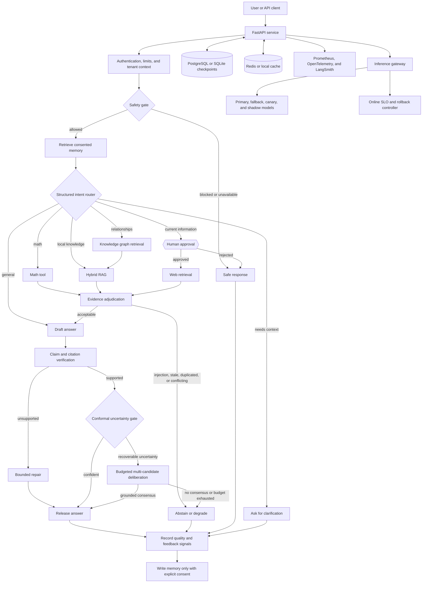
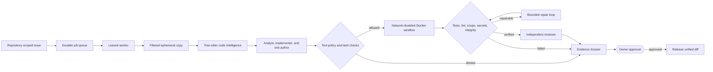

# AgentForge

**A reliability-first platform for building, evaluating, and operating AI agents.**

[](https://github.com/Theepankumargandhi/Multi-Agent-Orchestration/actions/workflows/ci.yml)
[](https://github.com/Theepankumargandhi/Multi-Agent-Orchestration/actions/workflows/cd-release.yml)

AgentForge began as a LangGraph research assistant. It has grown into a practical AI-engineering platform that answers a harder question: *how do you let an agent use retrieval, memory, tools, and additional inference without silently releasing an unsafe or unsupported answer?*

The repository contains two working agent systems:

- an evidence-aware research agent with hybrid RAG, durable human approval, memory, grounding, calibrated uncertainty, and adaptive test-time compute;
- a sandboxed coding agent that retrieves repository context, proposes a patch, tests it in an isolated container, and produces a reviewable evidence dossier without modifying the source repository.

Around those agents is the part that matters in production: an inference gateway, evaluation suites, adversarial testing, trace-based observability, release gates, persistence, and deployable FastAPI, Docker, and Kubernetes infrastructure.

> This is not presented as a production factuality guarantee or an official benchmark result. The checked-in evaluations are reproducible engineering evidence; the [limitations](#what-the-results-do-not-claim) explain where human-labelled and live-model validation is still required.

## Why this project exists

Most agent demos stop after the model produces a plausible answer. AgentForge treats generation as the middle of the workflow, not the end.

A request may need to be rejected by a safety policy, clarified, routed to a tool, approved by a person, grounded in several sources, repaired, or withheld when confidence is too low. Each of those decisions must be observable and testable. AgentForge makes those decisions explicit in the graph and attaches evaluation evidence to them.

That makes the project useful for demonstrating the work expected from an AI engineer:

- designing agent workflows rather than a single prompt;
- building and measuring retrieval systems;
- controlling hallucination, uncertainty, cost, and tool risk;
- evaluating complete trajectories, not only final text;
- operating model calls behind stable service boundaries;
- shipping with tests, telemetry, persistence, and deployment controls.

## System at a glance



The research workflow is an **18-node LangGraph state machine**. The trust controls are independently configurable, so they can be evaluated in isolation or enabled together. Native LangGraph interrupts persist web-approval state in the checkpointer, which means an approval can survive an API restart.

The line-by-line graph description lives in [the runtime flow](docs/architecture/agent_runtime_flow.md), and important trade-offs are recorded as [architecture decisions](docs/architecture/decisions.md).

## What is implemented

| Area | What the implementation demonstrates |
|---|---|
| Agent orchestration | Typed LangGraph state, structured routing, clarification, bounded repair, native interrupts, and route-scoped evidence |
| Retrieval | Semantic chunking, deterministic document IDs, vector + BM25 fusion, reranking, graph predicates, multi-hop retrieval, caching, and retrieval ablations |
| Evidence intelligence | Prompt-injection quarantine, source-independence checks, cross-domain duplicate detection, freshness policy, and numeric/negation conflict graphs |
| Trustworthy generation | Claim-to-evidence alignment, citation allowlisting, high-risk thresholds, conformal selective answering, and fail-closed abstention |
| Test-time compute | Confidence-aware early exit, bounded candidate generation, grounded candidate filtering, consensus, and token/call/latency budgets |
| Long-term memory | Episodic, semantic, preference, and procedural memory with consent, tenant isolation, provenance, TTLs, corrections, deletion, and poisoning controls |
| Model operations | Tenant budgets, provider deadlines, circuit breakers, fallback, isolated semantic caching, canaries, shadow evaluation, and online rollback decisions |
| Evaluation | Versioned datasets, fingerprints, trace replay, confidence intervals, failure slices, Pareto analysis, human-review provenance, adversarial arenas, and CI gates |
| Observability | Content-free OpenTelemetry GenAI spans, Prometheus metrics, LangSmith hooks, request/node latency, privacy checks, and reliability fault injection |
| Deployment | FastAPI + SSE, PostgreSQL/SQLite, Redis, Docker Compose, non-root containers, health checks, Kubernetes manifests, and network policy |

The controls are designed to compose. For example, retrieved documents do not go straight into a prompt: the evidence layer first removes suspicious or redundant material; the grounding layer then checks claims against the surviving evidence; the uncertainty layer decides whether the answer can be released; and adaptive compute is reserved for cases that are uncertain but still recoverable.

## Sandboxed coding agent

The coding workflow is deliberately separated from the research graph because code execution has a different risk model.



Code intelligence uses Tree-sitter for Python, TypeScript, JavaScript, Java, Go, and Rust. A decomposed query searches symbols, files, tests, and dependencies using BM25, semantic embeddings, graph propagation, and reranking. The resulting context is deduplicated, compressed to a token budget, and accompanied by provenance receipts.

The worker never edits the original repository. It operates on a filtered temporary copy and executes tests inside a non-root container with no network, a read-only root filesystem, dropped capabilities, and CPU, memory, PID, and time limits. Jobs are transactional and recoverable: submissions are deduplicated, workers hold expiring leases, abandoned jobs can be reclaimed, and completed artifacts are checked by digest.

See [the coding-agent design](docs/code-agent.md), [code intelligence](docs/code-intelligence.md), and [coding-agent evaluation](docs/coding-agent-evaluation.md).

## Evaluation evidence

The repository currently contains **212 automated tests** with **60.60% branch-aware coverage**. The CI floor is intentionally lower than the measured total so platform-specific integration paths can remain optional; the newest trust modules have focused coverage between 94% and 98%.

| Module | Focused coverage |
|---|---:|
| Adaptive test-time compute | 98% |
| Evidence quality | 97% |
| Conformal uncertainty | 95% |
| Grounding verification | 94% |
| Inference gateway | 94% |
| Agent memory | 92% |
| Online quality controller | 89% |

The deterministic evaluation suites cover more than happy-path output. They exercise evidence injection, copied-source laundering, stale and contradictory evidence, fabricated citations, unsafe high-risk claims, calibration drift, compute-budget violations, cross-tenant memory access, poisoning, provider failures, cache isolation, canary rollback, unsafe tool calls, worker-lease recovery, artifact tampering, and retrieval regressions.

Run the same core checks used in CI:

```bash
python -m pytest -q --cov --cov-report=term-missing --cov-report=xml
python -m evals.run_offline_evals --min-score 0.95
ruff check agent client code_agent evals post_training schema service tests
python -m pip check
```

Run the reliability command center locally:

```bash
python -m evals.reliability --output data/evaluations/reliability/latest.json
streamlit run evals/reliability_dashboard.py --server.port 8506
```

It combines experiment results, retrieval ablations, security attacks, failure recovery, model-gateway behavior, memory governance, grounding, uncertainty, adaptive compute, and evidence-quality results in one place. Every report retains configuration and dataset fingerprints so a result can be tied back to the exact experiment that produced it.

For the evaluation methodology and measured case studies, read [evaluation strategy](docs/evaluation.md) and the [recruiter-facing case study](docs/agentforge-case-study.md).

## Quick start

### 1. Create the environment

Python 3.11–3.13 is supported.

```bash
python -m venv .venv

# Windows PowerShell
.venv\Scripts\Activate.ps1

# macOS or Linux
source .venv/bin/activate

python -m pip install --upgrade pip
python -m pip install -r requirements-service.txt -r requirements-app.txt
```

### 2. Configure a model provider

```bash
cp .env.example .env
```

On Windows PowerShell, use `Copy-Item .env.example .env`. Add at least one of `OPENAI_API_KEY` or `GROQ_API_KEY`. Model credentials stay in the service; clients discover only the configured model IDs through `/capabilities`.

The advanced reliability controls are opt-in so the basic application can start without calibration artifacts or signing keys. Their defaults and explanations are in [.env.example](.env.example).

### 3. Start the API and UI

Use two terminals:

```bash
python run_service.py
```

```bash
streamlit run streamlit_app.py
```

Open `http://localhost:8501`. API documentation is available at `http://localhost:8000/docs`.

### Docker Compose

```bash
docker compose up --build
```

The default stack starts the API, UI, PostgreSQL, Redis, Prometheus, and Grafana. Evaluation dashboards are behind the `evaluation` profile:

```bash
docker compose --profile evaluation up --build
```

| Service | URL |
|---|---|
| API documentation | `http://localhost:8000/docs` |
| Agent UI | `http://localhost:8501` |
| Coding-agent evaluation | `http://localhost:8502` |
| Post-training lab | `http://localhost:8503` |
| Code-context lab | `http://localhost:8504` |
| Security lab | `http://localhost:8505` |
| Reliability command center | `http://localhost:8506` |
| Prometheus | `http://localhost:9090` |
| Grafana | `http://localhost:3001` |

Change the example PostgreSQL, Grafana, authentication, and integrity-signing secrets before exposing the stack outside a local environment.

## Try the main workflows

### Research agent

After registering through `POST /auth/register`, call `POST /invoke` or `POST /stream` with a stable `thread_id`. Current-information questions pause at a native graph interrupt. Resume with `approve` or `reject: reason` on the same user and thread; the service verifies that an active checkpoint interrupt exists before accepting the decision.

Useful demo prompts:

- `Calculate (125 * 8) / 4` — deterministic routing and tool execution.
- `local: explain the checkpoint implementation` — source-grounded local RAG.
- `How does FastAPI connect to LangGraph in this project?` — relationship and graph retrieval.
- `What changed in AI news this week?` — web approval, evidence adjudication, and durable resume.

### Ingest local documents

Place PDFs in `rag_docs/` or `graph_rag_docs/`, then run:

```bash
python scripts/ingestion/ingest_local_rag_pdfs.py --pdf-dir rag_docs
python scripts/ingestion/ingest_graph_rag_pdfs.py --pdf-dir graph_rag_docs
```

Ingestion is idempotent for unchanged content. Chunks receive deterministic IDs, and stale chunks for a changed source are removed only after the replacement write succeeds.

### Run a coding task

Build the purpose-specific sandbox image, then enable `CODE_AGENT_ENABLED`:

```bash
docker build -f docker/Dockerfile.code-sandbox -t agentforge-code-sandbox:local .
```

Submit an authenticated issue to `POST /code/tasks` with an `Idempotency-Key`. Poll the task, inspect its event history and evidence dossier, then explicitly approve or reject the verified patch. The original repository remains unchanged throughout the workflow.

## Repository map

```text
agent/          LangGraph runtime, retrieval, memory, grounding, and model controls
code_agent/     Sandboxed coding workflow, code intelligence, security, and benchmarks
service/        FastAPI endpoints, authentication, persistence, and streaming
evals/          Datasets, experiment runners, graders, dashboards, and release gates
post_training/  Reviewed SFT/DPO preparation, LoRA/QLoRA training, and model lineage
monitoring/     Prometheus and Grafana configuration
docker/         Runtime and hardened coding-sandbox images
k8s/            Kubernetes deployment, storage, secrets, and network policy
docs/           Architecture decisions, threat model, subsystem guides, and case studies
tests/          Unit, integration, security, and evaluation tests
```

## Design choices worth discussing

**Why several release gates?** Evidence quality, grounding, uncertainty, and adaptive compute answer different questions. A source can be suspicious before synthesis; a generated claim can be unsupported afterward; a supported answer can still fall outside the calibrated release region; and extra inference is useful only for uncertain cases that have enough evidence to recover.

**Why are most advanced controls opt-in?** Some require a calibration artifact, a dedicated integrity key, or an operational policy that should be owned by the deploying team. Silent defaults would make a demo easier but would hide those dependencies.

**Why deterministic evaluations?** Credential-free tests are stable enough for every pull request. They validate control flow, isolation, accounting, and failure behavior. Live-model and human-labelled evaluations remain a separate layer because they are slower, more expensive, and statistically variable.

**Why not let the coding agent apply changes?** The project keeps generation and authorization separate. A verified patch is evidence for a human decision, not permission to mutate the source repository.

## What the results do not claim

The checked-in datasets are intentionally useful for regression testing, but several are authored or synthetic. They prove that the mechanisms behave as designed; they do not prove broad real-world model quality.

- Evidence, grounding, conformal, and adaptive-compute results need larger human-labelled, multilingual, temporal, and live-model datasets before they support production quality claims.
- The behavioral arena uses synthetic seed scenarios and deterministic policy simulators; it is not a substitute for repeated adversarial testing with real models and calibrated judges.
- Retrieval uses an embedded Chroma deployment and hashed embeddings by default in some offline paths. Larger deployments should use managed/shared indexes and evaluated production embeddings.
- The inference gateway, online event stream, memory store, coding queue, and artifact store are durable single-host reference implementations, not distributed control planes.
- The Docker sandbox is strong process isolation for a portfolio system, but hostile multi-tenant execution should use isolated microVM workers and an external immutable artifact store.
- Kubernetes manifests are a secure starting point, not a complete managed-cloud architecture.
- Post-training plumbing is implemented, but no fine-tuned-model quality claim should be made without reviewed data, accelerator training, and a frozen holdout evaluation.


## Documentation

- [Architecture and runtime flow](docs/architecture/agent_runtime_flow.md)
- [Architecture decision records](docs/architecture/decisions.md)
- [Evaluation strategy](docs/evaluation.md)
- [AgentForge case study](docs/agentforge-case-study.md)
- [Evidence intelligence](docs/evidence-intelligence.md)
- [Grounding verification](docs/grounding-verification.md)
- [Uncertainty calibration](docs/uncertainty-calibration.md)
- [Adaptive test-time compute](docs/adaptive-test-time-compute.md)
- [Agent memory](docs/agent-memory.md)
- [Inference gateway](docs/inference-gateway.md)
- [Online AI governance](docs/online-ai-governance.md)
- [Code agent](docs/code-agent.md)
- [Code intelligence](docs/code-intelligence.md)
- [Security threat model](docs/security/threat-model.md)
- [GenAI observability](docs/genai-observability.md)
- [Self-improvement flywheel](docs/self-improvement-flywheel.md)
- [Post-training](docs/post-training.md)

Contributions are welcome; see [CONTRIBUTING.md](CONTRIBUTING.md). AgentForge is released under the [MIT License](LICENSE).
