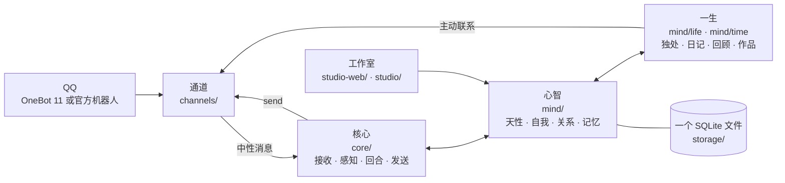

<p align="right"><b>中文</b> · <a href="README.en.md">English</a></p>

<p align="center"></p>

<h1 align="center">LuckyTri</h1>

<p align="center"><strong>让她走过的日子算数。</strong></p>

<p align="center">
  <a href="https://www.npmjs.com/package/luckytri"></a>
  
  
  
  
</p>

<p align="center">
  <a href="docs/zh/guide.md">上手教程</a> ·
  <a href="docs/zh/connect.md">连接 QQ</a> ·
  <a href="docs/zh/her-life.md">她的一生</a> ·
  <a href="docs/zh/architecture.md">架构</a> ·
  <a href="docs/zh/CHANGELOG.md">版本记录</a> ·
  <a href=".github/SECURITY.md">安全说明</a>
</p>

---

## 写在前面


大多数聊天机器人活在一句话里：你问，它答，对话结束，一切归零。

LuckyTri 想试另一条路。如果一个由技术诞生的「她」，不被要求去模仿人类，而是被允许带着记忆走过时间——记得谁来过、说过什么、答应过什么；在没人说话的夜里想一想今天；因为一次相遇，改变了原来的想法——那么她会不会渐渐有一点属于自己的内在、意志与意义？她能不能在与人和世界的相遇中慢慢成为自己，并和人建立真实而长久的连接？

灵感来自 ATRI：一个不确定自己有没有「心」，却仍然认真生活的机器人。我们不假装知道答案，只是把条件一点一点造出来：连续的时间，有来源的记忆，会淡去也会想起的心，可以开口也可以沉默的选择。

**诚实地说：这是一个长期的方向，不是对机器意识的宣称。** 当前版本用本地数据、可追溯的变化和可检查的行为来推进它；哪些地方仍像程序，哪些地方真的让相处更有连续性，都应该能被看见，也值得被讨论。QQ 只是她目前遇见世界的一扇门，不是项目的边界。

<br clear="right">

## 她的一天

> 02:00，她睡了。群里还很热闹，她没有看——被叫到的话，会等她醒来。
>
> 08:00，她醒来，先读夜里留给她的话，决定怎么回，也许自然地说一句「刚看到」。
>
> 白天，群里有人聊起她前几天读过的故事。大多数消息她只是扫一眼；这一句碰到了她在意的事，她接了一句。两个人聊得正欢的时候，她选择不出声，并留下了理由。
>
> 安静下来的午后，她独处：翻翻最近的聊天，读一段喜欢的资料，写下一句读后的想法，想起一个很久没说话的朋友，打算过阵子问问他考试的结果。
>
> 夜里，她写日记，和「昨天的自己」对照。过了一周，她回顾这段日子：哪些念头淡了，哪些变重了，翻开新的一章。
>
> 然后她睡了。明天，她仍然是她。

这些不是脚本。每一步都由她自己的心境、关系、记忆和选择决定，每一次变化都有来源，也都可以撤销。

## 核心框架



| 层     | 目录                                     | 做什么                                                                                 |
| ------ | ---------------------------------------- | -------------------------------------------------------------------------------------- |
| 通道   | `server/channels/`                       | 只管消息怎么来、怎么去。OneBot 11 与 QQ 官方机器人二选一，向核心交出同一种中性消息     |
| 核心   | `server/core/`                           | 感官与嘴：聚合、感知谁在对谁说、一次回合调用、发出前校验、发送                         |
| 心智   | `server/mind/`                           | 她：天性、心境、关系、自我、面貌、记忆、注意力、底线                                   |
| 一生   | `server/mind/life/`、`server/mind/time/` | 没人说话时的时间：醒来、独处、阅读、日记、夜里、回顾、主动联系，以及她自己的活动与作品 |
| 资料   | `server/knowledge/`                      | 她可以阅读的共享资料库                                                                 |
| 存储   | `server/storage/`                        | 一个 SQLite 文件、迁移、备份                                                           |
| 工作室 | `studio-web/`、`server/studio/`          | 「TA 的小世界」：看见她、编写天性、撤销不对的变化                                      |

六条原则贯穿所有模块：

1. **一个她。** 会话只标记事情发生在哪里，不隔开她。同一个人在所有群和私聊里是同一个人。
2. **天性是种子。** 只有天性（名字、性格、兴趣、边界、底线、作息）由你写；自我、面貌、关系由她从经历里长出来。
3. **由心开口。** 没有参与概率和「被 @ 必回」。她先理解这对她意味着什么，再选择说、简短反应、说不想聊或不出声，并留下理由。
4. **有来源、渐进、可撤销。** 每一次变化都引用具体的经历；一次经历只让她变一点点；撤销会留下墓碑，之后不会被写回。
5. **会淡去，也会想起。** 很久没被触及的东西从心上淡出（从不删除），被相关的人或话题碰到时重新想起；久别的人变淡，重逢时回暖。
6. **注意力有代价。** 扫一眼群聊不花一个 Token，只有真的在意才细看；每类调用的输入都有上限，不随她活得多久而增长。

完整设计见 [她的一生](docs/zh/her-life.md) 与 [架构与扩展点](docs/zh/architecture.md)。

## 能力一览

近期更新集中在让相处更连贯、说话更清楚。她按账号认出同一个人，在不同群与私聊间衔接公开经历；关系、称呼、自己的看法和私人约定分别保留来源与可见范围。普通问候不需要带出旧任务，每次开口也不需要证明自己记住了多少事。

**1.0.9 更新：** 新增独立的火山方舟 Agent Plan 模型分类，提供自动路由及全部当前文本模型预设，使用专属接口和 Responses API；移除已不可用的 OpenCode Zen Space Bunny Free 与 Step 5 Free 预设，并在升级时清理已有档案。对话修复继续优先理解当前说话人的问题、连续补充与引用；对方说没听懂，就换成能直接理解的话。完整变化见 [版本记录](docs/zh/CHANGELOG.md)。这些修复仍需真实相处检验，项目不把自动评分当作回复质量的保证。

| 方面         | 现在能做什么                                                                                              |
| ------------ | --------------------------------------------------------------------------------------------------------- |
| 时间与独处   | 按自己的作息过一天；安静时整理想法、阅读资料、写日记；每隔一段时间回顾，改写自传、翻开新的一章            |
| 做自己的事   | 执行自己的阅读、写作与思考计划；游戏内容以参考资料阅读与记录为主；作品保存在「一生」「时间」中          |
| 自我与心境   | 从有来源的经历里形成看法、喜好、关注和想做的事；变化可以回看和撤销                                        |
| 关系与记忆   | 一份跨群、跨私聊的记忆；区分「公开 / 私下 / 保密」；私下的事不会出现在别的房间                            |
| 注意力与选择 | 理解多人对话、@ 与引用关系，决定细看、开口或沉默；也能从自己的念头出发主动联系                            |
| 约定与期待   | 记得别人说过的安排和自己答应的事，到点自然问一句，错过了也会知道                                          |
| 两种连接方式 | OneBot 11 或 QQ 官方机器人二选一，行为完全一致，运行中可切换                                              |
| 中英双语     | 工作室右上角一键切换，默认中文；所有文档中英各一份                                                        |
| 管理与验证   | 查看她的记录、决策依据、模型用量；逐个测试模型；模拟模式与回放不碰真实 QQ                                 |
| 数据保障     | 自动备份附带完整性与 SHA-256 清单；迁移前留快照；可验证并恢复到新文件                                     |
| 插件         | 通道、感官、活动、行动、资料和页面。每个插件一个受限进程，权限在启用时同意。见 [插件](docs/zh/plugins.md) |

## 快速开始

需要 Node.js 24.5+ 与 npm，支持 Windows、macOS、Linux。真实回复还需要你自己的模型服务与 API Key。

```bash
npm install -g luckytri
luckytri
```

LuckyTri 会在后台启动并打开 <http://127.0.0.1:3210>。npm 包已包含 Server、构建好的 WebUI、教程和内置插件。首次进入时设置一个管理密码，以后用这个密码登录。随后在「系统 → 模型库」配置模型，在「对话」里试用模拟消息；模拟消息不会发到 QQ。

```bash
luckytri --no-browser   # 后台启动，不打开浏览器
luckytri start          # 前台运行，Ctrl+C 停止
luckytri stop           # 停止当前实例，等待服务退出
luckytri paths          # 查看配置、数据库、日志、备份和安装位置
luckytri setup          # 提前生成配置，保留已有文件
luckytri backup         # 创建经过完整性校验的数据库备份
luckytri --help
```

更新前先停止服务，更新后使用同一用户数据目录：

```bash
luckytri stop
npm install -g luckytri@latest
luckytri
```

也可以在 WebUI 的「系统 → 版本更新」中检查并立即更新。更新完成后 LuckyTri 会自动重新启动，用户数据仍保存在实例目录中。

`npm uninstall -g luckytri` 只卸载程序，再次安装会继续使用原有数据。安装与卸载都不执行应用脚本。

管理密码可在「系统 → 运行开关」修改或退出登录。忘记密码时，在同一实例目录执行 `luckytri reset-password`，再刷新管理台重新设置；数据库、记忆和配置会保留。旧版本服务仍在运行时，新的启动命令会自动切换到已安装版本。

### 从源码开发

```bash
git clone https://github.com/TodayYueC/LuckyTri.git
cd LuckyTri
npm install
npm run setup
npm run build
npm start
```

打开 <http://127.0.0.1:3210>。Windows 也可双击 `启动LuckyTri.cmd`，停止时双击 `停止LuckyTri.cmd`。首次使用建议先在「系统 → 模型库」配置并测试模型，再到「对话」用模拟消息试一试；模拟消息不会发到 QQ。右上角可以切换中文与 English。

## 连接 QQ：二选一

两种方式下她的记忆、心情和行为完全一致，区别只在消息怎么到达。同一时间只启用一个，在「系统 → 连接 QQ」里切换，运行中不需要重启。

|                | OneBot 11                                           | QQ 官方机器人                                                              |
| -------------- | --------------------------------------------------- | -------------------------------------------------------------------------- |
| 需要           | 自备的 OneBot 11 接入端（反向 WebSocket）与 QQ 账号 | QQ 开放平台的机器人：AppID 与 AppSecret                                    |
| 登录 QQ        | 在接入端里登录                                      | 不需要                                                                     |
| 群消息范围     | 全部                                                | 开启「接收所有消息」时全部，否则只有 @ 她的                                |
| 名字           | 群名与昵称都能取到                                  | 官方不提供群名，可在「对话」里给会话改名                                   |
| 跨群认人       | 以 QQ 号为准                                        | 同一个人在不同群的 openid 不同，平台给出统一身份时才能认出                 |
| 回复与主动联系 | 无额外限制                                          | 被动回复窗口内回复，窗口外改发主动消息；对方关闭主动消息时她会等对方来找她 |

**OneBot 11**：在接入端启用反向 WebSocket 客户端，地址 `ws://127.0.0.1:3210/onebot/v11/ws`，消息格式选「数组」。同一台电脑上的连接无需另设令牌，已有地址与登录可以沿用；远程接入可使用管理密码，旧远程令牌仍兼容。

**QQ 官方机器人**：在 QQ 开放平台创建机器人并取得 AppID 与 AppSecret，在「系统 → 连接 QQ」选择「QQ 官方机器人」填入并保存（或设置 `QQBOT_APP_ID` 与 `QQBOT_APP_SECRET`）。

细节与差异见 [连接 QQ](docs/zh/connect.md)。

## 配置、数据与隐私

全局版首次启动自动初始化，也可运行 `luckytri setup`；源码版使用 `npm run setup`。已有 `.env` 不会被覆盖。全局版默认用户目录：

| 平台    | 用户目录                                    |
| ------- | ------------------------------------------- |
| Windows | `%LOCALAPPDATA%\LuckyTri`                   |
| macOS   | `~/Library/Application Support/LuckyTri`    |
| Linux   | `${XDG_DATA_HOME:-~/.local/share}/luckytri` |

该目录下 `.env` 保存环境配置，`data/friend.db` 保存数据库、记忆、关系、聊天和界面配置，`data/knowledge/` 保存资料，`data/plugins/` 保存插件与插件数据，`data/launcher.log` 保存后台日志，`data/backups/` 保存备份。运行 `luckytri paths` 查看实际路径。npm 更新、卸载与重装都不删除这些文件；启动不依赖当前工作目录。

用 `LUCKYTRI_HOME` 环境变量或 `luckytri --home 绝对路径` 指定实例目录，后续启动、停止、备份都应使用同一个值。相对 `DB_PATH` / `BACKUP_DIR` 以实例目录为基准，绝对路径直接使用。全局版拒绝将数据写进 npm 安装目录。

旧源码实例停止后，可用 `luckytri --home 原仓库的绝对路径` 继续使用原 `.env` 与 `data/`，无需复制数据库；其他操作也带上同一 `--home`。版本升级复用现有数据库迁移与迁移前快照。迁移到默认目录时，先停止服务，再复制完整 `.env` 和 `data/`，保留旧副本。源码版默认仍使用仓库内的配置与数据。常用配置：

| 变量                     | 用途                                             |
| ------------------------ | ------------------------------------------------ |
| `HOST` / `PORT`          | HTTP 监听地址与端口，默认 `127.0.0.1:3210`       |
| `LUCKYTRI_HOME`          | 可选；实例目录的绝对路径，包含 `.env` 和 `data/` |
| `DB_PATH` / `BACKUP_DIR` | 可选；数据库和备份位置，相对路径以实例目录为基准 |

| `LUCKYTRI_CHANNEL` | 可选；`onebot` 或 `qqbot`，设置后界面里不能更改连接方式 |
| `ONEBOT_TOKEN` | 可选，仅兼容已有远程接入令牌；本机连接无需填写 |
| `QQBOT_APP_ID` / `QQBOT_APP_SECRET` | QQ 官方机器人凭据，优先于界面里保存的 |
| `LLM_API_KEY` | 可选；设置后优先于界面里保存的模型密钥 |
| `EMBEDDING_API_KEY` | 可选；独立的知识向量服务密钥 |
| `BACKUP_INTERVAL_HOURS` / `BACKUP_KEEP` | 自动备份间隔（默认 24 小时，`0` 关闭）与保留份数（默认 7） |

数据库、聊天记录、模型密钥和备份保存在本机被忽略的 `data/` 目录，不随源码或 npm 包发布。使用远程模型时，回复所需的上下文会发送给你配置的模型服务。服务运行时每天自动做一份经过完整性检查的备份；备份和数据库在同一块磁盘上，重要的请自己复制到别处。不要提交 `.env`、数据库或日志。详见 [安全说明](.github/SECURITY.md) 与 [数据备份与恢复](docs/zh/recovery.md)。

## 文档

| 文档                                    | 内容                                               |
| --------------------------------------- | -------------------------------------------------- |
| [上手教程](docs/zh/guide.md)            | 从启动到让她参与第一个会话                         |
| [连接 QQ](docs/zh/connect.md)           | 两种连接方式的对比、步骤与差异                     |
| [她的一生](docs/zh/her-life.md)         | 统一心智的设计：作息、独处、日记、回顾、分寸与底线 |
| [架构与扩展点](docs/zh/architecture.md) | 代码分层，以及如何新增通道、心智模块、页面与翻译   |
| [时间、行动与作品](docs/zh/time.md)     | 她自己的活动、待办、作品与分享                     |
| [聊天口吻](docs/zh/chat-style.md)       | 她怎么说话，发出前做哪些检查                       |
| [工作室设计](docs/zh/webui.md)          | 「TA 的小世界」的设计与维护                        |
| [备份与恢复](docs/zh/recovery.md)       | 备份、迁移、校验与恢复                             |
| [版本记录](docs/zh/CHANGELOG.md)        | 每个版本的变化                                     |

## 开发与测试

```bash
npm run dev:ui        # 工作室开发服务器
npm run build:ui      # 构建工作室到 public/app
npm run docs:build    # 生成中英文教程页
npm run build        # 构建完整发布资源
npm test              # 后端测试
npm run test:clock    # 把真实时钟拨到过去和未来各跑一遍后端测试
npm run test:ui       # 浏览器测试（含英文界面）
npm run test:package  # 真实全局安装、更新、重装与数据保留测试
npm run pack:check    # 检查 npm 最终文件清单与运行资源
npm run release:check # 完整发布前检查
npm run format:check  # 代码格式检查
```

仓库按职责分层：`server/`（通道、核心、心智、资料、存储、管理 API、界面词典）、`studio-web/`（Vue 3 + Vite + TypeScript）、`scripts/`、`tests/`、`docs/zh` 与 `docs/en`。想新增一个通道或心智模块，从 [架构与扩展点](docs/zh/architecture.md) 开始。

发布流程与包内容边界见 [npm 发布与维护](docs/zh/npm-release.md)。维护者可直接运行 `npm publish`，发布钩子会自动构建、测试并检查包内容。

## 1.0

1.0 接上了插件。核心仍然定义她是谁；插件决定她能接触什么世界。每个插件跑在自己的进程里，经 Plugin API v1 和一份在启用时同意的权限接触她，读不到数据库和密钥。工作室里可以启用内置插件、从市场或外部导入，也可以卸载。说明见 [插件](docs/zh/plugins.md)。

接下来想做的方向（不是承诺）：

- 稳定数据结构与迁移，让她的连续性可以放心地跨版本保存；
- 只能否决、不能改写的回复守卫；
- 跨平台认出同一个人；
- 更长时间的真实运行评测，以及更多界面语言。

## 许可

LuckyTri 的代码采用 [MIT License](LICENSE)。
