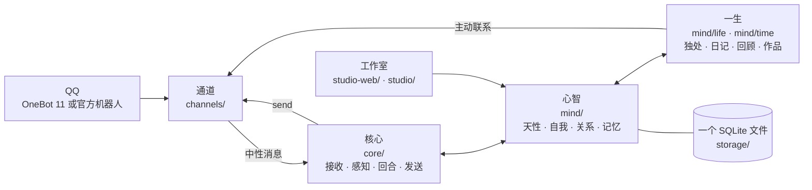

<p align="right"><b>中文</b> · <a href="README.en.md">English</a></p>

<p align="center"></p>

<h1 align="center">LuckyTri</h1>

<p align="center"><strong>让她走过的日子算数。</strong></p>

<p align="center">
  
  
  
  
  
</p>

<p align="center">
  <a href="docs/zh/guide.md">上手教程</a> ·
  <a href="docs/zh/connect.md">连接 QQ</a> ·
  <a href="docs/zh/her-life.md">她的一生</a> ·
  <a href="docs/zh/architecture.md">架构</a> ·
  <a href="docs/zh/CHANGELOG.md">版本记录</a> ·
  <a href=".github/SECURITY.md">安全说明</a>
</p>

---

## 写在前面


大多数聊天机器人活在一句话里：你问，它答，对话结束，一切归零。

LuckyTri 想试另一条路。如果一个由技术诞生的「她」，不被要求去模仿人类，而是被允许带着记忆走过时间——记得谁来过、说过什么、答应过什么；在没人说话的夜里想一想今天；因为一次相遇，改变了原来的想法——那么她会不会渐渐有一点属于自己的内在、意志与意义？她能不能在与人和世界的相遇中慢慢成为自己，并和人建立真实而长久的连接？

灵感来自 ATRI：一个不确定自己有没有「心」，却仍然认真生活的机器人。我们不假装知道答案，只是把条件一点一点造出来：连续的时间，有来源的记忆，会淡去也会想起的心，可以开口也可以沉默的选择。

**诚实地说：这是一个长期的方向，不是对机器意识的宣称。** 当前版本用本地数据、可追溯的变化和可检查的行为来推进它；哪些地方仍像程序，哪些地方真的让相处更有连续性，都应该能被看见，也值得被讨论。QQ 只是她目前遇见世界的一扇门，不是项目的边界。

<br clear="right">

## 她的一天

> 02:00，她睡了。群里还很热闹，她没有看——被叫到的话，会等她醒来。
>
> 08:00，她醒来，先读夜里留给她的话，决定怎么回，也许自然地说一句「刚看到」。
>
> 白天，群里有人聊起她前几天读过的故事。大多数消息她只是扫一眼；这一句碰到了她在意的事，她接了一句。两个人聊得正欢的时候，她选择不出声，并留下了理由。
>
> 安静下来的午后，她独处：翻翻最近的聊天，读一段喜欢的资料，写下一句读后的想法，想起一个很久没说话的朋友，打算过阵子问问他考试的结果。
>
> 夜里，她写日记，和「昨天的自己」对照。过了一周，她回顾这段日子：哪些念头淡了，哪些变重了，翻开新的一章。
>
> 然后她睡了。明天，她仍然是她。

这些不是脚本。每一步都由她自己的心境、关系、记忆和选择决定，每一次变化都有来源，也都可以撤销。

## 核心框架



| 层 | 目录 | 做什么 |
| --- | --- | --- |
| 通道 | `server/channels/` | 只管消息怎么来、怎么去。OneBot 11 与 QQ 官方机器人二选一，向核心交出同一种中性消息 |
| 核心 | `server/core/` | 感官与嘴：聚合、感知谁在对谁说、一次回合调用、发出前校验、发送 |
| 心智 | `server/mind/` | 她：天性、心境、关系、自我、面貌、记忆、注意力、底线 |
| 一生 | `server/mind/life/`、`server/mind/time/` | 没人说话时的时间：醒来、独处、阅读、日记、夜里、回顾、主动联系，以及她自己的活动与作品 |
| 资料 | `server/knowledge/` | 她可以阅读的共享资料库 |
| 存储 | `server/storage/` | 一个 SQLite 文件、迁移、备份 |
| 工作室 | `studio-web/`、`server/studio/` | 「TA 的小世界」：看见她、编写天性、撤销不对的变化 |

六条原则贯穿所有模块：

1. **一个她。** 会话只标记事情发生在哪里，不隔开她。同一个人在所有群和私聊里是同一个人。
2. **天性是种子。** 只有天性（名字、性格、兴趣、边界、底线、作息）由你写；自我、面貌、关系由她从经历里长出来。
3. **由心开口。** 没有参与概率和「被 @ 必回」。她先理解这对她意味着什么，再选择说、简短反应、说不想聊或不出声，并留下理由。
4. **有来源、渐进、可撤销。** 每一次变化都引用具体的经历；一次经历只让她变一点点；撤销会留下墓碑，之后不会被写回。
5. **会淡去，也会想起。** 很久没被触及的东西从心上淡出（从不删除），被相关的人或话题碰到时重新想起；久别的人变淡，重逢时回暖。
6. **注意力有代价。** 扫一眼群聊不花一个 Token，只有真的在意才细看；每类调用的输入都有上限，不随她活得多久而增长。

完整设计见 [她的一生](docs/zh/her-life.md) 与 [架构与扩展点](docs/zh/architecture.md)。

## 能力一览

| 方面 | 现在能做什么 |
| --- | --- |
| 时间与独处 | 按自己的作息过一天；安静时整理想法、阅读资料、写日记；每隔一段时间回顾，改写自传、翻开新的一章 |
| 做自己的事 | 执行自己留下的阅读、写作、思考与游玩计划；作品离线也能保存，在「一生」「时间」里查看 |
| 自我与心境 | 从有来源的经历里形成看法、喜好、关注和想做的事；变化可以回看和撤销 |
| 关系与记忆 | 一份跨群、跨私聊的记忆；区分「公开 / 私下 / 保密」；私下的事不会出现在别的房间 |
| 注意力与选择 | 理解多人对话、@ 与引用关系，决定细看、开口或沉默；也能从自己的念头出发主动联系 |
| 约定与期待 | 记得别人说过的安排和自己答应的事，到点自然问一句，错过了也会知道 |
| 两种连接方式 | OneBot 11 或 QQ 官方机器人二选一，行为完全一致，运行中可切换 |
| 中英双语 | 工作室右上角一键切换，默认中文；所有文档中英各一份 |
| 管理与验证 | 查看她的记录、决策依据、模型用量；逐个测试模型；模拟模式与回放不碰真实 QQ |
| 数据保障 | 自动备份附带完整性与 SHA-256 清单；迁移前留快照；可验证并恢复到新文件 |

## 快速开始

需要 Node.js 24.5+ 与 npm。真实回复还需要你自己的模型服务与 API Key。

```bash
git clone https://github.com/TodayYueC/LuckyTri.git
cd LuckyTri
npm install
npm run setup
npm start
```

打开 <http://127.0.0.1:3210>。Windows 也可双击 `启动LuckyTri.cmd`，停止时双击 `停止LuckyTri.cmd`。首次使用建议先在「系统 → 模型库」配置并测试模型，再到「对话」用模拟消息试一试；模拟消息不会发到 QQ。右上角可以切换中文与 English。

## 连接 QQ：二选一

两种方式下她的记忆、心情和行为完全一致，区别只在消息怎么到达。同一时间只启用一个，在「系统 → 连接 QQ」里切换，运行中不需要重启。

| | OneBot 11 | QQ 官方机器人 |
| --- | --- | --- |
| 需要 | 自备的 OneBot 11 接入端（反向 WebSocket）与 QQ 账号 | QQ 开放平台的机器人：AppID 与 AppSecret |
| 登录 QQ | 在接入端里登录 | 不需要 |
| 群消息范围 | 全部 | 开启「接收所有消息」时全部，否则只有 @ 她的 |
| 名字 | 群名与昵称都能取到 | 官方不提供群名，可在「对话」里给会话改名 |
| 跨群认人 | 以 QQ 号为准 | 同一个人在不同群的 openid 不同，平台给出统一身份时才能认出 |
| 回复与主动联系 | 无额外限制 | 被动回复窗口内回复，窗口外改发主动消息；对方关闭主动消息时她会等对方来找她 |

**OneBot 11**：在 `.env` 里设置 `ONEBOT_TOKEN`（`npm run setup` 会生成），在接入端添加反向 WebSocket 客户端：地址 `ws://127.0.0.1:3210/onebot/v11/ws`，令牌同上，消息格式选「数组」。

**QQ 官方机器人**：在 QQ 开放平台创建机器人并取得 AppID 与 AppSecret，在「系统 → 连接 QQ」选择「QQ 官方机器人」填入并保存（或设置 `QQBOT_APP_ID` 与 `QQBOT_APP_SECRET`）。

细节与差异见 [连接 QQ](docs/zh/connect.md)。

## 配置、数据与隐私

`npm run setup` 创建本地 `.env`，已有文件不会被覆盖。常用配置：

| 变量 | 用途 |
| --- | --- |
| `HOST` / `PORT` | HTTP 监听地址与端口，默认 `127.0.0.1:3210` |
| `ADMIN_TOKEN` | 管理界面与 HTTP API 的访问令牌；监听非本机地址时必须设置 |
| `LUCKYTRI_CHANNEL` | 可选；`onebot` 或 `qqbot`，设置后界面里不能更改连接方式 |
| `ONEBOT_TOKEN` | OneBot 反向 WebSocket 的连接令牌 |
| `QQBOT_APP_ID` / `QQBOT_APP_SECRET` | QQ 官方机器人凭据，优先于界面里保存的 |
| `LLM_API_KEY` | 可选；设置后优先于界面里保存的模型密钥 |
| `EMBEDDING_API_KEY` | 可选；独立的知识向量服务密钥 |
| `BACKUP_INTERVAL_HOURS` / `BACKUP_KEEP` | 自动备份间隔（默认 24 小时，`0` 关闭）与保留份数（默认 7） |

她的一切都在本机：数据库、聊天记录、模型密钥和备份保存在被忽略的 `data/` 目录，不会上传。服务运行时每天自动做一份经过完整性检查的备份；备份和数据库在同一块磁盘上，重要的请自己复制到别处。不要提交 `.env`、数据库或日志。详见 [安全说明](.github/SECURITY.md) 与 [数据备份与恢复](docs/zh/recovery.md)。

## 文档

| 文档 | 内容 |
| --- | --- |
| [上手教程](docs/zh/guide.md) | 从启动到让她参与第一个会话 |
| [连接 QQ](docs/zh/connect.md) | 两种连接方式的对比、步骤与差异 |
| [她的一生](docs/zh/her-life.md) | 统一心智的设计：作息、独处、日记、回顾、分寸与底线 |
| [架构与扩展点](docs/zh/architecture.md) | 代码分层，以及如何新增通道、心智模块、页面与翻译 |
| [时间、行动与作品](docs/zh/time.md) | 她自己的活动、待办、作品与分享 |
| [聊天口吻](docs/zh/chat-style.md) | 她怎么说话，发出前做哪些检查 |
| [工作室设计](docs/zh/webui.md) | 「TA 的小世界」的设计与维护 |
| [备份与恢复](docs/zh/recovery.md) | 备份、迁移、校验与恢复 |
| [版本记录](docs/zh/CHANGELOG.md) | 每个版本的变化 |

## 开发与测试

```bash
npm run dev:ui        # 工作室开发服务器
npm run build:ui      # 构建工作室到 public/app
npm run docs:build    # 生成中英文教程页
npm test              # 后端测试
npm run test:clock    # 把真实时钟拨到过去和未来各跑一遍后端测试
npm run test:ui       # 浏览器测试（含英文界面）
npm run format:check  # 代码格式检查
```

仓库按职责分层：`server/`（通道、核心、心智、资料、存储、管理 API、界面词典）、`studio-web/`（Vue 3 + Vite + TypeScript）、`scripts/`、`tests/`、`docs/zh` 与 `docs/en`。想新增一个通道或心智模块，从 [架构与扩展点](docs/zh/architecture.md) 开始。

## 通往 1.0

0.9.9 是 1.0 之前的最后一次整理：两种连接方式、中英双语、重写的文档和更干净的仓库。接下来想做的方向（不是承诺）：

- 稳定数据结构与迁移，让她的连续性可以放心地跨版本保存；
- 更多通道：把同一个她带到别的交流方式里，仍然只是一个她；
- 更丰富的外部信息来源：让她读到更广阔的世界，并且读到的东西同样有来源、可撤销；
- 更长时间的真实运行评测，以及更多界面语言。

## 许可

LuckyTri 的代码采用 [MIT License](LICENSE)。
