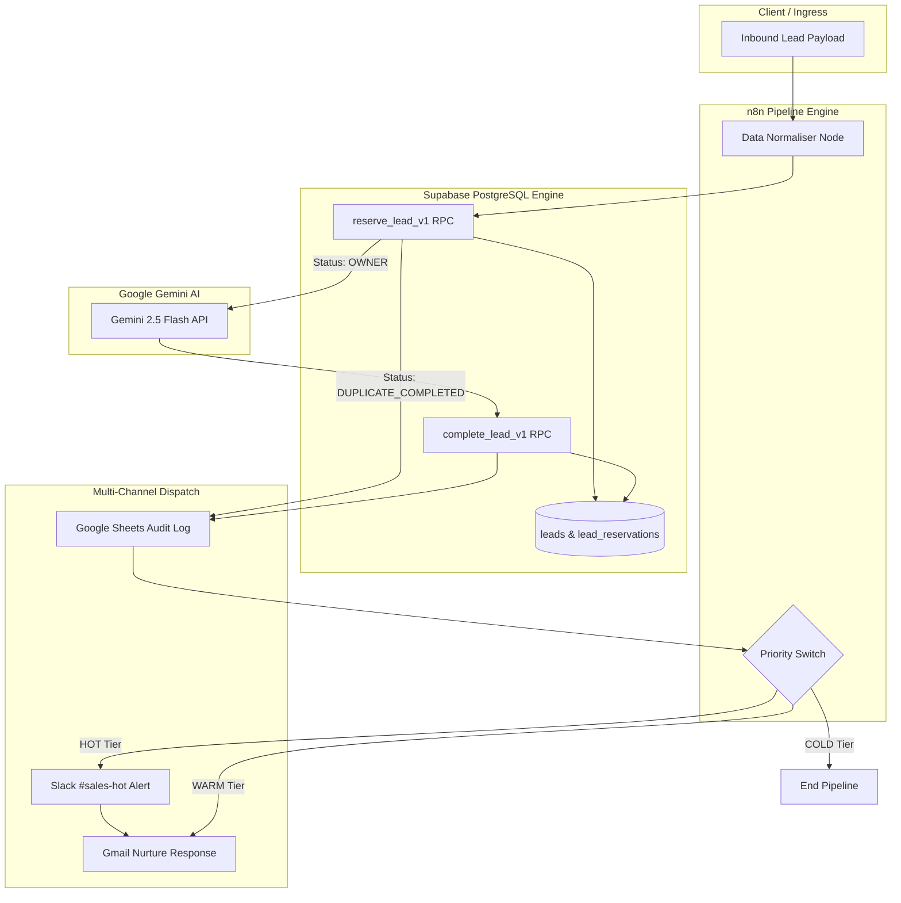
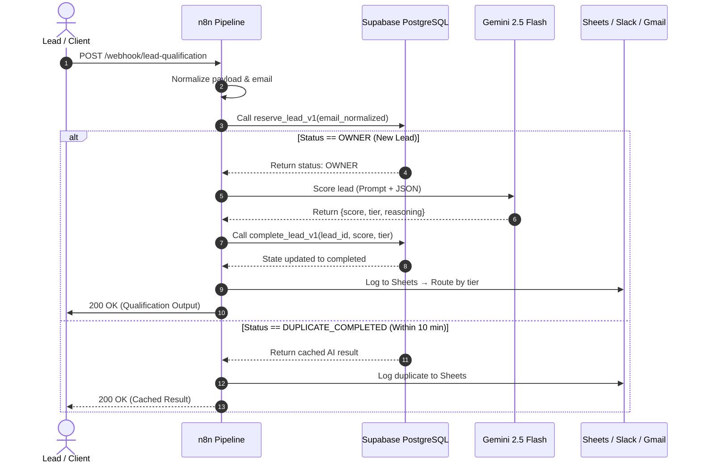
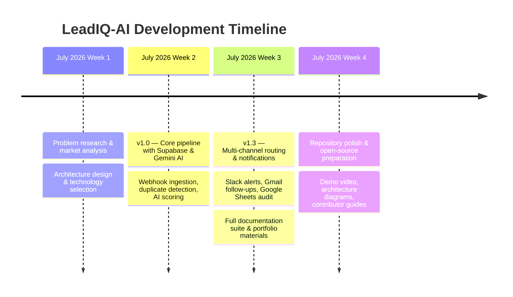

## v2 Runtime Notes

The current production baseline receives leads at `POST /webhook/leadiq`. Production requests must include `X-Webhook-Secret` matching `N8N_WEBHOOK_SECRET`. The existing routing behavior is HOT -> Slack, WARM -> Gmail, and COLD -> no active notification; HOT Gmail is intentionally not enabled in the exported v2 workflow. `GET /webhook/leadiq-health` reports configuration readiness and returns HTTP 503 when required settings are missing.

<h1 align="center">LeadIQ-AI</h1>

<p align="center">
  <strong>Enterprise AI Lead Qualification & Multi-Channel Routing Pipeline</strong>
</p>

<p align="center">
  <a href="./LICENSE"></a>
  <a href="https://python.org"></a>
  <a href="https://n8n.io"></a>
  <a href="https://github.com/sourabh-jangid-dev/LeadIQ-AI/stargazers"></a>
  <a href="https://github.com/sourabh-jangid-dev/LeadIQ-AI/issues"></a>
  <a href="https://github.com/sourabh-jangid-dev/LeadIQ-AI/commits/main"></a>
  <a href="./CONTRIBUTING.md"></a>
</p>

<p align="center">
  <a href="./docs/Architecture.md">📖 Architecture</a> · <a href="./docs/API.md">🔌 API Spec</a> · <a href="./docs/Workflow.md">🔄 Workflow Guide</a> · <a href="./docs/SETUP.md">🛠️ Setup Guide</a> · <a href="./docs/DEMO.md">🎬 Live Demo</a>
</p>

---

## The Problem

Sales teams lose **23% of qualified leads** due to slow response times and inconsistent follow-up. Manual triage creates bottlenecks — reps waste hours reviewing low-quality leads while high-value prospects go cold.

**LeadIQ-AI** solves this by automating the entire lead qualification pipeline. When a prospect submits an inquiry, the system instantly scores their intent using AI, prevents duplicate processing, routes hot leads to Slack for immediate attention, sends personalized follow-up emails, and logs everything to an audit trail — all within seconds, with zero manual intervention.

---

## 🎥 Project Demo

> **Watch the full pipeline in action** — from lead submission to AI qualification, duplicate prevention, Slack notification, Gmail generation, and Google Sheets reporting.

<p align="center">
  <a href="./demo/videos/leadiq-ai-demo.mp4">
    
  </a>
</p>

<p align="center"><em>▶️ Click the preview above to watch the full demo video</em></p>

<details>
<summary><strong>What the demo covers</strong></summary>

| Step | What Happens |
|---|---|
| 1. Lead Submission | A prospect submits an inquiry via the webhook endpoint |
| 2. Data Normalization | Email is normalized, correlation IDs are generated |
| 3. Duplicate Check | Supabase RPC checks the 10-minute deduplication window |
| 4. AI Qualification | Gemini 2.5 Flash scores intent (0–100) and assigns a tier |
| 5. Audit Logging | Full lead record is appended to Google Sheets |
| 6. Slack Alert | HOT leads trigger an immediate alert in `#sales-hot` |
| 7. Gmail Follow-up | Personalized acknowledgment email is sent to the lead |

</details>

---

## 💡 Why LeadIQ-AI?

<table>
  <tr>
    <td width="50%">

**Without LeadIQ-AI**
- ❌ Manual lead review takes hours
- ❌ Hot leads go cold waiting for response
- ❌ Duplicate submissions waste AI tokens
- ❌ No audit trail for qualification decisions
- ❌ Inconsistent scoring across reps

</td>
    <td width="50%">

**With LeadIQ-AI**
- ✅ Leads qualified in under 3 seconds
- ✅ Hot leads routed to Slack instantly
- ✅ 10-minute deduplication saves API costs
- ✅ Every decision logged to Google Sheets
- ✅ Consistent AI-powered scoring

</td>
  </tr>
</table>

---

## ⚡ Key Highlights

| Highlight | Detail |
|---|---|
| 🤖 **AI-Powered Scoring** | Google Gemini 2.5 Flash evaluates buyer intent, budget signals, and urgency |
| ⚡ **Sub-3s Qualification** | End-to-end pipeline from webhook to notification in under 3 seconds |
| 🔒 **Atomic Deduplication** | PostgreSQL RPCs prevent race conditions and duplicate processing |
| 📊 **Full Audit Trail** | Every lead decision logged to Google Sheets with AI reasoning |
| 🐳 **One-Command Deploy** | Docker Compose brings up the entire stack with `docker compose up -d` |
| 🔌 **Extensible Architecture** | Modular n8n pipeline — add new channels or scoring models without code changes |

---

## 🏗️ System Architecture

### Business Flow

A prospect submits an inquiry → the system normalizes their data → checks for duplicate submissions → scores their intent using AI → logs the result → routes alerts based on priority tier. **Hot leads get instant Slack alerts and email follow-ups. Warm leads get email nurturing. Cold leads are logged for reference.**

### Technical Architecture



### Channel Dispatch Matrix

| Tier | Score Range | Slack Alert | Gmail Follow-up | Google Sheets |
|---|---|---|---|---|
| **🔴 HOT** | 80–100 | ✅ Immediate | ✅ Personalized | ✅ Logged |
| **🟡 WARM** | 50–79 | — | ✅ Nurture email | ✅ Logged |
| **🔵 COLD** | 0–49 | — | — | ✅ Logged |

---

## ✨ Features

| Feature | Description |
|---|---|
| 🤖 **AI Lead Qualification** | Gemini 2.5 Flash evaluates buyer intent, company fit, urgency, and budget against ICP criteria — producing a score (0–100), tier, and structured reasoning |
| ⚡ **Transactional Duplicate Prevention** | Supabase PostgreSQL RPCs (`reserve_lead_v1`, `complete_lead_v1`) enforce a 10-minute deduplication window with atomic state management |
| 📊 **Immutable Audit Trail** | Every lead payload, AI score, tier, and reasoning is appended to Google Sheets for non-technical stakeholder access |
| 💬 **Real-time Slack Alerts** | HOT enterprise leads trigger formatted Markdown alerts in `#sales-hot` for immediate representative triage |
| 📧 **Automated Email Follow-up** | Personalized Gmail acknowledgments are sent based on qualification tier |
| 🐳 **One-Command Deployment** | Containerized n8n execution via Docker Compose with isolated secret management |

---

## 🔄 Workflow Overview

<details>
<summary><strong>Click to expand the full pipeline sequence diagram</strong></summary>



</details>

**Pipeline stages:** Webhook Ingestion → Data Normalization → Duplicate Check → AI Scoring → State Persistence → Audit Logging → Tier Routing → Slack/Gmail Dispatch

---

## 🛠️ Tech Stack

| Technology | Role | Why This Choice |
|---|---|---|
| [n8n](https://n8n.io) | Workflow Orchestration | Visual debugging, self-hostable, native integrations, no per-execution fees |
| [Supabase](https://supabase.com) | State Engine & PostgreSQL | ACID transactions, PL/pgSQL RPCs for atomic operations, built-in Studio UI |
| [Google Gemini](https://ai.google.dev) | AI Lead Scoring | `gemini-2.5-flash` — fast, structured JSON output, contextual reasoning |
| [Google Sheets](https://sheets.google.com) | Audit Trail | Zero-infrastructure log for non-technical stakeholders |
| [Slack API](https://api.slack.com) | Real-time Alerts | Channel-based routing, rich Markdown formatting |
| [Gmail API](https://developers.google.com/gmail) | Email Automation | OAuth2 personalized follow-ups with dynamic content |
| [Docker](https://www.docker.com) | Containerization | One-command deployment, isolated environments |

---

## 📸 Screenshots

> **Screenshots of the live pipeline** — n8n workflow, Slack alerts, Gmail emails, Google Sheets audit log, and Supabase Studio.

| Screenshot | Description |
|---|---|
| n8n Workflow Canvas | Full pipeline with duplicate detection branch visible |
| Gemini AI Response | n8n execution log showing AI scoring JSON output |
| Slack `#sales-hot` | Formatted Markdown alert for a HOT enterprise lead |
| Gmail Follow-up | Personalized acknowledgment email sent to the lead |
| Google Sheets Log | Audit spreadsheet with multiple lead records and tiers |
| Supabase Studio | `leads` and `lead_reservations` tables showing state transitions |

> [!TIP]
> To add screenshots: capture each system's output during a demo run, then place the images in [`demo/screenshots/`](./demo/screenshots/). See the [screenshot guide](./demo/screenshots/README.md) for naming conventions.

---

## 🚀 Installation

### Prerequisites

| Tool | Version | Install |
|---|---|---|
| Docker Desktop | Latest | [docker.com](https://www.docker.com/products/docker-desktop/) |
| Git | 2.40+ | [git-scm.com](https://git-scm.com/) |
| Python | 3.11+ | [python.org](https://python.org) |
| Supabase CLI | Latest | [supabase.com/docs/guides/cli](https://supabase.com/docs/guides/cli) |

### Quick Start

```bash
# 1. Clone & configure
git clone https://github.com/sourabh-jangid-dev/LeadIQ-AI.git
cd LeadIQ-AI
cp .env.example .env
# Edit .env with your API keys (see Configuration below)

# 2. Start Supabase & apply migrations
supabase start
supabase db reset

# 3. Launch n8n via Docker Compose
docker volume create n8n_data
docker compose up -d

# 4. Access n8n dashboard
# Open http://localhost:5678 in your browser
```

> [!NOTE]
> For detailed setup instructions including OAuth configuration, see the [full Setup Guide](./docs/SETUP.md).

---

## ⚙️ Configuration

| Variable | Required | Description |
|---|---|---|
| `LLM_API_KEY` | ✅ | Google Gemini API key |
| `LLM_MODEL` | ✅ | Model identifier (default: `gemini-2.5-flash`) |
| `SUPABASE_URL` | ✅ | Supabase REST URL |
| `SUPABASE_SERVICE_ROLE_KEY` | ✅ | Supabase service role secret |
| `GOOGLE_SHEETS_SPREADSHEET_ID` | ✅ | Target Google Sheets document ID |
| `SLACK_CHANNEL_HOT` | ✅ | Slack channel for HOT alerts (default: `#sales-hot`) |
| `GMAIL_SENDER_NAME` | ✅ | Display name for outbound emails |

> See [`.env.example`](./.env.example) for a complete template with inline documentation.

---

## ▶️ Running the Workflow

### Import the Workflow into n8n

1. Open n8n at `http://localhost:5678`
2. Go to **Workflows** → **Import from File**
3. Select [`n8n/v2/workflows/leadiq-ai-v2.1-fixed.json`](./n8n/v2/workflows/leadiq-ai-v2.1-fixed.json)
4. Configure credentials (Google Sheets OAuth2, Slack, Gmail) in n8n's credential manager
5. Toggle the workflow to **Active**

### Test with a Sample Lead

```bash
# Send a HOT lead
python scripts/generate_test_leads.py --count 1 --tier hot

# Or use cURL directly
curl -X POST "http://localhost:5678/webhook/lead-qualification" \
  -H "Content-Type: application/json" \
  -d '{
    "name": "Sarah Jenkins",
    "email": "s.jenkins@enterprise-tech.com",
    "company": "Enterprise Tech Solutions",
    "message": "We have an urgent budget of $50,000 to deploy AI lead automation across 40 reps.",
    "phone": "+1-555-019-2834",
    "country": "United States",
    "source": "Web Form"
  }'
```

### Verify Output

| Check | Where to Look |
|---|---|
| Pipeline execution | n8n → Executions tab |
| Database state | Supabase Studio (`http://localhost:54323`) → `leads` table |
| Audit log | Google Sheets → `Leads` tab |
| Slack alert | Slack → `#sales-hot` channel |
| Email sent | Gmail → Sent folder |

---

## 📁 Project Structure

```
LeadIQ-AI/
├── assets/                        # Hero banner & visual assets
├── business/                      # Business model & client presentation guides
│   ├── ClientDemo.md
│   ├── Pricing.md
│   ├── Problem.md
│   └── UseCases.md
├── data/                          # Sample payloads & schema references
│   ├── sample_leads.json
│   └── schema.md
├── demo/                          # Demo assets & walkthrough
│   ├── demo_walkthrough.md
│   ├── screenshots/               # Pipeline screenshots
│   ├── scripts/                   # Live webhook test sender
│   │   └── send_demo_lead.py
│   └── videos/                    # Demo recordings & GIF previews
├── diagrams/                      # Mermaid diagrams & .drawio files
├── docs/                          # Technical documentation suite
│   ├── API.md                     # Webhook REST API specification
│   ├── Architecture.md            # System architecture reference
│   ├── DATABASE.md                # Supabase schema & RPC guide
│   ├── DECISIONS.md               # Engineering decision records
│   ├── DEMO.md                    # Live demo walkthrough guide
│   ├── LIMITATIONS.md             # Known tradeoffs & limitations
│   ├── PRD.md                     # Product Requirements Document
│   ├── SETUP.md                   # Installation & setup guide
│   └── Workflow.md                # n8n pipeline node-by-node guide
├── examples/                      # cURL commands & sample payloads
├── n8n/                           # n8n workflow definitions
│   └── v2/workflows/              # ← Production workflow JSON
├── portfolio/                     # Case studies & portfolio collateral
├── prompts/                       # Google Gemini AI prompt templates
│   ├── lead_scoring.md
│   └── email_reply.md
├── scripts/                       # Developer utility tools
│   ├── generate_test_leads.py
│   └── validate_schema.py
├── supabase/                      # PostgreSQL migrations & RPC definitions
│   └── migrations/
├── tests/                         # Workflow test scenarios
├── .env.example                   # Environment configuration template
├── CHANGELOG.md                   # Release notes (Keep a Changelog)
├── CONTRIBUTING.md                # Contribution guidelines
├── docker-compose.yml             # Docker stack configuration
├── LICENSE                        # MIT License
├── README.md                      # ← You are here
└── SECURITY.md                    # Security policy
```

---

## 🧠 Engineering Decisions

> [!NOTE]
> Full decision records with rationale are documented in [`docs/DECISIONS.md`](./docs/DECISIONS.md).

<details>
<summary><strong>Why n8n for Orchestration?</strong></summary>

Visual flow execution enables node-by-node debugging. Self-hostable via Docker with no per-execution cloud fees. Native connectors for Google Sheets, Slack, and Gmail eliminate custom integration code.

</details>

<details>
<summary><strong>Why Supabase PostgreSQL for State Management?</strong></summary>

Full ACID transaction guarantees for concurrency control. PL/pgSQL stored procedures (`reserve_lead_v1`, `complete_lead_v1`) encapsulate atomic duplicate detection and state transitions, eliminating race conditions at the database level.

</details>

<details>
<summary><strong>Why Gemini 2.5 Flash for AI Scoring?</strong></summary>

Reliable structured JSON output matching strict qualification schemas. Fast turnaround (~1-2s) suitable for synchronous webhook processing. Superior contextual reasoning compared to keyword-based rules engines for evaluating buyer intent, budget, and urgency.

</details>

<details>
<summary><strong>Why a 10-Minute Duplicate Window?</strong></summary>

Web forms frequently receive accidental double-clicks or script loop resubmissions. The 10-minute window prevents redundant Gemini API calls (saving token costs) while being short enough that a genuine re-inquiry after the window expires gets fresh scoring.

</details>

<details>
<summary><strong>Why Google Sheets as an Audit Log?</strong></summary>

Gives sales leadership and non-technical stakeholders instant, real-time access to incoming leads without needing database query access or custom admin UI development. Zero additional infrastructure to maintain.

</details>

---

## ⚠️ Limitations & Tradeoffs

| Limitation | Current State | Why This Tradeoff |
|---|---|---|
| **Fixed duplicate window** | Hardcoded at 10 minutes | Simplifies configuration; covers 95% of accidental resubmissions |
| **Synchronous processing** | Webhook caller waits for full pipeline | Provides instant feedback; async queueing planned for v2 |
| **Single-tenant deployment** | One Supabase + n8n instance | Reduces operational complexity for initial deployment |
| **Fixed lease timeout** | 15-minute worker lease | Balances crash recovery with processing window |
| **Third-party rate limits** | Bound by Gemini, Sheets, Slack, Gmail APIs | Mitigated by deduplication; queueing planned for high-throughput |

> [!TIP]
> See [`docs/LIMITATIONS.md`](./docs/LIMITATIONS.md) for detailed analysis of each tradeoff and planned mitigations.

---

## 🛣️ Roadmap

### ✅ Completed

- [x] Core webhook ingestion pipeline
- [x] Supabase PostgreSQL state engine with atomic RPCs
- [x] Google Gemini AI lead scoring and tiering
- [x] 10-minute duplicate detection and suppression
- [x] Google Sheets immutable audit logging
- [x] Slack real-time alerts for HOT leads
- [x] Gmail personalized follow-up emails
- [x] Tier-based conditional routing (HOT / WARM / COLD)
- [x] Docker Compose one-command deployment
- [x] Comprehensive documentation suite
- [x] Portfolio and case study materials

### 🔜 Planned

- [ ] Asynchronous message queueing (Redis / BullMQ) for high-throughput
- [ ] Multi-tenant routing with territory-based rules
- [ ] Lead enrichment integrations (Clearbit / Apollo)
- [ ] CRM integrations (Salesforce, HubSpot)
- [ ] Authentication and API key management
- [ ] CI/CD pipeline with automated testing
- [ ] Monitoring and alerting dashboard
- [ ] Automated replay CLI for `RECOVERY_REQUIRED` leads

---

## 📸 Project Journey

> A timeline of how LeadIQ-AI evolved from concept to production.



---

## 💭 Lessons Learned

<details>
<summary><strong>Database-Level Deduplication > Application-Level</strong></summary>

Moving duplicate detection from the n8n workflow into Supabase PostgreSQL RPCs eliminated race conditions entirely. Application-level checks couldn't handle concurrent webhook submissions for the same email. The database's serializable transaction isolation guarantees correctness that application logic cannot.

</details>

<details>
<summary><strong>Structured AI Output Requires Prompt Engineering</strong></summary>

Getting Gemini to consistently return valid JSON with exact field names (`score`, `tier`, `reasoning`) required iterative prompt refinement. Including explicit output schema examples and negative constraints ("do NOT include any text outside the JSON") in the prompt template achieved ~99% structured output reliability.

</details>

<details>
<summary><strong>Google Sheets as a Stakeholder Interface</strong></summary>

Initially considered building a custom dashboard, but Google Sheets turned out to be the highest-impact, lowest-effort solution. Sales leadership could filter, sort, and create charts without any engineering support. The tradeoff is scale — Sheets works perfectly for hundreds of leads per day but would need replacement at enterprise volumes.

</details>

<details>
<summary><strong>Visual Workflow Engines Accelerate Debugging</strong></summary>

n8n's visual execution traces made debugging production issues significantly faster than reading application logs. Being able to click on a node and see its exact input/output JSON — including the Gemini AI response — reduced mean time to diagnosis from hours to minutes.

</details>

---

## ❓ FAQ

<details>
<summary><strong>How does duplicate detection work?</strong></summary>

When a lead is submitted, n8n calls Supabase's `reserve_lead_v1` RPC. If the normalized email was qualified within the last 10 minutes, Supabase returns status `DUPLICATE_COMPLETED` and the cached AI qualification output, bypassing Gemini AI completely.

</details>

<details>
<summary><strong>Can I customize the scoring criteria?</strong></summary>

Yes! The AI scoring logic is driven by the prompt in [`prompts/lead_scoring.md`](./prompts/lead_scoring.md). You can adjust ICP definitions, company size weightings, budget thresholds, and urgency signals.

</details>

<details>
<summary><strong>What happens if a downstream service fails?</strong></summary>

Downstream integration statuses (Slack, Sheets, Gmail) are recorded independently. A failed notification can be retried without re-running Gemini AI scoring. If the worker crashes mid-execution, the processing lease expires after 15 minutes, marking the record `RECOVERY_REQUIRED`.

</details>

---

## 🔧 Troubleshooting

<details>
<summary><strong>Common issues and solutions</strong></summary>

| Symptom | Root Cause | Resolution |
|---|---|---|
| `500 Internal Error` on webhook | Supabase key or URL missing | Ensure `SUPABASE_URL` and `SUPABASE_SERVICE_ROLE_KEY` are set in `.env` and passed to n8n via `docker-compose.yml` |
| Gemini API timeout | Invalid API key or network block | Verify `LLM_API_KEY` in `.env` and test connectivity to `generativelanguage.googleapis.com` |
| Duplicate not cached | Email normalization issue | Ensure input email is lowercased; check `lead_reservations` table in Supabase Studio |
| Slack alert not received | Bot token permissions | Verify the Slack bot has `chat:write` scope for the target channel |

</details>

---

## 🤝 Contributing

Contributions are welcome! See the [Contributing Guide](./CONTRIBUTING.md) for:

- 📋 Prerequisites and development environment setup
- 🚀 Step-by-step onboarding (clone → install → configure → run → test)
- 📏 Commit message conventions
- 💡 Contribution ideas

> [!IMPORTANT]
> The core n8n workflow and Supabase schema are in a **production freeze**. Community contributions are welcome for documentation, tests, diagrams, and examples.

---

## 📚 Documentation

| Document | Description |
|---|---|
| [Architecture](./docs/Architecture.md) | System architecture, component breakdown, data flow |
| [API Specification](./docs/API.md) | Webhook endpoints, request/response schemas |
| [Workflow Guide](./docs/Workflow.md) | n8n node-by-node pipeline execution guide |
| [Setup Guide](./docs/SETUP.md) | Installation, configuration, and deployment |
| [Database Guide](./docs/DATABASE.md) | Supabase schema, RPCs, and state model |
| [Engineering Decisions](./docs/DECISIONS.md) | Architecture decision records with rationale |
| [Limitations](./docs/LIMITATIONS.md) | Known tradeoffs and future improvements |
| [Demo Guide](./docs/DEMO.md) | Step-by-step demonstration walkthrough |
| [Docker Setup](./README_DOCKER.md) | Docker Compose deployment guide |
| [Environment Config](./docs/ENVIRONMENT_CONFIGURATION.md) | Complete environment variable reference |
| [Production Checklist](./docs/PRODUCTION_CHECKLIST.md) | Pre-deployment verification checklist |
| [Test Results](./docs/TEST_RESULTS.md) | System validation and test outcomes |

---

## 📜 License

Distributed under the **MIT License**. See [LICENSE](./LICENSE) for details.

---

## 🙏 Acknowledgements

- [n8n](https://n8n.io) — Open-source workflow automation platform
- [Supabase](https://supabase.com) — Open-source Firebase alternative with PostgreSQL
- [Google Gemini AI](https://ai.google.dev) — Multimodal AI model for lead scoring
- [Google Sheets API](https://developers.google.com/sheets) — Audit trail and stakeholder reporting
- [Slack API](https://api.slack.com) — Real-time team notifications
- [Gmail API](https://developers.google.com/gmail) — Automated email dispatch
- [Docker](https://www.docker.com) — Containerization and deployment

---

<p align="center">
  <strong>Built with ❤️ for modern sales teams</strong>
</p>
<p align="center">
  <a href="https://github.com/sourabh-jangid-dev/LeadIQ-AI/stargazers">⭐ Star this repo</a> if you found it useful!
</p>
