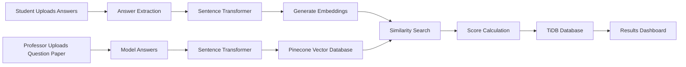
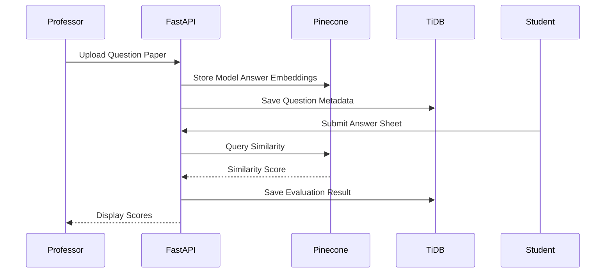

# AI-Powered Answer Evaluation System

An intelligent answer evaluation platform that automates descriptive answer assessment using Natural Language Processing (NLP), vector embeddings, and semantic similarity search.

The system enables educators to upload question papers and model answers, while students submit answer sheets for automatic evaluation. Instead of relying on keyword matching, the platform evaluates answers based on semantic meaning using transformer embeddings and vector similarity.

---

## Overview

Manual evaluation of descriptive answers is time-consuming, inconsistent, and difficult to scale.

This project solves that problem by leveraging:

- Sentence Transformer embeddings
- Vector similarity search
- Automated score generation
- Role-based access control
- Cloud-native database architecture

The platform compares student answers against model answers and generates evaluation scores based on semantic similarity.

---

## Key Features

| Feature | Description |
|----------|------------|
| Authentication System | Secure login and registration |
| Professor Dashboard | Upload question papers and model answers |
| Student Dashboard | Submit answer sheets |
| Semantic Evaluation | AI-based answer comparison |
| Automated Scoring | Similarity-based marks calculation |
| Vector Database Integration | Fast semantic search using Pinecone |
| Cloud Database Support | TiDB for persistent storage |
| REST API Backend | Built using FastAPI |
| Result Management | View evaluation scores and submissions |

---

# System Architecture



---

# Evaluation Workflow



---

# Technology Stack

## Backend

| Technology | Purpose |
|------------|----------|
| Python | Core Programming Language |
| FastAPI | REST API Framework |
| SQLAlchemy | ORM |
| PyMySQL | Database Connectivity |

---

## AI & NLP

| Technology | Purpose |
|------------|----------|
| Sentence Transformers | Text Embeddings |
| all-MiniLM-L6-v2 | Embedding Model |
| Cosine Similarity | Answer Evaluation |

---

## Databases

| Technology | Purpose |
|------------|----------|
| TiDB | Relational Database |
| Pinecone | Vector Database |

---

## Frontend

| Technology | Purpose |
|------------|----------|
| HTML5 | UI Structure |
| CSS3 | Styling |

---

## Development Tools

| Tool | Purpose |
|-------|----------|
| VS Code | Development Environment |
| Git | Version Control |
| GitHub | Repository Hosting |

---

# Project Screenshots

## Login Page


---

## Professor Dashboard


---

## Student Dashboard


---

## Evaluation Results


---

# Project Structure

```text
AI-Powered-Answer-Evaluation-System/
│
├── app/
│   ├── routes/
│   ├── models/
│   ├── services/
│   ├── database/
│   └── utils/
│
├── static/
│   ├── css/
│   └── assets/
│
├── templates/
│
├── uploads/
│
├── docs/
│   └── screenshots/
│
├── main.py
├── requirements.txt
├── .env
└── README.md
```

---

# How It Works

## Step 1: Upload Question Paper

The professor uploads a question paper along with model answers.

### Example

```text
Question:
Explain the concept of Machine Learning.

Model Answer:
Machine Learning is a subset of Artificial Intelligence...
```

---

## Step 2: Generate Embeddings

The model answers are converted into vector embeddings using:

```python
sentence-transformers/all-MiniLM-L6-v2
```

---

## Step 3: Store in Pinecone

The generated embeddings are stored in Pinecone for semantic retrieval.

---

## Step 4: Student Submission

Students upload their answer sheets through the portal.

---

## Step 5: Semantic Evaluation

Student answers are converted into embeddings and compared against stored model answer vectors.

```text
Cosine Similarity Score = 0.87
```

---

## Step 6: Marks Calculation

The similarity score is mapped to marks.

| Similarity Score | Marks |
|-----------------|--------|
| 0.90 - 1.00 | Excellent |
| 0.75 - 0.89 | Good |
| 0.60 - 0.74 | Average |
| Below 0.60 | Needs Improvement |

---

# Installation

## Clone Repository

```bash
git clone https://github.com/your-username/AI-Powered-Answer-Evaluation-System.git

cd AI-Powered-Answer-Evaluation-System
```

---

## Create Virtual Environment

### Windows

```bash
python -m venv venv

venv\Scripts\activate
```

### Linux / macOS

```bash
python3 -m venv venv

source venv/bin/activate
```

---

## Install Dependencies

```bash
pip install -r requirements.txt
```

---

## Configure Environment Variables

Create a `.env` file:

```env
DATABASE_URL=your_tidb_connection_string

PINECONE_API_KEY=your_api_key

PINECONE_INDEX_NAME=your_index_name
```

---

## Run Application

```bash
uvicorn main:app --reload
```

---


# Database Design

| Table | Description |
|---------|------------|
| Users | Professor and Student Accounts |
| Questions | Uploaded Question Papers |
| Model Answers | Reference Answers |
| Submissions | Student Responses |
| Evaluations | Generated Scores |

---

# Testing Strategy

The project includes multiple testing layers.

| Testing Type | Purpose |
|-------------|----------|
| Unit Testing | Individual module validation |
| Integration Testing | Service interaction testing |
| Functional Testing | Workflow verification |
| Usability Testing | User experience validation |
| Performance Testing | Response time analysis |
| Regression Testing | Stability verification |
| UAT | End-user validation |

---

# Future Enhancements

- Detailed AI-generated feedback
- Multi-question batch evaluation
- LMS integration
- Analytics dashboard
- Plagiarism detection
- OCR-based handwritten answer extraction
- Performance tracking reports
- Multi-language answer evaluation

---

# Performance Highlights

| Metric | Result |
|----------|---------|
| Embedding Generation | Real-Time |
| Similarity Search | Fast Retrieval |
| API Response | Low Latency |
| Database Scalability | Cloud Native |
| Evaluation Accuracy | Semantic-Based |

---

# License

This project is intended for educational and research purposes.

You may modify and extend the project for academic or personal use.

---
