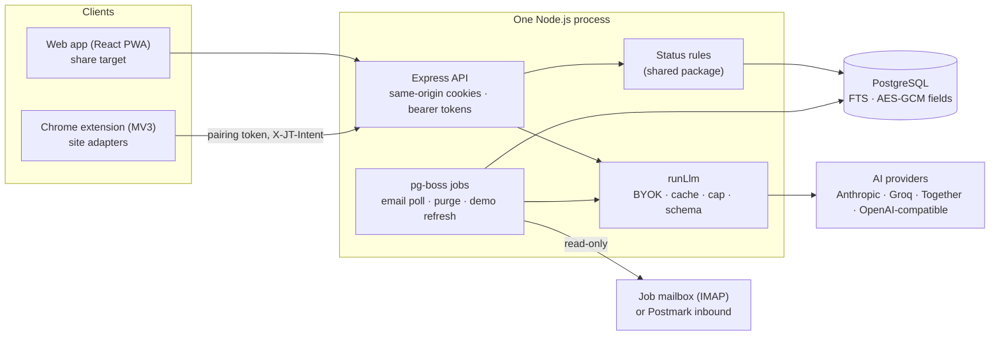

# ShortList

[](https://github.com/Yash-Satankar/shortlist/actions/workflows/ci.yml)
[](LICENSE)

**A free, open-source, self-hostable job tracker that updates itself from your email and job portals.** Built for Indian job seekers (Naukri, LPA, notice period), and works everywhere.

Save a job from your phone's share sheet or a browser extension. Your applications then update from job emails and job portals, under rules you can always see and undo. Before each interview you get a prep pack, and you can ask questions about your whole search. Open source and self-hostable; AI is optional and uses your own key.

**[Try the live demo](https://yash-satankar.github.io/shortlist/demo.html)** (fictional data, read-only; it may take a minute to wake up) · **[Website and docs](https://yash-satankar.github.io/shortlist/)** · **[Chrome extension](https://github.com/Yash-Satankar/shortlist/releases/latest)** · **[Self-host it](docs/self-hosting.md)** · **[Free hosting](docs/free-hosting.md)**


<p>
  
  
  
  
</p>

## The problem

Applying to forty jobs across LinkedIn, Naukri, Greenhouse, Lever and company portals means forty places where things change silently:

- **Statuses change where you can't see them.** A portal marks you "viewed" or "not selected", or an email lands in a promotions tab, and your spreadsheet is out of date.
- **Job descriptions disappear.** The posting is taken down the week of your interview.
- **Answers get forgotten.** What notice period did you tell this company? Which salary range did you give?
- **Follow-ups slip.** Nobody remembers to nudge a recruiter after ten quiet days.

## What it does

| | |
| --- | --- |
| **Capture** | Android share sheet → quick-add (PWA share target). Chrome extension saves the job page, including the description, and notices when you submit an application. Spreadsheet import with a dry run. |
| **Stay current** | Statuses update from job emails (IMAP, or a forwarding address) and from your applications list on job portals. Every automatic change follows one set of rules: forward only, offers always reviewed, unsure signals wait for you, all undoable. |
| **Follow up** | One inbox: changes to review, follow-ups due, possible ghosting. Draft follow-up emails and LinkedIn notes; nothing is ever sent for you. |
| **Prepare** | Per-application prep packs from the job description, your resume and your saved answers: likely questions, where you match, gaps, questions to ask. |
| **Ask** | "How many rejections this month?" is answered exactly by the database. "What did Lumen say about notice period?" is answered from your records, with citations. |
| **Own your data** | Export everything (JSON, CSV), delete your account, self-host it. Sensitive fields are encrypted at rest. |

Every integration is optional and can be switched off, both per server and per user.

## Architecture



A pnpm monorepo: `apps/api` (Express 5, Drizzle, Postgres), `apps/web` (React 19, Vite, Tailwind 4, TanStack Query), `apps/extension` (MV3, React popup), `packages/shared` (status rules, normalizers, feature flags and schemas shared by all three) and `apps/e2e` (Playwright).

## Key engineering decisions

Each has a short record in [docs/adr](docs/adr/README.md).

- **Append-only timeline with undo.** Every status change is an event with its source, confidence and evidence. Undo appends a reverting event, so nothing is lost and every status can be explained. ([0001](docs/adr/0001-append-only-timeline.md))
- **One rulebook for automatic sources.** Email, portals, the extension and the ghosting rule all go through one pure function: forward only, confidence-gated, offers always reviewed. ([0002](docs/adr/0002-automatic-source-rules.md))
- **Same-origin cookie auth.** The API serves the web app, so the session cookie is first-party (`__Host-`, `HttpOnly`, `SameSite=Lax`). The extension gets revocable, scoped tokens. ([0003](docs/adr/0003-same-origin-cookie-auth.md))
- **Field-level AES-256-GCM.** Salaries, contacts, emails, prep packs and AI keys are encrypted before they reach Postgres, with rotatable keys. ([0004](docs/adr/0004-field-level-encryption.md))
- **Explicit proxy trust.** `TRUST_PROXY` is the exact hop count, verified by an endpoint, so rate limits can't be bypassed with a forged header. ([0005](docs/adr/0005-proxy-trust.md))
- **Full-text search over vectors.** Ask turns counting questions into exact SQL. Open questions use Postgres full-text search with citations. Encrypted emails are decrypted in memory for one request and never indexed. ([0006](docs/adr/0006-search-without-vectors.md))
- **LLM cost controls in one place.** Bring your own key; every call is cached, capped per month in your currency, rate-limited, schema-validated and logged. Small models for cheap tasks, strong ones for writing. ([0007](docs/adr/0007-llm-byok-and-cost-controls.md))
- **Defensive site adapters.** The extension reads only the rendered page, site by site and off by default, and drops what it can't read with certainty. ([0008](docs/adr/0008-adapters-and-readers.md))

## Security and privacy

- Passwords use argon2id. Sessions and tokens are random and stored only as hashes. Cookie writes are checked against the app's origin, and login and expensive endpoints are rate-limited per user.
- Every table is scoped by `user_id`, and every feature has cross-user tests.
- Sensitive fields are encrypted at rest. Emails that aren't about an application are never stored, and stored ones expire after 90 days.
- AI is bring-your-own-key and strictly opt-in. The app shows what each feature sends to your provider: CTC and recruiter email addresses are never sent, and emails go to Ask only if you switch that on. Details are in [PRIVACY.md](PRIVACY.md).
- Never: storing portal passwords, scraping from a server, or sending email or messages for you.
- Report vulnerabilities as described in [SECURITY.md](SECURITY.md).

## Quick start

**Self-host** (Docker): see [docs/self-hosting.md](docs/self-hosting.md).

```bash
cp .env.example .env   # set ENCRYPTION_KEYS, APP_ORIGIN
docker compose --profile app up -d
# open http://localhost:3000 → first-run setup creates your admin account
```

**Develop** (Node 22+, pnpm 10, Docker):

```bash
pnpm install && cp .env.example .env && pnpm keygen   # paste the key into ENCRYPTION_KEYS
pnpm db:up && pnpm db:seed && pnpm dev                # http://localhost:5173
```

## Tests and CI

| | |
| --- | --- |
| Unit and integration | Vitest. The API tests run against a real Postgres test database (`pnpm test`), with cross-user cases for every feature. |
| Ask eval | 20 real-style questions over seeded fictional data. Counting questions must return exactly the expected records; open questions must retrieve them. |
| End to end | Playwright on phone and desktop viewports against the production build: login, share-to-add, status change and undo, follow-up snooze, import dry run. |
| Static | TypeScript, ESLint, a check that dev-only extension switches leave no trace in production builds, and a full-history secret scan (gitleaks). |

CI ([workflow](.github/workflows/ci.yml)) runs all of it on every push, builds the web app and uploads the extension zip.

## Documentation

- [Self-hosting](docs/self-hosting.md) · [Free hosting](docs/free-hosting.md) · [Upgrading](docs/UPGRADING.md) · [Deploying on Railway](docs/deployment.md) · [Public demo](docs/demo.md)
- [Development and API](docs/development.md) · [Optional features](docs/features.md) · [Chrome extension](docs/extension.md)
- [Architecture decisions](docs/adr/README.md) · [Privacy](PRIVACY.md) · [Contributing](CONTRIBUTING.md) · [Security](SECURITY.md)

## Roadmap

- [x] **v1.0, self-hostable**: tracker, PWA share target, Chrome extension, portal sync, email updates, prep packs, follow-up drafts, Ask, multi-user foundations (invites, email verification, export, deletion), Docker Compose, public demo.
- [ ] **v1.1, hosted instance**: open sign-up with email verification, inbound email by forwarding address (Postmark adapter built), terms, abuse limits.
- [ ] Android app (Flutter): native share sheet and notification listener for job-app notifications.
- [ ] Server-side paging and facets for very large lists (over 500 applications).
- [ ] Billing for the hosted instance.

## License

ShortList is free software under the [GNU Affero General Public License v3.0 only](LICENSE) (AGPL-3.0-only). You may use, study, change and share it. If you run a modified version for other people over a network, you must offer them its source code; Settings links to the source of the running version, set by `SOURCE_CODE_URL`.
