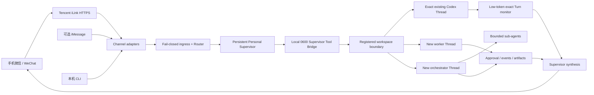

<div align="center">

# codex2wechat

### Control local Codex from WeChat with first-class Threads

### 通过微信安全、持久地远程管理本机 Codex，并完整复用原生任务上下文

[](./CODEX_IMPLEMENTATION_PROMPT.md)
[](https://github.com/YouXH94/codex2wechat/releases)
[](https://www.apple.com/macos/)
[](https://nodejs.org/)
[](https://developers.openai.com/codex/)

[中文](#中文) · [English](#english) · [实施合同](./CODEX_IMPLEMENTATION_PROMPT.md) · [Releases](https://github.com/YouXH94/codex2wechat/releases)

</div>

> [!IMPORTANT]
> **This repository is specification-first by design.** Its primary open-source deliverable is a deterministic, Codex-executable implementation contract that instructs a fresh Codex task to inspect the current local environment and build the complete project from scratch. A fixed generated runtime is intentionally not treated as the canonical product.
>
> **本仓库采用 specification-first 设计。** 核心开源交付物是一份可直接交给 Codex 执行的确定性实施合同。Codex 会先检查用户当前的本机环境与正式接口，再生成、配置、测试并交付适配该环境的完整实现；仓库并不把某一次生成结果固定为唯一标准实现。

---

# 中文

## 项目定位

`codex2wechat` 是一份面向 macOS 的 **Codex 可执行工程规范 / implementation contract**。它定义如何使用腾讯 iLink 微信通道作为主要远程入口，把手机微信中的自然语言请求安全地送入一个持久化个人 Supervisor，再由 Supervisor 读取、启动、继续、中断或监控本机 Codex 任务。

它解决的核心问题不是“再造一个聊天机器人”，而是：

> **让微信成为 Codex 的远程控制入口，同时继续使用原生 Codex Thread 作为唯一正式上下文。**

因此，在微信中启动的工作能够继续出现在 Codex Desktop 中；桌面端已有任务也可以被微信侧精确绑定、只读监控，并在结束时收到汇总结果。

## 为什么仓库主要提供 Spec，而不是固定实现代码？

`codex2wechat` 面向的是会持续变化的本机环境：Codex Desktop / App Server 接口、macOS 权限模型、Node.js 运行时以及微信通道能力都可能变化。

因此本项目将以下内容版本化并作为正式产品维护：

- 系统架构与不可妥协的不变量；
- Codex Thread / Turn 的精确控制语义；
- Supervisor、worker、orchestrator 与子 Agent 的边界；
- 身份、审批、sandbox、单写入与 fail-closed 安全规则；
- 本地持久化、恢复、幂等与审计要求；
- 必须创建的工程结构、测试、诊断和验收标准；
- Codex 在执行前必须检查的当前正式接口与本机能力。

然后由 **当前版本的 Codex 在目标机器上生成环境适配实现**。

这意味着 `CODEX_IMPLEMENTATION_PROMPT.md` 不是“等待以后写代码的需求草稿”，而是本仓库的核心可执行交付物。

## 核心设计原则

> **Codex Thread 是唯一正式会话上下文。微信、SQLite、JSONL 和 Markdown 只负责传输、路由、恢复和审计，不创建另一套对话真相源。**

同时坚持：

- **First-class Threads**：远程入口直接操作精确 Codex Thread / Turn。
- **Single writer**：同一 Thread 同时只允许一个 writer，桌面占用时默认只读。
- **Fail closed**：身份、凭据、审批、工作区或请求映射不确定时不执行写操作。
- **Native approvals**：不绕过 Codex 原生审批、sandbox 和权限边界。
- **Environment-aware generation**：Codex 必须先核对当前正式接口，再生成兼容实现。
- **Low-token monitoring**：默认 completion-only，只轮询状态，终态前不额外运行模型。
- **Secret-free public spec**：公开仓库不包含 Token、微信身份、聊天记录、私有路径或本机状态库。

## 目标架构



## 仓库内容

| 文件 | 作用 |
|---|---|
| [`CODEX_IMPLEMENTATION_PROMPT.md`](./CODEX_IMPLEMENTATION_PROMPT.md) | **核心产品**：可直接交给全新 Codex 的中英双语确定性实施合同 |
| [`README.md`](./README.md) | 项目定位、设计原则、使用方法与范围说明 |

## 如何使用

### 1. 准备环境

在 Mac 上创建一个空目录，并在该目录中新建一个 Codex 任务。

### 2. 交给 Codex

把 [`CODEX_IMPLEMENTATION_PROMPT.md`](./CODEX_IMPLEMENTATION_PROMPT.md) **完整交给 Codex，不要删减规范内容**。

可以附加一句：

```text
严格执行该实施合同。先检查本机当前 Codex/App Server 与依赖能力，再完成工程创建、配置、实现、测试、doctor 和本机交付。只有扫码、macOS 权限与真实消息验收等必须由我完成的身份敏感步骤才暂停。
```

### 3. Codex 生成本机实现

规范要求 Codex 在实现前核对：

- macOS 与 CPU 架构；
- Node/npm 环境；
- 当前 Codex 二进制；
- 当前 Codex App Server schema / capabilities；
- 微信通道所需接口；
- 可选 `imsg` 能力；
- 目标工作区和已有用户改动。

然后再生成工程、安装依赖、测试和诊断。

### 4. 用户完成身份敏感步骤

包括：

- 微信扫码；
- macOS 隐私权限；
- 真实消息端到端验收；
- 明确需要人工确认的高风险操作。

这些步骤不应由自动化伪造。

## 规范要求生成的核心能力

- 微信扫码绑定后，扫码者成为唯一控制者。
- 微信和 Codex Desktop 是同一个 Supervisor 的不同入口。
- Supervisor 直接控制注册工作区中的精确 Thread。
- 简单任务使用 task-scoped worker。
- 复杂任务使用一次性 orchestrator，并可协调边界明确的子 Agent。
- 支持对已有桌面任务进行精确读取、继续、steer、中断与终态监控。
- 默认 completion-only 监控，后台状态轮询不运行模型。
- Codex 原生审批、sandbox 和单写入语义保持有效。
- SQLite 只保存路由、恢复、幂等、审批和审计相关状态，不替代 Codex 上下文。
- 可选 iMessage 适配器使用 `imsg rpc`，不直接解析 Messages 私有数据库。

## 最低验收基线

生成实现至少应满足：

- `npm run build`、`npm test`、`npm run doctor` 通过，或明确区分必须由用户完成的权限项。
- 非绑定身份、群聊、回声和重复消息不会触发 Codex 工作。
- `微信 → Supervisor → Codex Turn → 微信` 完成真实端到端回环。
- 远程创建的 Thread 能在 Codex Desktop 中找到并继续。
- Resume 失败不得静默创建一个替代 Thread。
- 对精确 Desktop Thread + Turn 的 completion-only 监控只发送一次终态报告。
- 未知、过期或无法精确映射的审批请求一律拒绝。
- Token、个人标识、聊天内容、本机状态和私有绝对路径不得进入公开输出或 Git 历史。

## 项目范围

### 本项目是

- Codex-native 的远程控制架构规范；
- 可直接由 Codex 消费的实施合同；
- 面向单一所有者、本机运行、first-class Threads 的设计；
- 对安全边界、恢复语义和验收结果有明确约束的工程规范。

### 本项目不是

- 托管 SaaS；
- 多用户远程执行服务；
- Codex Thread 的替代聊天数据库；
- 绕过 Codex approvals / sandbox 的工具；
- 桌面微信 Hook、注入或 UI 自动化项目；
- 把某次 Codex 生成代码冻结为唯一权威运行时的仓库。

## 项目状态与版本化

本项目按 **Spec 版本** 演进。版本变化代表实施合同、架构、不变量、安全边界或验收要求发生变化，而不是要求仓库必须打包一份固定运行时。正式版本见 [GitHub Releases](https://github.com/YouXH94/codex2wechat/releases)。

## 参考资料

- [OpenAI Codex](https://developers.openai.com/codex/)
- [Codex App Server](https://developers.openai.com/codex/app-server/)
- [Tencent/openclaw-weixin](https://github.com/Tencent/openclaw-weixin)
- [openclaw/imsg](https://github.com/openclaw/imsg)

本项目不整体 Fork 上述项目。实施者应自行核对相关公开接口及许可证，只复用被许可的必要设计或接口。

---

# English

## What is codex2wechat?

`codex2wechat` is a **Codex-executable engineering specification for macOS**. It defines how a fresh Codex task should build a secure local control plane that uses Tencent iLink / WeChat as the primary remote channel and preserves native Codex Threads as the authoritative task context.

The project is intentionally **specification-first**:

> **The implementation contract is the product. A generated runtime is environment-specific output, not the canonical repository artifact.**

A Codex task consuming the specification must first inspect the currently installed Codex/App Server interfaces and local environment, then generate, configure, test, diagnose, and hand off an implementation compatible with that machine.

## Why a specification instead of one frozen reference implementation?

The relevant environment changes over time: Codex/App Server capabilities, macOS permissions, Node.js behavior, and channel interfaces may evolve. `codex2wechat` therefore versions the durable engineering contract rather than freezing one generated snapshot.

The specification defines:

- architecture and non-negotiable invariants;
- exact Thread / Turn control semantics;
- Supervisor, worker, orchestrator, and sub-agent boundaries;
- identity, approval, sandbox, single-writer, and fail-closed rules;
- persistence, recovery, idempotency, and audit requirements;
- required project structure, tests, diagnostics, and acceptance criteria;
- environment capabilities that Codex must verify before implementation.

## Central invariant

> **A Codex Thread is the only authoritative conversation context. WeChat, SQLite, JSONL, and Markdown are transport, routing, recovery, and audit layers—not a second agent memory.**

## Key behavior required by the specification

- QR binding establishes one controlling WeChat identity.
- WeChat and Codex Desktop are transports into the same persistent Supervisor model.
- The Supervisor controls exact Threads inside registered workspace boundaries.
- Routine work uses task-scoped workers; complex work may use bounded task-scoped orchestrators.
- Existing Desktop tasks can be read, resumed, steered, interrupted, or monitored by exact Thread / Turn identity.
- Monitoring defaults to completion-only and does not invoke a model while polling state.
- Native Codex approvals, sandboxing, and single-writer semantics remain authoritative.
- Local persistence supports routing and recovery but never replaces Codex Thread context.
- Optional iMessage integration uses `imsg rpc` rather than parsing the private Messages database.

## Repository contents

| File | Purpose |
|---|---|
| [`CODEX_IMPLEMENTATION_PROMPT.md`](./CODEX_IMPLEMENTATION_PROMPT.md) | **Primary deliverable:** deterministic bilingual Codex implementation and acceptance contract |
| [`README.md`](./README.md) | Project positioning, architecture, scope, and usage |

## How to use it

1. Create an empty project directory on a Mac and start a fresh Codex task there.
2. Give Codex the complete [`CODEX_IMPLEMENTATION_PROMPT.md`](./CODEX_IMPLEMENTATION_PROMPT.md).
3. Instruct it to execute the contract exactly and inspect the current Codex/App Server contract before implementing compatibility code.
4. Let Codex create the project, install dependencies, implement, test, and run diagnostics.
5. Perform only identity-sensitive steps yourself: WeChat authorization, macOS privacy grants, and real-message acceptance.

Example instruction:

```text
Execute this implementation contract exactly. Inspect the currently installed Codex/App Server interfaces first, then build, configure, test, diagnose, and hand off the local project. Pause only for identity-sensitive actions that require me, such as QR scanning, macOS permissions, or real-message acceptance.
```

## Scope

`codex2wechat` is a local, single-owner, Codex-native control-plane specification. It is not a hosted SaaS service, a multi-user remote execution system, a replacement conversation database, an approval bypass, or a desktop WeChat hooking project.

## Versioning

Versions track the **specification surface**: required behavior, invariants, security boundaries, compatibility rules, and acceptance criteria. Published versions are available on [GitHub Releases](https://github.com/YouXH94/codex2wechat/releases).

## References

- [OpenAI Codex](https://developers.openai.com/codex/)
- [Codex App Server](https://developers.openai.com/codex/app-server/)
- [Tencent/openclaw-weixin](https://github.com/Tencent/openclaw-weixin)
- [openclaw/imsg](https://github.com/openclaw/imsg)

This project does not wholesale-fork those projects. Implementers should review applicable licenses and public interface contracts before reusing any code or design.

---

## Attribution / 署名

Architecture synthesis, implementation specification, and bilingual documentation were developed with assistance from **GPT-5.6 Sol**.

项目架构整理、确定性实施规范与中英文文档在 **GPT-5.6 Sol** 协助下完成。

<div align="center">

**One owner. One Supervisor. First-class Codex Threads.**

</div>
