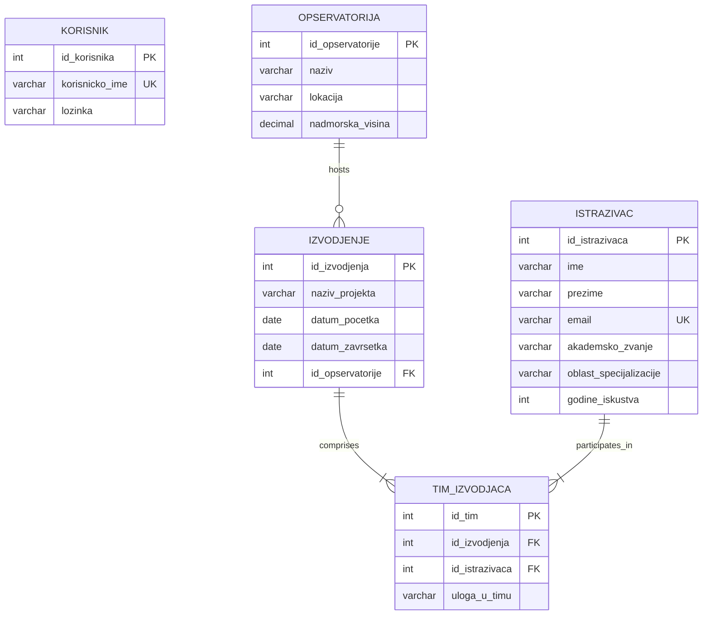

# 🌌 Astronomical Observatory Management System

[](https://www.oracle.com/java/)
[](https://www.mysql.com/)
[](https://docs.oracle.com/javase/tutorial/uiswing/)
[](https://dev.mysql.com/downloads/connector/j/)
[](LICENSE)

A robust, event-driven desktop application built in **Java (Swing / AWT)** and backed by a relational **MySQL** database via **JDBC**. This system empowers astronomical research institutions and observatories to manage scientific observational campaigns, researchers, facility allocations, and user accounts through an intuitive graphical interface.

---

## 📑 Table of Contents

- [Overview](#-overview)
- [Key Features](#-key-features)
- [System Architecture](#-system-architecture)
- [Database Schema & ER Diagram](#-database-schema--er-diagram)
- [Tech Stack](#-tech-stack)
- [Project Structure](#-project-structure)
- [Getting Started & Installation](#-getting-started--installation)
  - [Prerequisites](#prerequisites)
  - [Database Setup](#database-setup)
  - [Configuration](#configuration)
  - [Running the Application](#running-the-application)
- [SQL & Data Modeling Highlights](#-sql--data-modeling-highlights)
- [Software Engineering Best Practices](#-software-engineering-best-practices)
- [Future Roadmap](#-future-roadmap)
- [Author & Contact](#-author--contact)

---

## 🔭 Overview

Modern astronomical observatories conduct complex observational campaigns involving multidisciplinary teams of astrophysicists, spectroscopists, and cosmologists. 

**AstronomijaApp** provides an integrated desktop management suite designed to:
- Securely authenticate operators, administrators, and researchers.
- Query observatory facilities dynamically and inspect linked research personnel.
- Aggregate multi-tiered relational data linking observatories, research projects, executing teams, and scientist profiles.
- Maintain user account lifecycles with strict integrity validation and database cascading constraints.

---

## ✨ Key Features

### 🔐 1. Authentication & User Account Lifecycle
- **User Registration**: Client-side validation ensuring matching passwords, non-empty fields, and handling unique username constraints (`SQLIntegrityConstraintViolationException`).
- **Secure Login**: Verifies credentials against the MySQL database with parameterized SQL statements.
- **Account Settings & Profile Management**: Allows authenticated users to update their username and password with validation.
- **Account Deletion with Verification**: Multi-step confirmation dialog requiring password verification before permanently purging the account.

### 🔬 2. Observatory & Researcher Directory
- **Dynamic Facility Selection**: Real-time retrieval of active observatories participating in observational campaigns using `DISTINCT` SQL queries.
- **Multi-Table Research Roster**: Interactive `JTable` rendering detailed researcher portfolios (First Name, Last Name, Email, Academic Degree, Specialization Area, Years of Experience).
- **Relational Aggregation**: Complex SQL query traversing 4 interrelated database tables (`OPSERVATORIJA` ➔ `IZVODJENJE` ➔ `TIM_IZVODJACA` ➔ `ISTRAZIVAC`) with `GROUP BY` deduplication.

### 🖥️ 3. Modular GUI & Responsive UI
- **Swing Framework**: Structured with modular `JFrame` windows, custom layout managers (`BorderLayout`, `GridLayout`, `FlowLayout`), and padded UI borders.
- **Event-Driven Navigation**: Seamless transitions between views (`LoginForm`, `RegistracijaForm`, `GlavniMeni`, `LaboratorijeForm`, `AzuriranjeNalogaForm`, `BrisanjeNalogaForm`).
- **Dynamic Table Models**: Interactive data binding using `DefaultTableModel` inside scrollable viewports (`JScrollPane`).
- **Contextual Notifications**: Informative feedback and error popups utilizing `JOptionPane` dialogs.

---

## 🏗️ System Architecture

The application is structured into distinct layers following modular design principles:

```
┌─────────────────────────────────────────────────────────────┐
│                    Presentation Layer (GUI)                 │
│  [LoginForm] [RegistracijaForm] [GlavniMeni]                │
│  [LaboratorijeForm] [AzuriranjeNalogaForm] [BrisanjeForm]   │
└──────────────────────────────┬──────────────────────────────┘
                               │ User Interactions & Events
                               ▼
┌─────────────────────────────────────────────────────────────┐
│                  Database Access Layer (JDBC)               │
│               [db.DBKonekcija] (DriverManager)              │
│       - Connection Lifecycle (Try-With-Resources)           │
│       - PreparedStatement Execution (Anti-SQL Injection)    │
└──────────────────────────────┬──────────────────────────────┘
                               │ TCP / JDBC Protocol
                               ▼
┌─────────────────────────────────────────────────────────────┐
│                  Relational Database (MySQL)                │
│  - KORISNIK            - OPSERVATORIJA     - ISTRAZIVAC     │
│  - IZVODJENJE          - TIM_IZVODJACA                      │
└─────────────────────────────────────────────────────────────┘
```

---

## 🗄️ Database Schema & ER Diagram

The database model connects user authentication, observatories, observational campaigns, team associations, and individual researchers:



---

## 🛠️ Tech Stack

| Domain | Technology / Library | Description |
| :--- | :--- | :--- |
| **Language** | Java (JDK 8 / 11 / 17 / 21) | Core object-oriented language |
| **User Interface** | Java Swing & AWT | Native desktop GUI components & layout managers |
| **Data Persistence** | JDBC (Java Database Connectivity) | Type 4 database connectivity driver |
| **Database** | MySQL 8.x / 9.x | Relational database management system |
| **Driver Library** | `mysql-connector-j-9.7.0.jar` | Official MySQL JDBC driver |
| **Development Environment** | IntelliJ IDEA / VS Code | IDE support & build tooling |

---

## 📂 Project Structure

```
AstronomijaApp/
│
├── lib/
│   └── mysql-connector-j-9.7.0.jar   # MySQL JDBC Connector library
│
├── src/
│   ├── Main.java                     # Application entry point (Swing event dispatch thread)
│   │
│   ├── db/
│   │   └── DBKonekcija.java          # Centralized database connection manager
│   │
│   └── gui/
│       ├── LoginForm.java            # Authentication view
│       ├── RegistracijaForm.java     # New user registration view
│       ├── GlavniMeni.java           # Main dashboard navigation menu
│       ├── LaboratorijeForm.java     # Observatory & researcher exploratory view
│       ├── AzuriranjeNalogaForm.java # User profile & credentials update view
│       └── BrisanjeNalogaForm.java   # Account deletion confirmation view
│
├── schema.sql                        # Complete SQL DDL schema & sample dataset
├── AstronomijaApp.iml                 # IntelliJ project configuration
└── README.md                         # Project documentation
```

---

## 🚀 Getting Started & Installation

### Prerequisites
- **Java Development Kit (JDK)**: Version 8 or higher (JDK 17+ recommended).
- **MySQL Server**: Version 8.0 or newer.
- **MySQL Workbench** or MySQL CLI client.

---

### 1. Database Setup

Open MySQL terminal or Workbench and run the provided [`schema.sql`](schema.sql) file:

```sql
-- Alternatively run directly from terminal:
mysql -u root -p < schema.sql
```

The script will automatically create the `astronomija` database, all necessary relational tables, foreign key constraints, and pre-populate realistic sample data for observatories, researchers, campaigns, and user accounts.

---

### 2. Database Configuration

Ensure connection credentials in [`src/db/DBKonekcija.java`](src/db/DBKonekcija.java) match your local MySQL server setup:

```java
public class DBKonekcija {
    private static final String URL = "jdbc:mysql://localhost:3306/astronomija";
    private static final String USER = "root";       // Change if using another user
    private static final String PASSWORD = "root123"; // Update to your MySQL root password

    public static Connection getKonekcija() throws SQLException {
        return DriverManager.getConnection(URL, USER, PASSWORD);
    }
}
```

---

### 3. Running the Application

#### Option A: Using IntelliJ IDEA (Recommended)
1. Open IntelliJ IDEA and choose **Open Project** -> Select `AstronomijaApp` directory.
2. Ensure the JDK is configured: `File` -> `Project Structure` -> `SDKs` -> Select JDK (17+).
3. Verify the JDBC library is added: `File` -> `Project Structure` -> `Libraries` -> Add `lib/mysql-connector-j-9.7.0.jar`.
4. Run [`src/Main.java`](src/Main.java).

#### Option B: Using Command Line (PowerShell / Terminal)

**Compile:**
```bash
javac -cp ".;lib/mysql-connector-j-9.7.0.jar" -d bin src/db/*.java src/gui/*.java src/Main.java
```

**Execute:**
```bash
java -cp "bin;lib/mysql-connector-j-9.7.0.jar" Main
```

---

## 🧠 SQL & Data Modeling Highlights

### Multi-Table Relational Join
The core research explorer executes an advanced join across four entities with `GROUP BY` deduplication to prevent duplicate researcher records across multiple project phases:

```sql
SELECT 
    i.ime, 
    i.prezime, 
    i.email, 
    i.akademsko_zvanje, 
    i.oblast_specijalizacije, 
    i.godine_iskustva 
FROM ISTRAZIVAC i
JOIN TIM_IZVODJACA ti ON i.id_istrazivaca = ti.id_istrazivaca
JOIN IZVODJENJE iz    ON ti.id_izvodjenja = iz.id_izvodjenja
JOIN OPSERVATORIJA o  ON iz.id_opservatorije = o.id_opservatorije
WHERE o.naziv = ?
GROUP BY i.id_istrazivaca;
```

---

## 🛡️ Software Engineering Best Practices

- **SQL Injection Prevention**: All dynamic SQL queries utilize `java.sql.PreparedStatement` with placeholder binding, adhering to OWASP injection defense guidelines.
- **Resource Management**: Implements Java 7+ **Try-With-Resources** blocks (`try (Connection conn = DBKonekcija.getKonekcija())`) guaranteeing automatic socket and database connection teardown to prevent connection leaks.
- **Swing Thread Safety**: Application entry point initializes GUI components on the **Event Dispatch Thread (EDT)** using `SwingUtilities.invokeLater()`.
- **Defensive Error Handling**: Explicit capture of `SQLIntegrityConstraintViolationException` for duplicate record collisions and descriptive user feedback via modal dialogs.
- **Relational Integrity**: Foreign key constraints with `ON DELETE CASCADE` and `ON UPDATE CASCADE` to prevent orphaned records in junction tables.

---

## 👨‍💻 Author & Contact

**Abdurahman**  
- 📂 GitHub: [@abdurahmankrsk](https://github.com/abdurahmankrsk)  
- 🌟 Project Repository: [Astronomical-Observatory-Management-System](https://github.com/abdurahmankrsk/Astronomical-Observatory-Management-System)

---

<div align="center">
  <sub>Built with ❤️ for astronomical science and robust Java engineering.</sub>
</div>
