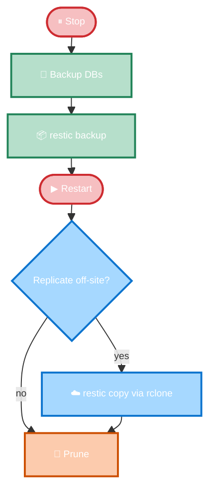

# Logseq Sync Restic Backup

A backup workflow for a self-hosted Logseq Sync server, built on [**Restic**](https://restic.net/) ([source](https://github.com/restic/restic)): an open-source backup program that stores encrypted, deduplicated, versioned snapshots in a plain repository.

The script stops Logseq Sync, snapshots clean SQLite `.backup` copies plus `assets/` into a Restic repository, restarts the container, and applies retention policies, optionally replicating to a second off-site repository (e.g. Google Drive via [**rclone**](https://rclone.org/)).

> **Written and tested on macOS.** The script (Bash 3.2+) should run on Linux unchanged, but setup commands here (`brew install`, Docker Desktop) assume a Mac. On Linux, swap in your distro's package manager; the cron scheduling below works the same on both.

## Architecture



Logseq is only offline between **Stop** and **Restart**; an `EXIT` trap installed right after `Stop` (and cleared right after `Restart`) restarts the container even if the script dies unexpectedly. Off-site copy and both prune steps run after the container is already back up, and a failed off-site copy just logs a warning; it doesn't invalidate the local snapshot.

## What's backed up

- `data/index.sqlite`: server-wide index of which graphs exist, which users/devices have access, and their sync state.
- `data/graphs/<graph-id>/db.sqlite`: one per graph; the CRDT-style sync history for that graph's blocks/pages.
- `data/assets/`: images, PDFs, and other attachments embedded in notes.

The two SQLite databases are copied via `sqlite3 .backup`, not a raw file copy, to avoid capturing WAL/SHM state.

**Not** included: `docker-compose.yml`, `.env`/deployment config, Restic password files, cloud credentials, logs. Back those up separately for full disaster recovery.

## Requirements

This script assumes you already have a Logseq Sync server up and running. If you don't yet, see [Self-hosting Logseq Sync](https://abhilesh.github.io/blog/2026/self-hosting-logseq-sync/) for a walkthrough of setting one up before coming back to this backup script.

- [Logseq Sync](https://github.com/yshalsager/logseq-selfhost-sync) running via [Docker Compose](https://docs.docker.com/compose/).
- [`docker`](https://docs.docker.com/get-docker/) with the [Compose plugin](https://docs.docker.com/compose/install/).
- [`sqlite3`](https://www.sqlite.org/cli.html).
- [`restic`](https://restic.net/).
- [Bash](https://www.gnu.org/software/bash/) 3.2+ (works with macOS's stock Bash).
- [`rclone`](https://rclone.org/), only needed if you enable off-site replication.

Expected layout: the directory structure this script assumes on disk, matching `DATA_DIR` and `COMPOSE_FILE` in `config.sh`:
  ```text
  logseq-sync/
  ├── docker-compose.yml
  └── data/
      ├── index.sqlite
      ├── assets/
      └── graphs/<graph-id>/db.sqlite
  ```

## Setup

1. Install Restic and SQLite:

   ```bash
   brew install restic sqlite   # or your package manager
   ```

2. Create a Restic password file:

   ```bash
   mkdir -p ~/.config/restic
   printf '%s\n' 'YOUR-RESTIC-PASSWORD' > ~/.config/restic/logseq-sync-password
   chmod 600 ~/.config/restic/logseq-sync-password
   ```

3. Initialize the local repository:

   ```bash
   restic -r /path/to/local/restic/repository \
     --password-file ~/.config/restic/logseq-sync-password init
   ```

4. Create and edit your config:

   ```bash
   cp config.example.sh config.sh   # then edit for your system
   ```

5. Make the script executable and run it once:

   ```bash
   chmod +x backup-logseq-sync.sh
   ./backup-logseq-sync.sh
   ```

6. Confirm it worked:

   ```bash
   cat ~/logs/restic-logseq-sync.log
   restic -r /path/to/local/restic/repository \
     --password-file ~/.config/restic/logseq-sync-password snapshots --tag logseq-sync
   docker compose -f /path/to/docker-compose.yml ps   # logseq-sync should be running again
   ```

A backup isn't proven until you've restored it; see [Restore](#restore).

## Configuration

The script reads configuration variables from `config.sh`, see example [`config.example.sh`](config.example.sh) and edit it for your machine. By default it's read from the script's directory; override with `LOGSEQ_BACKUP_CONFIG=/path ./backup-logseq-sync.sh` to run from a different location.

### Required

- `DATA_DIR`: the Logseq Sync `data/` directory (see [expected layout](#requirements)).
- `COMPOSE_FILE`: absolute path to the `docker-compose.yml` that manages the container.
- `SERVICE_NAME`: the Compose **service** name, not the container name; check with `docker compose config --services`. If it's wrong, `stop`/`start` silently do nothing, and the SQLite backup ends up running against a live database.
- `LOG_FILE`: where the run log is appended; the parent directory is created automatically.
- `LOCAL_REPOSITORY` / `LOCAL_PASSWORD_FILE`: the primary Restic repository and the file holding its password.

### Optional (with defaults)

- `BACKUP_TAG` (`logseq-sync`): tags every snapshot, and scopes both pruning and off-site copy selection.
- `KEEP_DAILY` / `KEEP_WEEKLY` / `KEEP_MONTHLY` / `KEEP_YEARLY` (`7` / `4` / `6` / `1`): the primary repository's retention policy, passed straight to `restic forget --prune`. Restic keeps the most recent snapshot per day for the last 7 days, per week for the last 4 weeks, per month for the last 6 months, and per year for the last year; these classes overlap, so it's not simply 18 snapshots retained.
- `ENABLE_OFFSITE_COPY` (`false`) and `OFFSITE_PRUNE` (`true`): whether to replicate off-site at all, and whether to prune that copy. `OFFSITE_KEEP_DAILY` / `_WEEKLY` / `_MONTHLY` / `_YEARLY` mirror the retention variables above (same `7` / `4` / `6` / `1` defaults) but apply independently to the off-site repository; see [Off-site replication](#off-site-replication-optional) below.

> [`config.example.sh`](config.example.sh) has the full, ready-to-copy template with every variable and inline comments.

## Off-site replication (optional)

Off-site replication is controlled entirely from `config.sh`: set `ENABLE_OFFSITE_COPY=true` along with `OFFSITE_REPOSITORY` and `OFFSITE_PASSWORD_FILE`.

Once enabled, every run of the script uses `restic copy` to move that run's `logseq-sync`-tagged snapshots from the primary repository to the off-site one, then applies the off-site repository's own independent retention via `OFFSITE_PRUNE`/`OFFSITE_KEEP_*`.

[**Google Drive**](https://drive.google.com/) doesn't speak Restic's native repository protocols, so this goes through [**rclone**](https://rclone.org/), a general-purpose cloud-sync CLI that Restic can use as a backend for anything rclone supports (Drive, Dropbox, OneDrive, and dozens more).

If you don't specifically need Drive, Restic talks to [several backends natively](https://restic.readthedocs.io/en/stable/030_preparing_a_new_repo.html) (S3-compatible storage, SFTP, a REST server, Azure Blob, Google Cloud Storage) without going through rclone at all: simpler and one less moving part if any of those already fit your setup.

1. Install rclone and set up a Drive remote:

   ```bash
   brew install rclone      # or your package manager
   rclone config             # create a remote named e.g. "gdrive", type "drive"
   ```

   This stores an OAuth token in `~/.config/rclone/rclone.conf`; no separate `OFFSITE_ENV_FILE` needed, so leave it unset.

2. Set the off-site variables in `config.sh`:

   ```bash
   ENABLE_OFFSITE_COPY=true
   OFFSITE_REPOSITORY="rclone:gdrive:logseq-sync-backups"   # gdrive = the remote name from `rclone config`
   OFFSITE_PASSWORD_FILE="$HOME/.config/restic/logseq-sync-offsite-password"
   ```

3. Initialize the destination **before first use**, sharing chunker params so dedup works across repos:

   ```bash
   restic -r "rclone:gdrive:logseq-sync-backups" \
     --password-file ~/.config/restic/logseq-sync-offsite-password \
     init --from-repo /path/to/local/restic/repository \
     --from-password-file ~/.config/restic/logseq-sync-password \
     --copy-chunker-params
   ```

Keep the off-site password file at `chmod 600`, same as the primary one. Other rclone-supported destinations work too; see Restic's [rclone backend docs](https://restic.readthedocs.io/en/stable/030_preparing_a_new_repo.html#other-services-via-rclone).

## Restore

1. Restore the snapshot into a **separate** temp directory, and inspect it before touching live data:

   ```bash
   restic -r /path/to/local/restic/repository \
     --password-file ~/.config/restic/logseq-sync-password \
     restore <snapshot-id> --target ~/logseq-restore-test
   ```

2. Stop Logseq Sync, move the current `data/` aside, then copy the restored `index.sqlite`, each graph's `db.sqlite`, and `assets/` into place.
3. Restart Logseq Sync and verify the graphs from a client.

Snapshots are stored under a stable `logseq-sync-backup/` path, not timestamped, so Restic's parent-snapshot and retention grouping stays consistent from run to run.

## Scheduling

[`cron.example`](cron.example) runs the backup nightly at 03:00.

1. Confirm `docker`, `restic`, and `sqlite3` are all on `PATH`, since cron runs with a minimal environment that doesn't load your shell's profile:

   ```bash
   command -v docker restic sqlite3
   ```

2. Copy its `SHELL`, `PATH`, and schedule lines into your crontab, substituting the absolute script path:

   ```bash
   crontab -e
   ```

   Don't run `crontab cron.example` directly; that replaces your whole crontab.

`launchd`/systemd timers work too if you prefer native scheduling.

## Failure behaviour

- SQLite or primary Restic backup failure aborts the run; the `EXIT` trap still restarts Logseq.
- Off-site copy failure logs a warning and exits non-zero for monitoring, but the local snapshot stays valid.
- `forget --prune` failure, local or off-site, only logs a warning; already-created snapshots remain valid.

## Security

Never commit `config.sh` if it holds private details, nor Restic password files, cloud credentials, or `.env` secrets; `.gitignore` covers the common cases.

## Disclaimer

A personal backup workflow, not an official Logseq tool. Test it against your own deployment, and test restores, before depending on it.
