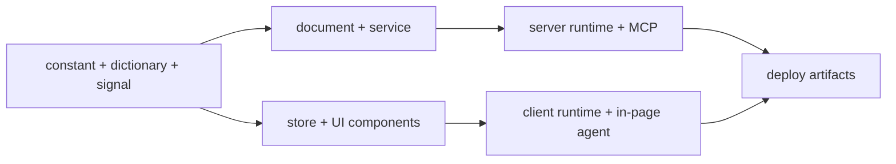

# Akan.js

[한국어](./README.ko.md) | [Docs](https://akanjs.com/docs) | [v3 release note](https://akanjs.com/blog/v3release) | [npm](https://www.npmjs.com/package/akanjs)


**The TypeScript framework, agents included.** Powered by Bun.

**Build a screen — agents can use it. Build a server — any AI can run it.**

No tool schemas, no MCP server to write, no second permission model. The app you build for people is already the
one AI can use, on the model you choose. One line of business code runs through every layer, ships to six platforms,
and reaches everyone who uses it — people and agents.

## Quick Start

### With your coding agent

Open Claude Code or Codex in an empty directory and paste this prompt. Add your workspace and app names under it,
or let the agent ask.

```text
Set up a new Akan.js workspace for me (https://akanjs.com).

1. Check that Bun 1.4 or newer is installed (`bun --version`). If it isn't, install or upgrade it as https://bun.sh describes.
2. Ask me for a workspace name and a first app name, short and lowercase, unless I wrote them below.
3. In this directory, run `bunx create-akan-workspace@latest <workspace> --app <app>`. It installs the akan CLI globally, creates ./<workspace> and installs its dependencies.
4. Inside ./<workspace>, start the dev server in the background with `akan start <app>` and check that the URL it prints (http://localhost:8282 by default) loads.
5. Tell me it's running, and that I should reopen you inside ./<workspace>: the project's Akan MCP server and AGENTS.md rules load from there.
```

The new workspace already carries what the agent works through: `AGENTS.md` and `CLAUDE.md`, Cursor rules, and the
Akan MCP server registered for Claude Code, Codex and Cursor. Reopen the agent inside the workspace so it loads them.

### In a terminal

Requires [Bun](https://bun.sh) `>=1.4.0`.

```bash
bunx create-akan-workspace@latest
cd <workspace-name>
akan start <app-name> --open
```

The creator asks for a workspace name and an app name, installs the `akan` CLI and the workspace's dependencies, and
generates a sample app. The app opens on `http://localhost:8282`.

## All Of It Is One Line

```ts
export class ProductInput extends via((field) => ({
  name: field(String),
})) {}
```

**1 line × 8 layers × 6 platforms × people & agents.**

- **1 line.** Adding a field is one declaration: a name and a type.
- **× 8 layers.** That line runs through the schema, query, service, API, fetch, client type, state and UI prop. In a
  usual stack those are eight places to change by hand, and missing one breaks a type or fails at runtime. Here they
  change together.
- **× 6 platforms.** The same code ships as SEO-ready web, iOS and Android apps, and macOS, Windows and Linux desktop
  apps, with native-level screen transitions rather than a wrapped website.
- **× people & agents.** Every guarded endpoint becomes an MCP tool and every control on screen an in-page agent
  tool, behind the same guards people pass.

## The Screen You Build Is The Agent's Interface

```tsx
export const Order = () => {
  const { l } = usePage();
  const icecreamOrderForm = st.use.icecreamOrderForm();
  const order = st.tool("createIcecreamOrder", { confirm: true })
    .desc("Place the order in the form.")
    .exec(() => st.do.createIcecreamOrder());
  return (
    <>
      <Field.MultiToggleSelect
        label={l("icecreamOrder.toppings")}
        items={cnst.Topping}
        value={icecreamOrderForm.toppings}
        onChange={st.do.setToppingsOnIcecreamOrder}
      />
      <Button onClick={order}>{l("icecreamOrder.createIcecreamOrder")}</Button>
    </>
  );
};
```

- **Write the screen you were going to write.** A field handed its setter publishes it. A button's handler becomes a
  tool with one `st.tool` line — the same function the button calls.
- **An agent sees tools, not pixels.** Every control you wired is published under its own name, with the arguments it
  takes. What isn't on the screen isn't on the list.
- **It works the screen in the user's own tab**, with their session, exactly like a click.
- **What matters waits for a yes.** A tool declared with `confirm` stops on an approval card.

Setup is one `<Agent.Chat />` in a layout and your model's key in `option.ts`. OpenAI-compatible hosts and Anthropic
both work.

## Your Server Is Already An MCP Server

```ts
serveIcecreamOrder: mutation(cnst.IcecreamOrder, {
  guards: [Admin],
})
  .param("icecreamOrderId", ID)
  .exec(async function (icecreamOrderId) {
    return await this.icecreamOrderService.serve(icecreamOrderId);
  }),
refundIcecreamOrder: mutation(cnst.IcecreamOrder, {
  guards: [Every, Person],
})
  .param("icecreamOrderId", ID)
  .with(Self)
  .exec(async function (icecreamOrderId, self) {
    return await this.icecreamOrderService.refund(icecreamOrderId, self.id);
  }),
```

- **Point any MCP client at your app.** `POST /mcp` is on by default. Every endpoint whose guards admit the caller is
  a tool, described by the dictionary you already write.
- **Sign-in and consent happen on your app.** OAuth 2.1 ships with `libs/shared`. The AI gets a token for one user —
  exactly their rights, revocable at any time.
- **It can't do what it shouldn't.** `refundIcecreamOrder` is guarded by `Person`, so it never reaches the shelf. To
  the AI it looks exactly like a tool that doesn't exist.
- **Pages become prompts.** `page().prompt(name, description)` publishes a screen as an MCP prompt: its fetches run
  under the caller's token and the agent receives the data, with no second implementation to keep in sync.

## One Rule, Three Kinds Of Users

You write a guard once per endpoint. It decides for a person on the screen, for the agent in their tab, and for an AI
calling over MCP.

- **Refusals give nothing away.** A tool an agent may not use answers exactly like one that doesn't exist.
- **Rate-limited per caller.** MCP calls are capped at 120 a minute and 8 at once for each caller.
- **Secrets stay home.** Hidden and secret fields are stripped before anything reaches a model.
- **Connections end when you say.** Revoke a connection and its next call is refused. The chat relay keeps no
  session and no transcript.

## Agents Build It, Too

AI coding turns to spaghetti past a certain size: the faster an agent writes, the more file paths, names, structures
and declaration styles drift apart. Akan stops this at the source with strict rules.

- **Config hell ends.** Everything is configured in `akan.config.ts`, and an empty one still runs.
- **Strict rules, unified style.** File paths, names, structures and declarations stay consistent, and lint enforces
  them, so code reads like one person wrote it.
- **Rules agents can't route around.** Every workspace ships a generated `AGENTS.md`, bundled guidelines, a
  plan-then-apply workflow MCP, and `akan code`, a terminal coding agent that works through them.
- **Fixed blocks.** Upload, login, admin, chat, boards and alerts are ready-made blocks, so agents produce
  consistent code on top of them.

## The Domain Module

Code is organized around business domains such as `user`, `product`, `ticket` or `project`, not by technical layer
first.

```text
lib/product/
├── product.constant.ts    # model, scalar, enum, schema definition
├── product.dictionary.ts  # i18n labels, descriptions, errors
├── product.signal.ts      # typed endpoint contract, guards
├── product.document.ts    # persistence and document queries
├── product.service.ts     # business logic
├── product.store.ts       # domain state and actions
├── Product.Template.tsx   # form UI
├── Product.Unit.tsx       # list item UI
├── Product.View.tsx       # detail UI
└── Product.Zone.tsx       # page section UI
```



## Faster Than v2

v3 adds agents, MCP and a new UI system, and it is still faster than v2 on every number we measured.

| Metric | v2 | v3 | Change |
| --- | --- | --- | --- |
| Requests per second | 112K | 123K | +10% |
| Response time (p99) | 1.30 ms | 1.04 ms | −20% |
| Startup time | 204 ms | 102 ms | −50% |
| Memory at rest | 84 MB | 57 MB | −32% |
| Memory under load | 105 MB | 85 MB | −19% |

- Client build output: 26MB → 8.1MB (605 chunks down to 258).
- Hydrating 1,000 rows on the client: 3.5ms → 0.9ms.
- A 50-row list query: −33% time, with 85% fewer allocations.

Measured on an Apple M4 Pro MacBook Pro with production builds and 50 concurrent users. The harness and raw data live
in [`benchmarks/api-benchmark`](./benchmarks/api-benchmark).

## From Build To A Live URL

[Akan Cloud](https://cloud.akanjs.com) is the deploy platform built for Akan apps.

```bash
akan login           # sign in to Akan Cloud from your machine
akan tunnel <app>    # share the app you are running on a public URL
akan build <app>     # build the production artifact Akan Cloud runs
```

## Docs For You And Your Agent

- Read the docs at [akanjs.com/docs](https://akanjs.com/docs). Every docs page carries the in-page agent, so you can
  ask it about a topic and it opens the page.
- Connect Claude Code or Cursor to `https://akanjs.com/mcp`, and your AI reads the docs (`listDocPages`,
  `searchDocPages`, `readDocPage`) while it writes your code.
- [`llms.txt`](https://akanjs.com/llms.txt) indexes the docs for any model.

## One Package, Many Boundaries

Akan is published as a single npm package, `akanjs`. The root import is intentionally small; subpath imports keep
server-only, client-only, UI and tooling surfaces apart.

```ts
import { Int, dayjs } from "akanjs/base";
import { via } from "akanjs/constant";
import { endpoint } from "akanjs/signal";
import { Button, Layout } from "akanjs/ui";
import { page } from "akanjs/client";
import { AkanApp } from "akanjs/server/akanApp";
```

```css
@import "akanjs/ui/styles.css";
```

| Subpath | Purpose |
| --- | --- |
| `akanjs/base` | Core primitives, scalars (`Int`, `Float`, `ID`, `Binary`, `enumOf`), `dayjs`, environment helpers. |
| `akanjs/common` | Shared cross-runtime helpers. |
| `akanjs/constant` | Model declarations, schema shaping, serialization, defaults, and the `via` builder. |
| `akanjs/dictionary` | Locale, translation, and dictionary helpers for labels, descriptions and errors. |
| `akanjs/document` | Database documents, filters, query builders, full-text search, and persistence utilities. |
| `akanjs/signal` | Endpoints, slices, guards, middleware, and typed signal contracts. |
| `akanjs/service` | Services, adaptors, dependency injection, and the business logic runtime. |
| `akanjs/fetch` | Typed fetch, HTTP and WebSocket clients. |
| `akanjs/store` | Domain state, actions, and the in-page agent's `st.tool` / `st.use` surface. |
| `akanjs/ui` | React components, recipes, and `_overrides.tsx` slots: layout, form, modal, table, loading, agent chat. |
| `akanjs/client` | The route chain (`page()`, `layout()`), routing, cookies, storage, locale, and `cn`. |
| `akanjs/client/native` | The native bridge and builtin plugins for iOS, Android and desktop apps. |
| `akanjs/webkit` | Browser-side helpers such as `lazy` and SEO pages. |
| `akanjs/server` | Server runtime, SSR/RSC, MCP, logging, and server types. `akanjs/server/akanApp` is the entrypoint. |
| `akanjs/native/desktop` | Desktop parts of native plugins. |
| `akanjs/test` | Test helpers and sample generation. |

Tooling ships as separate packages: `@akanjs/cli` (the `akan` command), `@akanjs/devkit` (build runners, code
generation, lint rules) and `create-akan-workspace`.

## CLI Overview

```bash
akan create-workspace
akan create-application <app>
akan create-module
akan start <app> --open          # or several: akan start a,b
akan build <app>
akan build-ios <app>             # also build-android, build-desktop
akan lint <app>
akan typecheck <app>
akan test <app>
akan logs <app>
akan code
akan update
```

- **Workspace**: create workspaces, lint, sync, and run `akan doctor`.
- **Application**: start, build, typecheck, test, and package web, mobile and desktop apps.
- **Library**: create, install, sync, push, and pull shared libraries.
- **Module and scalar**: generate domain modules, models, views, units, templates, and stores.
- **Agents**: `akan code`, `akan mcp`, `akan mcp-install`, `akan workflow`, `akan guideline`.
- **Cloud and release**: `akan login`, `akan tunnel`, deployment assets, and package updates.

## Application Configuration

`akan.config.ts` is the single place for app-level configuration. It can stay empty, then grow only when the app
needs routes, domains, base paths, database modes, or native app settings.

```ts
import type { AppConfig } from "akanjs";

const config: AppConfig = {
  routes: [
    { domains: { main: ["example.com", "www.example.com"] }, basePath: "web" },
    { domains: {}, basePath: "app" },
  ],
  database: { modes: ["single", "cluster"] },
  native: {
    basePath: "app",
    appName: "Example",
    appId: "com.example.app",
    version: "1.0.0",
    buildNum: 1,
  },
};

export default config;
```

## Contributor Notes

This repository is a Bun-first monorepo. Framework code lives under `pkgs/akanjs`, tooling under `pkgs/@akanjs`,
applications under `apps`, shared libraries under `libs`, and deployment assets under `infra`. `apps/akan` is
[akanjs.com](https://akanjs.com) itself.

Inside this repository, `bun run akan` builds the CLI from source and runs it:

```bash
bun run akan start <app>
bun run akan lint <app>
bun run akan typecheck <app>
bun run akan test <app-or-lib-or-pkg>
```

`AGENTS.md` is the guide for coding agents and contributors alike. When editing framework code, prefer established
subpaths and keep the root `akanjs` entrypoint small. The package boundary is part of the runtime design.

## Open Source Notes

- License: MIT. See [`pkgs/akanjs/LICENSE`](./pkgs/akanjs/LICENSE).
- Repository: [akan-team/akanjs](https://github.com/akan-team/akanjs).
- Contribution guide: [`pkgs/akanjs/CONTRIBUTING.md`](./pkgs/akanjs/CONTRIBUTING.md).
- Code of conduct: [`pkgs/akanjs/CODE_OF_CONDUCT.md`](./pkgs/akanjs/CODE_OF_CONDUCT.md).
