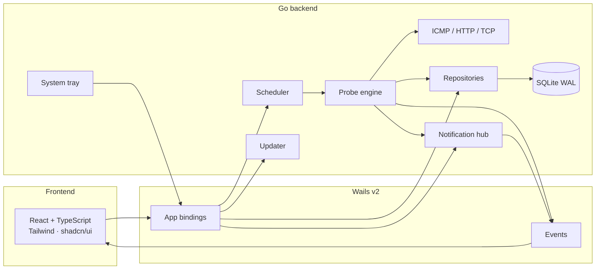

<div align="center">

# PingPulse

**Know when your infrastructure goes silent.**

A personal desktop monitor for the hosts you actually care about.
Ping on a schedule. Catch real outages. Alert on your terms. Data stays on your machine.

[](https://github.com/alikmndlu/PingPulse/releases/latest)
[](https://github.com/alikmndlu/PingPulse/releases/latest)
[](LICENSE)
[](https://go.dev)
[](https://wails.io)
[](CODE_OF_CONDUCT.md)

[Download](https://github.com/alikmndlu/PingPulse/releases/latest)
· [Changelog](CHANGELOG.md)
· [Contributing](CONTRIBUTING.md)
· [Security](SECURITY.md)
· [Code of Conduct](CODE_OF_CONDUCT.md)
· [License](LICENSE)

</div>

---

PingPulse is a **native desktop app** — not a SaaS, not a cloud agent, not a browser tab you forget to refresh. It lives in the system tray, probes your hosts with **ICMP**, **HTTP**, or **TCP**, stores history locally in SQLite, and can wake you through desktop toasts, SMS, webhooks, Telegram, Discord, Slack, or Teams.

Built for people who run their own boxes and want to know the moment one of them goes quiet.

**Current release: [v2.1.3](https://github.com/alikmndlu/PingPulse/releases/latest)** — installers for Windows, macOS, and Linux, plus in-app updates that follow those installs.

## Contents

- [Install](#install)
- [Why PingPulse](#why-pingpulse)
- [What's new in 2.1](#whats-new-in-21)
- [Features](#features)
- [Using the app](#using-the-app)
- [Probe notes](#probe-notes)
- [Notifications](#notifications)
- [Data, config, and logs](#data-config-and-logs)
- [In-app updates](#in-app-updates)
- [Architecture](#architecture)
- [Develop from source](#develop-from-source)
- [Community](#community)

## Install

Grab the latest asset for your OS from **[Releases](https://github.com/alikmndlu/PingPulse/releases/latest)**. Verify the download against `SHA256SUMS.txt` in that release.

| OS | Install with | Then |
| --- | --- | --- |
| Windows x64 | `PingPulse-<tag>-windows-amd64-setup.exe` | Run the installer. Start Menu, desktop shortcut, and Uninstall are registered. |
| macOS universal | `PingPulse-<tag>-darwin-universal.dmg` | Open the disk image and drag `PingPulse.app` to Applications. |
| Linux (Debian / Ubuntu) | `PingPulse-<tag>-linux-amd64.deb` | `sudo apt install ./PingPulse-<tag>-linux-amd64.deb` |
| Linux (Fedora) | `PingPulse-<tag>-linux-amd64.rpm` | `sudo dnf install ./PingPulse-<tag>-linux-amd64.rpm` |

Coming from **v1.x**: install 2.1.3 by hand once. After that, later versions can update themselves.

### Windows

Use the **setup.exe**. That is not a portable zip. The `.zip` on the release is only what Settings → Install update downloads later. The app lives under `%LOCALAPPDATA%\Programs\PingPulse`.

Builds are not Authenticode-signed yet. SmartScreen may warn; that is expected.

### macOS

Use the **`.dmg`**. Drag the app to Applications so later in-app updates can replace it. The `.tar.gz` is only the updater payload. Do not keep running PingPulse from a read-only disk image.

These builds are unsigned (no Apple Developer ID / notarization yet), so Gatekeeper will block the first launch. That warning is expected.

1. In the **"PingPulse" Not Opened** dialog, click **Done** — not Move to Trash.
2. Open **System Settings → Privacy & Security**.
3. Scroll to **Security**. Next to *“PingPulse was blocked…”* click **Open Anyway**.
4. Confirm, then open `PingPulse.app` again.

Or strip the download quarantine and launch from Terminal:

```bash
xattr -cr /Applications/PingPulse.app
open /Applications/PingPulse.app
```

### Linux

Packages install to `/opt/pingpulse`, add a desktop entry, and a `pingpulse` command. Later in-app updates open the new `.deb` or `.rpm`. The `.tar.gz` is a portable copy for a writable folder such as `~/.local/bin`.

Linux builds target **WebKitGTK 4.1** (Ubuntu 24.04+, Fedora 40+, Debian 12+). The packages pull those libraries in. For a tarball:

```bash
# Debian / Ubuntu 24.04+
sudo apt install libgtk-3-0 libwebkit2gtk-4.1-0

# Fedora 40+
sudo dnf install gtk3 webkit2gtk4.1
```

### First-run check

Do this once with a GitHub Release asset, not `wails dev`. That is where long-lived bugs show up.

1. Install with the setup, DMG, or `.deb` / `.rpm`
2. Enable **Start application on boot**
3. Confirm the tray icon, then hide the window
4. Keep or add an ICMP target
5. Notifications → Telegram → **Send test**
6. Header **Quiet** → a short custom time, then unmute
7. Settings → **Check for updates** (install only works on a packaged build)

## Why PingPulse

Most “uptime” tools assume a server, an account, and a monthly invoice. PingPulse assumes a laptop, a list of hosts, and the desire to keep secrets on disk.

| You want | PingPulse does |
| --- | --- |
| Know when a host is actually down | Failure / recovery thresholds, not a single missed ping |
| Keep running with the window closed | Scheduler + system tray |
| Own the data | Local SQLite, WAL mode, no telemetry |
| Get alerted without giving a vendor your network | Desktop, SMS, webhook, Telegram, Discord, Slack, Teams |
| Ship it to three operating systems | One Wails codebase, tagged GitHub Releases |

## What's new in 2.1

**v2.1.3** is the release you should install. Full notes: [CHANGELOG](CHANGELOG.md).

- **In-app Help** — an animated tour of every screen, from probes to backup
- Faster page changes with skeleton loaders; revisits keep data on screen
- **Real installers** — Windows setup, macOS DMG, Linux `.deb` / `.rpm`
- **Updates that match the install** — replace in place when the folder is writable; open the next Linux package when PingPulse lives under `/opt`
- **Backup and restore** of the local database from Settings
- **Quiet** for 1 hour, 8 hours, tomorrow morning, or a custom time
- **History retention** of 7 / 30 / 90 days (incidents are kept)
- Motion, launch intro, and a quieter desktop UI

**v2.0.0** brought the cross-platform Wails app: ICMP / HTTP / TCP, groups, maintenance, incidents, SLA, and in-app updates.

Product version is stamped in `internal/updater/version.go`, `wails.json`, and `build/windows/info.json` (**2.1.3**).

## Features

**Monitoring**
- Per-target probes: **ICMP**, **HTTP** (status check), and **TCP** (port dial) with interval, timeout, retries, retry delay
- Status model: `online` · `offline` · `unknown` · `disabled`
- Configurable **failure threshold** and **recovery threshold** so flapping links do not spam you
- High-latency and timeout events, independent of offline detection
- **Maintenance windows** (all targets, one group, or one target) that can suppress checks and/or notifications
- **Incidents** open on offline and close on recovery, with downtime / MTTR outage reports
- **SLA reports** against 99 / 99.5 / 99.9 / 99.99%, with error budget, MTBF, and MTTR
- Pause all checks, or stop the scheduler entirely, without losing targets

**Product surface**
- Live dashboard: counts, uptime %, open incidents, active maintenance, status donut, group filter
- Target list with probe type, endpoint, enable/disable, mute, and groups
- Target details: latency area chart, availability strip, open incident / maintenance badges, recent events
- Incidents page: filterable outage list plus CSV / print export
- SLA page: compliance vs a chosen target, error budget, CSV / JSON / print
- Maintenance page: schedule windows with scope and suppress options
- History with filters: target, status, date range, search
- JSON / CSV import and export (including group names and probe fields)
- In-app Help tour of every screen
- Instant navigation with skeletons while reports load
- SQLite backup / restore from Settings, plus Open data folder and Open log

**Operations**
- Dark / light theme
- Start on boot, start monitoring automatically, minimize to tray
- Global mute (1 hour, 8 hours, until tomorrow morning, or a custom time) and per-target mute
- In-app updates from GitHub Releases
- Structured JSON logs with secret redaction

**Notifications**
- Desktop toasts (WinRT / AppleScript / `notify-send`)
- SMS over a generic HTTP API (Melipayamak-shaped defaults)
- Webhooks with JSON templates
- Telegram bots
- Discord, Slack, and Microsoft Teams incoming webhooks
- Per-kind cooldown so the same alert does not fire every interval

## Using the app

| Screen | What it is for |
| --- | --- |
| **Dashboard** | Fleet pulse: online / offline / unknown, open incidents, active maintenance, uptime, group filter |
| **Targets** | Create, edit, enable, mute, group, and delete probes (ICMP / HTTP / TCP) |
| **Target details** | Latency series, availability strip, open incident / maintenance badges, recent events, one-off test |
| **Incidents** | Outage list, downtime / MTTR, CSV and print export |
| **SLA** | Uptime vs 99–99.99%, error budget, MTBF/MTTR, CSV / JSON / print |
| **Maintenance** | Schedule windows with scope and suppress checks / notifications |
| **History** | Every stored probe result, filterable |
| **Notifications** | Provider credentials, templates, test send, alert kinds |
| **Help** | Animated tour of every surface |
| **Settings** | Defaults, thresholds, theme, logging, autostart, tray, backup, in-app updates |

**Quiet 1 hour** in the header mutes every channel globally. The same mute exists per target. Mutes expire automatically; they do not stop pinging, they only suppress alerts.

### Defaults

| Setting | Default |
| --- | --- |
| Interval | 120s |
| Timeout | 5s |
| Retries | 3 |
| Retry delay | 2s |
| Failure threshold | 3 consecutive failures → offline |
| Recovery threshold | 2 consecutive successes → online |
| Notification cooldown | 600s per target + kind |
| High-latency threshold | 500ms (off by default) |
| Theme | Dark |
| Log level | `info` |

Hosts are IPv4/IPv6 or DNS names. For ICMP, `http://` prefixes, ports, and trailing paths are stripped. HTTP probes keep a full URL (`httpUrl`); TCP probes keep `host` + `tcpPort`. Uniqueness is `(probe type, host, tcp port, HTTP URL)`, so one box can have an ICMP check and an HTTPS check at the same time. Minimum interval is 5 seconds.

## Probe notes

**ICMP** uses [`prometheus-community/pro-bing`](https://github.com/prometheus-community/pro-bing).

- **Windows** — native ICMP (`SetPrivileged(true)`).
- **Linux / macOS** — unprivileged UDP ICMP when the OS allows it. Some hosts still need `CAP_NET_RAW` or root for raw ICMP.

**HTTP** performs a request to the configured URL and treats the probe as successful when the status code matches `expectStatus` (default `200`).

**TCP** dials `host:port` within the timeout; a successful connect is online.

A check that times out, fails DNS, or never receives a packet is a failed probe. The evaluator only marks a target **offline** after `failureThreshold` consecutive failures, and **online** again after `recoveryThreshold` consecutive successes. That is the difference between “the network hiccuped” and “the box is gone”.

During an active **maintenance window**, PingPulse can skip checks and/or suppress notifications for the scoped targets. If checks still run, offline transitions continue to open **incidents** for the outage report even when alerts are quiet.

## Notifications

Every channel implements the same interface:

```go
type Provider interface {
    Name() string
    Send(ctx context.Context, n domain.Notification) error
}
```

| Provider | How it delivers |
| --- | --- |
| **desktop** | WinRT toast (Windows), `osascript` (macOS), `notify-send` (Linux) |
| **sms** | Generic HTTP API. Defaults are shaped for Melipayamak |
| **webhook** | HTTP POST (or your method) with a JSON body template |
| **telegram** | Bot token + chat ID against `https://api.telegram.org` |
| **discord** | Channel webhook (`{"content":"..."}`) |
| **slack** | Incoming webhook (`{"text":"..."}`) |
| **teams** | Incoming webhook (`{"text":"..."}`) |

Alert kinds: `offline`, `recovery`, `high_latency`, `timeout`. Each kind can be toggled in Settings. Cooldown is per `(target, kind)`.

API keys live in SQLite on the local machine. They are never returned to the UI after save, never written to logs, and never hardcoded.

**Template variables**

`{{name}}` `{{host}}` `{{status}}` `{{failures}}` `{{latency}}` `{{lastSuccess}}` `{{time}}` `{{title}}` `{{body}}` `{{kind}}`

To add a provider, see [Contributing](CONTRIBUTING.md#adding-a-notification-provider).

## Data, config, and logs

Nothing lives in env files. Everything is in the user data directory:

| OS | Directory |
| --- | --- |
| Windows | `%AppData%\PingPulse\` |
| macOS | `~/Library/Application Support/PingPulse/` |
| Linux | `~/.config/PingPulse/` |

| File | Purpose |
| --- | --- |
| `pingpulse.db` | SQLite, WAL, `foreign_keys=ON`, `busy_timeout=5000`. **Settings → Data and backup** exports a snapshot (includes Telegram / SMS keys). Restore overwrites this file and quits the app. |
| `pingpulse.log` | JSON logs, mode `0600`, secrets redacted |

Migrations are versioned SQL under `internal/database/migrations` and applied on startup.

| Table | Role |
| --- | --- |
| `targets` | Probes, last status, consecutive counters, group, mute, HTTP/TCP fields |
| `target_groups` | Named color groups |
| `ping_results` | Every check; pruned by **history retention** (7 / 30 / 90 days) |
| `events` | Offline / recovery / latency / timeout |
| `incidents` | Open / resolved outages with duration and failure count (not pruned with ping history) |
| `maintenance_windows` | Scheduled scopes (all / group / target); suppress checks and/or alerts |
| `notification_configs` | Provider credentials and templates |
| `notification_cooldowns` | Last send per target + kind |
| `app_settings` | Single-row JSON blob |

There is no analytics, no crash reporter, and no network call except probes to *your* hosts, the notification endpoints *you* configure, and GitHub when you check for updates.

## In-app updates

Settings → **Check for updates** calls the public GitHub Releases API for [`alikmndlu/PingPulse`](https://github.com/alikmndlu/PingPulse/releases).

- Compares the running semver with `tag_name`
- Downloads only assets from `github.com/alikmndlu/PingPulse/releases/download/`
- Picks `windows-amd64.zip`, `linux-amd64.tar.gz`, or `darwin-universal.tar.gz` for in-place replace (never the Windows setup.exe, macOS `.dmg`, or Linux `.deb`/`.rpm`)
- If the install folder is writable, replaces the running binary (or the `.app` on macOS) and restarts
- If Linux was installed as a system package (`/opt/pingpulse`), downloads the matching `.deb` or `.rpm` and opens it with the desktop installer

On Windows, first install with **`windows-amd64-setup.exe`**. Later in-app updates overwrite that same `PingPulse.exe`.

On macOS, first install from the **`.dmg`** into `/Applications`. In-app update cannot replace a copy still sitting on a read-only disk image.

On Linux, first install the **`.deb`** or **`.rpm`**. In-app update then opens the next package. A tarball in a home folder updates in place.

`wails dev` can *check*, but will not *install*. **If you are on v1.x, install v2.1.3 by hand once.** After that, later versions can update themselves.

Each release attaches `SHA256SUMS.txt`. Builds are not Authenticode-signed or Apple-notarized yet; SmartScreen and Gatekeeper warnings are expected.

Release CI stamps the version into the binary:

```text
-ldflags "-X pingpulse/internal/updater.Version=vX.Y.Z"
```

Local `wails dev` falls back to `internal/updater/version.go`. Keep that, `wails.json` `productVersion`, and `build/windows/info.json` in sync when you bump — details in [Contributing](CONTRIBUTING.md#releasing-maintainers).

## Architecture

The React UI never talks to SQLite or ICMP. Wails bindings on `App` are the only bridge. The engine, scheduler, notifications, and database are independent Go packages.



The UI is event-driven. A 15s dashboard refresh is only a safety net.

| Event | When |
| --- | --- |
| `target:status_changed` | Evaluator transitions status |
| `target:ping_completed` | A check finished |
| `notification:sent` | A provider attempted delivery |
| `monitoring:started` | Scheduler is running |
| `monitoring:stopped` | Scheduler stopped or paused |
| `event:created` | An alert/recovery event was stored |
| `mute:changed` | Global or per-target mute changed |
| `groups:changed` | A group was created, updated, or deleted |
| `incident:updated` | An incident opened or resolved |
| `maintenance:changed` | A maintenance window was created, updated, or deleted |
| `update:progress` | Update download percent |

| Layer | Choice |
| --- | --- |
| Desktop shell | [Wails v2](https://wails.io) |
| Backend | Go 1.25, CGO for the webview only |
| Ping | `prometheus-community/pro-bing` |
| Database | `modernc.org/sqlite` |
| Tray | `energye/systray` |
| UI | React 18, TypeScript, Vite, Tailwind, shadcn/ui, Radix |
| Charts | Recharts |
| State | Zustand |
| Toasts | Sonner |
| CI | GitHub Actions → tagged Releases |

Package layout and how to add a notification provider: [Contributing](CONTRIBUTING.md#project-map).

## Develop from source

Requirements and a full workflow live in **[CONTRIBUTING.md](CONTRIBUTING.md)**. Short version:

```bash
git clone https://github.com/alikmndlu/PingPulse.git
cd PingPulse
go install github.com/wailsapp/wails/v2/cmd/wails@v2.15.0
cd frontend && pnpm install && cd ..
wails dev
```

```bash
go test ./internal/...
cd frontend && pnpm test
```

Pushing a tag that matches `v*` publishes Windows setup, macOS DMG, Linux `.deb` / `.rpm`, updater archives, and `SHA256SUMS.txt`.

## Security posture

- Secrets stay in the local DB; the UI receives `apiKeySet`, not the key
- Logs redact `api_key`, `token`, `authorization`, `bearer`, `secret`, `password`
- Update downloads are host-allowlisted to this repo’s GitHub Releases
- Update archives reject zip-slip paths
- Data directory and log file are created with restrictive permissions
- Public Wails errors are sanitized; internal details stay in logs

How to report a vulnerability: **[SECURITY.md](SECURITY.md)**. Do not open a public issue.

## Community

| | |
| --- | --- |
| [Contributing](CONTRIBUTING.md) | Build from source, tests, pull requests, releases |
| [Code of Conduct](CODE_OF_CONDUCT.md) | Contributor Covenant 2.1 |
| [Security](SECURITY.md) | Supported versions and private reporting |
| [Changelog](CHANGELOG.md) | What shipped in each tag |
| [License](LICENSE) | MIT, Copyright (c) 2026 Ali Kamandlu |
| [Issues](https://github.com/alikmndlu/PingPulse/issues) | Bugs and feature requests |

By contributing, you agree that your work is licensed under MIT, the same as the rest of PingPulse.

---

<div align="center">

**PingPulse** — know when your infrastructure goes silent.

[Download v2.1.3](https://github.com/alikmndlu/PingPulse/releases/latest)
· [Contributing](CONTRIBUTING.md)
· [Security](SECURITY.md)
· [Code of Conduct](CODE_OF_CONDUCT.md)
· [MIT License](LICENSE)

</div>
