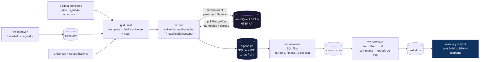

# wq-alpha-pipeline

[](https://github.com/angel4angelov-glitch/wq-alpha-pipeline/actions/workflows/ci.yml)
[](https://www.python.org/downloads/)
[](LICENSE)
[](https://github.com/astral-sh/ruff)

Automated alpha research pipeline for the [WorldQuant BRAIN](https://platform.worldquantbrain.com) platform. Built for the **International Quant Championship 2026 (IQC)**.

Instead of clicking "Submit" on the BRAIN web GUI one alpha at a time, this pipeline turns alpha research into a brute-force overnight job: define a handful of expression templates, cross them against thousands of fundamental fields, run the lot through BRAIN's backtester three-concurrent, and wake up to a ranked, de-correlated basket of submission candidates.

---

## Why

BRAIN exposes ~85,000 data fields and a 5-year backtester behind an HTTP API. The web GUI surfaces one simulation at a time; the API allows three concurrent. Manual workflow caps you around 10 backtests/day. This pipeline runs ~800 overnight, persists every result, filters by Sharpe / fitness / IS-check status, then prunes correlated alphas down to a basket you can actually submit.

## Architecture



## Quickstart

```bash
git clone <this-repo> && cd wq-alpha-pipeline
python -m venv .venv && source .venv/bin/activate
pip install -e .
cp .env.example .env  # fill in WQ_EMAIL + WQ_PASS

# 1. discover available data fields (one-time, ~30s)
wq discover

# 2. run a small grid as smoke test (≈60 sims, ≈25 min at 3-concurrent)
wq run --max-fields 5 --neutralizations MARKET,SUBINDUSTRY

# 3. filter survivors at default thresholds
wq survivors

# 4. correlation-prune to an uncorrelated basket
wq correlate
```

## Subcommands

| Command          | What it does                                                        |
|------------------|---------------------------------------------------------------------|
| `wq discover`    | Pulls all available data fields → `fields.csv` + `fields.json`.     |
| `wq run`         | Grid runner: 8 templates × N fields × universes × neutralizations.  |
| `wq expressions` | Same dispatcher, but reads raw expressions from a file.             |
| `wq survivors`   | SQL filter: Sharpe, fitness, margin, structural IS-checks.          |
| `wq correlate`   | Fetches PnL series, builds correlation matrix, greedy de-dup.       |

Each subcommand takes `--help` for its full options.

## Configuration

`.env` (copy from `.env.example`):

```
WQ_EMAIL=your_brain_email
WQ_PASS=your_brain_password
```

These are HTTP Basic creds for `POST /authentication`. If your account uses biometric/persona 2FA, the client raises `WQBiometricRequired` with the URL you need to visit before continuing.

Default simulation settings (region USA, delay 1, language FASTEXPR, etc.) live in `wq_pipeline.client.SimulationSettings` and are overridable per-call.

## Design decisions worth knowing

These are the non-obvious choices, with the reasoning. The intent is that anyone reading the code can see *why*, not just *what*.

1. **SQLite instead of Postgres / a job queue.** One process writes, occasional readers query. The dataset is single-digit MB even at 10k rows. WAL + `busy_timeout=10000` is enough; anything heavier is overkill.
2. **Idempotent UPSERT on `(expression_hash, region, universe, delay, decay, neutralization, truncation)`.** Re-running the same grid produces zero duplicates and zero wasted API calls. Crash-resume falls out for free.
3. **Active-futures dispatcher, not `executor.map`.** `executor.map` queues every task at once and swallows exceptions; the dispatcher loop keeps exactly `max_workers` in flight, has per-future watchdog timeouts, and interleaves DB writes between dispatch and result phases.
4. **Thread-local `WQClient` per worker.** `requests.Session` is not thread-safe — its cookie jar and adapter pool break under concurrent access. Each worker thread lazily instantiates its own client (and its own Session) on first use.
5. **`mark_running` *before* `executor.submit`.** Closes a TOCTOU window where a crash between `submit()` and a post-submit DB write would leave the row `QUEUED` while a sim was already in flight.
6. **`fcntl.flock` on `alphas.db.lock`.** Prevents two `wq run` processes from racing on the same DB. Second process exits cleanly with a clear message.
7. **PnL diff, not raw cumulative.** WQ returns cumulative dollar PnL; correlation between cumulative series is meaningless. The pipeline diffs to daily returns before computing correlation.
8. **`COALESCE(chk_X_result, 'PASS') != 'FAIL'` for IS-check filters.** SQL three-valued logic: `NULL != 'FAIL'` is `NULL`, which is falsy in `WHERE`. Without the `COALESCE`, rows with a `NULL` check would silently get filtered out.
9. **Drop `LOW_SHARPE` / `LOW_FITNESS` from required-checks.** Those checks duplicate the explicit `--min-sharpe` / `--min-fitness` thresholds and would re-impose WQ's hardcoded 1.25 / 1.0 limits on top of any custom filter the user picks.
10. **Positive Sharpe by default, `--allow-inverse` opt-in.** A negative-Sharpe alpha is just an inverted positive-Sharpe alpha, but the inversion has to be made explicit by the user — competition submissions need the right sign on day one.

## Known limits / not-built (deliberate)

- **No auto-submitter.** `basket.csv` is the hand-off; final submission to BRAIN is manual to avoid ever burning a submission slot accidentally.
- **No multi-process advisory lock across machines.** `flock` is host-local. One runner per host, one host per DB.
- **`align_returns` uses max-length, not date-intersection.** Fine for single-universe runs (dates align by construction). For multi-universe baskets, refactor to thread date arrays through.
- **No LLM template generator.** The brief explicitly chose brute-force over generative templating; out of scope.
- **No correlation pruning vs production set.** PnL correlation is computed *within* the candidate set, not against your already-submitted alphas. Add when prod-set is large enough to matter.
- **8 hand-written templates (5 keepers + 3 winner-variants from data).** Bigger template set is the obvious next lever; see upstream references like [worldquant-miner](https://github.com/zhutoutoutousan/worldquant-miner) for a 200+ template library to draw from.

## Tech stack

Python 3.11+, `requests`, `sqlite3` (stdlib), `numpy`, `concurrent.futures.ThreadPoolExecutor`, `fcntl`. No async, no ORM, no Docker.

## Layout

```
src/wq_pipeline/        # the package
├── client.py           # BRAIN API client (auth, submit, poll, fetch)
├── models.py           # Template, GridItem dataclasses
├── db.py               # SQLite store, schema, status transitions
├── runner.py           # grid runner + active-futures dispatcher
├── survivors.py        # SQL filter for IS-passing alphas
├── correlation.py      # PnL fetch + greedy de-dup
├── fields.py           # /data-fields paginator
├── expressions.py      # raw-expression bulk runner
└── cli.py              # single entry point with subcommands

examples/               # smoke + sample expressions file
tests/                  # pytest unit tests
data/                   # gitignored; alphas.db lives here
.github/workflows/ci.yml
```

## License

MIT — see [LICENSE](LICENSE).
