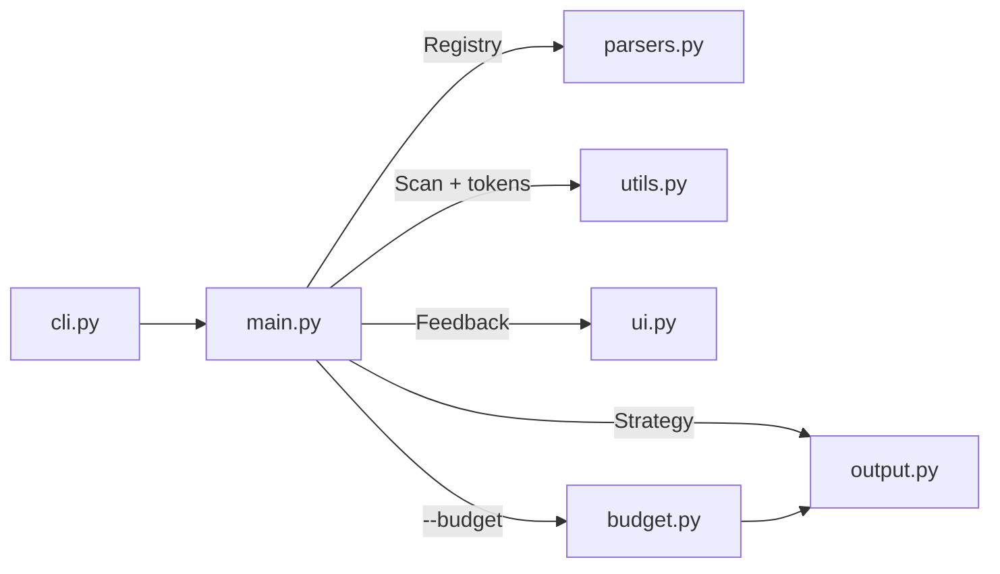

<p align="center">
  
</p>

<p align="center">
  <a href="https://pypi.org/project/data2prompt/"></a>
  <a href="https://github.com/arianmokhtariha/data2prompt/actions/workflows/tests.yml"></a>
  <a href="https://www.python.org/downloads/"></a>
  <a href="https://github.com/arianmokhtariha/data2prompt/blob/main/LICENSE"></a>
  <a href="https://github.com/arianmokhtariha/data2prompt/stargazers"></a>
  <a href="https://deepwiki.com/arianmokhtariha/data2prompt"></a>
</p>

<p align="center">
  
</p>

<p align="center">
  <b>Turn data-heavy projects into LLM context that actually fits.</b><br>
  One command packs your CSVs, spreadsheets, notebooks and databases into a
  single file that ChatGPT, Claude or Gemini can read: summarized, cleaned,
  and sized to fit.
</p>

<p align="center">
  
</p>

<p align="center">
  <a href="#why-data2prompt">Why</a> ·
  <a href="#features">Features</a> ·
  <a href="#installation">Installation</a> ·
  <a href="#usage">Usage</a> ·
  <a href="#options">Options</a> ·
  <a href="#architecture">Architecture</a> ·
  <a href="#contributing">Contributing</a>
</p>

---

## Why data2prompt

Before an AI model can help with a data project, it has to see the project.
The usual tools for that, like repomix and code2prompt, were made for
code. They treat a CSV like any other text file and paste in every single row,
so a normal data project turns into a file far too big for any model to read.

Here is the same analytics project packed by all three tools:

<p align="center">
  
</p>

22 MB is several million tokens. No mainstream model accepts that in one
prompt, so those outputs can't be used at all. data2prompt's 241 KB fits, and
thanks to the column statistics the model often learns more about your data
than it would from the raw rows.

data2prompt looks at your data the way an analyst does on day one: how big each
table is, what every column holds, where the gaps are, and a few example rows.
That summary is what the model gets.

---

## Features

### Your data, summarized instead of pasted

Every table (a CSV, an Excel sheet, a Parquet file, a database table) gets a
profile computed over all of its rows:

- each column's type and how many values are missing
- for numbers: min, max, average, median and spread
- for text: how many distinct values there are and which one is most common

On top of that come 15 real rows picked at random, so the model can see what
the data looks like. A note says how many rows the table really has, so the
model never mistakes 15 example rows for the whole dataset.

Because the numbers cover every row, the model can spot problems it never saw
directly: a `-999` placeholder hiding in a numeric column, duplicate IDs, a
column that is 10% empty, or one category spelled three different ways. In our
test project, a 2,040-row orders file that would take about 50,000 tokens to
paste comes down to about 900.

### Clean notebooks

Jupyter notebooks are full of things a model doesn't need: embedded images,
HTML copies of every table, invisible formatting codes. data2prompt keeps your
code, your notes, the printed results and the error messages, and removes the
rest. Very long outputs are shortened, and a removed chart leaves a short note
behind so the model knows there was one.

It also checks how the notebook was run. If cells ran out of order, some never
ran, or the run stopped on an error, the model is warned that the saved results
may not match a clean run from top to bottom.

### Fits your context window with one flag

```bash
data2prompt --budget 100k
```

Tell data2prompt how many tokens you can spare and it shrinks the output until
it fits. It shows fewer example rows first and keeps the column statistics as
long as possible, since they are the most useful part. Whole files are left out
only as a last resort. Everything it trimmed is listed for you, and if the
project can't fit at all, it says so and writes nothing.

Use it when you want to:

- paste into a chat app with a smaller limit
- leave room in the conversation for your questions and the model's answers
- match a model's context size, such as `--budget 128k`, `200k` or `1m`
- keep API costs predictable on every run

### The model knows what's missing

A model given part of a file will happily guess the rest. data2prompt is
built to stop that. The output starts with a short guide for the model, lists every
file with a status (full, sampled, schema only, redacted, skipped), and marks
every spot where something was shortened or left out. The model is told to say
when information isn't there instead of making it up.

### Works with the formats you already use

| File | What the model gets |
| :--- | :--- |
| CSV, Parquet, Feather, Arrow | Column statistics plus example rows. Parquet keeps its exact column types. |
| Excel (`.xlsx`, `.xls`, `.xlsm`) | The same for each sheet, plus a note when the workbook has charts or images. |
| SQLite databases | Each table's structure, including keys and links to other tables, plus statistics and example rows. |
| SQL scripts | Table definitions in full, with long lists of inserted rows cut down to examples. |
| Jupyter notebooks | Code, notes and text outputs, cleaned as described above. |
| `.env` files | Variable names only. Values are always hidden. |
| Code, docs and other text | The full text. Very large files are cut to their beginning, and binary files are skipped. |

### Safe and repeatable

- Secret values in `.env` files never reach the output.
- Files listed in your `.gitignore` are left out.
- Databases are opened read-only, and none of your files are changed.
- The same project gives the same output every time (apart from the
  timestamp), so you can compare runs.
- Token counting happens on your machine. Nothing is uploaded.
- A broken or locked file gets a note in the output and doesn't stop the run.

---

## Installation

The quickest way is [uv](https://docs.astral.sh/uv/), which runs data2prompt
without installing anything permanently:

```bash
uvx data2prompt
```

Or install it as a command you can use anywhere:

```bash
uv tool install data2prompt   # with uv
pipx install data2prompt      # with pipx
pip install data2prompt       # into your current Python environment
```

<details>
<summary><b>Parquet, Feather and Arrow support</b> (optional)</summary>

These formats need the extra `pyarrow` package:

```bash
uvx --from "data2prompt[parquet]" data2prompt   # no install
uv tool install "data2prompt[parquet]"          # uv
pipx install "data2prompt[parquet]"             # new pipx install
pipx inject data2prompt pyarrow                 # existing pipx install
pip install "data2prompt[parquet]"              # pip
```

Without it, these files are still listed in the output with a note explaining
why they were skipped. Old `.xls` Excel files work the same way with `xlrd`
(`pip install xlrd`).
</details>

<details>
<summary><b>Install from source</b></summary>

```bash
git clone https://github.com/arianmokhtariha/data2prompt.git
cd data2prompt
pip install -e .
```
</details>

---

## Usage

Open a terminal in your project folder and run:

```bash
data2prompt
```

You get a `PROMPT.md` file to paste or upload into your AI chat, plus a short
report in the terminal showing what was included, what was trimmed and which
files take up the most space.

Common recipes:

| You want to | Run |
| :--- | :--- |
| Copy the result straight to the clipboard | `data2prompt -c` |
| Fit a 200k-token model | `data2prompt --budget 200k` |
| Share the structure of your data without any rows | `data2prompt --schema-only` |
| Show the model more example rows | `data2prompt -s 50` |
| Get XML instead of Markdown (some models follow it better in long prompts) | `data2prompt -f xml` |

To leave files or folders out, list them in a `.data2promptignore` file in your
project. It works like a `.gitignore`.

---

## Options

| Flag | Default | What it does |
| :--- | :--- | :--- |
| `-b`, `--budget` | off | Fit the output into a token budget (`50000`, `100k`, `1.5m`) |
| `-c`, `--clipboard` | off | Copy the result to the clipboard instead of writing a file |
| `-f`, `--format` | `markdown` | `markdown` or `xml` (same content either way) |
| `-o`, `--output` | `PROMPT` | Name of the output file |
| `-s`, `--csv-sample-size` | `15` | Example rows per table |
| `--seed` | `42` | Which random rows are picked; keep it the same for identical output |
| `--schema-only` | off | Column information and statistics only, no rows |
| `--no-stats-summary` | stats on | Leave out the column statistics |
| `--stats-decimals` | `4` | Decimal places for statistics |
| `--data-decimals` | `6` | Decimal places for values in example rows |
| `--max-lines` | `40` | Output lines kept per notebook cell |
| `--max-sheets` | `10` | Sheets read per Excel file |
| `--max-tables` | `25` | Tables read per database |
| `--max-file-size` | `70` | Size in KB above which other text files are cut to their first 10 KB |
| `--no-env-keys` | redact | Leave `.env` files out completely |
| `--no-gitignore` | respect | Include files that `.gitignore` excludes |
| `--ignore-folders` / `--ignore-files` / `--skip-exts` | | Extra folders, files or extensions to leave out |

Every flag, with its limits and edge cases, is documented in
[docs/cli.md](https://github.com/arianmokhtariha/data2prompt/blob/main/docs/cli.md).

---

## Architecture

data2prompt is a small, fully typed Python package. A thin `main.py` hands each
job to one focused module, and new file types plug into a parser registry
without touching the rest of the pipeline.



Each module has its own in-depth document:

| Doc | Covers |
| :--- | :--- |
| [Architecture](https://github.com/arianmokhtariha/data2prompt/blob/main/docs/architecture.md) | Module layout, data flow, design patterns |
| [Parsers](https://github.com/arianmokhtariha/data2prompt/blob/main/docs/parsers.md) | How each file format is read and summarized |
| [Budget](https://github.com/arianmokhtariha/data2prompt/blob/main/docs/budget.md) | How `--budget` decides what to trim |
| [Output](https://github.com/arianmokhtariha/data2prompt/blob/main/docs/output.md) · [Output contract](https://github.com/arianmokhtariha/data2prompt/blob/main/docs/output-contract.md) | The structure of the generated file and the rules it follows |
| [CLI](https://github.com/arianmokhtariha/data2prompt/blob/main/docs/cli.md) · [UI](https://github.com/arianmokhtariha/data2prompt/blob/main/docs/ui.md) · [Installation](https://github.com/arianmokhtariha/data2prompt/blob/main/docs/installation.md) | Flags, the terminal report, setup |

---

## Contributing

```bash
pip install -e .[dev]
pytest
```

Contributions are welcome. Support for a new file type is the easiest place to
start. For anything that changes the generated file, please open an issue first
and read the
[output contract](https://github.com/arianmokhtariha/data2prompt/blob/main/docs/output-contract.md).

---

<p align="center"><i>If data2prompt saved you time and tokens, a star helps other data people find it.</i></p>
